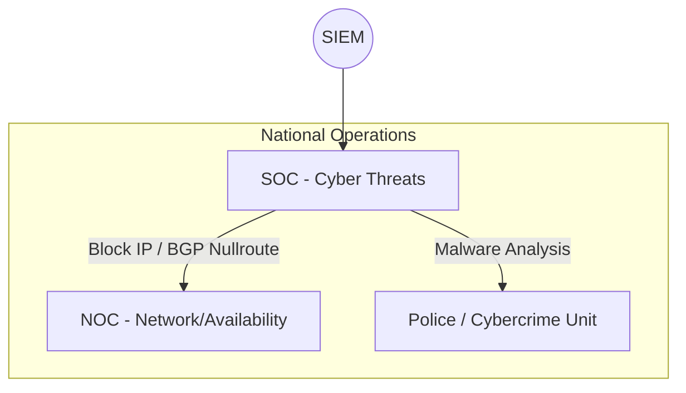

---
# ============================================================
# SNISID-Cyber — Security Operations Center (SOC)
# Architecture Opérationnelle et Escalade
# Document ID: SNISID-SOC-001
# Version: 1.0.0
# ============================================================

## 1. SOC GOUVERNEMENTAL 24/7

Le National Security Operations Center (SOC) est la vigie de l'État. Hébergé de manière sécurisée (Zone 2) dans le Datacenter Primaire, avec une équipe de backup dans le Datacenter DR.

### 1.1 Modèle Hybride (Tiering)
- **L1 - Triage & Alerting (Hybride MSSP / Interne) :** Analyse initiale des alertes remontées par le SIEM. 80% des alertes sont gérées par l'automatisation (SOAR) ou par un partenaire MSSP de confiance sous stricte surveillance.
- **L2 - Incident Analysis (100% Gouvernemental) :** Investigateurs spécialisés (Threat Hunters). Ils analysent les incidents confirmés, isolent les machines compromises et gèrent le "Containment".
- **L3 - Cyber Fusion & Forensics (100% Gouvernemental) :** Ingénieurs Reverse-Malware, Experts Forensiques. Ils font l'ingénierie inverse des ransomwares et collaborent avec la DCPJ (Police) pour l'attribution des attaques.

## 2. CYBER FUSION OPERATIONS

Le SOC n'est pas isolé. Il opère un modèle de "Cyber Fusion", partageant la salle de contrôle physique (ou virtuelle) avec le NOC (Opérations Réseau de la Phase 5) et la cellule de crise de la PNH (Police Nationale).

## 3. RÉPONSE RÉGIONALE (Regional SOC Coordination)

Si un incident frappe une mairie dans le département de l'Artibonite (ex: Ransomware local) :
1. Le SOC Central (Port-au-Prince) isole immédiatement l'Edge Node de l'Artibonite du réseau national.
2. Une directive est envoyée au responsable informatique local (Mini-SOC) pour exécuter le playbook de confinement physique (débrancher les câbles réseau des postes infectés).

---
*Document ID: SNISID-SOC-001 | Approuvé par: Directeur National de la Cybersécurité (ANSSI-H)*
