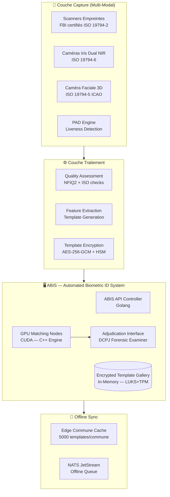
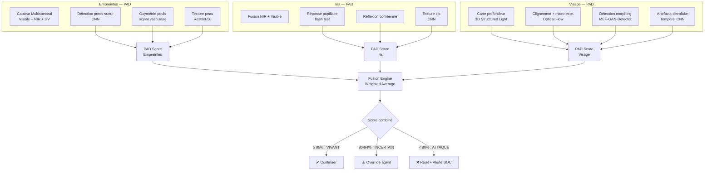
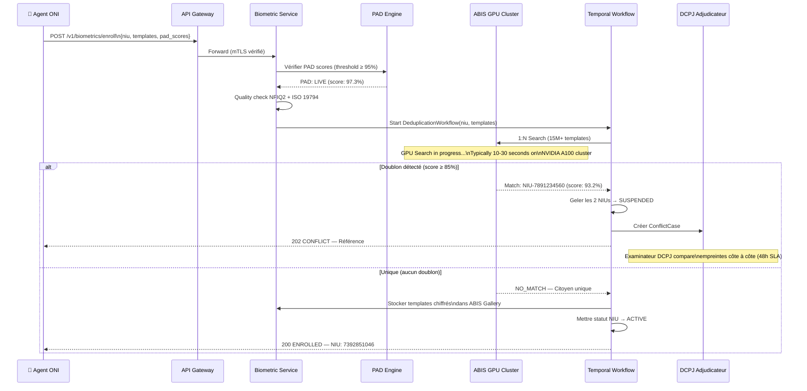
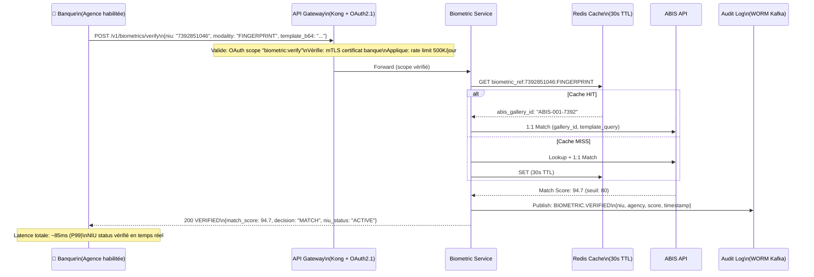

# 🔬 SNISID — PLATEFORME BIOMÉTRIQUE NATIONALE
## National Biometric Platform — Architecture & Anti-Fraud Model

**Document ID :** SNISID-BIO-001  
**Version :** 1.0.0  
**Date :** Mai 2026  
**Classification :** SOUVERAIN / BIOMÉTRIQUE SENSIBLE  
**Principe absolu :** Un citoyen, une identité biométrique — déduplication ABIS obligatoire

---

## 1. VISION & MISSION BIOMÉTRIQUE

La plateforme biométrique SNISID est l'**ancre absolue de l'unicité identitaire** haïtienne. Elle garantit qu'aucun citoyen ne peut être enregistré deux fois sous des identités différentes, même avec des noms et dates de naissance altérés.

**La biométrie répond à 3 questions souveraines :**
1. **Qui êtes-vous ?** (1:N identification — recherche dans 15M+ templates)
2. **Êtes-vous bien cette personne ?** (1:1 vérification — comparaison ciblée)
3. **Êtes-vous vivant ?** (PAD — liveness detection anti-spoofing)

---

## 2. ARCHITECTURE MULTI-MODALE

### 2.1 Vue d'Ensemble



### 2.2 Spécifications Techniques par Modalité

| Modalité | Standard | Format Template | Qualité Min | Retries Max | Fallback |
|---------|---------|-----------------|-------------|-------------|----------|
| **Empreintes (10-print)** | ISO 19794-2 | Minutiae WSQ | NFIQ2 ≥ 40 (par doigt) | 3 par doigt | Accepter 8/10 doigts |
| **Iris (Dual)** | ISO 19794-6 | IrisCode NIR | Usable area ≥ 70% | 3 par œil | Skip si cert. médical |
| **Visage (3D)** | ISO 19794-5 ICAO | Feature Vector + 3D | 23 checks ICAO | 5 | Reposition + lumière |
| **Liveness** | ISO 30107-3 | PAD Score (0-100) | ≥ 95% | 3 | Escalade superviseur |

---

## 3. PIPELINE ANTI-SPOOFING (PAD)

### 3.1 Architecture PAD Multi-Couches



### 3.2 Matrice des Vecteurs d'Attaque

| Type d'Attaque | Modalité | Méthode Détection | Taux Détection | FRR |
|---------------|---------|------------------|----------------|-----|
| Photo 2D imprimée | Visage | Analyse carte profondeur | **99.9%** | < 0.01% |
| Vidéo sur écran | Visage | Détection motif Moiré + reflets | **99.7%** | < 0.05% |
| Masque silicone 3D | Visage | Texture peau + thermique | **99.2%** | < 0.1% |
| Deepfake vidéo | Visage | Artefacts temporels CNN | **98.5%** | < 0.2% |
| Photo morphée | Visage | MAD différentiel | **97.8%** | < 0.3% |
| Doigt gélatine/silicone | Empreinte | Multispectral + pouls | **99.5%** | < 0.05% |
| Empreinte latente levée | Empreinte | Absence pores sueur | **99.8%** | < 0.01% |
| Iris imprimé papier | Iris | Test réponse pupillaire | **99.9%** | < 0.01% |
| Lentille de contact | Iris | Irrégularité bord pupille | **98.0%** | < 0.5% |

---

## 4. WORKFLOWS BIOMÉTRIQUES ABIS

### 4.1 Déduplication 1:N (Enrôlement)



### 4.2 Vérification 1:1 (Authentication)



---

## 5. PROTECTION CRYPTOGRAPHIQUE DES TEMPLATES

### 5.1 Modèle "No Raw Storage"

```
Capture biométrique brute (WSQ/JPEG2000)
    ↓
Feature Extraction (algorithme propriétaire ABIS)
    ↓
Template mathématique IRRÉVERSIBLE (vecteur numérique)
    ↓
Chiffrement AES-256-GCM avec clé dérivée du NIU
    ↓
Stockage dans ABIS Gallery (LUKS + TPM hardware)
    ↓
Images brutes → Archivage WORM (Vault + air-gap)
             → Suppression locale après extraction
```

**Propriétés de sécurité :**
- ❌ **Aucune image brute** en mémoire après extraction du template
- ❌ **Aucun template en clair** dans les bases de données
- ✅ **Template irréversible** : impossible de reconstruire l'empreinte
- ✅ **Clé de chiffrement** stockée dans HSM FIPS 140-2 Level 3
- ✅ **LUKS** sur tous les volumes de stockage ABIS
- ✅ **TPM 2.0** pour attestation d'intégrité matérielle

### 5.2 Hiérarchie de Clés Biométriques

```
HSM National (Root Key — Air-gapped)
    └── ABIS Master Key (HSM Online FIPS 140-2 L3)
            ├── Template Encryption Key per Modality
            │       ├── TEK-FINGERPRINT (AES-256)
            │       ├── TEK-IRIS (AES-256)
            │       └── TEK-FACE (AES-256)
            └── Gallery Index Key
```

---

## 6. API CONTRACT BIOMÉTRIQUE (OpenAPI 3.1)

```yaml
openapi: "3.1.0"
info:
  title: SNISID Biometric Service API
  version: "1.0.0"

paths:
  /v1/biometrics/enroll:
    post:
      operationId: enrollBiometrics
      summary: Enrôler les données biométriques d'un citoyen
      security:
        - oauth2: [biometric:enroll]
      requestBody:
        content:
          application/json:
            schema:
              type: object
              required: [niu, templates]
              properties:
                niu:
                  type: string
                  pattern: '^\d{10}$'
                templates:
                  type: object
                  properties:
                    fingerprints:
                      type: string
                      format: byte
                      description: "ISO 19794-2 template, Base64, AES-256 encrypted"
                    iris:
                      type: string
                      format: byte
                      description: "ISO 19794-6 dual-iris, Base64"
                    face:
                      type: string
                      format: byte
                      description: "ISO 19794-5 3D template, Base64"
                pad_scores:
                  type: object
                  properties:
                    fingerprint_pad: { type: number, minimum: 0, maximum: 100 }
                    iris_pad: { type: number }
                    face_pad: { type: number }
                    combined_pad: { type: number }
                quality_scores:
                  type: object
                  properties:
                    nfiq2_mean: { type: number }
                    iris_quality: { type: number }
                    icao_compliance: { type: boolean }
      responses:
        '202':
          description: "Accepté — déduplication ABIS en cours (asynchrone)"
          content:
            application/json:
              schema:
                properties:
                  dedup_job_id: { type: string }
                  status: { type: string, enum: [PENDING_DEDUP] }
                  eta_seconds: { type: integer, example: 30 }
        '409':
          description: "Doublon biométrique détecté"
          content:
            application/json:
              schema:
                properties:
                  conflict_case_id: { type: string }
                  conflicting_niu: { type: string }
                  match_score: { type: number }
                  status: { type: string, enum: [CONFLICT_PENDING_ADJUDICATION] }

  /v1/biometrics/verify:
    post:
      operationId: verifyBiometric
      summary: Vérification 1:1 — authentifier un citoyen qui se présente
      security:
        - oauth2: [biometric:verify]
      requestBody:
        content:
          application/json:
            schema:
              type: object
              required: [niu, modality, template_data]
              properties:
                niu: { type: string, pattern: '^\d{10}$' }
                modality: { type: string, enum: [FINGERPRINT, IRIS, FACE] }
                template_data:
                  type: string
                  format: byte
                  description: "Template capturé en direct (Base64)"
                liveness_score: { type: number, minimum: 0, maximum: 100 }
      responses:
        '200':
          description: "Résultat de la vérification"
          content:
            application/json:
              schema:
                properties:
                  decision: { type: string, enum: [MATCH, NO_MATCH, ERROR] }
                  match_score: { type: number, example: 94.7 }
                  niu_status: { type: string, enum: [ACTIVE, SUSPENDED, DECEASED] }
                  response_time_ms: { type: integer }

  /v1/biometrics/{niu}/status:
    get:
      operationId: getBiometricStatus
      summary: Obtenir le statut d'enrôlement biométrique d'un citoyen
      security:
        - oauth2: [biometric:read]
      parameters:
        - name: niu
          in: path
          required: true
          schema: { type: string }
      responses:
        '200':
          content:
            application/json:
              schema:
                properties:
                  niu: { type: string }
                  fingerprints_enrolled: { type: boolean }
                  iris_enrolled: { type: boolean }
                  face_enrolled: { type: boolean }
                  last_verified_at: { type: string, format: date-time }
                  verification_count: { type: integer }
                  abis_gallery_id: { type: string }

  /v1/biometrics/{niu}/revoke:
    delete:
      operationId: revokeBiometrics
      summary: Révoquer les données biométriques (fraude confirmée)
      security:
        - oauth2: [biometric:revoke]
      parameters:
        - name: niu
          in: path
          required: true
          schema: { type: string }
      requestBody:
        content:
          application/json:
            schema:
              properties:
                reason: { type: string }
                legal_reference: { type: string }
                authorized_by: { type: string }
      responses:
        '200':
          description: "Biométrie révoquée (templates supprimés de la galerie active, archivés pour prévention futur ré-enregistrement)"
```

---

## 7. CACHE BIOMÉTRIQUE OFFLINE (EDGE NODES)

### 7.1 Architecture

Chaque node edge de département maintient un cache chiffré des templates biométriques des citoyens de la commune, permettant la vérification 1:1 **sans connectivité** avec le datacenter central.

```mermaid
graph TD
    subgraph CENTRAL["🏢 SNISID Core (PaP)"]
        ABIS_CENTRAL[ABIS Gallery\n15M+ templates]
        SYNC_MGR[Cache Sync Manager\n(nightly or on-demand)]
    end

    subgraph EDGE_DEPT["📡 Edge Node Département"]
        EDGE_DB[(SQLite Encrypted\nLUKS + TPM)]
        EDGE_SVC[Biometric Verify Service\nK3s Pod]
        CACHE[~50K templates\n commune locale]
    end

    subgraph KIT["🎒 Kit Terrain"]
        KIT_DB[(Local SQLite\nTPM-bound)]
        KIT_SVC[Offline Verify\nAndroid App]
        COMMUNE_CACHE[~5K templates\nsection communale]
    end

    ABIS_CENTRAL -->|Delta sync\n(chiffré, signé)| EDGE_DEPT
    EDGE_DEPT -->|Sync partiel\n(commune ciblée)| KIT

    note1["🔐 Clés de chiffrement:\njamais transférées via réseau\nDérivées localement du HSM USB"]
```

**Contraintes du cache offline :**

| Niveau | Capacité | Population couverte | Connectivité requise | Durée autonomie |
|--------|---------|---------------------|----------------------|-----------------|
| Edge Département | 50K templates | Chef-lieu + environ | 4G/VSAT (sync) | 30 jours |
| Kit Terrain | 5K templates | Section communale | Aucune | 30+ jours |
| Vérif locale | 1:1 uniquement | Commune assignée | Aucune | Permanente |

---

## 8. ACCOMMODATIONS SPÉCIALES

### 8.1 Cas d'Exception

| Condition | Accommodation | Documentation | Impact ABIS |
|-----------|-------------|---------------|-------------|
| **Amputation doigts** | Enregistrer doigts disponibles, flag "PARTIAL_CAPTURE" | Certificat médical requis | Réduction capacité déduplication |
| **Cataractes sévères / Cécité** | Skip capture iris, relayer sur empreintes + visage | Certificat médical | Déduplication moins robuste |
| **Nourrissons (0-5 ans)** | Photo uniquement, mise à jour biométrique planifiée à 5 ans | Acte de naissance | Déduplication différée |
| **Personnes âgées (empreintes usées)** | Seuil NFIQ2 abaissé à ≥ 25, priorité iris + visage | Vérification âge | Taux FAR légèrement plus élevé |
| **Handicap moteur** | Temps de capture étendu, assistance agent, position adaptée | Attestation agent | Sans impact qualité |
| **Anomalie médicale cutanée** | Flag "MEDICAL_CONDITION", documentation MSPP | Dossier médical | Alerte superviseur |

---

## 9. GOUVERNANCE DES DONNÉES BIOMÉTRIQUES

### 9.1 Principes RGPD & Convention 108+

| Principe | Implémentation SNISID |
|---------|----------------------|
| **Finalité** | Biométrie utilisée UNIQUEMENT pour déduplication et vérification identité |
| **Minimisation** | Templates irréversibles — jamais les images brutes accessibles externement |
| **Rétention** | Templates actifs : durée de vie du citoyen. Archives : 7 ans post-décès |
| **Droit d'accès** | Citoyen peut demander confirmation de l'enrôlement via portail SNISID |
| **Droit à l'effacement** | Anonymisation post-archivage (RGPD Art. 17 — sauf obligation légale) |
| **Sécurité** | HSM FIPS 140-2 L3, LUKS, TPM, audit WORM |

### 9.2 Comité de Gouvernance Biométrique

| Rôle | Responsabilité |
|------|---------------|
| **NDPA (Directeur)** | Validation des politiques biométriques nationales |
| **CISO SNISID** | Sécurité et chiffrement des données biométriques |
| **DG-ONI** | Opérations d'enrôlement et qualité des captures |
| **Comité Éthique IA** | Supervision des algorithmes de reconnaissance |
| **Représentant citoyens (CNN)** | Défense des droits fondamentaux |

---

*Document ID : SNISID-BIO-001 v1.0.0 — Mai 2026*  
*Approuvé par : CISO National | DG-ONI | NDPA | Comité Éthique IA*  
*Classification : SOUVERAIN / BIOMÉTRIQUE SENSIBLE — République d'Haïti*
