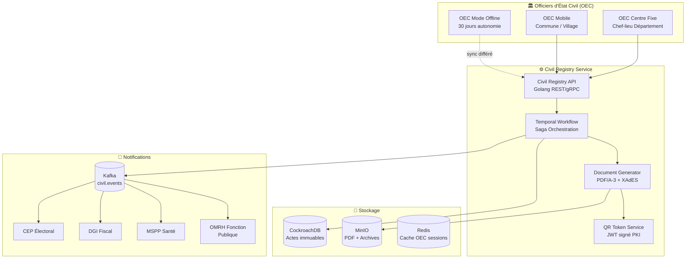
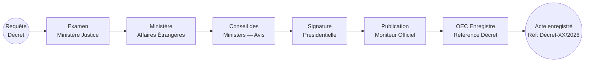
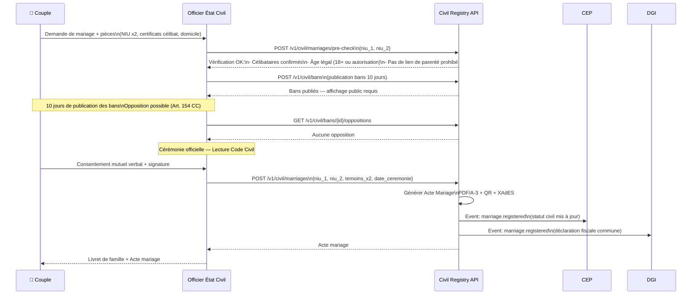

# ⚖️ SNISID — REGISTRE NATIONAL D'ÉTAT CIVIL
## Civil Registry Master & BPMN Workflows — 5 Types de Naissance + Mariage/Décès/Divorce

**Document ID :** SNISID-CIV-001  
**Version :** 1.0.0  
**Date :** Mai 2026  
**Classification :** SOUVERAIN / DONNÉES LÉGALES  
**Base légale :** Code Civil Haïtien — Loi-cadre SNISID État Civil 2026

---

## 1. ARCHITECTURE DU REGISTRE ÉTAT CIVIL

### 1.1 Principes Fondamentaux

Le Registre National d'État Civil SNISID est le **système de référence légal** pour tous les événements vitaux de la République d'Haïti. Il remplace les registres papier communaux par un système :

- **Immuable** : Chaque acte est un événement non modifiable (corrections via annotations marginales)
- **Distribué** : Déployé dans les 10 chefs-lieux de département + accès communal
- **Offline-first** : 30 jours d'autonomie pour les communes isolées
- **Légalement valide** : Signature XAdES-LTA, PDF/A-3, QR code vérifiable

### 1.2 Architecture Système



---

## 2. CATALOGUE DES ACTES D'ÉTAT CIVIL

### 2.1 Tableau des Actes et SLAs

| Code | Type d'Acte | Base Légale | SLA | Mode Offline |
|------|------------|------------|-----|--------------|
| **EC-N01** | Naissance Simple | CC Art. 55-57 | 24h | ✅ Oui |
| **EC-N02** | Naissance par Reconnaissance | CC Art. 58-60 | 5 jours | ✅ Oui |
| **EC-N03** | Naissance Déclaration Tardive | CC Art. 61-63 | 60 jours | ⚠️ Partiel |
| **EC-N04** | Naissance par Décret | Décret présidentiel | 30 jours | ❌ Non |
| **EC-N05** | Naissance Jugement rang Minutes | Jugement TPI | 6 mois | ❌ Non |
| **EC-M01** | Mariage Civil | CC Art. 136-175 | 10 jours (+bans) | ⚠️ Partiel |
| **EC-M02** | Mariage Concordataire | CC + Droit canonique | 10 jours (+bans) | ⚠️ Partiel |
| **EC-D01** | Divorce Contentieux | CC Art. 176-225 | 6 mois | ❌ Non |
| **EC-D02** | Divorce Mutuel | CC Art. 226-230 | 60 jours | ❌ Non |
| **EC-X01** | Déclaration de Décès | CC Art. 77-86 | 24h (urgent) | ✅ Oui |
| **EC-A01** | Adoption Simple | Code Famille | 90 jours | ❌ Non |
| **EC-A02** | Adoption Plénière | Code Famille + IBESR | 180 jours | ❌ Non |
| **EC-C01** | Correction Administrative | Arrêté MJ | 30 jours | ❌ Non |

---

## 3. WORKFLOWS NAISSANCE — 5 TYPES COMPLETS

### 3.1 EC-N01 — Naissance Simple (SLA: 24h)

**Conditions :** Déclaration dans les 30 jours suivant la naissance.  
**Documents requis :** Attestation MSPP, pièce identité déclarant, présence enfant recommandée.

```mermaid
flowchart TD
    classDef start fill:#4CAF50,stroke:#388E3C,color:white
    classDef end_ok fill:#4CAF50,stroke:#388E3C,color:white
    classDef end_ko fill:#F44336,stroke:#D32F2F,color:white
    classDef task fill:#E3F2FD,stroke:#1565C0
    classDef gate fill:#FFC107,stroke:#FFA000
    classDef legal fill:#F3E5F5,stroke:#7B1FA2
    classDef doc fill:#E8F5E9,stroke:#2E7D32
    classDef alert fill:#FFEBEE,stroke:#C62828
    classDef audit fill:#FFF3E0,stroke:#E65100

    S((👶 Déclarant\nSe présente)):::start
    S --> RECEIPT[Accueil + Numéro de file\nBilingual FR/HT]:::task
    RECEIPT --> AGENT_AUTH[Authentification OEC\nFIDO2 + Certificat PKI]:::legal
    AGENT_AUTH --> AUTH_OK{OEC\nauthentifié?}:::gate
    AUTH_OK -->|Non| AUTH_FAIL[Refus accès\nAlert supervisor]:::alert
    AUTH_OK -->|Oui| OPEN_SESSION[Ouvrir session acte\nGénérer Enrollment ID]:::audit

    OPEN_SESSION --> AUDIT_START[WORM LOG:\nBIRTH.SESSION.STARTED]:::audit
    AUDIT_START --> SCAN_DOCS[Scanner documents:\n• Attestation MSPP\n• ID Déclarant\n• Certificat hôpital]:::task

    SCAN_DOCS --> ATTEST_CHECK{Attestation\nMSPP valide?}:::gate
    ATTEST_CHECK -->|Non| ATTEST_FAIL[Refus: attestation\nmanquante ou expirée]:::alert
    ATTEST_CHECK -->|Oui| VERIFY_MSPP[Vérifier vs API FHIR\nMSPP en temps réel]:::legal

    VERIFY_MSPP --> MSPP_OK{MSPP\nconfirme?}:::gate
    MSPP_OK -->|Non — Mode Offline| OFFLINE_ATTEST[Accepter attestation papier\nSigner par OEC\nSync différé]:::task
    MSPP_OK -->|Oui| ENTER_DEMO[Saisie données enfant:\n• Nom/Prénom\n• Date/Lieu naissance\n• Sexe\n• Parents NIU]:::task
    OFFLINE_ATTEST --> ENTER_DEMO

    ENTER_DEMO --> NIU_PARENT{Les 2 parents\nont un NIU?}:::gate
    NIU_PARENT -->|Oui| LINK_PARENTS[Lier filiation dans\nIdentity Registry]:::legal
    NIU_PARENT -->|Non — Père inconnu| SINGLE_PARENT[Enregistrement\nmère uniquement]:::task
    LINK_PARENTS --> VERIFY_DEMO[Valider données\ncomplétude + format]:::task
    SINGLE_PARENT --> VERIFY_DEMO

    VERIFY_DEMO --> DUPLICATE_CHECK[Vérification doublon\ndémographique:\n nom+DOB+parent]:::task
    DUPLICATE_CHECK --> DUP_FOUND{Doublon\ndétecté?}:::gate
    DUP_FOUND -->|Oui| DUP_ALERT[Alerte: possible\ndoublon — superviseur]:::alert
    DUP_FOUND -->|Non| ASSIGN_NIU_CHILD[Générer NIU enfant\n(crypto/rand 10 chiffres)]:::legal

    ASSIGN_NIU_CHILD --> SIGN_OEC[Signature électronique\nXAdES-LTA par OEC]:::legal
    SIGN_OEC --> GENERATE_ACTE[Générer Acte de Naissance:\nPDF/A-3 + QR code JWT]:::doc
    GENERATE_ACTE --> COUNTER_SIGN{Contreseing\nrequis?}:::gate
    COUNTER_SIGN -->|"Oui (acte complex)"| SUPERVISOR_SIGN[Superviseur\ncountersigne]:::legal
    COUNTER_SIGN -->|Non| REGISTER_DB
    SUPERVISOR_SIGN --> REGISTER_DB

    REGISTER_DB[(Enregistrer acte\ndans CockroachDB\nimmuable)]:::doc
    REGISTER_DB --> ISSUE_CERT[Émettre certificat\nnaissance officiel]:::doc
    ISSUE_CERT --> KAFKA_EVENT[Kafka: civil.birth.registered\n+ identity.created]:::audit
    KAFKA_EVENT --> SMS_PARENT[SMS: "Ak neysan pitit ou\nnimewo NIN: 7392851046"]:::task
    SMS_PARENT --> PRINT[Imprimer acte\nde naissance]:::doc
    PRINT --> AUDIT_END[WORM LOG:\nBIRTH.REGISTERED.COMPLETED]:::audit
    AUDIT_END --> E1((✅ Acte enregistré\nSLA: <24h)):::end_ok

    AUTH_FAIL --> E_FAIL((❌ Accès refusé)):::end_ko
    ATTEST_FAIL --> E_FAIL2((⚠️ Documents\nInsuffisants)):::end_ko
    DUP_ALERT --> E_DUP((🔍 En cours\nd'examen)):::end_ko
```

**DMN — Règles de décision EC-N01 :**

| Condition | Valeur | Décision |
|-----------|--------|----------|
| Jours depuis naissance | ≤ 30 | EC-N01 Simple |
| Jours depuis naissance | 31 - 365 | EC-N03 Tardive |
| Jours depuis naissance | > 365 | EC-N05 Jugement |
| Attestation MSPP présente | Oui | Continuer |
| Attestation MSPP présente | Non | Bloquer → demander |
| Doubloon démographique | Score > 80% | Supervisor review |
| Mode offline | Oui | Signature papier + sync différé |

---

### 3.2 EC-N02 — Naissance par Reconnaissance (SLA: 5 jours)

**Conditions :** Père non marié à la mère reconnaît l'enfant légalement.  
**Documents :** Déclaration de reconnaissance, ID des 2 parents, acte naissance enfant existant ou simultané.

```mermaid
flowchart TD
    classDef task fill:#E3F2FD,stroke:#1565C0
    classDef gate fill:#FFC107,stroke:#FFA000
    classDef legal fill:#F3E5F5,stroke:#7B1FA2
    classDef doc fill:#E8F5E9,stroke:#2E7D32
    classDef start fill:#4CAF50,stroke:#388E3C,color:white

    S((👨 Père se\nprésente)):::start
    S --> VERIFY_PARENTS[Vérifier NIU\ndes 2 parents]:::task
    VERIFY_PARENTS --> PARENTS_OK{Les 2 parents\nidentifiés?}:::gate
    PARENTS_OK -->|Non| GET_IDS[Demander pièces\nd'identité manquantes]:::task
    PARENTS_OK -->|Oui| CHECK_MARRIAGE[Vérifier: père et mère\nnon mariés ensemble?]:::legal
    CHECK_MARRIAGE --> MARRIAGE_CHECK{Mariage\nexistant?}:::gate
    MARRIAGE_CHECK -->|Oui → mariage| WRONG_TYPE[Router vers\nEC-N01 Simple]:::task
    MARRIAGE_CHECK -->|Non| WITNESS_CHECK[2 témoins\nprésents avec NIU?]:::gate
    WITNESS_CHECK -->|Non| GET_WITNESSES[Ajourner: demander\n2 témoins majeurs]:::task
    WITNESS_CHECK -->|Oui| DECLARATION[Rédiger déclaration\nde reconnaissance]:::legal
    DECLARATION --> SIGN_FATHER[Signature père\nXAdES ou empreinte]:::legal
    SIGN_FATHER --> SIGN_MOTHER[Consentement mère\n(si présente)]:::legal
    SIGN_MOTHER --> SIGN_WITNESSES[Signature 2 témoins]:::legal
    SIGN_WITNESSES --> UPDATE_BIRTH[Annoter acte naissance\nexistant: annotation marginale]:::doc
    UPDATE_BIRTH --> UPDATE_NIU[Mettre à jour NIU enfant:\npere_niu = NIU père]:::doc
    UPDATE_NIU --> KAFKA_RECON[Kafka: civil.recognition.registered]:::doc
    KAFKA_RECON --> E((✅ Reconnaissance\nenregistrée)):::start
```

---

### 3.3 EC-N03 — Naissance par Déclaration Tardive (SLA: 60 jours)

**Conditions :** Déclaration après 30 jours. Procédure simplifiée si < 1 an, jugement supplétif si > 1 an.

```mermaid
flowchart TD
    classDef task fill:#E3F2FD,stroke:#1565C0
    classDef gate fill:#FFC107,stroke:#FFA000
    classDef legal fill:#F3E5F5,stroke:#7B1FA2
    classDef court fill:#FFEBEE,stroke:#C62828
    classDef start fill:#FF9800,stroke:#E65100,color:white

    S((⏰ Déclaration\ntardive)):::start
    S --> CALC_DELAY[Calculer délai\ndepuis naissance]:::task
    CALC_DELAY --> DELAY_CHECK{Délai?}:::gate
    DELAY_CHECK -->|"31-365 jours"| SIMPLIFIED[Procédure simplifiée:\nJugement supplétif simplifié\n(TPI ou Notaire)]:::legal
    DELAY_CHECK -->|"> 1 an"| COMPLEX[Procédure complexe:\nTribunal + Parquet + MJSP]:::court
    DELAY_CHECK -->|"> 5 ans"| JUDGMENT[EC-N05:\nJugement rang des Minutes]:::court

    SIMPLIFIED --> COLLECT_DOCS[Collecter preuves:\n• Témoins x2\n• Attestation communale\n• Tout document disponible]:::task
    COLLECT_DOCS --> NOTAIRE[Acte notarié\nou Jugement TPI]:::legal
    NOTAIRE --> JUDGE_SIGN[Signature juge + sceau\ndu tribunal]:::legal
    JUDGE_SIGN --> VERIFY_COURT[Vérifier jugement\nvs API Tribunaux]:::legal
    VERIFY_COURT --> REGISTER[Enregistrer acte\navec référence jugement]:::task
    REGISTER --> E_SIMPLE((✅ Enregistré)):::start

    COMPLEX --> PARQUET[Avis favorable\nParquet du TPI]:::court
    PARQUET --> MJSP[Validation\nMinistère Justice]:::court
    MJSP --> AUDIT_MJSP[Audit WORM:\nNAISSANCE.TARDIVE.MJSP.APPROVED]:::task
    AUDIT_MJSP --> REGISTER
```

---

### 3.4 EC-N04 — Naissance par Décret (SLA: 30 jours)

**Conditions :** Citoyen né à l'étranger ou cas exceptionnel nécessitant un décret présidentiel.



---

### 3.5 EC-N05 — Naissance par Jugement rang des Minutes (SLA: 6 mois)

**Conditions :** Absence totale de preuve, naissance non déclarée depuis plusieurs années. Procédure judiciaire complète.

```mermaid
flowchart TD
    classDef court fill:#F3E5F5,stroke:#7B1FA2
    classDef task fill:#E3F2FD,stroke:#1565C0
    classDef gate fill:#FFC107,stroke:#FFA000
    classDef legal fill:#FFEBEE,stroke:#C62828

    S((Requête\npersonne non\nenregistrée)) --> ATTORNEY[Avocat/Notaire\nrédige requête]:::court
    ATTORNEY --> TPI_FILING[Dépôt au TPI\n(Tribunal de 1ère Instance)]:::court
    TPI_FILING --> PARQUET_AVIS[Parquet du TPI\nDonne avis]:::court
    PARQUET_AVIS --> WITNESSES_HEARING[Audience:\n• 2 témoins\n• Requérant\n• Parquet]:::court
    WITNESSES_HEARING --> JUDGE_DELIBERATION[Délibération du juge\n(15-30 jours)]:::legal
    JUDGE_DELIBERATION --> JUDGMENT{Jugement\ndécision}:::gate
    JUDGMENT -->|Favorable| HOMOLOGATION[Homologation\nJugement + Sceau]:::court
    JUDGMENT -->|Défavorable| APPEAL[Appel possible\nCour d'Appel\n(3 mois)]:::court
    APPEAL --> APPEAL_DECISION{Décision\nCour d'Appel}:::gate
    APPEAL_DECISION -->|Favorable| HOMOLOGATION
    APPEAL_DECISION -->|Défavorable| CASSATION[Cour de Cassation\n(cas exceptionnel)]:::court
    HOMOLOGATION --> TRANSCRIPTION[Transcription\naux registres état civil\n(OEC + SNISID)]:::task
    TRANSCRIPTION --> ANNOTATION[Annotation marginale\nsur tout acte précédent]:::task
    ANNOTATION --> PKI_ISSUE[Émettre certificats PKI\nNIU citoyen]:::task
    PKI_ISSUE --> E((✅ Identité civile\nétablie par jugement))
```

---

## 4. WORKFLOW DÉCÈS — EC-X01 (URGENT 24H)

Le décès est l'événement état civil le plus **temporellement critique** : il déclenche une cascade de 8 notifications agences dans les 5 minutes suivant la validation.

```mermaid
flowchart TD
    classDef urgent fill:#F44336,stroke:#D32F2F,color:white
    classDef task fill:#E3F2FD,stroke:#1565C0
    classDef gate fill:#FFC107,stroke:#FFA000
    classDef cascade fill:#FF9800,stroke:#E65100

    S((💀 Décès\nsignalé)):::urgent
    S --> DECLARE[Déclarant se présente\n(famille, médecin, ou police)\nSLA: dans les 24h]:::task
    DECLARE --> CERT_MED[Certificat médical MSPP:\nCause de décès + heure]:::task
    CERT_MED --> VERIFY_MSPP_FHIR[Vérifier vs FHIR MSPP\n(médecin enregistré?)]:::task
    VERIFY_MSPP_FHIR --> MSPP_OK{MSPP\nconfirme?}:::gate
    MSPP_OK -->|Non| POLICE_CERT[PNH attestation\n(décès non naturel ou\ncertif. médecin absent)]:::urgent
    MSPP_OK -->|Oui| FIND_NIU[Rechercher NIU du défunt\ndans Identity Registry]:::task
    POLICE_CERT --> FIND_NIU

    FIND_NIU --> NIU_FOUND{NIU\ntrouvé?}:::gate
    NIU_FOUND -->|Non| SEARCH_BIOM[Recherche biométrique\n1:N sur défunt si possible]:::task
    NIU_FOUND -->|Oui| VERIFY_IDENTITY[Confirmer identité:\nPhoto + Biométrie si disponible]:::task
    SEARCH_BIOM --> VERIFY_IDENTITY

    VERIFY_IDENTITY --> OEC_SIGN[OEC signe acte décès\nXAdES-LTA]:::task
    OEC_SIGN --> SUSPEND_NIU_IMMEDIATE[🚨 IMMÉDIAT (<1 min):\nSuspendre NIU\ndans Identity Registry]:::urgent
    SUSPEND_NIU_IMMEDIATE --> GENERATE_ACTE[Générer Acte Décès\nPDF/A-3 + QR]:::task
    GENERATE_ACTE --> KAFKA_DECEASED[Kafka: identity.deceased\n{niu, date_deces, acte_id}]:::urgent

    subgraph CASCADE["🔥 Cascade Notifications (SLA: 5 min) — PARALLÈLE"]
        CEP_NOTIFY[CEP: Retirer des\nlistes électorales]:::cascade
        DGI_NOTIFY[DGI: Clôturer\ndossier fiscal]:::cascade
        OFATMA_NOTIFY[OFATMA: Arrêter\nversements pension]:::cascade
        BCN_NOTIFY[BCN: Invalider\npasseport actif]:::cascade
        MSPP_NOTIFY[MSPP: Clôturer\ndossier santé]:::cascade
        OMRH_NOTIFY[OMRH: Notification\nsi fonctionnaire]:::cascade
        MENFP_NOTIFY[MENFP: Clôturer\ndossier étudiant si <25]:::cascade
        PKI_REVOKE[PKI CA: Révoquer\ncertificats NIU]:::urgent
    end

    KAFKA_DECEASED -->|Consumers parallèles| CASCADE
    CASCADE --> SUCCESSION[Déclencher workflow\ndroits de succession\n(si héritiers identifiés)]:::task
    SUCCESSION --> ARCHIVE_PLAN[Planifier archivage NIU\naprès 10 ans]:::task
    ARCHIVE_PLAN --> E((✅ Décès enregistré\nCascade complète))

    style CASCADE fill:#FFF3E0,stroke:#FF9800
```

---

## 5. WORKFLOW MARIAGE — EC-M01 (SLA: 10 jours + publication bans)



---

## 6. GÉNÉRATION DOCUMENTAIRE — SPÉCIFICATION PDF/A-3 + XAdES

### 6.1 Structure du Document

```
Acte de Naissance Numérique SNISID
├── PDF/A-3 (ISO 19005-3)
│   ├── Page 1: Acte officiel typographié
│   │   ├── En-tête: Armoiries d'Haïti + SNISID
│   │   ├── Corps: Données civiles structurées
│   │   ├── QR Code: JWT signé (valable 5 ans)
│   │   └── Pied: Signatures + Sceau OEC
│   └── Annexe XMP: Métadonnées Dublin Core
│
├── Signature XAdES-LTA (XML Advanced Electronic Signature)
│   ├── Signature OEC (certificat PKI SNISID)
│   ├── Horodatage RFC 3161 (TSA nationale)
│   └── Archive timestamp (validité à long terme)
│
└── QR Code JWT
    ├── Header: {alg: RS256, kid: PKI-KEY-OEC-001}
    ├── Payload: {niu, act_id, type, date, commune, hash}
    └── Signature: PKI Issuing CA SNISID
```

### 6.2 Validation QR Code (Vérification Hors Ligne)

```
1. Scanner le QR code
2. Décoder le JWT (RS256)
3. Vérifier la signature avec la clé publique PKI SNISID
   (disponible offline si téléchargée à l'avance)
4. Vérifier exp (5 ans de validité)
5. Comparer le hash du document avec le hash dans le JWT
6. ✅ Document authentique et non modifié
```

---

## 7. KAFKA EVENT CATALOG — ÉTAT CIVIL

| Event | Topic | Payload | Consommateurs |
|-------|-------|---------|---------------|
| `civil.birth.registered` | `snisid.civil.births` | {niu_enfant, niu_parents, commune, type} | ONI, DGI, MSPP |
| `civil.marriage.registered` | `snisid.civil.marriages` | {niu_1, niu_2, date, commune} | CEP, DGI, OFATMA |
| `civil.divorce.registered` | `snisid.civil.divorces` | {niu_1, niu_2, type, date} | CEP, DGI, OFATMA |
| `civil.death.registered` | `snisid.civil.deaths` | {niu, date, cause_category} | Tous agences (cascade) |
| `civil.adoption.registered` | `snisid.civil.adoptions` | {niu_enfant, niu_parents_adoptifs} | IBESR, ONI, DGI |
| `civil.correction.applied` | `snisid.civil.corrections` | {act_id, champ, ancienne, nouvelle} | Audit, agences concernées |

---

## 8. GOUVERNANCE DES OFFICIERS D'ÉTAT CIVIL

### 8.1 Authentification OEC

Chaque OEC est muni d'un certificat PKI SNISID unique :
- **Certificat signature actes** : RSA-4096, validité 2 ans
- **Certificat authentification** : EC P-384 FIDO2
- **Carte à puce** : Swissbit HSM pour stockage clé privée

### 8.2 Supervision & Contrôle Qualité

| Contrôle | Fréquence | Responsable |
|----------|-----------|-------------|
| Revue des actes du jour | Quotidien | Superviseur département |
| Audit des signatures OEC | Hebdomadaire | AND (Autorité Nationale) |
| Contrôle qualité documentaire | Mensuel | CISO + DG-ONI |
| Certification OEC | Annuelle | Ministère Justice |

---

*Document ID : SNISID-CIV-001 v1.0.0 — Mai 2026*  
*Approuvé par : Ministère Justice | AND | DG-ONI | Comité Légal SNISID*  
*Classification : SOUVERAIN / DONNÉES LÉGALES — République d'Haïti*
