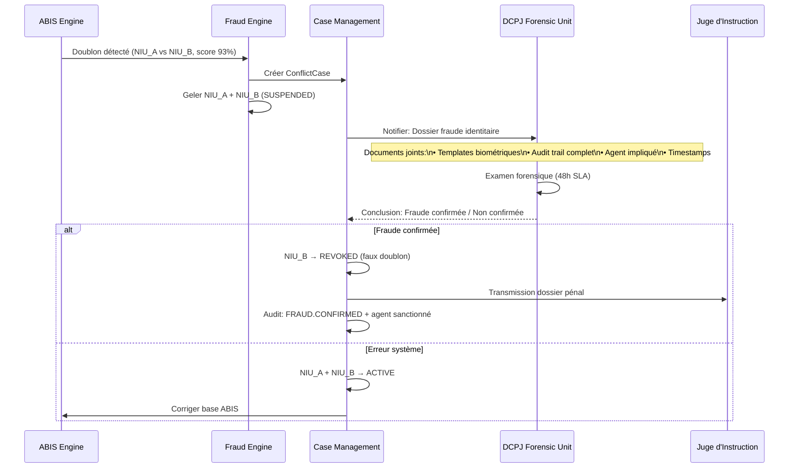

# 🛡️ SNISID — MOTEUR ANTI-FRAUDE NATIONAL
## Fraud Prevention Engine & Verification Platform

**Document ID :** SNISID-FRD-001  
**Version :** 1.0.0  
**Date :** Mai 2026  
**Classification :** SOUVERAIN / SÉCURITÉ NATIONALE

---

## 1. PAYSAGE DES MENACES FRAUDE EN HAÏTI

### 1.1 Typologies de Fraude Identifiées

| Type de Fraude | Impact | Prévalence estimée | Vecteur Principal |
|---------------|--------|-------------------|-------------------|
| **Travailleurs fantômes** | État paie des salaires à des identités fictives | Élevé (fonct. publique) | Inscription frauduleuse OMRH |
| **Double enrôlement** | Même citoyen sous 2 identités différentes | Moyen-élevé | Données démographiques altérées |
| **Fraude électorale** | Votes multiples via plusieurs NIU | Élevé (période électorale) | Compromission agents CEP |
| **Usurpation d'identité** | Vol d'identité pour accès aux services | Moyen | Documents falsifiés |
| **Documents falsifiés** | Faux actes de naissance pour enrôlement | Élevé | Officiers corrompus |
| **Fraude interne (insider)** | Agents ONI créant des identités fictives | Moyen | Absence de supervision |
| **Fraude organisée** | Réseaux d'inscription massive frauduleuse | Faible-moyen | Complicité agents + témoins |

### 1.2 Principes de Défense

```
Ligne 1 — Biométrie : ABIS 1:N (déduplication absolue)
Ligne 2 — IA/ML : Détection de patterns de fraude en temps réel
Ligne 3 — Règles métier : Velocity checks, geographic checks
Ligne 4 — Supervision humaine : DCPJ investigation
Ligne 5 — Audit WORM : Forensic readiness complète
```

---

## 2. ARCHITECTURE DU MOTEUR ANTI-FRAUDE

### 2.1 Pipeline Temps Réel

```mermaid
graph TD
    subgraph INTAKE["📥 Événements en entrée"]
        ENROLL_EVENT[Événement\nEnrôlement]
        VERIFY_EVENT[Événement\nVérification]
        CIVIL_EVENT[Événement\nÉtat Civil]
    end

    subgraph FLINK["⚡ Apache Flink — Feature Extraction"]
        VELOCITY[Velocity\nAnalyzer]
        GEO[Geographic\nAnalyzer]
        AGENT[Agent Behavior\nAnalyzer]
        DOC[Document\nAnalyzer]
        BIO_CORREL[Biometric\nCorrelation]
    end

    subgraph ML["🤖 ML Inference (TensorFlow Serving)"]
        RF[Random Forest\nEnrollment Model]
        DNN[Deep Neural Net\nBehavior Model]
        ENSEMBLE[Ensemble\nFusion (weighted avg)]
    end

    subgraph DECISION["🎯 Décision Engine"]
        RISK_SCORE[Risk Score\n0.0 → 1.0]
        RULES_ENGINE[Rules Engine\n30+ règles métier]
        FINAL_DECISION{Décision\nfinale}
    end

    subgraph ACTIONS["⚡ Actions"]
        AUTO_APPROVE[✅ Auto-approuver\n< 0.4]
        STEP_UP[⚠️ Step-Up Review\n0.4-0.7]
        FREEZE[🚨 Geler + DCPJ\n> 0.7]
    end

    INTAKE --> FLINK
    FLINK --> ML
    ML --> ENSEMBLE
    ENSEMBLE --> RISK_SCORE
    RISK_SCORE --> RULES_ENGINE
    RULES_ENGINE --> FINAL_DECISION
    FINAL_DECISION --> AUTO_APPROVE & STEP_UP & FREEZE
```

### 2.2 Vecteur de Features (14 Dimensions)

| # | Feature | Description | Poids | Source |
|---|---------|-------------|-------|--------|
| 1 | `agent_velocity_1h` | Enrôlements de cet agent dans la dernière heure | **Haut** | Agent Baseline DB |
| 2 | `agent_velocity_8h` | Enrôlements des dernières 8h vs baseline | **Haut** | Agent Baseline DB |
| 3 | `agent_deviation_sigma` | Écarts-types vs moyenne historique agent | **Haut** | Agent Stats |
| 4 | `device_location_delta` | Distance GPS vs station assignée de l'agent | **Moyen** | GPS + GIS |
| 5 | `time_of_day_risk` | Score de risque selon l'heure (nuit = élevé) | **Moyen** | System Clock |
| 6 | `document_diversity_score` | Variété de types de docs dans le batch | **Moyen** | Doc Pipeline |
| 7 | `commune_saturation_pct` | % population communale enrôlée aujourd'hui | **Moyen** | Registry Stats |
| 8 | `biometric_quality_mean` | Score NFIQ2 moyen du batch | **Bas** | Bio Pipeline |
| 9 | `demographic_entropy` | Entropie statistique des noms/DOB du batch | **Moyen** | Demographics |
| 10 | `inter_enrollment_gap_sec` | Temps moyen entre enrôlements consécutifs | **Moyen** | Workflow Engine |
| 11 | `photo_similarity_cosine` | Similarité cosinus des visages du batch | **Haut** | ABIS |
| 12 | `same_witness_frequency` | Fréquence du même témoin dans les affidavits | **Haut** | Doc Pipeline |
| 13 | `geo_velocity_kmh` | Vitesse de déplacement impossible entre enrôl. | **Haut** | GIS |
| 14 | `offline_duration_days` | Durée offline avant sync (long = risque) | **Moyen** | Sync Daemon |

---

## 3. VELOCITY CHECKS — RÈGLES IMMÉDIATES

```yaml
# fraud-engine/rules/velocity-checks.yaml
velocity_rules:

  agent_enrollment_velocity:
    description: "Trop d'enrôlements par un seul agent"
    thresholds:
      - window: 1h
        limit: 25
        action: ALERT_SUPERVISOR
      - window: 8h
        limit: 80
        action: FREEZE_AGENT
      - window: 24h
        limit: 200
        action: FREEZE_AGENT + DCPJ_REFERRAL

  device_rapid_fire:
    description: "Enrôlements trop rapides sur le même appareil"
    threshold:
      min_gap_seconds: 180  # 3 minutes minimum entre 2 enrôlements
      violations_before_freeze: 3
    action: FREEZE_DEVICE + SOC_ALERT

  commune_saturation:
    description: "Saturation anormale d'une commune"
    threshold:
      max_pct_population_per_day: 5.0  # Max 5% de la population en 1 jour
      absolute_max_per_day: 500
    action: FLAG_FOR_REVIEW + REGIONAL_SUPERVISOR_ALERT

  same_witness_abuse:
    description: "Même témoin utilisé trop souvent (fraude coordonnée)"
    threshold:
      max_appearances_per_day: 5
      max_appearances_per_week: 15
    action: FREEZE_WITNESS_NIU + DCPJ_REFERRAL

  biometric_batch_similarity:
    description: "Visages trop similaires dans un batch (population fictive)"
    threshold:
      cosine_similarity_threshold: 0.85
      min_pairs_triggering: 3
    action: FREEZE_BATCH + SOC_ALERT + DCPJ_REFERRAL

  geographic_impossibility:
    description: "Agent physiquement impossible d'être aux 2 endroits"
    threshold:
      max_speed_kmh: 120  # Vitesse maximale réaliste
    action: FREEZE_SESSION + SOC_ALERT
```

---

## 4. PLATEFORME DE VÉRIFICATION NATIONALE

### 4.1 Canaux de Vérification

```mermaid
graph TD
    subgraph CHANNELS["🔌 Canaux de Vérification"]
        API_B2B[🏦 API B2B\n(Banques, Hôpitaux, Police)]
        QR_SCAN[📱 QR Code\n(Documents physiques)]
        USSD[📞 USSD *555#\n(Téléphones basiques)]
        SDK[📲 SDK Mobile\n(Android + iOS)]
        OFFLINE_NODE[💻 Node Offline\n(Edge départemental)]
    end

    subgraph VERIFY_ENGINE["⚙️ Verification Engine"]
        AUTH_CHECK[OAuth 2.1 + mTLS\nVérification accès]
        RATE_LIMIT[Rate Limiter\nPar agence]
        IDENTITY_CHK[Identity Registry\nLookup]
        BIO_MATCH[Biometric 1:1\n(si niveau 3+)]
        DISCLOSURE[Data Minimization\nAttributs sélectifs]
    end

    subgraph RESPONSE["📤 Réponses"]
        MINIMAL[Niveau 1: Actif/Inactif]
        WITH_PHOTO[Niveau 2: + Photo]
        WITH_BIO[Niveau 3: + Biométrie]
        FULL_PKI[Niveau 4: + Certificat PKI]
    end

    CHANNELS --> VERIFY_ENGINE
    VERIFY_ENGINE --> RESPONSE
```

### 4.2 API Vérification (OpenAPI 3.1)

```yaml
paths:
  /v1/verify/identity:
    post:
      operationId: verifyIdentity
      summary: Vérification complète d'une identité
      security:
        - oauth2: [verification:read]
      requestBody:
        content:
          application/json:
            schema:
              type: object
              required: [niu, requested_level]
              properties:
                niu:
                  type: string
                  pattern: '^\d{10}$'
                requested_level:
                  type: integer
                  enum: [1, 2, 3, 4]
                  description: |
                    1=Statut seul, 2=+Photo, 3=+Biométrie 1:1, 4=+Certificat PKI
                biometric_template:
                  type: string
                  format: byte
                  description: "Requis si niveau ≥ 3"
                purpose:
                  type: string
                  description: "Motif de la vérification (audit)"
      responses:
        '200':
          content:
            application/json:
              schema:
                properties:
                  niu: { type: string }
                  status: { type: string, enum: [ACTIVE, SUSPENDED, DECEASED, NOT_FOUND] }
                  nom: { type: string, description: "Si niveau ≥ 2" }
                  photo_match: { type: boolean, description: "Si niveau ≥ 2" }
                  biometric_match: { type: boolean, description: "Si niveau 3" }
                  biometric_score: { type: number, description: "Si niveau 3" }
                  cert_valid: { type: boolean, description: "Si niveau 4" }
                  verified_at: { type: string, format: date-time }
                  verification_id: { type: string, format: uuid }

  /v1/verify/qr/{token}:
    get:
      operationId: verifyQRCode
      summary: Valider un QR code de document officiel SNISID
      parameters:
        - name: token
          in: path
          required: true
          schema: { type: string }
      responses:
        '200':
          content:
            application/json:
              schema:
                properties:
                  valid: { type: boolean }
                  document_type: { type: string }
                  niu: { type: string }
                  document_date: { type: string, format: date }
                  issuing_commune: { type: string }
                  tamper_detected: { type: boolean }
                  expires_at: { type: string, format: date-time }
```

### 4.3 Limites de Taux par Agence

| Agence | Quotidien | Horaire | Seuil Alerte |
|--------|-----------|---------|--------------|
| DGI (Fiscal) | 100,000 | 10,000 | > 80% |
| MSPP (Hôpitaux) | 200,000 | 20,000 | > 80% |
| CEP (Électoral) | 500,000 | 100,000 | > 90% |
| Banques (all) | 1,000,000 | 150,000 | > 85% |
| PNH (Police) | 50,000 | 10,000 | > 70% |
| MENFP (Éducation) | 75,000 | 8,000 | > 80% |

---

## 5. PLATEFORME D'AUDIT & TRAÇABILITÉ

### 5.1 Architecture WORM (Write Once Read Many)

```mermaid
graph LR
    subgraph SOURCES["📡 Sources d'événements"]
        ID_SVC[Identity Service]
        BIO_SVC[Biometric Service]
        CIV_SVC[Civil Registry]
        WF_ENGINE[Workflow Engine]
        GW[API Gateway]
    end

    subgraph AUDIT_PIPELINE["🔏 Pipeline d'Audit"]
        KAFKA_AUDIT[(Kafka\nsnisid.audit.system\n365 jours)]
        ENRICHER[Audit Enricher\nAjoute contexte, geo, hash]
        SIGNER[Event Signer\nSignature PKI des événements]
    end

    subgraph STORAGE["💾 Stockage Immuable"]
        OPENSEARCH_AUDIT[(OpenSearch\nRecherche temps réel)]
        WORM_STORAGE[MinIO WORM\n(Object Lock — 7 ans min)]
        MERKLE[Merkle Tree\nHash Chain]
    end

    SOURCES --> KAFKA_AUDIT
    KAFKA_AUDIT --> ENRICHER --> SIGNER
    SIGNER --> OPENSEARCH_AUDIT
    SIGNER --> WORM_STORAGE
    SIGNER --> MERKLE
```

### 5.2 Catalogue d'Événements d'Audit (50+ types)

| Catégorie | Événements |
|-----------|-----------|
| **Identité** | CITIZEN.CREATED, CITIZEN.ACTIVATED, CITIZEN.UPDATED, CITIZEN.SUSPENDED, CITIZEN.REVOKED, CITIZEN.DECEASED |
| **Biométrie** | BIO.ENROLLED, BIO.VERIFIED, BIO.FAILED, BIO.SPOOFING_DETECTED, BIO.REVOKED |
| **État Civil** | CIVIL.BIRTH.*, CIVIL.DEATH.*, CIVIL.MARRIAGE.*, CIVIL.DIVORCE.*, CIVIL.ADOPTION.* |
| **Accès** | ACCESS.GRANTED, ACCESS.DENIED, ACCESS.PRIVILEGED, ACCESS.BULK_EXPORT |
| **Fraude** | FRAUD.ALERT.CREATED, FRAUD.CASE.OPENED, FRAUD.AGENT.FROZEN, FRAUD.DCPJ.REFERRED |
| **Système** | SYS.AGENT.LOGIN, SYS.AGENT.LOGOUT, SYS.CONFIG.CHANGED, SYS.CERT.ISSUED |
| **PKI** | PKI.CERT.ISSUED, PKI.CERT.REVOKED, PKI.CRL.PUBLISHED |

### 5.3 Chaîne Merkle pour Intégrité

```
Événement N-1 (hash: abc123)
    ↓
Événement N: {payload} + previous_hash: "abc123"
    ↓ SHA-256
Hash N: "def456"
    ↓
Événement N+1: {payload} + previous_hash: "def456"
    ...

Toute altération d'un événement invalide tous les événements suivants.
```

---

## 6. PROCÉDURE DE RÉFÉRÉ DCPJ

Pour tout cas de fraude avérée ou doublon biométrique confirmé :



---

*Document ID : SNISID-FRD-001 v1.0.0 — Mai 2026*  
*Approuvé par : CISO National | DG-DCPJ | DG-AND*  
*Classification : SOUVERAIN / SÉCURITÉ NATIONALE*
