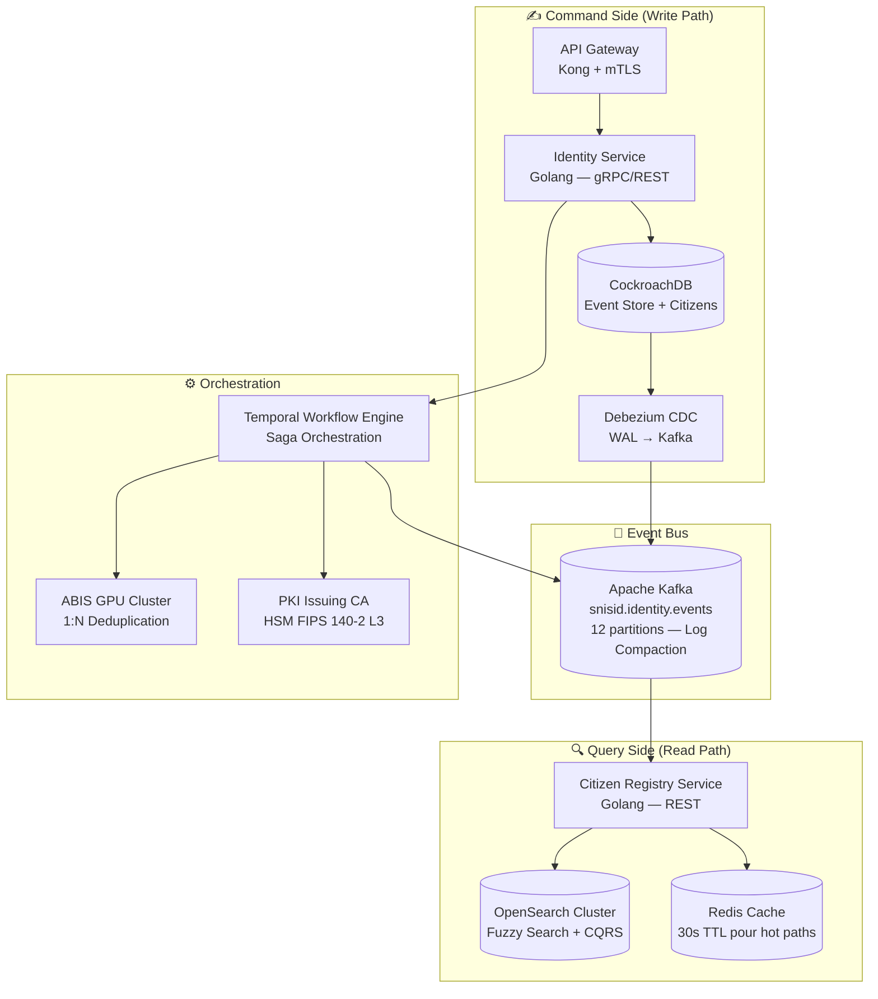
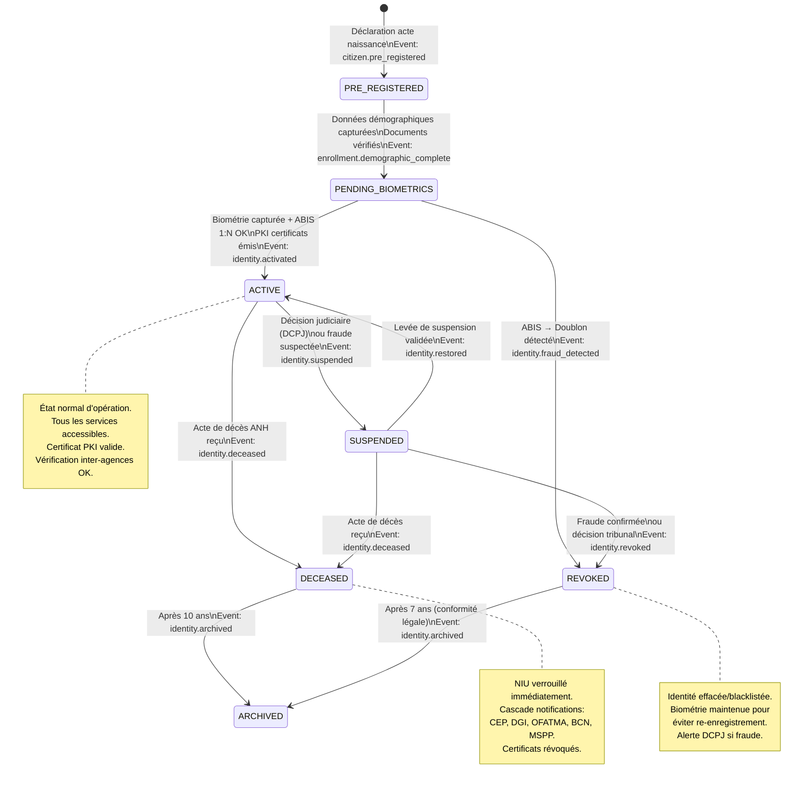
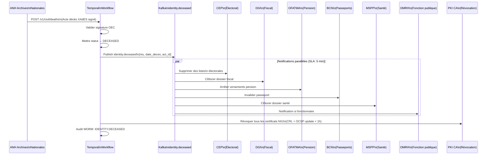
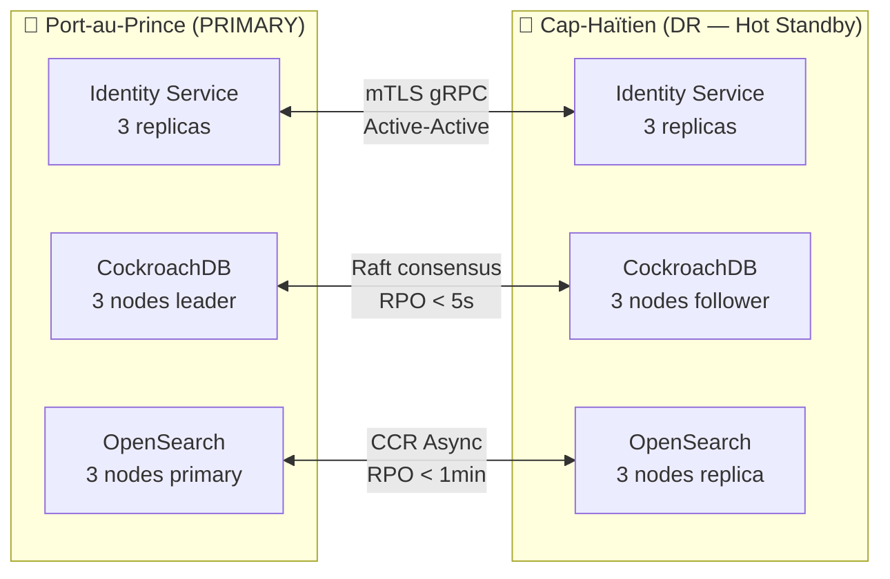

# 🆔 SNISID — REGISTRE NATIONAL D'IDENTITÉ
## Architecture Maître — Identity Registry & Citizen Lifecycle Engine

**Document ID :** SNISID-IDN-001  
**Version :** 1.0.0  
**Date :** Mai 2026  
**Classification :** SOUVERAIN / INFRASTRUCTURE CRITIQUE NATIONALE  
**Statut :** PRODUCTION-READY  

---

## 1. VISION & MISSION

Le Registre National d'Identité SNISID est l'**autorité souveraine d'identification** de la République d'Haïti. Il constitue la source unique de vérité (Single Source of Truth) pour l'identité de chaque citoyen haïtien, garantissant :

- **Un citoyen, une identité** : déduplication biométrique absolue
- **Souveraineté nationale** : données résidant physiquement en Haïti
- **Audit total** : chaque accès, chaque modification, immuablement tracé
- **Résilience 24/7** : disponible en ligne, hors ligne, en catastrophe

---

## 2. ARCHITECTURE SYSTÈME

### 2.1 Modèle CQRS + Event Sourcing



### 2.2 Couches de Service

| Couche | Service | Technologie | Port | SLA |
|--------|---------|-------------|------|-----|
| **API** | API Gateway | Kong + WAF | 443 | 99.99% |
| **Identité** | Identity Service | Golang | 8443 | 99.95% |
| **Registre** | Citizen Registry | Golang | 8081 | 99.95% |
| **Biométrie** | Biometric Service | Golang + Python | 8082 | 99.9% |
| **Workflow** | Temporal Engine | Go | 7233 | 99.9% |
| **Données** | CockroachDB | CockroachDB 23+ | 5432 | 99.99% |
| **Recherche** | OpenSearch | OpenSearch 2+ | 9200 | 99.9% |
| **Cache** | Redis Cluster | Redis 7+ | 6379 | 99.95% |

---

## 3. NUMÉRO D'IDENTIFICATION UNIQUE (NIU)

### 3.1 Format & Génération

Le NIU est le **pilier central** du système SNISID. Contrairement aux anciens numéros CIN qui encodaient des informations démographiques, le NIU est **cryptographiquement aléatoire**.

```
NIU Format: XXXXXXXXXX  (10 chiffres décimaux)
Exemple:    7392851046
```

**Propriétés critiques :**
- 🔒 **Aléatoire** : Généré par `crypto/rand` — aucune info démographique encodée
- 🔒 **Unique** : Collision probability < 1:10^10 (contrôle d'unicité en DB)
- 🔒 **Opaque** : Impossible de déduire département, date de naissance, sexe
- 🔒 **Permanent** : Non modifiable après activation (renouvellement = nouveau NIU v2+)
- 🔒 **Versionné** : Champ `niu_version` permet de tracer les renouvellements

### 3.2 Algorithme de Génération

```go
// identity-service/internal/domain/niu_generator.go
package domain

import (
    "crypto/rand"
    "database/sql"
    "fmt"
    "math/big"
)

const niuMax = int64(9999999999) // 10^10 - 1

type NIUGenerator struct {
    db *sql.DB
}

func (g *NIUGenerator) Generate(ctx context.Context) (string, error) {
    for attempts := 0; attempts < 10; attempts++ {
        n, err := rand.Int(rand.Reader, big.NewInt(niuMax))
        if err != nil {
            return "", fmt.Errorf("crypto/rand failed: %w", err)
        }
        niu := fmt.Sprintf("%010d", n.Int64())

        // Contrôle d'unicité atomique (avec lock de table row)
        exists, err := g.existsInDB(ctx, niu)
        if err != nil {
            return "", err
        }
        if !exists {
            return niu, nil
        }
    }
    return "", fmt.Errorf("NIU generation: 10 collision attempts exhausted")
}
```

---

## 4. LIFECYCLE DE L'IDENTITÉ CITOYENNE

### 4.1 Machine d'État (7 États)



### 4.2 Transitions & Gardes

| Transition | Déclencheur | Garde (conditions) | Actions |
|-----------|-------------|-------------------|---------|
| `PRE_REGISTERED → PENDING_BIOMETRICS` | Agent enrollment | Docs vérifiés, agent authentifié FIDO2 | Créer session biométrique, générer enrollment_id |
| `PENDING_BIOMETRICS → ACTIVE` | ABIS clear + PKI issued | ABIS score < 85%, qualité bio OK, docs valides | Générer NIU, émettre certificats, publier `identity.activated` |
| `PENDING_BIOMETRICS → REVOKED` | ABIS doublon ≥ 85% | - | Geler les 2 NIUs, router vers adjudication |
| `ACTIVE → SUSPENDED` | Décision judiciaire ou fraude flag | Décision signée par autorité habilitée | Révoquer token OAuth, notifier agences |
| `SUSPENDED → ACTIVE` | Décision judiciaire de levée | Décision signée, délai minimum respecté | Réhabiliter accès, notifier agences |
| `ACTIVE → DECEASED` | Acte de décès validé | OEC signature XAdES vérifiée | Cascade 8 agences, révoquer PKI |
| `DECEASED → ARCHIVED` | Cron job (après 10 ans) | Date décès + 10 ans dépassée | Anonymiser données RGPD, archiver |

### 4.3 Cascade Notifications au Décès



---

## 5. API CONTRACT (OpenAPI 3.1)

```yaml
openapi: "3.1.0"
info:
  title: SNISID Identity Registry API
  version: "1.0.0"
  description: |
    API souveraine du Registre National d'Identité SNISID.
    Authentification: OAuth 2.1 (client_credentials) + mTLS obligatoire.
    Toutes les réponses incluent un X-Audit-Trail-ID header.
  contact:
    name: AND — Autorité Nationale Numérique
    email: api@snisid.gov.ht

servers:
  - url: https://api.snisid.gov.ht/v1
    description: Production (Port-au-Prince)
  - url: https://api-dr.snisid.gov.ht/v1
    description: DR (Cap-Haïtien — Failover)

security:
  - oauth2_client_credentials: []

paths:

  /identities:
    post:
      operationId: createIdentity
      summary: Créer une nouvelle identité citoyenne
      tags: [Identity]
      security:
        - oauth2_client_credentials: [identity:write]
      requestBody:
        required: true
        content:
          application/json:
            schema:
              $ref: '#/components/schemas/CreateIdentityRequest'
      responses:
        '202':
          description: Accepté — Traitement asynchrone (workflow Temporal lancé)
          headers:
            X-Workflow-ID:
              schema: { type: string }
            X-Enrollment-ID:
              schema: { type: string, format: uuid }
          content:
            application/json:
              schema:
                $ref: '#/components/schemas/EnrollmentAccepted'
        '400':
          $ref: '#/components/responses/ValidationError'
        '409':
          description: Conflit — Identité existante probable (biométrie similaire)
          content:
            application/json:
              schema:
                $ref: '#/components/schemas/ConflictError'

  /identities/{niu}:
    get:
      operationId: getIdentity
      summary: Récupérer le profil d'une identité
      tags: [Identity]
      security:
        - oauth2_client_credentials: [identity:read]
      parameters:
        - name: niu
          in: path
          required: true
          schema: { type: string, pattern: '^\d{10}$' }
        - name: fields
          in: query
          description: Champs à retourner (minimisation données)
          schema: { type: array, items: { type: string } }
      responses:
        '200':
          description: Identité trouvée
          content:
            application/json:
              schema:
                $ref: '#/components/schemas/IdentityResponse'
        '404':
          $ref: '#/components/responses/NotFound'
        '403':
          $ref: '#/components/responses/AccessDenied'

    patch:
      operationId: updateIdentity
      summary: Mettre à jour des données d'une identité
      tags: [Identity]
      security:
        - oauth2_client_credentials: [identity:write]
      parameters:
        - name: niu
          in: path
          required: true
          schema: { type: string, pattern: '^\d{10}$' }
      requestBody:
        content:
          application/json:
            schema:
              $ref: '#/components/schemas/UpdateIdentityRequest'
      responses:
        '200':
          description: Mis à jour avec succès
        '409':
          description: Conflit de version (optimistic locking)

  /identities/{niu}/suspend:
    post:
      operationId: suspendIdentity
      summary: Suspendre une identité (décision judiciaire ou fraude)
      tags: [Identity, Security]
      security:
        - oauth2_client_credentials: [identity:suspend]
      parameters:
        - name: niu
          in: path
          required: true
          schema: { type: string }
      requestBody:
        required: true
        content:
          application/json:
            schema:
              properties:
                reason: { type: string, enum: [JUDICIAL_ORDER, FRAUD_CONFIRMED, SUSPECTED_DUPLICATE, SECURITY_HOLD] }
                legal_reference: { type: string, description: "Numéro décision judiciaire" }
                authorized_by: { type: string, description: "ID autorité habilitée" }
                signature: { type: string, description: "Signature XAdES de la décision" }

  /identities/{niu}/history:
    get:
      operationId: getIdentityHistory
      summary: Récupérer l'historique complet des événements d'une identité
      tags: [Identity, Audit]
      security:
        - oauth2_client_credentials: [identity:audit]
      parameters:
        - name: niu
          in: path
          required: true
          schema: { type: string }
        - name: from
          in: query
          schema: { type: string, format: date-time }
        - name: to
          in: query
          schema: { type: string, format: date-time }
        - name: event_types
          in: query
          schema: { type: array, items: { type: string } }
      responses:
        '200':
          content:
            application/json:
              schema:
                type: object
                properties:
                  niu: { type: string }
                  events:
                    type: array
                    items:
                      $ref: '#/components/schemas/IdentityEvent'
                  total: { type: integer }

  /registry/search:
    get:
      operationId: searchCitizens
      summary: Recherche fuzzy dans le registre citoyen (CQRS Read Model)
      tags: [Registry]
      security:
        - oauth2_client_credentials: [registry:search]
      parameters:
        - name: q
          in: query
          description: "Texte libre (nom, prénom, commune)"
          schema: { type: string, minLength: 3 }
        - name: date_naissance
          in: query
          schema: { type: string, format: date }
        - name: commune
          in: query
          schema: { type: string }
        - name: departement
          in: query
          schema: { type: string }
        - name: limit
          in: query
          schema: { type: integer, default: 10, maximum: 100 }
      responses:
        '200':
          content:
            application/json:
              schema:
                type: object
                properties:
                  results:
                    type: array
                    items:
                      $ref: '#/components/schemas/CitizenSearchResult'
                  total_hits: { type: integer }
                  took_ms: { type: integer }

components:
  schemas:
    CreateIdentityRequest:
      type: object
      required: [demographics, documents, biometrics, enrollment_metadata]
      properties:
        demographics:
          type: object
          required: [nom, prenom, date_naissance, lieu_naissance_commune, sexe]
          properties:
            nom: { type: string, maxLength: 100 }
            prenom: { type: string, maxLength: 150 }
            date_naissance: { type: string, format: date }
            lieu_naissance_commune: { type: string }
            lieu_naissance_departement: { type: string }
            sexe: { type: string, enum: [M, F, INDETERMINE] }
            pere_niu: { type: string, pattern: '^\d{10}$' }
            mere_niu: { type: string, pattern: '^\d{10}$' }
        documents:
          type: array
          minItems: 1
          items:
            type: object
            properties:
              type: { type: string }
              reference: { type: string }
              scan_base64: { type: string, format: byte }
        biometrics:
          type: object
          properties:
            fingerprints: { type: string, format: byte, description: "ISO 19794-2 template, Base64" }
            iris: { type: string, format: byte, description: "ISO 19794-6 template, Base64" }
            face: { type: string, format: byte, description: "ISO 19794-5 template, Base64" }
            pad_scores: { type: object }
        enrollment_metadata:
          type: object
          properties:
            agent_id: { type: string }
            centre_id: { type: string }
            channel: { type: string, enum: [FIXED_SITE, MOBILE_KIT, OFFLINE_EMERGENCY] }
            session_id: { type: string, format: uuid }

    IdentityResponse:
      type: object
      properties:
        niu: { type: string }
        statut: { type: string }
        nom: { type: string }
        prenom: { type: string }
        date_naissance: { type: string, format: date }
        lieu_naissance_commune: { type: string }
        sexe: { type: string }
        biometric_enrolled: { type: boolean }
        cert_expires_at: { type: string, format: date-time }
        version: { type: integer }

    CitizenSearchResult:
      type: object
      properties:
        niu: { type: string }
        nom: { type: string }
        prenom: { type: string }
        date_naissance: { type: string, format: date }
        commune: { type: string }
        statut: { type: string }
        score: { type: number, description: "Score de pertinence OpenSearch" }

    IdentityEvent:
      type: object
      properties:
        event_id: { type: string, format: uuid }
        event_type: { type: string }
        timestamp: { type: string, format: date-time }
        agent_id: { type: string }
        payload: { type: object }
        event_hash: { type: string }

  responses:
    ValidationError:
      description: Données invalides
      content:
        application/json:
          schema:
            properties:
              code: { type: string, example: "VALIDATION_ERROR" }
              message: { type: string }
              details: { type: array, items: { type: object } }
    NotFound:
      description: Identité non trouvée
    AccessDenied:
      description: Accès refusé (scope insuffisant ou politique ABAC)

  securitySchemes:
    oauth2_client_credentials:
      type: oauth2
      flows:
        clientCredentials:
          tokenUrl: https://iam.snisid.gov.ht/realms/snisid/protocol/openid-connect/token
          scopes:
            identity:read: "Lire les données d'identité"
            identity:write: "Créer et modifier des identités"
            identity:suspend: "Suspendre/révoquer des identités"
            identity:audit: "Accès à l'historique d'audit"
            registry:search: "Recherche dans le registre citoyen"
```

---

## 6. KAFKA EVENT CATALOG

### 6.1 Topics & Schemas

| Topic | Partitions | Rétention | Description |
|-------|-----------|-----------|-------------|
| `snisid.identity.events` | 12 | INFINITE (log compaction) | Tous les événements identité |
| `snisid.identity.activated` | 6 | 90 jours | Identités nouvellement activées |
| `snisid.identity.deceased` | 3 | 90 jours | Décès (déclenche cascade) |
| `snisid.identity.suspended` | 3 | 90 jours | Suspensions |
| `snisid.enrollment.completed` | 6 | 30 jours | Enrôlements terminés |
| `snisid.fraud.detected` | 3 | 365 jours | Alertes fraude |

### 6.2 Avro Schema — CitizenRegistered

```json
{
  "namespace": "ht.gov.snisid.identity.v1",
  "type": "record",
  "name": "CitizenRegistered",
  "doc": "Événement publié lors de la première création d'une identité citoyenne",
  "fields": [
    { "name": "event_id", "type": "string", "doc": "UUID v4 de l'événement" },
    { "name": "niu", "type": "string", "doc": "Numéro d'Identification Unique (10 chiffres)" },
    { "name": "enrollment_id", "type": "string" },
    { "name": "timestamp", "type": { "type": "long", "logicalType": "timestamp-millis" } },
    { "name": "agent_id", "type": "string" },
    { "name": "centre_id", "type": "string" },
    { "name": "channel", "type": { "type": "enum", "name": "Channel", "symbols": ["FIXED_SITE", "MOBILE_KIT", "OFFLINE_EMERGENCY"] } },
    { "name": "demographics_hash", "type": "string", "doc": "SHA-256 des données démographiques (pas les données elles-mêmes)" },
    { "name": "biometrics_enrolled", "type": "boolean" },
    { "name": "departement", "type": "string" },
    { "name": "schema_version", "type": "string", "default": "1.0" }
  ]
}
```

### 6.3 Avro Schema — IdentityDeceased

```json
{
  "namespace": "ht.gov.snisid.identity.v1",
  "type": "record",
  "name": "IdentityDeceased",
  "doc": "Déclenche la cascade de notifications inter-agences",
  "fields": [
    { "name": "event_id", "type": "string" },
    { "name": "niu", "type": "string" },
    { "name": "date_deces", "type": { "type": "int", "logicalType": "date" } },
    { "name": "acte_deces_id", "type": "string" },
    { "name": "oec_id", "type": "string" },
    { "name": "commune_deces", "type": "string" },
    { "name": "notifications_required", "type": { "type": "array", "items": "string" },
      "doc": "Agences à notifier: CEP, DGI, OFATMA, BCN, MSPP, OMRH, MENFP" },
    { "name": "timestamp", "type": { "type": "long", "logicalType": "timestamp-millis" } }
  ]
}
```

---

## 7. KUBERNETES MANIFESTS

### 7.1 Namespace & NetworkPolicy

```yaml
# Namespace
apiVersion: v1
kind: Namespace
metadata:
  name: snisid-identity
  labels:
    istio-injection: enabled
    pod-security.kubernetes.io/enforce: restricted
    snisid.gov.ht/component: identity-core
    snisid.gov.ht/data-classification: sovereign-critical

---
# NetworkPolicy: Default Deny
apiVersion: networking.k8s.io/v1
kind: NetworkPolicy
metadata:
  name: default-deny-all
  namespace: snisid-identity
spec:
  podSelector: {}
  policyTypes: [Ingress, Egress]
---
# NetworkPolicy: Allow from API Gateway only
apiVersion: networking.k8s.io/v1
kind: NetworkPolicy
metadata:
  name: allow-api-gateway
  namespace: snisid-identity
spec:
  podSelector:
    matchLabels:
      app: identity-service
  policyTypes: [Ingress]
  ingress:
  - from:
    - namespaceSelector:
        matchLabels:
          kubernetes.io/metadata.name: snisid-api-gateway
    - podSelector:
        matchLabels:
          app: api-gateway
    ports:
    - port: 8443
      protocol: TCP
---
# NetworkPolicy: Allow to CockroachDB + Kafka
apiVersion: networking.k8s.io/v1
kind: NetworkPolicy
metadata:
  name: allow-egress-data
  namespace: snisid-identity
spec:
  podSelector:
    matchLabels:
      app: identity-service
  policyTypes: [Egress]
  egress:
  - to:
    - namespaceSelector:
        matchLabels:
          kubernetes.io/metadata.name: snisid-databases
    ports:
    - port: 26257  # CockroachDB
  - to:
    - namespaceSelector:
        matchLabels:
          kubernetes.io/metadata.name: snisid-event-bus
    ports:
    - port: 9092   # Kafka
  - to:  # Vault
    - namespaceSelector:
        matchLabels:
          kubernetes.io/metadata.name: snisid-security
    ports:
    - port: 8200
  - to:  # Temporal
    - namespaceSelector:
        matchLabels:
          kubernetes.io/metadata.name: snisid-workflows
    ports:
    - port: 7233
  - ports:  # DNS
    - port: 53
      protocol: UDP
```

### 7.2 Identity Service Deployment

```yaml
apiVersion: apps/v1
kind: Deployment
metadata:
  name: identity-service
  namespace: snisid-identity
  labels:
    app: identity-service
    version: "1.0.0"
    snisid.gov.ht/component: identity-core
    snisid.gov.ht/tier: critical
spec:
  replicas: 3
  selector:
    matchLabels:
      app: identity-service
  strategy:
    type: RollingUpdate
    rollingUpdate:
      maxSurge: 1
      maxUnavailable: 0
  template:
    metadata:
      labels:
        app: identity-service
        version: "1.0.0"
        sidecar.istio.io/inject: "true"
      annotations:
        vault.hashicorp.com/agent-inject: "true"
        vault.hashicorp.com/role: "identity-service"
        vault.hashicorp.com/agent-inject-secret-db: "database/creds/identity-service-role"
        vault.hashicorp.com/agent-inject-template-db: |
          {{- with secret "database/creds/identity-service-role" -}}
          DATABASE_URL=postgresql://{{ .Data.username }}:{{ .Data.password }}@cockroachdb.snisid-databases:5432/snisid
          {{- end }}
        prometheus.io/scrape: "true"
        prometheus.io/port: "9090"
        prometheus.io/path: "/metrics"
    spec:
      serviceAccountName: identity-service
      automountServiceAccountToken: false
      securityContext:
        runAsNonRoot: true
        runAsUser: 65534
        runAsGroup: 65534
        fsGroup: 65534
        seccompProfile:
          type: RuntimeDefault
      containers:
      - name: identity-service
        image: harbor.snisid.gov.ht/snisid/identity-service:1.0.0
        imagePullPolicy: Always
        ports:
        - name: grpc
          containerPort: 8443
        - name: metrics
          containerPort: 9090
        - name: health
          containerPort: 8080
        env:
        - name: APP_ENV
          value: production
        - name: LOG_LEVEL
          value: info
        - name: KAFKA_BROKERS
          valueFrom:
            configMapKeyRef:
              name: identity-service-config
              key: kafka.brokers
        - name: TEMPORAL_HOST
          valueFrom:
            configMapKeyRef:
              name: identity-service-config
              key: temporal.host
        envFrom:
        - configMapRef:
            name: identity-service-config
        volumeMounts:
        - name: vault-secrets
          mountPath: /vault/secrets
          readOnly: true
        - name: tmp
          mountPath: /tmp
        securityContext:
          allowPrivilegeEscalation: false
          readOnlyRootFilesystem: true
          capabilities:
            drop: [ALL]
        resources:
          requests:
            memory: "512Mi"
            cpu: "250m"
          limits:
            memory: "1Gi"
            cpu: "1000m"
        livenessProbe:
          httpGet:
            path: /healthz
            port: health
          initialDelaySeconds: 30
          periodSeconds: 10
          failureThreshold: 3
        readinessProbe:
          httpGet:
            path: /readyz
            port: health
          initialDelaySeconds: 10
          periodSeconds: 5
          failureThreshold: 2
        startupProbe:
          httpGet:
            path: /startupz
            port: health
          failureThreshold: 30
          periodSeconds: 10
      volumes:
      - name: vault-secrets
        emptyDir:
          medium: Memory
      - name: tmp
        emptyDir: {}
      topologySpreadConstraints:
      - maxSkew: 1
        topologyKey: kubernetes.io/hostname
        whenUnsatisfiable: DoNotSchedule
        labelSelector:
          matchLabels:
            app: identity-service
      affinity:
        podAntiAffinity:
          requiredDuringSchedulingIgnoredDuringExecution:
          - labelSelector:
              matchLabels:
                app: identity-service
            topologyKey: kubernetes.io/hostname

---
# HorizontalPodAutoscaler
apiVersion: autoscaling/v2
kind: HorizontalPodAutoscaler
metadata:
  name: identity-service-hpa
  namespace: snisid-identity
spec:
  scaleTargetRef:
    apiVersion: apps/v1
    kind: Deployment
    name: identity-service
  minReplicas: 3
  maxReplicas: 20
  metrics:
  - type: Resource
    resource:
      name: cpu
      target:
        type: Utilization
        averageUtilization: 70
  - type: Resource
    resource:
      name: memory
      target:
        type: Utilization
        averageUtilization: 80
  behavior:
    scaleDown:
      stabilizationWindowSeconds: 300
    scaleUp:
      stabilizationWindowSeconds: 60

---
# PodDisruptionBudget
apiVersion: policy/v1
kind: PodDisruptionBudget
metadata:
  name: identity-service-pdb
  namespace: snisid-identity
spec:
  minAvailable: 2
  selector:
    matchLabels:
      app: identity-service

---
# KEDA ScaledObject (Kafka lag)
apiVersion: keda.sh/v1alpha1
kind: ScaledObject
metadata:
  name: identity-service-kafka-scaler
  namespace: snisid-identity
spec:
  scaleTargetRef:
    name: identity-service
  minReplicaCount: 3
  maxReplicaCount: 20
  triggers:
  - type: kafka
    metadata:
      bootstrapServers: kafka.snisid-event-bus:9092
      consumerGroup: identity-service
      topic: snisid.identity.commands
      lagThreshold: "100"
```

---

## 8. SÉCURITÉ & ZERO TRUST

### 8.1 ABAC Policy (OPA Rego)

```rego
# identity-service/policies/identity-access.rego
package snisid.identity

import future.keywords

# Règle principale: autoriser uniquement si toutes les conditions sont réunies
default allow = false

allow if {
    valid_token
    valid_scope
    valid_commune_access
    not suspended_agent
    within_operating_hours
}

# Le token JWT doit être valide et non expiré
valid_token if {
    input.token.iss == "https://iam.snisid.gov.ht/realms/snisid"
    input.token.exp > time.now_ns() / 1000000000
    input.token.sub != ""
}

# Scopes requis par action
valid_scope if {
    input.action == "read"
    "identity:read" in input.token.scope
}
valid_scope if {
    input.action == "write"
    "identity:write" in input.token.scope
}
valid_scope if {
    input.action == "suspend"
    "identity:suspend" in input.token.scope
    input.token.role in {"CISO", "DCPJ_INVESTIGATOR", "JUDGE"}
}

# Un agent d'enregistrement ne peut enregistrer que dans sa commune assignée
valid_commune_access if {
    input.token.role == "ENROLLMENT_OFFICER"
    input.citizen.birth_commune == input.token.assigned_commune
}
# Les superviseurs ont accès à leur département entier
valid_commune_access if {
    input.token.role == "REGIONAL_SUPERVISOR"
    input.citizen.birth_departement == input.token.assigned_departement
}
# DGI, MSPP, etc. ont accès lecture seule à tout le territoire
valid_commune_access if {
    input.token.role in {"DGI_AGENT", "MSPP_AGENT", "PNH_AGENT", "CEP_AGENT"}
    input.action == "read"
}
# Admin SNISID accès complet
valid_commune_access if {
    input.token.role == "SNISID_ADMIN"
}

# Un agent suspendu ne peut pas accéder
not suspended_agent if {
    data.suspended_agents[input.token.sub] == null
}

# Horaires d'opération (éviter accès nocturnes non autorisés)
within_operating_hours if {
    input.token.role != "ENROLLMENT_OFFICER"  # Agents bureau 24/7
}
within_operating_hours if {
    input.token.role == "ENROLLMENT_OFFICER"
    hour := time.clock(time.now_ns())[0]
    hour >= 6
    hour <= 20  # 06h-20h seulement pour les agents terrain
}
```

---

## 9. HA & DISASTER RECOVERY

### 9.1 Topologie Multi-Datacenter



### 9.2 RTO/RPO par Niveau de Service

| Service | RTO Cible | RPO Cible | Stratégie |
|---------|-----------|-----------|-----------|
| Identity API | 2 minutes | 0 (aucune perte) | Active-Active + CockroachDB consensus |
| Registry Search | 5 minutes | 1 minute | OpenSearch CCR + failover |
| Enrollment | 8 heures | 30 minutes | Offline-first + kit autonome |
| PKI/Certs | 1 heure | 0 | HSM offline + CRL prépublié |

---

## 10. MONITORING & SLOs

### 10.1 SLOs Critiques

| SLO | Cible | Mesure |
|-----|-------|--------|
| Identity API Availability | 99.95% | Uptime mensuel |
| Identity Create P99 Latency | < 2s | Percentile 99 |
| Registry Search P95 Latency | < 200ms | Percentile 95 |
| Biometric 1:1 Latency | < 100ms | Percentile 99 |
| ABIS 1:N Deduplication | < 30s | Temps moyen |
| Enrollment Throughput | > 10,000/jour | Compteur quotidien |

### 10.2 Alertes Critiques (PagerDuty P1)

```yaml
# prometheus-rules/identity-service-alerts.yaml
groups:
- name: snisid.identity.critical
  rules:
  - alert: IdentityServiceDown
    expr: up{job="identity-service"} == 0
    for: 1m
    labels:
      severity: critical
      team: platform
      pager: true
    annotations:
      summary: "Identity Service DOWN — INFRASTRUCTURE CRITIQUE"
      runbook: https://runbooks.snisid.gov.ht/identity-service-down

  - alert: IdentityAPIHighLatency
    expr: histogram_quantile(0.99, rate(http_request_duration_seconds_bucket{job="identity-service"}[5m])) > 2
    for: 5m
    labels:
      severity: warning

  - alert: HighFraudAlertRate
    expr: rate(snisid_fraud_alerts_total[1h]) > 10
    for: 5m
    labels:
      severity: critical
      team: soc
    annotations:
      summary: "Taux d'alertes fraude anormalement élevé — SOC intervention requise"

  - alert: EnrollmentThroughputLow
    expr: rate(snisid_enrollments_completed_total[1h]) * 3600 < 1000
    for: 30m
    labels:
      severity: warning
    annotations:
      summary: "Cadence d'enrôlement inférieure au seuil objectif"
```

---

## 11. REFERENCES TECHNIQUES

| Document | Lien |
|----------|------|
| Schéma SQL | [citizen-schema.sql](./schemas/citizen-schema.sql) |
| Manifests K8s | [identity-service-k8s.yaml](./manifests/identity-service-k8s.yaml) |
| Biometric Platform | [../Biometrics/SNISID-BIOMETRIC-PLATFORM-MASTER.md](../Biometrics/SNISID-BIOMETRIC-PLATFORM-MASTER.md) |
| Civil Registry | [../Civil-Registry/SNISID-CIVIL-REGISTRY-MASTER.md](../Civil-Registry/SNISID-CIVIL-REGISTRY-MASTER.md) |
| Fraud Detection | [../Fraud-Detection/SNISID-FRAUD-PREVENTION-ENGINE.md](../Fraud-Detection/SNISID-FRAUD-PREVENTION-ENGINE.md) |

---

**Préparé par :** Équipe SNISID National Platform Engineering  
**Approuvé par :** DG-AND | CISO National | DG-ONI  
**Prochaine révision :** Novembre 2026  

*Classification : SOUVERAIN / INFRASTRUCTURE CRITIQUE NATIONALE — République d'Haïti*
