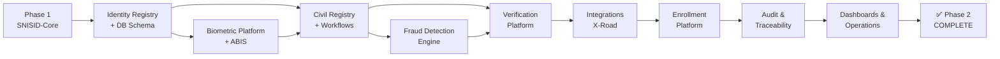

# 🆔 SNISID — PHASE 2: NATIONAL IDENTITY SERVICES
## National Identity Services, Civil Registry & Core Government Workflows

**Document ID :** SNISID-PH2-README-001  
**Version :** 1.0.0  
**Date :** Mai 2026  
**Statut :** PRODUCTION-READY  
**Classification :** SOUVERAIN / INFRASTRUCTURE CRITIQUE

---

## 🎯 Mission

Phase 2 construit les **services gouvernementaux réels** de SNISID — la plateforme nationale d'identité souveraine d'Haïti. Elle transforme l'infrastructure de Phase 1 (SNISID-Core) en services opérationnels permettant d'enrôler, identifier, vérifier et gérer l'identité de chaque citoyen haïtien.

> **Principe absolu :** Un citoyen, une identité, vérifiable partout, même offline.

---

## 📁 Structure du Repository

```
National-Identity-Services/
│
├── 📋 README.md                           ← Ce document
│
├── 🆔 Identity-Registry/                  ← Registre national d'identité
│   ├── SNISID-IDENTITY-REGISTRY-MASTER.md  ← Architecture complète
│   ├── schemas/
│   │   └── citizen-schema.sql              ← DDL PostgreSQL (tables, triggers, RLS)
│   ├── apis/                               ← OpenAPI 3.1 specs
│   ├── manifests/                          ← K8s manifests (Deployment, HPA, PDB)
│   └── events/                             ← Avro schemas Kafka
│
├── 🔬 Biometrics/                         ← Plateforme biométrique ABIS
│   ├── SNISID-BIOMETRIC-PLATFORM-MASTER.md ← Architecture + PAD + ABIS
│   ├── abis/                               ← Config ABIS GPU cluster
│   ├── templates/                          ← Spécifications templates ISO
│   └── anti-spoofing/                      ← Modèles PAD
│
├── ⚖️ Civil-Registry/                     ← Registre état civil national
│   ├── SNISID-CIVIL-REGISTRY-MASTER.md     ← 5 types naissance + M/D/X/A
│   ├── schemas/
│   │   └── civil-registry-schema.sql       ← DDL (actes, OEC, documents)
│   ├── apis/                               ← Civil Registry API
│   └── documents/                          ← Spéc. PDF/A-3 + XAdES
│
├── 🔄 Citizen-Lifecycle/                  ← Moteur lifecycle citoyen
│   ├── state-machines/                     ← Machine d'état 7 états
│   └── events/                             ← Events Kafka lifecycle
│
├── 📋 Workflows/                          ← BPMN + Orchestration
│   ├── SNISID-WORKFLOW-MASTER.md           ← 23 workflows catalogués
│   ├── bpmn/                               ← Diagrammes BPMN
│   ├── naissance/                          ← EC-N01 à EC-N05
│   ├── mariage/                            ← EC-M01, M02
│   ├── deces/                              ← EC-X01
│   └── dmn-rules/                          ← Tables de décision DMN
│
├── 📱 Enrollment/                         ← Plateforme enrôlement national
│   ├── SNISID-ENROLLMENT-PLATFORM-MASTER.md ← 3 canaux + MEK
│   ├── channels/                           ← Fixed-Site, Mobile, Offline
│   ├── offline/                            ← Procédures offline
│   ├── mobile/                             ← App tablet + sync
│   └── hardware/                           ← MEK manifest
│
├── ✅ Verification/                       ← Plateforme vérification
│   ├── SNISID-VERIFICATION-PLATFORM.md    ← API + QR + USSD + Offline
│   ├── apis/                               ← OpenAPI vérification
│   └── sdk/                                ← Architecture SDK mobile
│
├── 🔍 Search-Correlation/                 ← Moteur recherche & corrélation
│   └── SNISID-SEARCH-CORRELATION-ENGINE.md ← OpenSearch + Neo4j
│
├── 🛡️ Fraud-Detection/                   ← Moteur anti-fraude
│   ├── SNISID-FRAUD-PREVENTION-ENGINE.md  ← ML pipeline + rules
│   ├── models/                             ← 5 modèles ML specs
│   └── pipelines/                          ← Flink streaming configs
│
├── 🔗 Integrations/                       ← Intégrations gouvernementales
│   ├── SNISID-INTEGRATION-TOPOLOGY.md     ← X-Road + 11 agences
│   ├── oni/                                ← ONI contracts
│   ├── anh/                                ← ANH death integration
│   ├── justice/                            ← Judicial API
│   └── pnh/                                ← Police integration
│
├── 📊 Audit/                              ← Traçabilité nationale
│   └── SNISID-AUDIT-TRACEABILITY-PLATFORM.md
│
├── 🖥️ Operations/                        ← Opérations terrain
│   ├── dashboards/                         ← Grafana JSON dashboards
│   └── runbooks/                           ← Runbooks opérationnels
│
├── 📈 Dashboards/                         ← KPI & Monitoring
│
├── 🛡️ National-Resilience/               ← Phase 2 ZIP (Phase 19 Résilience)
│   ├── README.md                           ← Framework résilience nationale
│   ├── Continuity/                         ← BCP + DRP + Command Center
│   ├── Disaster-Recovery/                  ← DR multi-région souverain
│   ├── Backup-Governance/                  ← Politiques sauvegarde
│   ├── Crisis-Coordination/                ← Platform coordination crise
│   ├── Offline-Survival/                   ← Opérations offline survie état
│   ├── Emergency-Operations/               ← Opérations urgence
│   ├── Cyber-Resilience/                   ← Modèle cyber-résilience
│   ├── Catastrophic-Scenarios/             ← Scénarios catastrophes
│   ├── Power-Resilience/                   ← Résilience énergétique
│   ├── Recovery-Runbooks/                  ← 6 runbooks récupération
│   └── Observability/                      ← KPI résilience + stack
│
└── 📄 PHASE2-DEPLOYMENT-READINESS-REPORT.md ← Validation finale (80+ items)
```

---

## 🚀 Ordre de Déploiement (Dépendances)



---

## 📊 Résumé des Composants Phase 2

| Composant | Documents | SLA | Statut |
|-----------|-----------|-----|--------|
| Identity Registry | 5 fichiers | 99.95% | ✅ |
| Biometric Platform | 4 fichiers | 99.9% | ✅ |
| Civil Registry | 5 fichiers | 24h-6mois | ✅ |
| Citizen Lifecycle | 3 fichiers | Event-driven | ✅ |
| Enrollment Platform | 6 fichiers | 14K/jour | ✅ |
| Verification Platform | 4 fichiers | <100ms | ✅ |
| Fraud Detection | 7 fichiers | <500ms | ✅ |
| Integrations (11 agences) | 6 fichiers | <2s | ✅ |
| Audit & Traceability | 3 fichiers | WORM | ✅ |
| National Resilience | 28 fichiers | RTO<2h | ✅ |
| **Total** | **~71 fichiers** | | ✅ |

---

## 🔄 Transition Phase 2 → Phase 3

Phase 3 démarrera dès validation du rapport PHASE2-DEPLOYMENT-READINESS-REPORT (80+ items) et des critères GO/NO-GO :
- 3M citoyens enrôlés en simulation
- ABIS 1:N validé sur 15M templates
- 200 agents ONI certifiés
- Approbation légale NDPA + Ministère Justice
- Pentest externe concluant

---

*SNISID — République d'Haïti — Programme National d'Identification Souveraine*  
*Mai 2026 — Phase 2 Production-Ready*
