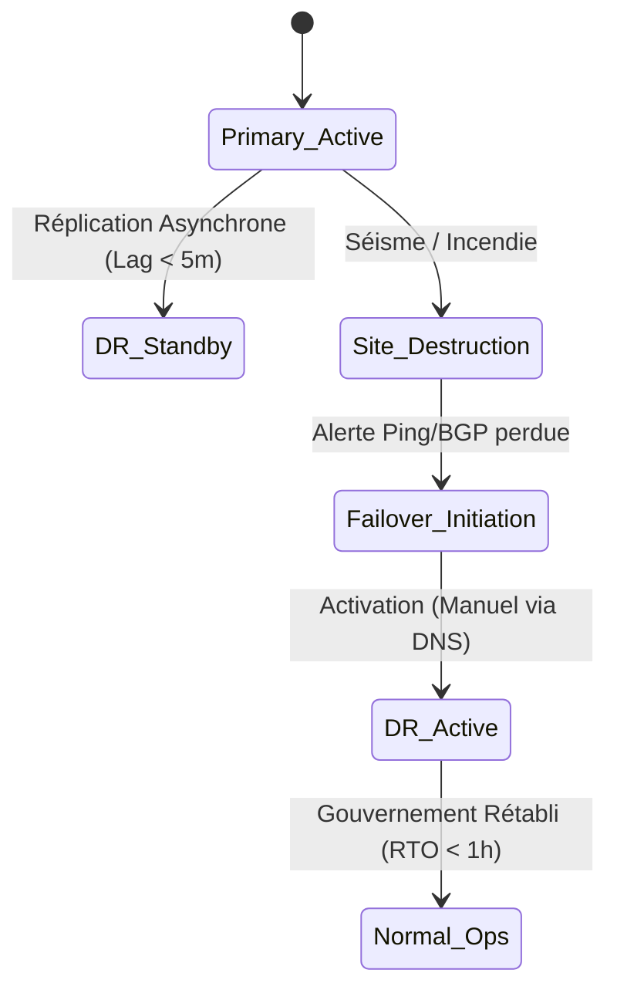

---
# ============================================================
# SNISID-Infra — National Disaster Recovery Datacenter
# Géo-redondance et Failover Automatique
# Document ID: SNISID-DC-DR-001
# Version: 1.0.0
# ============================================================

## 1. GÉO-REDONDANCE (Failover Sismique)

Haïti étant situé sur des failles sismiques actives (Faille d'Enriquillo-Plantain Garden), un séisme majeur à Port-au-Prince pourrait détruire le Datacenter Primaire.
Le Datacenter DR doit être situé à plus de 150 km (ex: Cap-Haïtien) ou dans une "Data Embassy" souveraine (hébergement dans un pays allié bénéficiant de l'immunité diplomatique, cf. modèle e-Estonia).

## 2. MODÈLE DE RÉPLICATION ASYNCHRONE

Le lien réseau inter-DC (>150km) introduit une latence (~5ms - 15ms). La réplication synchrone (attendre que la donnée soit écrite sur le site DR avant de confirmer au client) ralentirait trop le système.
Nous utilisons une **réplication asynchrone continue**.

### 2.1 RPO & RTO Targets
- **Recovery Point Objective (RPO) :** Max 5 minutes (Perte maximale de données acceptable).
- **Recovery Time Objective (RTO) :** Max 1 heure (Temps maximum pour que l'État soit de nouveau opérationnel après destruction du site principal).

### 2.2 Mécanismes de Réplication
1. **Base de Données (CockroachDB) :** CDC (Change Data Feed) streamé via Kafka MirrorMaker 2 vers le site DR.
2. **Backups Immuables (S3) :** Le stockage MinIO Object Storage du site Primaire réplique asynchronement ses "buckets" WORM vers le site DR.
3. **Configurations (GitOps) :** ArgoCD déploie la même configuration Kubernetes sur les deux sites à partir d'un repo Git sécurisé.

## 3. DR ORCHESTRATION & FAILOVER

Le "Failover" (basculement) de Primary vers DR nécessite une validation humaine (bouton "Launch") par le Conseil de Sécurité Nationale, pour éviter un basculement accidentel (Split-Brain) en cas de simple coupure fibre. Le basculement modifie les enregistrements BGP/DNS globaux de `api.snisid.gov.ht` vers les IP du site DR.

---
*Document ID: SNISID-DC-DR-001 | Approuvé par: CISO National*
