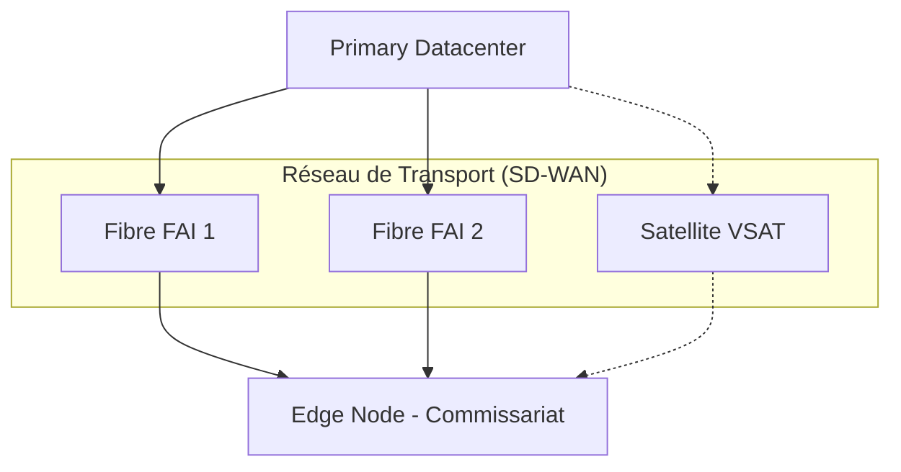

---
# ============================================================
# SNISID-Infra — National Network Backbone (WAN)
# SD-WAN, Redondance Multi-Chemins et Chiffrement
# Document ID: SNISID-WAN-001
# Version: 1.0.0
# ============================================================

## 1. LE BACKBONE NATIONAL

Le réseau WAN (Wide Area Network) relie le Datacenter Primaire, le Datacenter DR, les 10 directions départementales, et les ministères clés.

## 2. SD-WAN & RÉDONDANCE DES LIENS (Multi-Path)

Pour pallier l'instabilité des réseaux terrestres, l'approche SD-WAN (Software-Defined WAN) utilise plusieurs chemins physiques simultanément et route le trafic dynamiquement en cas de coupure (Fiber Cut).

### 2.1 Configuration d'un Noeud Régional (Ex: DDO Port-au-Prince)
- **Lien Primaire :** Fibre Optique dédiée (Fournisseur A - ex: Natcom).
- **Lien Secondaire :** Fibre Optique dédiée (Fournisseur B - ex: Digicel) routée par un chemin différent.
- **Lien Tertiaire (Secours Ultime) :** Antenne Satellite (VSAT / Starlink Enterprise) activée uniquement si les liens A et B tombent.

## 3. CHIFFREMENT DE BOUT EN BOUT (IPsec / WireGuard)

Toute donnée quittant le Datacenter ou un Commissariat est chiffrée.
- Même si un fournisseur d'accès internet intercepte le trafic sur sa fibre (Man-in-the-Middle), il ne verra qu'un tunnel IPsec/WireGuard indéchiffrable.
- Le protocole de routage (BGP) est authentifié (MD5/SHA) pour empêcher le détournement de routes (BGP Hijacking).

---
*Document ID: SNISID-WAN-001 | Approuvé par: Architecte Réseau (AND)*
