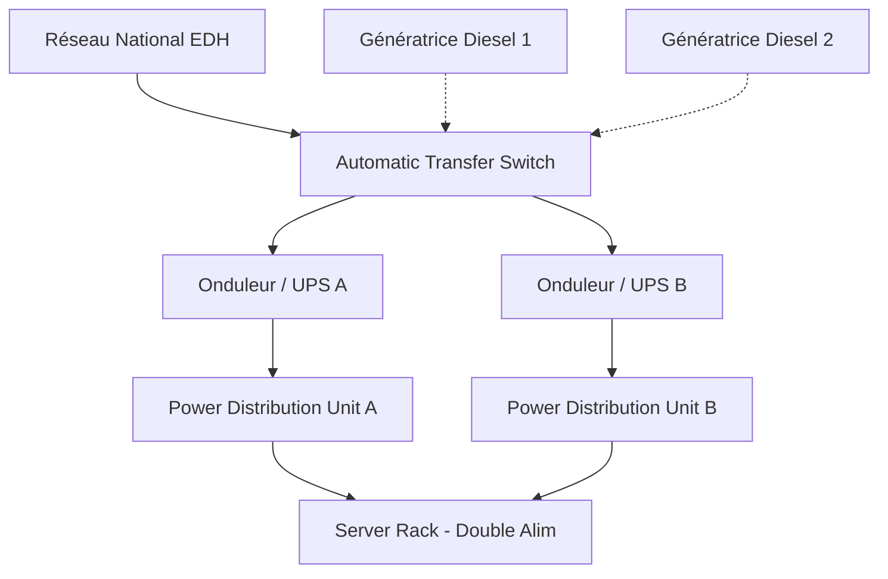

---
# ============================================================
# SNISID-Infra — Power Resilience Architecture
# Solar-First, UPS et Groupes Électrogènes
# Document ID: SNISID-POWER-001
# Version: 1.0.0
# ============================================================

## 1. DÉFIS ÉNERGÉTIQUES (Contexte Haïtien)

Le réseau électrique national (EDH) étant sujet à de fréquents délestages, l'infrastructure SNISID ne doit lui accorder aucune confiance (Zero Trust Energy). Le Datacenter et les Noeuds Edge génèrent leur propre énergie.

## 2. MODÈLE "SOLAR-FIRST" POUR L'EDGE

Les Noeuds Edge (Commissariats, Postes frontaliers) consomment peu d'énergie (Mini-serveurs ARM/x86 de type Intel NUC).
L'architecture énergétique locale est N+1 :
1. **Solaire (Primary) :** Panneaux solaires (ex: 5 kWc) alimentant un banc de batteries Lithium-Iron-Phosphate (LiFePO4) assurant 48h d'autonomie.
2. **EDH (Secondary) :** Connecté au réseau pour recharger les batteries si le soleil fait défaut.
3. **Génératrice (Tertiary) :** Petit générateur diesel à démarrage manuel/automatique pour secours ultime.

## 3. DATACENTER POWER ARCHITECTURE (Tier III)

Le Datacenter Primaire nécessite des centaines de kilowatts.

- Si l'EDH tombe, les **Onduleurs (UPS A/B)** maintiennent le courant sans micro-coupure.
- L'**ATS** détecte la chute de tension et démarre automatiquement les **Génératrices** en moins de 15 secondes.
- Les génératrices ont des cuves de diesel enterrées permettant une autonomie de **7 à 14 jours** sans ravitaillement (Crucial post-ouragan).

---
*Document ID: SNISID-POWER-001 | Approuvé par: Ingénieur Électrique (AND)*
