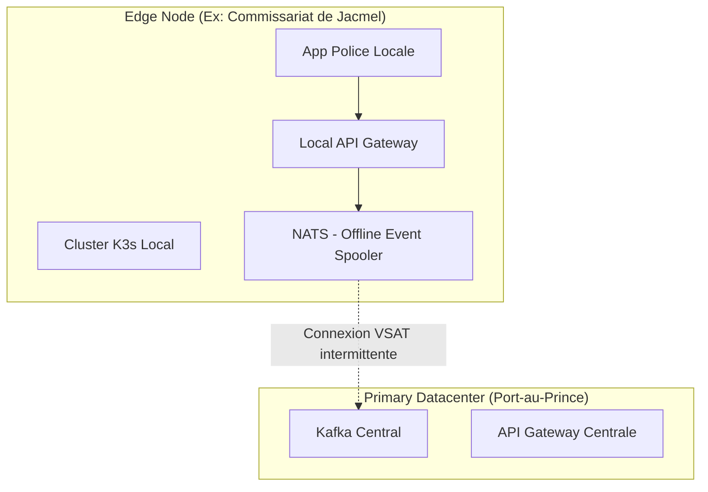

---
# ============================================================
# SNISID-Edge — National Edge Computing Platform
# K3s, Nœuds Régionaux et APIs Locales
# Document ID: SNISID-EDGE-PLAT-001
# Version: 1.0.0
# ============================================================

## 1. DÉCENTRALISATION DE L'ÉTAT

L'Edge Computing rapproche le Cloud des utilisateurs. Au lieu d'avoir un grand Datacenter centralisé à Port-au-Prince, la Phase 7 déploie des "Micro-Datacenters" dans chaque préfecture, hôpital majeur, ou commissariat de province.

## 2. ARCHITECTURE D'UN NOEUD EDGE (K3s)

Un "Edge Node" matériel est une valise durcie (Rugged Case) contenant des serveurs basse consommation (x86/ARM), une batterie, et un routeur 4G/VSAT.

### 2.1 Stack Logicielle Locale
- **Orchestrateur :** `K3s` (Distribution Kubernetes légère pour l'Edge).
- **APIs Locales :** Un sous-ensemble de l'API Gateway (Kong) tourne localement.
- **Local Cache :** Base de données miroir (Edge DB).
- **Message Broker :** `NATS JetStream` pour la mise en file d'attente (Spooling) des événements.

## 3. OPÉRATIONS DÉCONNECTÉES

Lorsqu'un policier à Jacmel utilise l'application d'identification sur sa tablette :
1. L'application contacte la **Local API Gateway** (`api.jacmel.snisid.gov.ht`) via le réseau Wi-Fi local du commissariat.
2. S'il s'agit d'une lecture (ex: Vérification d'un profil), l'API interroge la base locale répliquée la veille.
3. S'il s'agit d'une écriture (ex: Rapport d'incident), l'API écrit dans `NATS JetStream`. L'application reçoit un succès immédiat (Opération fluide).
4. En arrière-plan, NATS attendra que le VSAT se reconnecte pour vider sa file d'attente vers le Datacenter.

---
*Document ID: SNISID-EDGE-PLAT-001 | Approuvé par: Architecte Edge Computing*
