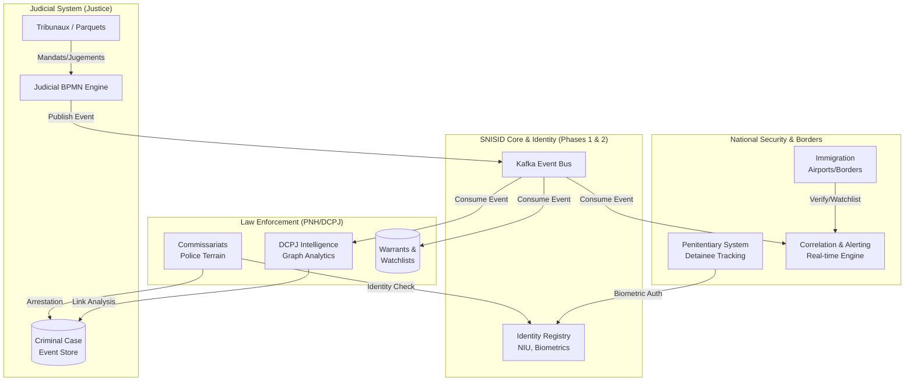

---
# ============================================================
# SNISID-Security — National Security Topology
# Integration Map: Police, Justice, DCPJ, Prisons, Borders
# Document ID: SNISID-SEC-TOPO-001
# Version: 1.0.0
# ============================================================

## 1. ARCHITECTURE DE SÉCURITÉ NATIONALE

La topologie sécuritaire nationale SNISID s'appuie sur le SNISID-Core (Phase 1) et l'Identity Registry (Phase 2). Tous les acteurs interagissent à travers des API Gateway strictes, régies par un modèle ABAC.

## 2. AUDIT DE SÉCURITÉ ET RISQUES (THREAT MODELING)

### 2.1 Risques "Insider Threat" (Corruption Interne)
- **Vecteur :** Un greffier ou policier altère un dossier criminel pour faire disparaître des charges.
- **Mitigation (SNISID) :** 
  1. Base de données Immutable (Event Sourcing). Les UPDATE/DELETE n'existent pas sur les faits.
  2. Chaque altération est un nouvel événement signé par PKI.
  3. Moteur anti-corruption (Étape 15) alertant la DCPJ/AND sur des schémas d'accès anormaux.

### 2.2 Ségrégation des Données (Privacy)
- **Vecteur :** Un agent de police accède au dossier médical complet (Phase 2) ou au graphe d'intelligence complet sans justification.
- **Mitigation (SNISID) :**
  1. La PNH n'a accès qu'à `statut_identite` (Valid/Wanted).
  2. Le déblocage d'un dossier complet nécessite l'émission d'un événement `MandatDelivre` par le workflow judiciaire.

### 2.3 Perte de Connectivité (Opérations Terrain)
- **Vecteur :** Blackout télécom lors d'une opération PNH majeure.
- **Mitigation (SNISID) :**
  1. Kits MEK (Mobile Enrollment Kits) équipés de K3s et d'un cache NATS contenant la Watchlist régionale.
  2. Arrestations enregistrées offline (signées localement) et synchronisées dès restauration.

## 3. POLICE INTEGRATION TOPOLOGY

La PNH dispose de 3 niveaux d'interface :
1. **DCPJ (QG) :** Accès classifié Top-Secret, moteur de corrélation Neo4j complet, vision nationale.
2. **Commissariats de Juridiction (DDO, etc.) :** Accès aux dossiers régionaux, gestion des gardes à vue.
3. **Unités Mobiles (UDMO, CIMO, Patrouilles) :** App offline-first, scan QR Code SNISID, scan biométrique rapide, vérification Watchlist 1:N locale.

---
*Document ID: SNISID-SEC-TOPO-001 | Classification: CONFIDENTIAL*
