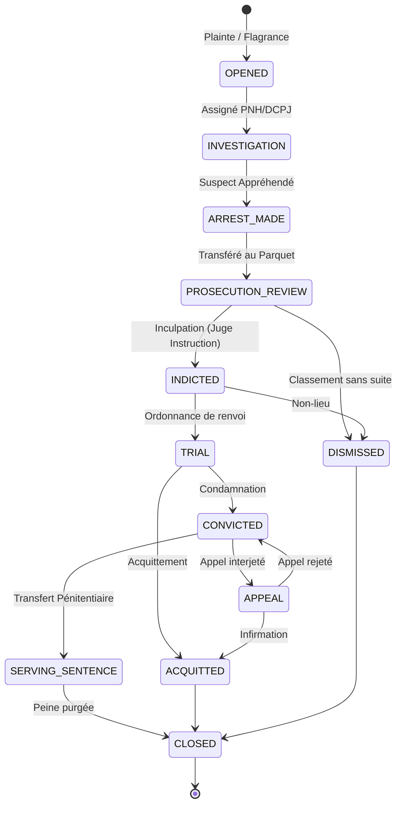

---
# ============================================================
# SNISID-Security — Criminal Case Management System
# Registre des dossiers judiciaires & Mandats
# Document ID: SNISID-CRIM-CASE-001
# Version: 1.0.0
# ============================================================

## 1. CONCEPT : LE "CRIMINAL CASE EVENT STORE"

Le système de gestion des dossiers criminels d'Haïti repose sur les mêmes principes que l'état civil : **l'immuabilité absolue**. Un dossier pénal n'est jamais "écrasé". Toute procédure (arrestation, audition, inculpation, libération, appel) génère un événement cryptographiquement signé.

### 1.1 Entités Principales
- **CriminalCase :** Le conteneur logique de la procédure (ex: DOS-2026-PAP-0992).
- **Suspect/Inculpé :** Lié fermement au NIU (Numéro d'Identification Unique) de l'Identity Registry. S'il s'agit d'un étranger sans NIU, un NIU temporaire (Shadow ID) est généré via biométrie.
- **Warrant (Mandat) :** Mandat d'amener, d'arrêt, de perquisition.
- **Evidence (Preuve) :** Référencement de la preuve physique (scellé) ou de la preuve numérique (hash stocké dans Kafka/MinIO).

## 2. LIFECYCLE DU DOSSIER CRIMINEL (CASE STATE MACHINE)



## 3. OPENAPI 3.1 — CRIMINAL CASE API

```yaml
openapi: 3.1.0
info:
  title: SNISID National Criminal Case API
  version: 1.0.0
servers:
  - url: https://api.snisid.gov.ht/v1/justice
paths:
  /cases:
    post:
      summary: Ouvrir un nouveau dossier criminel
      security:
        - BearerAuth: []
          ABAC: [Role:OfficiersPoliceJudiciaire]
      requestBody:
        required: true
        content:
          application/json:
            schema:
              $ref: '#/components/schemas/CaseOpening'
      responses:
        '201':
          description: Dossier créé (DOS-XXXX)

  /cases/{caseId}/suspects:
    post:
      summary: Lier un suspect à un dossier via NIU
      requestBody:
        content:
          application/json:
            schema:
              type: object
              properties:
                niu:
                  type: string
                  pattern: '^\d{10}$'
                role:
                  type: string
                  enum: [SUSPECT, TEMOIN, VICTIME]

  /warrants:
    post:
      summary: Émettre un mandat (Seulement Juge/Parquet)
      requestBody:
        content:
          application/json:
            schema:
              $ref: '#/components/schemas/Warrant'
```

## 4. GESTION DES PREUVES (CHAIN OF CUSTODY)

Chaque pièce à conviction suit une traçabilité inviolable :
1. **Saisie :** L'OPJ scanne ou enregistre la preuve. Un hash SHA-256 (si numérique) est généré.
2. **Scellé :** Un QR code (tag RFID pour objets) est généré, lié au `caseId`.
3. **Mouvement :** Tout transfert (ex: Laboratoire Scientifique → Tribunal) génère un événement `EvidenceTransferred` avec signature biométrique/PKI de l'agent qui reçoit.
4. **Intégrité :** La preuve numérique (vidéo, audio) est vérifiée contre le hash original avant lecture en cour.

---
*Document ID: SNISID-CRIM-CASE-001 | Approuvé par: Architecte Souverain*
