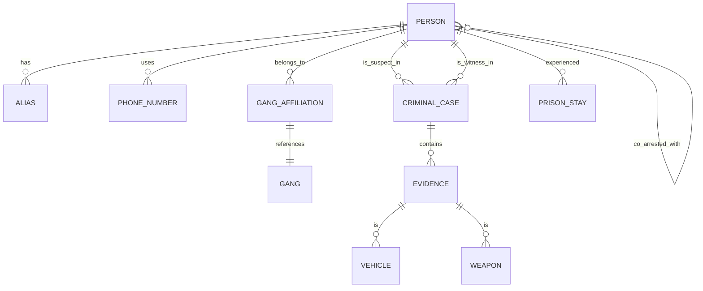

---
# ============================================================
# SNISID-Security — DCPJ Intelligence & Link Analysis Platform
# Graphes Criminels, Détection de Réseaux, Analytics
# Document ID: SNISID-DCPJ-INTEL-001
# Version: 1.0.0
# ============================================================

## 1. MISSION DCPJ (Direction Centrale de la Police Judiciaire)

La DCPJ est l'organe d'investigation criminelle. Contrairement à la PNH (opérations terrain), la DCPJ a besoin de comprendre les structures complexes, les gangs, les flux financiers et les associations de malfaiteurs. 
La plateforme d'Intelligence repose sur une base de données orientée graphe (Neo4j) alimentée par les événements SNISID (Identité, Justice, Prisons).

## 2. MODÈLE DE GRAPHE (CRIMINAL GRAPH TOPOLOGY)



## 3. FONCTIONNALITÉS ANALYTIQUES CLES

### 3.1 Entity Resolution (Fusion d'Alias)
Lorsqu'un individu est arrêté sans NIU, un "Shadow ID" est créé. Si plus tard l'ABIS (Biométrie) détecte que ce Shadow ID correspond à un NIU existant, le moteur d'Entity Resolution fusionne les deux noeuds dans le graphe, révélant rétroactivement les connexions criminelles.

### 3.2 Suspicious Activity Detection (SAD)
Moteur de règles (Drools/Spark) analysant les événements en temps réel :
- **Alerte :** Un individu visite un détenu hautement classifié (GANG_LEADER) et est ensuite impliqué comme témoin dans une affaire d'homicide.
- **Alerte :** Transferts d'armes entre juridictions basés sur les ballistiques (IBIS integration).

### 3.3 Gang Correlation Engine
Identification automatique des cellules de gangs par l'analyse des co-arrestations et des liens familiaux (depuis le Civil Registry), tout en appliquant les restrictions légales d'accès.

## 4. ARCHITECTURE TECHNIQUE DCPJ

- **Graph DB :** Neo4j Enterprise Cluster.
- **Event Ingestion :** Apache Flink consommant les topics Kafka `snisid.justice.*` et `snisid.identity.*`.
- **Visualization :** Linkurious / Apache Superset pour l'investigation visuelle.
- **Access Control :** Strict. Toute requête sur le graphe est loggée (Immutable Audit) et rattachée à un numéro de mandat / dossier (CaseID).

## 5. API INTELLIGENCE (GraphQL)

```graphql
type Person {
    niu: ID!
    aliases: [String]
    risk_level: Int
    known_associates(max_degree: Int = 2): [Person]
    involved_cases: [CriminalCase]
}

type Query {
    # Recherche par NIU avec calcul de chemin le plus court vers un gang connu
    shortestPathToGang(niu: ID!, gang_id: ID!): Path
    
    # Trouver les co-détenus d'un individu pendant une période spécifique
    findCoInmates(niu: ID!, start_date: String!, end_date: String!): [Person]
}
```

---
*Document ID: SNISID-DCPJ-INTEL-001 | Approuvé par: Directeur DCPJ*
