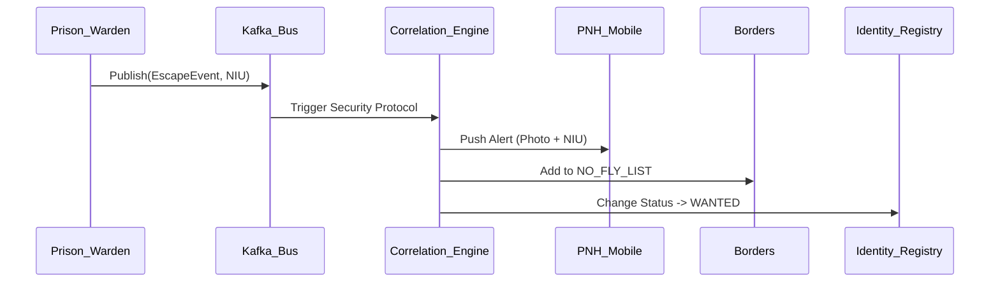

---
# ============================================================
# SNISID-Security — National Penitentiary Platform
# Gestion des Prisons et des Détenus
# Document ID: SNISID-PRISON-001
# Version: 1.0.0
# ============================================================

## 1. GESTION DU SYSTÈME PÉNITENTIAIRE

La plateforme gère les centres carcéraux (ex: Pénitencier National, CERMICOL). Elle est intégrée avec le Criminal Case Management pour s'assurer que personne n'est incarcéré sans ordonnance valide, et avec le Judicial Workflow Engine pour garantir les libérations.

## 2. CYCLE DE VIE D'UN DÉTENU

### 2.1 Entrée (Admission)
1. Réception de l'ordre d'incarcération (vérifié cryptographiquement).
2. **Identification biométrique stricte :** Pour prévenir les substitutions d'identité (fraude courante), le détenu est scanné (Iris/Empreinte). Son identité biométrique est croisée avec le NIU sur l'ordre du juge.
3. Fouille et assignation de cellule.

### 2.2 Séjour
- Enregistrement des transferts (Cellule A -> B, Prison X -> Y).
- Suivi médical (lien avec MSPP/Identité).
- Gestion des visites (Scans biométriques des visiteurs + croisement avec les Watchlists de la DCPJ pour détecter si des criminels recherchés tentent de rendre visite).

### 2.3 Sortie (Libération)
1. Réception de l'ordre de libération ou fin de peine.
2. Vérification biométrique finale obligatoire avant de passer la porte.

## 3. ARCHITECTURE DE L'ÉVASION (ESCAPE ALERTING)

Si une vérification échoue (ex: appel manquant) ou qu'une évasion est signalée :


## 4. PRISON API

```yaml
openapi: 3.1.0
paths:
  /inmates:
    post:
      summary: Admettre un détenu
      # Requiert Ordre de Dépôt + Match Biométrique
  /inmates/{niu}/transfer:
    post:
      summary: Transférer vers une autre prison
  /inmates/{niu}/visitors:
    post:
      summary: Enregistrer une visite (avec validation de la Watchlist)
```

---
*Document ID: SNISID-PRISON-001 | Approuvé par: Direction de l'Administration Pénitentiaire*
