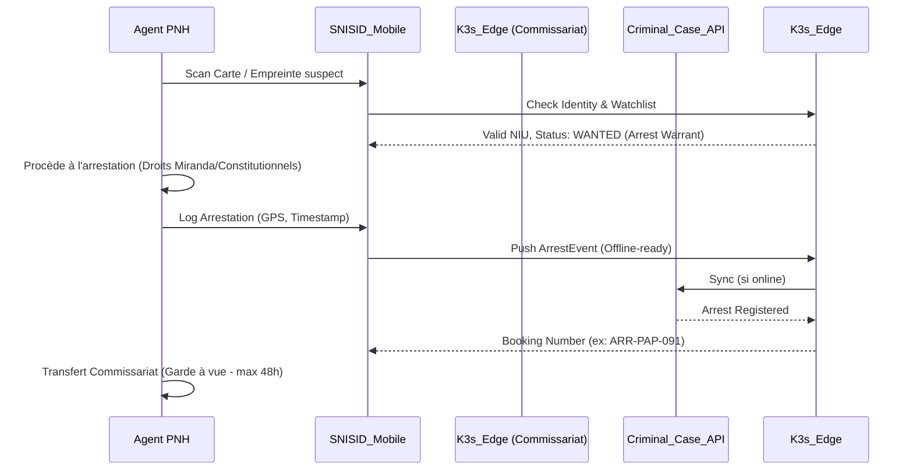

---
# ============================================================
# SNISID-Security — National Police Operations Platform
# Opérations PNH, Rapports d'Incident, Kits Mobiles
# Document ID: SNISID-PNH-OPS-001
# Version: 1.0.0
# ============================================================

## 1. CONCEPT : PNH FIELD OPERATIONS

La plateforme PNH est conçue pour les agents sur le terrain et les commissariats locaux. Elle doit garantir la sécurité des agents (alerte de dangerosité d'un individu) tout en assurant la traçabilité de chaque action de police.

### 1.1 Composants Principaux
- **Incident Reporting System (Main Courante Numérique) :** Déclaration de vols, agressions, accidents.
- **Arrest Workflows :** Processus standardisé d'arrestation (Garde à vue, notification des droits, transfert au Parquet).
- **Mobile Identity Verification :** Scan de la carte SNISID via NFC/QR ou empreinte digitale 1:N (offline-capable).
- **Patrol Operations :** Suivi GPS des patrouilles et géofencing (zones rouges).

## 2. WORKFLOW D'ARRESTATION (BPMN CONCEPTUEL)



## 3. OFFLINE MOBILE CAPABILITIES (PNH-MEK)

L'application mobile des agents de la PNH est **Offline-First**.

### 3.1 Synchronisation Quotidienne (Edge-to-Mobile)
Chaque matin, lors de la prise de service, le terminal mobile de l'agent se connecte au Wi-Fi sécurisé du commissariat (K3s Edge Node).
Il télécharge le Delta de la base de données locale (via NATS JetStream) :
- Watchlist nationale (Personnes recherchées, terroristes, criminels évadés).
- Véhicules volés (Plaques/Châssis).
- Caches biométriques locaux (1:N rapide sur les récidivistes du quartier).

### 3.2 Mode "Blackout"
Si l'agent est en zone blanche, l'application fonctionne à 100% avec les données du matin. Toutes les actions (amendes, rapports d'incidents, scans) sont stockées dans la base SQLite chiffrée (SQLCipher) du terminal et signées cryptographiquement.

## 4. INCIDENT REPORTING API (GraphQL/REST)

```yaml
openapi: 3.1.0
info:
  title: SNISID PNH Incident API
  version: 1.0.0
paths:
  /incidents:
    post:
      summary: Créer un rapport d'incident (Main Courante)
      requestBody:
        content:
          application/json:
            schema:
              type: object
              properties:
                incident_type:
                  type: string
                  enum: [VOL, AGRESSION, ACCIDENT_ROUTE, DOMESTIQUE, HOMICIDE]
                location_gps:
                  type: string
                  example: "18.5391,-72.3350"
                involved_nius:
                  type: array
                  items:
                    type: string
                narrative:
                  type: string
                agent_niu:
                  type: string
      responses:
        '201':
          description: Incident enregistré
```

---
*Document ID: SNISID-PNH-OPS-001 | Approuvé par: DG PNH / Architecte Souverain*
