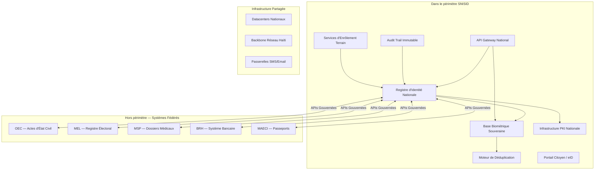
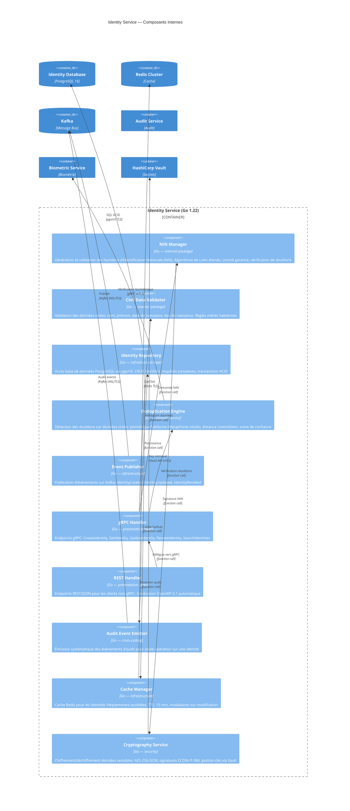
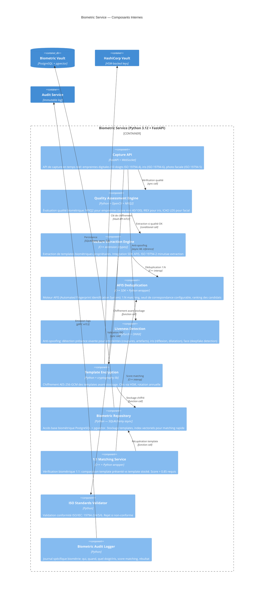
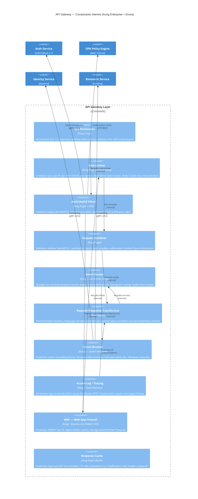
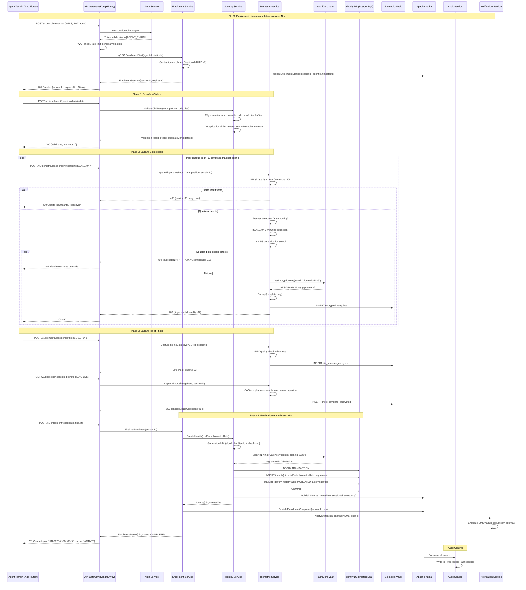
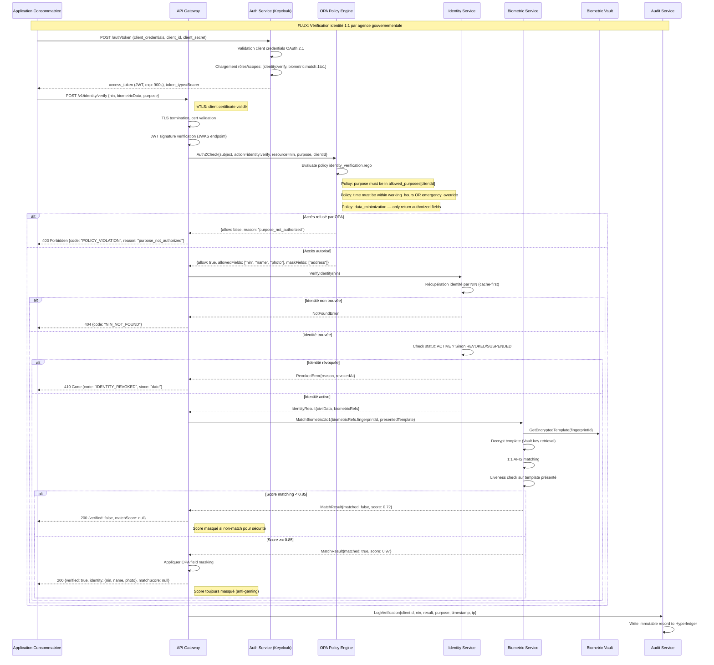
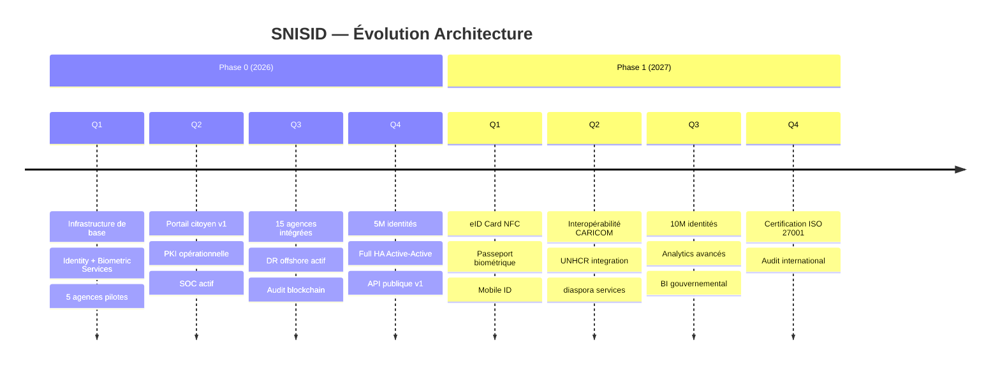

# SNISID — Modèles d'Architecture C4
# SNISID — C4 Architecture Models

---

| Métadonnée | Valeur |
|---|---|
| **Document ID** | SNISID-ARC-C4-001 |
| **Version** | 1.0.0 |
| **Date** | 2026-05-25 |
| **Statut** | APPROUVÉ — Production |
| **Classification** | RESTREINT / RESTRICTED |
| **Auteur** | Architecture Team — SNISID Programme |
| **Révisé par** | Chief Architect, Security Architect, Infrastructure Lead |
| **Approuvé par** | Directeur Général, SNISID Programme Office |
| **Standard** | C4 Model (Simon Brown), Arc42, ISO/IEC 42010 |

---

## Table des Matières / Table of Contents

1. [Introduction et Contexte](#1-introduction-et-contexte)
2. [C4 Niveau 1 — Contexte Système](#2-c4-niveau-1--contexte-système)
3. [C4 Niveau 2 — Conteneurs](#3-c4-niveau-2--conteneurs)
4. [C4 Niveau 3 — Composants](#4-c4-niveau-3--composants)
5. [C4 Niveau 4 — Code et Chemins Critiques](#5-c4-niveau-4--code-et-chemins-critiques)
6. [Décisions Technologiques](#6-décisions-technologiques)
7. [Exigences Non-Fonctionnelles par Composant](#7-exigences-non-fonctionnelles-par-composant)
8. [Contraintes Architecturales](#8-contraintes-architecturales)
9. [Perspectives d'Évolution](#9-perspectives-dévolution)

---

## 1. Introduction et Contexte

Le **Système National d'Identification Souverain et Intégré de la République d'Haïti (SNISID)** constitue l'infrastructure numérique de souveraineté la plus critique du pays. Ce document présente l'architecture complète selon le modèle C4 (Context, Containers, Components, Code), offrant quatre niveaux de zoom progressifs pour chaque audience technique.

### 1.1 Portée du Document

Ce document couvre :
- L'intégration du SNISID dans l'écosystème numérique haïtien (C4 L1)
- Tous les conteneurs applicatifs et infrastructurels majeurs (C4 L2)
- Les composants internes des services critiques (C4 L3)
- Les chemins de code critiques pour les opérations sensibles (C4 L4)

### 1.2 Principes Architecturaux Fondamentaux

| Principe | Description | Implication |
|---|---|---|
| **Souveraineté numérique** | Toutes données biométriques restent en territoire haïtien | Pas de cloud étranger pour les données PII/biométriques |
| **Résilience by design** | Tolérance aux pannes réseau et électriques | Mode offline obligatoire pour tous les services de terrain |
| **Zero Trust** | Jamais confiance, toujours vérifier | mTLS, SPIFFE/SPIRE sur tous les services |
| **Privacy by Design** | RGPD-compatible, minimisation des données | Chiffrement de bout en bout, pseudonymisation |
| **Interopérabilité** | OpenAPI 3.1, FHIR R4, GovStack | Standards ouverts uniquement |
| **Haute disponibilité** | RTO < 15 min, RPO < 5 min | Active-Active multi-DC |
| **Auditabilité totale** | Traçabilité de chaque accès | Audit immutable sur blockchain privée |

---

## 2. C4 Niveau 1 — Contexte Système

### 2.1 Acteurs Primaires et Systèmes Externes

```mermaid
C4Context
    title Contexte Système SNISID — Écosystème Numérique Haïtien

    Person(citizen, "Citoyen Haïtien", "Personne physique résidant en Haïti ou diaspora, demandant des services d'identification nationale")
    Person(agent_oec, "Agent OEC", "Agent de l'Office de l'État Civil enregistrant les naissances, mariages, décès")
    Person(agent_mel, "Agent MEL", "Agent du Ministère Electoral et des Libertés enregistrant les électeurs")
    Person(admin_snisid, "Administrateur SNISID", "Agent technique gérant le système d'identification souverain")
    Person(agent_police, "Agent PNH/DCPJ", "Agent de la Police Nationale d'Haïti accédant aux données d'identité")

    System(snisid, "SNISID", "Système National d'Identification Souverain et Intégré — Gère l'identité numérique souveraine de tous les citoyens haïtiens (biométrie, documents, attributs civils)")

    System_Ext(oec_sys, "Système OEC", "Office de l'État Civil — Registre des naissances, mariages, décès")
    System_Ext(mel_sys, "Système MEL", "Ministère Electoral — Registre électoral, listes électorales")
    System_Ext(mfa_sys, "Système MAECI", "Ministère des Affaires Étrangères — Passeports, visas, légalisations")
    System_Ext(msp_sys, "Système MSP", "Ministère de la Santé Publique — Dossiers médicaux, certificats de santé")
    System_Ext(dgif_sys, "Système DGIF", "Direction Générale des Impôts et Finances — NIF, déclarations fiscales")
    System_Ext(minjustice, "Système Justice", "Ministère de la Justice — Casier judiciaire, actes notariés")
    System_Ext(interpol, "INTERPOL", "Base internationale — Vérification des documents volés/perdus")
    System_Ext(icao_pki, "ICAO PKI Directory", "Infrastructure PKI ICAO — Validation eMRTD, passeports biométriques")
    System_Ext(un_unhcr, "UNHCR / OIM", "Agences ONU — Coordination réfugiés, apatrides")
    System_Ext(diaspora_portal, "Portail Diaspora", "Services en ligne pour les Haïtiens de l'étranger")
    System_Ext(banking_sys, "Système Bancaire BRH", "Banque de la République d'Haïti — KYC, identification financière")
    System_Ext(caricom_id, "CARICOM Digital ID", "Système d'identification régionale CARICOM")
    System_Ext(sms_gateway, "Passerelle SMS/OTP", "Services de notification OTP — Digicel, Natcom")

    Rel(citizen, snisid, "Enrôlement biométrique, demande de documents, vérification d'identité", "HTTPS/TLS 1.3, API REST")
    Rel(agent_oec, snisid, "Enregistrement actes d'état civil, consultation identité", "HTTPS mTLS, VPN IPsec")
    Rel(agent_mel, snisid, "Inscription électorale, mise à jour dossier citoyen", "HTTPS mTLS, VPN IPsec")
    Rel(admin_snisid, snisid, "Administration, supervision, audit", "HTTPS mTLS, Zero Trust VPN")
    Rel(agent_police, snisid, "Vérification identité, recherche biométrique", "HTTPS mTLS, RBAC/ABAC strict")

    Rel(snisid, oec_sys, "Synchronisation état civil, validation données", "REST/gRPC mTLS, Kafka streaming")
    Rel(snisid, mel_sys, "Partage registre électoral, mise à jour inscriptions", "REST mTLS, fichiers sécurisés SFTP")
    Rel(snisid, mfa_sys, "Validation identité pour passeports, demandes consulaires", "REST mTLS, SAML 2.0")
    Rel(snisid, msp_sys, "Partage identifiant patient, coordination vaccination", "FHIR R4, REST mTLS")
    Rel(snisid, dgif_sys, "Partage NIF, identification fiscale", "REST mTLS, XML chiffré")
    Rel(snisid, minjustice, "Consultation casier judiciaire, actes notariés", "REST mTLS, audit trail")
    Rel(snisid, interpol, "Vérification documents volés, avis de recherche", "HTTPS REST, XML/JSON")
    Rel(snisid, icao_pki, "Validation passeports eMRTD, vérification BAC/EAC", "LDAPS, HTTPS")
    Rel(snisid, un_unhcr, "Coordination identité réfugiés, apatrides", "REST API, échange sécurisé")
    Rel(snisid, banking_sys, "Fourniture API KYC, identité pour services financiers", "OAuth 2.1, REST mTLS")
    Rel(snisid, caricom_id, "Interopérabilité régionale, reconnaissance d'identité", "REST API, OpenID Connect")
    Rel(snisid, sms_gateway, "Envoi OTP, notifications citoyennes", "HTTPS REST, chiffré")
    Rel(diaspora_portal, snisid, "Demandes à distance, renouvellement documents", "HTTPS, OIDC, mTLS")
```



### 2.2 Périmètre de Responsabilité SNISID



---

## 3. C4 Niveau 2 — Conteneurs

### 3.1 Diagramme des Conteneurs SNISID

```mermaid
C4Container
    title Conteneurs SNISID — Vue d'Architecture Complète

    Person(citizen, "Citoyen", "Utilisateur final")
    Person(agent, "Agent Terrain", "Agent d'enrôlement, OEC, MEL")
    Person(admin, "Administrateur", "Ops, sécurité, audit")

    System_Boundary(snisid_boundary, "SNISID — Système National d'Identification Souverain") {

        Container(api_gateway, "API Gateway", "Kong Enterprise + Envoy Proxy", "Point d'entrée unique: authentification, rate limiting, routage, transformation. Applique OAuth 2.1 et mTLS sur toutes les routes")
        Container(identity_svc, "Identity Service", "Go 1.22 + gRPC + REST", "Cœur du système: gestion du cycle de vie des identités nationales (NIN). CRUD identité, recherche, déduplication civile")
        Container(biometric_svc, "Biometric Service", "Python 3.12 + FastAPI + C++ libs", "Capture, traitement, déduplication biométrique (empreintes 10 doigts, iris, facial). Moteur AFIS intégré")
        Container(enrollment_svc, "Enrollment Service", "Go 1.22 + gRPC", "Orchestration du processus d'enrôlement complet: collecte données, validation, soumission, notification")
        Container(document_svc, "Document Service", "Java 21 + Spring Boot", "Génération de documents officiels: carte nationale, passeport, certificats. Intégration imprimerie sécurisée")
        Container(auth_svc, "Authentication Service", "Go 1.22 + Keycloak", "OpenID Connect / OAuth 2.1, gestion sessions, MFA, émission tokens JWT/PASETO")
        Container(notification_svc, "Notification Service", "Node.js 22 + Bull Queue", "SMS, email, push notifications. Gestion des templates, retry, delivery tracking")
        Container(audit_svc, "Audit Service", "Go 1.22 + Kafka consumer", "Collecte immutable de tous les événements systèmes. Écriture sur ledger blockchain privé Hyperledger Fabric")
        Container(admin_portal, "Admin Portal", "React 18 + TypeScript + Vite", "Interface d'administration: supervision système, gestion utilisateurs, tableaux de bord opérationnels")
        Container(citizen_portal, "Portail Citoyen", "Next.js 14 + TypeScript", "Interface web et mobile citoyenne: demandes, suivi, accès dossier personnel, téléchargement documents")
        Container(field_agent_app, "Application Terrain", "Flutter 3.x (iOS/Android/Desktop)", "Application hors-ligne pour agents d'enrôlement. Synchronisation différée, capture biométrique locale")
        Container(interop_gateway, "Interoperability Gateway", "Apache Camel + Quarkus", "Transformation de protocoles, médiation, mappage de données entre SNISID et systèmes gouvernementaux")
        Container(search_svc, "Search Service", "Elasticsearch 8.x + Go", "Recherche full-text et sémantique sur les identités, documents, logs d'audit")
        Container(analytics_svc, "Analytics Service", "Apache Spark + Trino + Superset", "BI et analytics: statistiques démographiques, tableaux de bord opérationnels, rapports gouvernementaux")

        ContainerDb(identity_db, "Identity Database", "PostgreSQL 16 (Patroni HA)", "Données d'identité civile, attributs personnels, historique modifications. Chiffré AES-256-GCM")
        ContainerDb(biometric_db, "Biometric Vault", "PostgreSQL 16 + pgvector", "Templates biométriques chiffrés, index AFIS. Isolation réseau maximale")
        ContainerDb(document_db, "Document Store", "PostgreSQL 16 + MinIO", "Métadonnées documents, images haute résolution, modèles de documents")
        ContainerDb(audit_db, "Audit Ledger", "Hyperledger Fabric + CockroachDB", "Registre immuable d'audit. Multi-DC, consensus PBFT")
        ContainerDb(cache, "Cache Distribué", "Redis Cluster 7.x", "Sessions, tokens, résultats de recherche fréquents, rate limiting counters")
        ContainerDb(message_bus, "Message Bus", "Apache Kafka 3.x (KRaft)", "Event streaming: events d'enrôlement, synchronisation inter-services, audit events")
        ContainerDb(secret_store, "Coffre-fort Secrets", "HashiCorp Vault Enterprise", "Secrets, clés PKI, certificats TLS, credentials bases de données. HSM-backed")
    }

    System_Ext(oec, "OEC", "État Civil")
    System_Ext(mel, "MEL", "Electoral")
    System_Ext(icao, "ICAO PKI", "Passeports")
    System_Ext(interpol_ext, "INTERPOL", "Vérification")

    Rel(citizen, citizen_portal, "Accès portail", "HTTPS TLS 1.3")
    Rel(agent, field_agent_app, "Enrôlement terrain", "App offline/online")
    Rel(admin, admin_portal, "Administration", "HTTPS mTLS, MFA obligatoire")

    Rel(citizen_portal, api_gateway, "Requêtes API", "HTTPS + OAuth 2.1")
    Rel(field_agent_app, api_gateway, "Sync données", "HTTPS mTLS")
    Rel(admin_portal, api_gateway, "API admin", "HTTPS mTLS + MFA")

    Rel(api_gateway, auth_svc, "Validation token", "gRPC mTLS")
    Rel(api_gateway, identity_svc, "Opérations identité", "gRPC mTLS")
    Rel(api_gateway, biometric_svc, "Opérations biométriques", "gRPC mTLS")
    Rel(api_gateway, enrollment_svc, "Orchestration enrôlement", "gRPC mTLS")
    Rel(api_gateway, document_svc, "Génération documents", "gRPC mTLS")

    Rel(identity_svc, identity_db, "Lecture/écriture identités", "PostgreSQL TLS")
    Rel(identity_svc, message_bus, "Publication events", "Kafka TLS SASL")
    Rel(biometric_svc, biometric_db, "Stockage templates", "PostgreSQL TLS")
    Rel(enrollment_svc, message_bus, "Events d'enrôlement", "Kafka TLS SASL")
    Rel(audit_svc, audit_db, "Écriture audit", "gRPC mTLS")
    Rel(auth_svc, cache, "Sessions/tokens", "Redis TLS")
    Rel(interop_gateway, oec, "Synchronisation", "mTLS REST/gRPC")
    Rel(interop_gateway, mel, "Partage données", "mTLS REST")
    Rel(document_svc, icao, "Validation eMRTD", "LDAPS")
    Rel(identity_svc, interpol_ext, "Vérification", "HTTPS REST")
    Rel(identity_svc, secret_store, "Récupération secrets", "Vault API mTLS")
```



### 3.2 Description des Conteneurs

| Conteneur | Technologie | Rôle | Criticité |
|---|---|---|---|
| **API Gateway** | Kong Enterprise 3.x + Envoy | Point d'entrée unique, sécurité périmétrique | CRITIQUE |
| **Identity Service** | Go 1.22, gRPC, REST | Gestionnaire cycle de vie identités NIN | CRITIQUE |
| **Biometric Service** | Python 3.12, FastAPI, C++ | AFIS, capture biométrique, déduplication | CRITIQUE |
| **Enrollment Service** | Go 1.22, gRPC | Orchestration processus d'enrôlement | ÉLEVÉ |
| **Document Service** | Java 21, Spring Boot | Génération documents officiels | ÉLEVÉ |
| **Auth Service** | Go 1.22, Keycloak 23 | OIDC/OAuth 2.1, MFA, sessions | CRITIQUE |
| **Audit Service** | Go 1.22, Kafka consumer | Traçabilité immuable | CRITIQUE |
| **Interop Gateway** | Apache Camel, Quarkus | Médiation inter-systèmes | ÉLEVÉ |
| **Identity DB** | PostgreSQL 16 (Patroni) | Stockage principal identités | CRITIQUE |
| **Biometric Vault** | PostgreSQL 16 + pgvector | Templates biométriques isolés | CRITIQUE |
| **Message Bus** | Apache Kafka 3.x KRaft | Streaming événements | ÉLEVÉ |
| **Secret Store** | HashiCorp Vault Enterprise | PKI, secrets, credentials | CRITIQUE |

---

## 4. C4 Niveau 3 — Composants

### 4.1 Identity Service — Composants Internes



### 4.2 Biometric Service — Composants Internes



### 4.3 API Gateway — Composants Internes



---

## 5. C4 Niveau 4 — Code et Chemins Critiques

### 5.1 Chemin Critique 1 — Enrôlement Biométrique Complet



### 5.2 Chemin Critique 2 — Authentification et Vérification d'Identité 1:1



### 5.3 Structure de Code — Identity Service (Architecture Hexagonale)

```
identity-service/
├── cmd/
│   └── server/
│       └── main.go                    # Point d'entrée: config, wiring DI, graceful shutdown
├── internal/
│   ├── domain/                        # Domaine métier pur (aucune dépendance externe)
│   │   ├── identity/
│   │   │   ├── entity.go              # Identity struct, NIN type, statuts
│   │   │   ├── repository.go          # Interface IdentityRepository (port)
│   │   │   ├── service.go             # IdentityDomainService: règles métier
│   │   │   ├── nin.go                 # Génération/validation NIN haïtien
│   │   │   ├── events.go              # Domain events: IdentityCreated, etc.
│   │   │   └── errors.go              # Domain errors: DuplicateNIN, etc.
│   │   └── deduplication/
│   │       ├── civil.go               # Algorithme déduplication civile
│   │       └── metaphone_creole.go    # Phonétique créole haïtienne
│   ├── application/                   # Use cases (orchestration)
│   │   ├── create_identity.go         # Use case: CreateIdentity
│   │   ├── verify_identity.go         # Use case: VerifyIdentity
│   │   ├── revoke_identity.go         # Use case: RevokeIdentity
│   │   └── search_identities.go       # Use case: SearchIdentities
│   ├── infrastructure/                # Adaptateurs externes
│   │   ├── persistence/
│   │   │   ├── postgres_repo.go       # Implémentation PostgreSQL du repository
│   │   │   ├── migrations/            # Fichiers Flyway SQL
│   │   │   └── queries/               # SQL queries (sqlc generated)
│   │   ├── cache/
│   │   │   └── redis_cache.go         # Cache Redis avec chiffrement côté client
│   │   ├── messaging/
│   │   │   └── kafka_publisher.go     # Publication events Kafka
│   │   ├── vault/
│   │   │   └── vault_client.go        # Intégration HashiCorp Vault
│   │   └── biometric/
│   │       └── bio_client.go          # Client gRPC Biometric Service
│   └── interfaces/                    # Interfaces entrantes
│       ├── grpc/
│       │   ├── handler.go             # gRPC server handlers
│       │   └── interceptors/          # Auth, logging, tracing interceptors
│       └── rest/
│           ├── handler.go             # REST handlers (chi router)
│           └── middleware/            # Auth, CORS, rate limit middleware
├── api/
│   └── proto/
│       └── identity/v1/               # Protobuf definitions
│           └── identity.proto
├── configs/
│   ├── config.yaml                    # Configuration base
│   └── config.production.yaml        # Overrides production
└── deployments/
    ├── kubernetes/                    # Manifestes K8s
    └── helm/                          # Chart Helm
```

---

## 6. Décisions Technologiques

### 6.1 Matrice de Décisions Architecturales (ADR)

| ADR-ID | Composant | Décision | Alternative Rejetée | Raison |
|---|---|---|---|---|
| ADR-001 | API Gateway | Kong Enterprise + Envoy | Nginx, HAProxy, AWS API GW | Kong: plugins riches, Envoy: service mesh natif, souveraineté (on-prem) |
| ADR-002 | Identity Service | Go 1.22 | Java Spring, Python | Performance, faible empreinte mémoire, concurrence native (goroutines) |
| ADR-003 | Biometric Service | Python 3.12 + C++ | Go, Java | Python: écosystème ML (PyTorch, OpenCV), C++: performance AFIS critique |
| ADR-004 | Identity DB | PostgreSQL 16 (Patroni) | MySQL, Oracle, MongoDB | ACID strict, JSON natif, PostGIS, Patroni HA, souveraineté (open source) |
| ADR-005 | Message Bus | Apache Kafka 3.x KRaft | RabbitMQ, Pulsar | Volume élevé, rétention configurable, KRaft (sans ZooKeeper), replay events |
| ADR-006 | Auth | Keycloak 23 + Go service | Auth0, Okta, custom | Keycloak: OIDC complet, on-prem, souveraineté, auditable |
| ADR-007 | Secrets | HashiCorp Vault Enterprise | AWS Secrets Manager | On-prem, HSM integration, PKI native, audit complet |
| ADR-008 | Container Orch. | Kubernetes 1.30 (RKE2) | OpenShift, Nomad | RKE2: souveraineté (Rancher/SUSE), FIPS mode, gouvernement-ready |
| ADR-009 | Service Mesh | Istio 1.22 | Linkerd, Consul Connect | mTLS automatique, politique réseau fine, télémétrie complète |
| ADR-010 | Observabilité | Prometheus + Grafana + Loki + Tempo | Datadog, New Relic | Stack open source, on-prem, pas d'exfiltration télémétrie vers l'étranger |
| ADR-011 | CI/CD | GitLab CI + ArgoCD | Jenkins, GitHub Actions | Self-hosted, GitOps natif, RBAC pipeline, souveraineté |
| ADR-012 | Biometric DB | PostgreSQL + pgvector | Cassandra, Elasticsearch | pgvector: recherche vectorielle native, cohérence transactionnelle |

### 6.2 Stack Technologique Complet

```yaml
# SNISID Technology Stack — Version 1.0 (2026)
stack:
  languages:
    primary:
      - language: Go
        version: "1.22"
        usage: [identity-service, auth-service, audit-service, enrollment-service]
        justification: "Performance, concurrence, faible latence, déploiement statique"
      - language: Python
        version: "3.12"
        usage: [biometric-service, analytics-service, ML models]
        justification: "Écosystème ML/AI, bibliothèques biométriques, data science"
      - language: Java
        version: "21 LTS"
        usage: [document-service, interop-gateway]
        justification: "Spring Boot mature, Camel intégration, JVM stable"
      - language: TypeScript
        version: "5.x"
        usage: [citizen-portal-nextjs, admin-portal-react, notification-service-nodejs]

  frameworks:
    backend:
      - {name: gRPC, version: "1.64", usage: "Communication inter-services"}
      - {name: FastAPI, version: "0.111", usage: "REST API Python (Biometric Service)"}
      - {name: Spring Boot, version: "3.3", usage: "Document & Interop Services"}
      - {name: Apache Camel, version: "4.x", usage: "Intégration & médiation"}
      - {name: Quarkus, version: "3.x", usage: "Native image Interop Gateway"}
    frontend:
      - {name: Next.js, version: "14", usage: "Portail citoyen SSR/SSG"}
      - {name: React, version: "18", usage: "Admin portal SPA"}
      - {name: Flutter, version: "3.22", usage: "App terrain iOS/Android/Desktop"}

  databases:
    primary:
      - {name: PostgreSQL, version: "16", ha: "Patroni + etcd", usage: "Identity, Document, Auth"}
      - {name: CockroachDB, version: "23.x", usage: "Audit ledger distribué multi-DC"}
    cache:
      - {name: Redis, version: "7.x", mode: "Cluster", usage: "Sessions, cache, rate limiting"}
    search:
      - {name: Elasticsearch, version: "8.x", usage: "Full-text search, logs"}
    analytics:
      - {name: Apache Spark, version: "3.5", usage: "Batch analytics"}
      - {name: Trino, version: "450", usage: "Requêtes analytiques SQL"}

  infrastructure:
    orchestration: "Kubernetes 1.30 (RKE2 — SUSE Rancher, FIPS-enabled)"
    service_mesh: "Istio 1.22 (mTLS strict mode)"
    api_gateway: "Kong Enterprise 3.7 + Envoy 1.30"
    secrets: "HashiCorp Vault Enterprise 1.16 (HSM-backed)"
    ci_cd: "GitLab CE 17.x + ArgoCD 2.11"
    storage: "Ceph 18 (Reef) + MinIO"
    messaging: "Apache Kafka 3.7 (KRaft mode)"
    pki: "EJBCA Enterprise 8.x + HashiCorp Vault PKI"
    monitoring: "Prometheus 2.52 + Grafana 11 + Loki 3 + Tempo 2"
    tracing: "Jaeger 1.57 + OpenTelemetry 0.10"
    logging: "Fluentbit + Loki + Elasticsearch"
    policy: "OPA (Open Policy Agent) 0.65 + Gatekeeper 3.16"
```

---

## 7. Exigences Non-Fonctionnelles par Composant

### 7.1 Tableau NFR Complet

| Composant | Disponibilité | Latence P99 | Débit | RTO | RPO | Criticité |
|---|---|---|---|---|---|---|
| **API Gateway** | 99.99% | < 50 ms | 10 000 req/s | 2 min | N/A | CRITIQUE |
| **Identity Service** | 99.95% | < 200 ms | 2 000 req/s | 5 min | 1 min | CRITIQUE |
| **Biometric Service** | 99.95% | < 3 s (capture), < 500 ms (verify) | 500 req/s | 10 min | 5 min | CRITIQUE |
| **Auth Service** | 99.99% | < 100 ms | 5 000 req/s | 2 min | 30 s | CRITIQUE |
| **Enrollment Service** | 99.90% | < 5 s (end-to-end) | 200 req/s | 15 min | 5 min | ÉLEVÉ |
| **Document Service** | 99.90% | < 30 s (génération) | 100 req/s | 30 min | 15 min | ÉLEVÉ |
| **Notification Service** | 99.50% | < 10 s (delivery) | 1 000 notif/s | 60 min | 30 min | MOYEN |
| **Audit Service** | 99.99% | < 100 ms (write async) | 5 000 events/s | 2 min | 0 (sync) | CRITIQUE |
| **Identity DB** | 99.99% | < 10 ms (read), < 50 ms (write) | 5 000 TPS | 5 min | 1 min | CRITIQUE |
| **Biometric Vault** | 99.95% | < 20 ms (read) | 1 000 TPS | 10 min | 5 min | CRITIQUE |
| **Kafka Cluster** | 99.95% | < 10 ms (produce) | 100 000 msg/s | 5 min | 0 (sync replica) | ÉLEVÉ |
| **Search Service** | 99.90% | < 500 ms | 500 req/s | 30 min | 60 min | MOYEN |

### 7.2 NFR Sécurité — Tous Composants

```yaml
security_requirements:
  encryption:
    in_transit:
      protocol: "TLS 1.3 minimum (TLS 1.2 toléré pour legacy)"
      cipher_suites:
        - TLS_AES_256_GCM_SHA384
        - TLS_CHACHA20_POLY1305_SHA256
      certificate_validity: "90 jours maximum (rotation automatique)"
      mtls: "Obligatoire pour communication inter-services"
    at_rest:
      algorithm: "AES-256-GCM"
      key_management: "HashiCorp Vault (HSM-backed)"
      key_rotation: "Annuelle (biométrie), trimestrielle (identité)"

  authentication:
    human_users:
      method: "OIDC/OAuth 2.1 via Keycloak"
      mfa: "Obligatoire pour tous les accès (TOTP/FIDO2)"
      session_duration: "8h maximum (agents), 30min (admin)"
    services:
      method: "SPIFFE/SPIRE workload identity + mTLS"
      rotation: "Token SPIFFE: 1h, certificats mTLS: 24h"

  authorization:
    model: "ABAC (Attribute-Based Access Control) via OPA"
    principles: "Least privilege, need-to-know"
    review: "Revue trimestrielle des politiques"

  audit:
    requirement: "100% des accès aux données personnelles tracés"
    retention: "7 ans minimum (données civiles), 3 ans (logs opérationnels)"
    tamper_proof: "Hyperledger Fabric ledger immutable"
    fields_required: [who, when, what, where, why, result]
```

### 7.3 NFR Performance — Scalabilité

```yaml
scalability_requirements:
  current_phase_0:
    enrolled_identities: 5_000_000  # Phase 0: ~50% population
    daily_transactions: 50_000
    concurrent_users: 500
    peak_multiplier: 5x             # Période électorale

  target_phase_2:
    enrolled_identities: 12_000_000  # Population totale
    daily_transactions: 500_000
    concurrent_users: 5_000
    peak_multiplier: 10x

  auto_scaling:
    identity_service:
      min_replicas: 3
      max_replicas: 20
      scale_trigger: "CPU > 70% OU latency P95 > 200ms"
    biometric_service:
      min_replicas: 3
      max_replicas: 10
      scale_trigger: "Queue depth > 100 OU CPU > 80%"
    api_gateway:
      min_replicas: 3
      max_replicas: 15
      scale_trigger: "RPS > 7000"
```

---

## 8. Contraintes Architecturales

### 8.1 Contraintes Souveraineté

| Contrainte | Description | Impact Architectural |
|---|---|---|
| **Données sur territoire haïtien** | Toutes données biométriques et PII doivent rester en Haïti | Pas de cloud public pour données sensibles. Datacenters souverains obligatoires |
| **Clés cryptographiques en Haïti** | HSM physiquement en territoire haïtien | HSM on-premise FIPS 140-2 L3 dans datacenters PAP et CAP |
| **Code source auditable** | Tout code doit être auditable par l'État haïtien | Open source préféré, escrow source code pour solutions propriétaires |
| **Fournisseurs diversifiés** | Pas de lock-in fournisseur unique >40% | Architecture multi-fournisseurs, standards ouverts |

### 8.2 Contraintes Infrastructure Haïtienne

| Contrainte | Impact | Mitigation |
|---|---|---|
| **Électricité instable** | Pannes fréquentes (délestage) | UPS 4h + générateurs diesel, mode offline obligatoire |
| **Connectivité limitée** | Internet < 10 Mbps dans certaines zones | Synchronisation différée, compression, delta sync |
| **Canicule tropicale** | T° datacenter difficile à maintenir | Climatisation redondante N+1, monitoring thermique |
| **Risques sismiques** | Haïti zone sismique active | Datacenters sur fondations parasismiques, DR offshore |
| **Capacités techniques locales** | Ressources humaines limitées | Formation obligatoire, documentation en créole/français |

---

## 9. Perspectives d'Évolution

### 9.1 Roadmap Architecture



---

## Bloc d'Approbation / Approval Block

| Rôle | Nom | Signature | Date |
|---|---|---|---|
| **Architecte en Chef** | [À compléter] | [Signature] | 2026-05-25 |
| **Architecte Sécurité** | [À compléter] | [Signature] | 2026-05-25 |
| **Directeur Infrastructure** | [À compléter] | [Signature] | 2026-05-25 |
| **Directeur Général SNISID** | [À compléter] | [Signature] | 2026-05-25 |
| **CISO** | [À compléter] | [Signature] | 2026-05-25 |

---

*Document SNISID-ARC-C4-001 v1.0.0 — RESTREINT — © République d'Haïti, Programme SNISID, 2026*
*Toute reproduction ou diffusion non autorisée est interdite par la loi haïtienne.*
