# SNISID — Architecture Haute Disponibilité & Reprise sur Sinistre
# SNISID — High Availability & Disaster Recovery Architecture

---

| Métadonnée | Valeur |
|---|---|
| **Document ID** | SNISID-ARC-HA-DR-001 |
| **Version** | 1.0.0 |
| **Date** | 2026-05-25 |
| **Statut** | APPROUVÉ — Production |
| **Classification** | CONFIDENTIEL / CONFIDENTIAL |
| **Auteur** | Architecture & Infrastructure Team — SNISID |
| **Révisé par** | Chief Architect, Infrastructure Lead, CISO |
| **Approuvé par** | DG SNISID, Ministère concerné |
| **Standards** | ISO 22301:2019, ISO/IEC 27031, NIST SP 800-34, TIA-942 |

---

## Table des Matières

1. [Vue d'Ensemble HA/DR](#1-vue-densemble-hadr)
2. [Topologie Active-Active](#2-topologie-active-active)
3. [Objectifs RTO/RPO par Niveau de Service](#3-objectifs-rtorpo-par-niveau-de-service)
4. [Pyramide de Résilience à 5 Niveaux](#4-pyramide-de-résilience-à-5-niveaux)
5. [Stratégie de Réplication de Bases de Données](#5-stratégie-de-réplication-de-bases-de-données)
6. [Kafka MirrorMaker 2 — Streaming Cross-DC](#6-kafka-mirrormaker-2--streaming-cross-dc)
7. [Procédures de Basculement](#7-procédures-de-basculement)
8. [Architecture DR Offshore](#8-architecture-dr-offshore)
9. [Procédures de Drill DR](#9-procédures-de-drill-dr)
10. [Monitoring HA/DR](#10-monitoring-hadr)

---

## 1. Vue d'Ensemble HA/DR

### 1.1 Stratégie Globale

Le SNISID adopte une stratégie de **Haute Disponibilité Active-Active** entre les deux datacenters souverains haïtiens (Port-au-Prince et Cap-Haïtien), complétée par un **Coffre-fort Numérique Offshore** (Islande ou Suisse) pour la récupération de dernier recours.

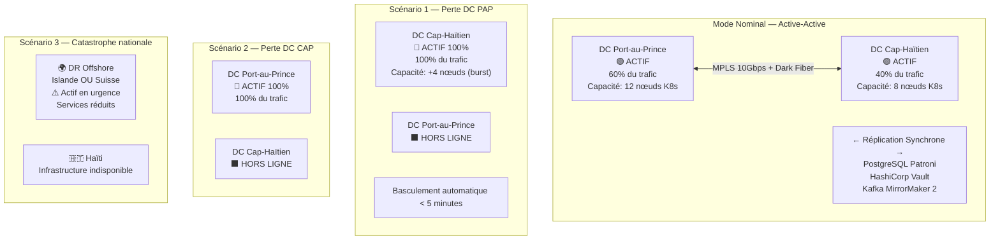

### 1.2 Principes HA/DR

| Principe | Description | Implémentation |
|---|---|---|
| **Zéro perte de données** | RPO = 0 pour données critiques | Réplication synchrone PostgreSQL + Kafka |
| **Basculement transparent** | Aucune intervention manuelle pour panne de composant | Patroni auto-failover, Istio circuit breaker |
| **Dégradation gracieuse** | Services essentiels maintenus même en capacité réduite | Mode offline agents terrain, cache distribué |
| **Test continu** | La capacité de récupération prouvée régulièrement | Drill mensuel composants, drill DR complet semestriel |
| **Documentation vivante** | Procédures à jour et validées | RevQ trimestrielle obligatoire |
| **Souveraineté maintenue** | Aucune dépendance externe pour opérations critiques | Infrastructure 100% on-premise Haïti |

---

## 2. Topologie Active-Active

### 2.1 Diagramme Active-Active Détaillé

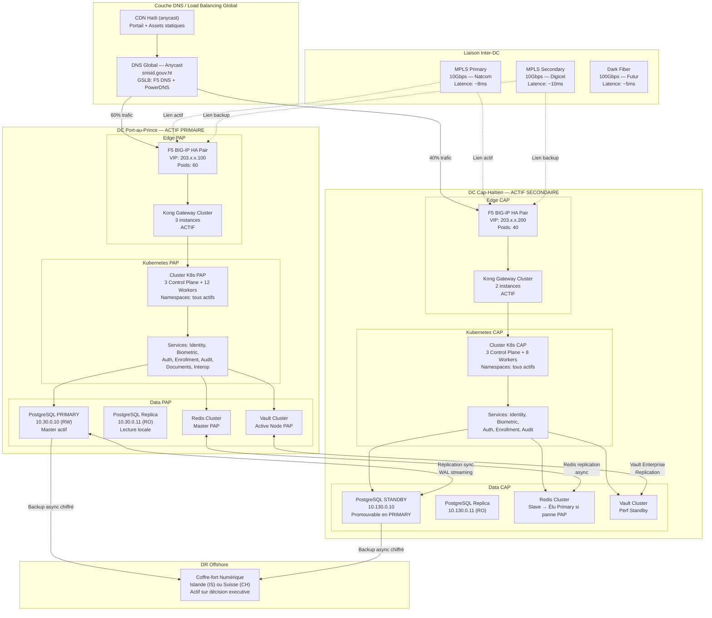

### 2.2 Distribution du Trafic — GSLB

```yaml
# GSLB Configuration — F5 DNS + PowerDNS avec GTM
gslb_config:
  zone: "api.snisid.gouv.ht"
  ttl: 30  # TTL court pour basculement rapide

  pools:
    - name: POOL_PAP
      members:
        - ip: "203.x.x.100"
          port: 443
          weight: 60
          health_check: "/health"
          datacenter: port-au-prince

    - name: POOL_CAP
      members:
        - ip: "203.x.x.200"
          port: 443
          weight: 40
          health_check: "/health"
          datacenter: cap-haitien

  strategy:
    normal: "weighted_round_robin"  # 60% PAP, 40% CAP
    pap_failure: "all_to_cap"       # Tout vers CAP si PAP tombe
    cap_failure: "all_to_pap"       # Tout vers PAP si CAP tombe
    detection_interval: 10s
    failover_threshold: 3           # 3 échecs consécutifs = failover
    recovery_threshold: 5           # 5 succès = retour au poids normal

  health_checks:
    interval: 10s
    timeout: 5s
    expected_codes: [200]
    expected_body: '"status":"healthy"'
```

---

## 3. Objectifs RTO/RPO par Niveau de Service

### 3.1 Classification des Services

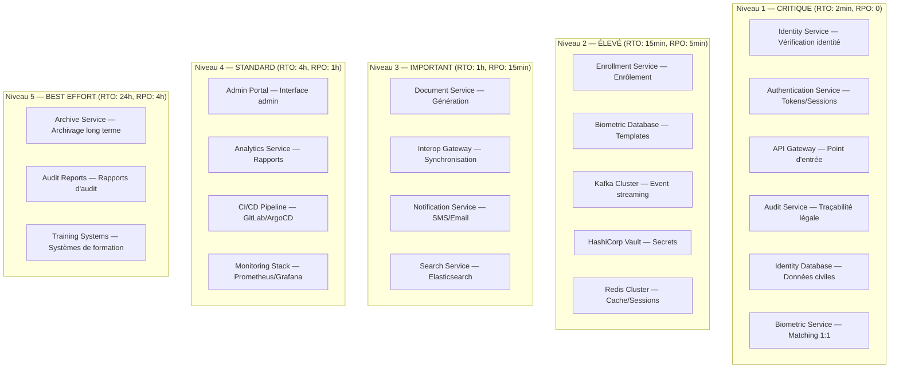

### 3.2 Tableau RTO/RPO Complet

| Service | Tier | RTO | RPO | Stratégie HA | Stratégie DR |
|---|---|---|---|---|---|
| **API Gateway (Kong)** | L1 | 2 min | N/A | Active-Active 3+2 instances | DNS failover auto |
| **Identity Service** | L1 | 2 min | 0 | K8s Deployment 3+ replicas, 2 DC | Kubernetes failover |
| **Auth Service (Keycloak)** | L1 | 2 min | 30 s | Cluster 3 nodes, 2 DC | Session replication |
| **Biometric Service** | L1 | 5 min | 0 | 2+ replicas GPU, 2 DC | K8s failover |
| **Audit Service** | L1 | 2 min | 0 | 3+ replicas, 2 DC | CockroachDB multi-DC |
| **Identity DB (PostgreSQL)** | L1 | 5 min | 0 | Patroni HA, sync replication | Async replication CAP |
| **Enrollment Service** | L2 | 15 min | 5 min | 2+ replicas, 2 DC | K8s restart |
| **Biometric Vault (DB)** | L2 | 10 min | 5 min | Patroni HA locale, async CAP | Restore from backup |
| **Kafka Cluster** | L2 | 5 min | 0 | 5 brokers RF=3, 2 DC via MM2 | MirrorMaker 2 |
| **HashiCorp Vault** | L2 | 5 min | 0 | Cluster 3 nodes, Performance Standby CAP | Vault Replication Enterprise |
| **Redis Cluster** | L2 | 10 min | 5 min | 3 masters + replicas, 2 DC | Redis replication |
| **Document Service** | L3 | 1 h | 15 min | 2 replicas, 1 DC | K8s restart + PVC restore |
| **Interop Gateway** | L3 | 1 h | 15 min | 2 replicas | K8s restart |
| **Notification Service** | L3 | 1 h | 30 min | 2 replicas + queue persistence | Queue replay |
| **Search (Elasticsearch)** | L3 | 2 h | 1 h | 3 nodes cluster | Snapshot restore |
| **Admin Portal** | L4 | 4 h | 1 h | 2 replicas | K8s restart |
| **Analytics (Spark/Trino)** | L4 | 4 h | 1 h | Stateless, restart | Redémarrage |
| **Monitoring Stack** | L4 | 4 h | 2 h | 2 Prometheus replicas | Backup Grafana + Prometheus |
| **Archive Service** | L5 | 24 h | 4 h | Single replica | Restore depuis Ceph |

---

## 4. Pyramide de Résilience à 5 Niveaux

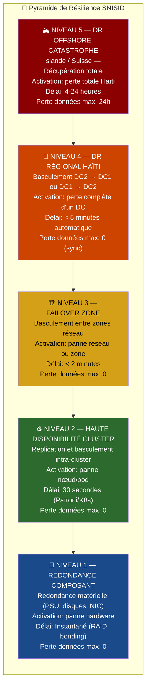

### 4.1 Niveau 1 — Redondance Composant

| Composant | Redondance | Mécanisme | MTTR |
|---|---|---|---|
| Alimentation serveur | 2 PSU (A+B) | Dual PSU, PDU séparés | Immédiat |
| Stockage | RAID 10 NVMe | Hotswap | < 30 min |
| Réseau serveur | Bonding 2×25GbE | LACP (802.3ad) | Immédiat |
| Réseau DC | Switches MLAG | MLAG Arista (< 1s) | < 1 s |
| Alimentation DC | UPS N+1 + Générateurs N+1 | ATS (Automatic Transfer Switch) | < 30 s |

### 4.2 Niveau 2 — HA Cluster

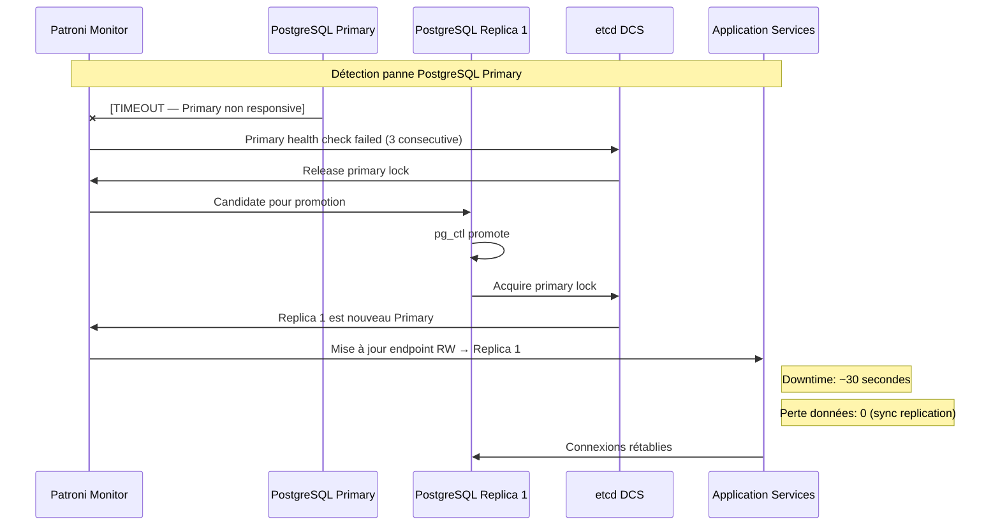

### 4.3 Niveau 3 — Failover Zone

- **Trigger** : Perte réseau d'une zone VLAN (ex. VLAN 20 Application inaccessible)
- **Mécanisme** : Kubernetes Node Not Ready → Pods eviction → Rescheduling sur nœuds disponibles
- **Délai** : 1-2 minutes (kubectl Node timeout: 40s + pod scheduling)
- **Pré-requis** : Capacité suffisante dans zones survivantes

### 4.4 Niveau 4 — DR Régional HAïti

Documenté en détail dans la section [Procédures de Basculement](#7-procédures-de-basculement).

### 4.5 Niveau 5 — DR Offshore Catastrophe

Documenté en détail dans la section [Architecture DR Offshore](#8-architecture-dr-offshore).

---

## 5. Stratégie de Réplication de Bases de Données

### 5.1 Architecture de Réplication PostgreSQL

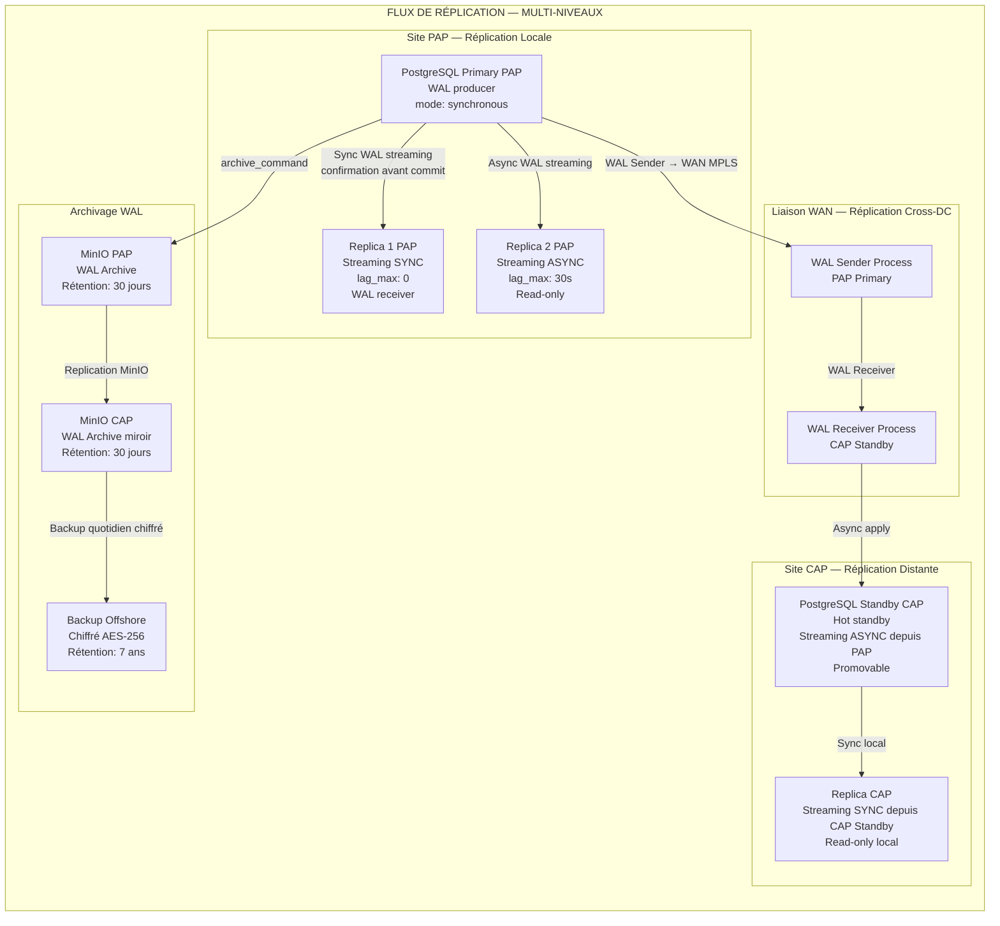

### 5.2 Configuration Réplication Synchrone/Asynchrone

```sql
-- postgresql.conf — Paramètres de réplication
-- Sur le Primary PAP:

-- Réplication synchrone vers Replica 1 PAP (même DC)
-- Réplication asynchrone vers Standby CAP (cross-DC)
synchronous_commit = on
synchronous_standby_names = 'FIRST 1 (replica1_pap)'
-- "FIRST 1" = au moins 1 replica sync doit confirmer avant commit
-- CAP Standby est async: pas de risque de latence WAN sur les commits

-- Slots de réplication pour éviter suppression WAL avant consommation
-- PAP Replicas:
-- SELECT pg_create_physical_replication_slot('replica1_pap');
-- SELECT pg_create_physical_replication_slot('replica2_pap');
-- CAP Standby:
-- SELECT pg_create_physical_replication_slot('cap_standby');

-- Monitoring réplication:
-- SELECT client_addr, state, sent_lsn, write_lsn, flush_lsn, replay_lsn,
--        write_lag, flush_lag, replay_lag, sync_state
-- FROM pg_stat_replication;
```

```yaml
# Patroni Configuration — patroni.yml
scope: snisid-identity-cluster
namespace: /snisid/
name: postgres-primary-pap

restapi:
  listen: 10.30.0.10:8008
  connect_address: 10.30.0.10:8008

etcd3:
  hosts: 10.30.0.50:2379,10.30.0.51:2379,10.30.0.52:2379
  protocol: https
  cacert: /etc/ssl/etcd/ca.crt
  cert: /etc/ssl/etcd/client.crt
  key: /etc/ssl/etcd/client.key

bootstrap:
  dcs:
    ttl: 30
    loop_wait: 10
    retry_timeout: 30
    maximum_lag_on_failover: 1048576  # 1 MB — failover si lag > 1MB
    maximum_lag_on_syncnode: -1       # Pas de limite sur sync node
    synchronous_mode: true            # Mode synchrone global
    synchronous_mode_strict: false    # Tolérer 0 sync si replica down
    postgresql:
      use_pg_rewind: true
      use_slots: true
      parameters:
        wal_level: replica
        hot_standby: "on"
        max_wal_senders: 10
        max_replication_slots: 10
        synchronous_commit: "on"
        archive_mode: "on"
        archive_timeout: 300

  initdb:
    - encoding: UTF8
    - locale: fr_HT.UTF-8
    - data-checksums

  pg_hba:
    - host replication replicator 10.30.0.0/24 md5
    - host replication replicator 10.130.0.0/24 md5  # CAP Standby
    - hostssl all all 10.20.0.0/20 md5

postgresql:
  listen: 10.30.0.10:5432
  connect_address: 10.30.0.10:5432
  data_dir: /data/postgresql/16/main
  bin_dir: /usr/lib/postgresql/16/bin
  config_dir: /etc/postgresql/16/main

  authentication:
    superuser:
      username: postgres
      password: '{VAULT_SECRET:postgresql/data/superuser}'
    replication:
      username: replicator
      password: '{VAULT_SECRET:postgresql/data/replicator}'
    rewind:
      username: rewind_user
      password: '{VAULT_SECRET:postgresql/data/rewind}'

  callbacks:
    on_start: /etc/patroni/callbacks/on_start.sh
    on_stop: /etc/patroni/callbacks/on_stop.sh
    on_role_change: /etc/patroni/callbacks/on_role_change.sh  # Notifie monitoring

tags:
  nofailover: false
  noloadbalance: false
  clonefrom: false
  nosync: false
```

### 5.3 Stratégie de Backup PITR

```yaml
backup_strategy:
  method: "WAL-G + pgBackRest"
  
  full_backup:
    frequency: "Quotidien — 02:00 AM HT"
    retention: "30 jours full"
    storage: ["MinIO PAP", "MinIO CAP", "Offshore chiffré"]
    compression: "zstd niveau 3"
    encryption: "AES-256-CBC (clé dans Vault)"

  wal_archiving:
    mode: continu
    destination: "s3://snisid-wal/$(hostname)/%Y/%m/%d/"
    endpoint: "https://minio.snisid.gouv.ht"
    retention: "30 jours"
    
  point_in_time_recovery:
    granularity: "1 seconde (WAL continu)"
    max_rpo: "5 minutes (archive_timeout=300)"
    test_restore: "Mensuel sur environnement DR test"

  verification:
    checksum_validation: true
    test_restore_schedule: "Dimanche 04:00 AM — DC test"
    alerting: "Si backup échoue: PagerDuty + email DBA on-call"
```

---

## 6. Kafka MirrorMaker 2 — Streaming Cross-DC

### 6.1 Architecture MirrorMaker 2

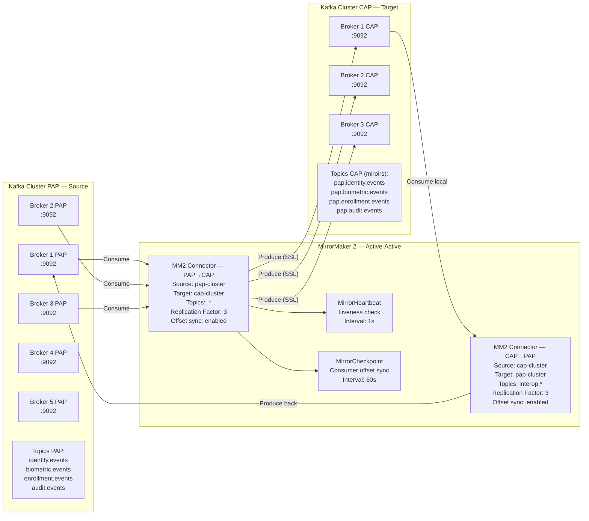

### 6.2 Configuration MirrorMaker 2

```yaml
# mm2.properties — MirrorMaker 2 Configuration
# Clusters
clusters = pap, cap

pap.bootstrap.servers = kafka-b1.snisid.internal:9093,kafka-b2.snisid.internal:9093,kafka-b3.snisid.internal:9093
pap.security.protocol = SSL
pap.ssl.truststore.location = /etc/kafka/ssl/kafka.truststore.jks
pap.ssl.keystore.location = /etc/kafka/ssl/kafka.pap.keystore.jks
pap.ssl.keystore.password = ${KAFKA_MM2_KEYSTORE_PASS}

cap.bootstrap.servers = kafka-c1.snisid.internal:9093,kafka-c2.snisid.internal:9093,kafka-c3.snisid.internal:9093
cap.security.protocol = SSL
cap.ssl.truststore.location = /etc/kafka/ssl/kafka.truststore.jks
cap.ssl.keystore.location = /etc/kafka/ssl/kafka.cap.keystore.jks

# Flows de réplication
pap->cap.enabled = true
cap->pap.enabled = true

# Topics à répliquer PAP→CAP (tous sauf les miroirs eux-mêmes)
pap->cap.topics = identity\.events, biometric\.events, enrollment\.events, audit\.events, notification\.commands, interop\.sync
pap->cap.topics.exclude = .*\.MirrorHeartbeat

# Topics à répliquer CAP→PAP (uniquement interop pour éviter boucle)
cap->pap.topics = interop\.sync
cap->pap.topics.exclude = pap\..*

# Replication settings
replication.factor = 3
tasks.max = 8
offset-syncs.topic.replication.factor = 3
heartbeats.topic.replication.factor = 3
checkpoints.topic.replication.factor = 3

# Sync consumer group offsets (pour failover transparent)
sync.group.offsets.enabled = true
sync.group.offsets.interval.seconds = 60

# Failover consumer configuration
offset.lag.max = 100000

# Monitoring
metrics.enabled = true
metrics.reporter.classes = org.apache.kafka.common.metrics.JmxReporter

# Compression
producer.compression.type = lz4

# Performance
producer.batch.size = 32768
producer.linger.ms = 5
consumer.max.poll.records = 5000
```

---

## 7. Procédures de Basculement

### 7.1 Procédure Basculement DC PAP → DC CAP (Manuel)

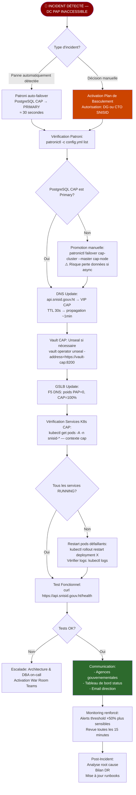

### 7.2 Runbook Complet — Basculement PostgreSQL

```bash
#!/bin/bash
# RUNBOOK: PostgreSQL Failover PAP → CAP
# Fichier: /opt/snisid/runbooks/postgresql-failover-pap-to-cap.sh
# Auteur: SNISID Infrastructure Team
# Révision: v1.0 — 2026-05-25

set -euo pipefail
LOG_FILE="/var/log/snisid/dr-$(date +%Y%m%d-%H%M%S).log"
exec > >(tee -a "$LOG_FILE") 2>&1

echo "=== SNISID DR RUNBOOK: PostgreSQL Failover PAP → CAP ==="
echo "Date: $(date -u +%Y-%m-%dT%H:%M:%SZ)"
echo "Opérateur: $USER"
echo ""

# ÉTAPE 0: Autorisation
echo "[ÉTAPE 0] Vérification autorisation..."
echo "⚠️  Ce runbook nécessite autorisation DG SNISID ou CTO."
echo "Entrez le code d'autorisation DR (format: SNISID-DR-YYYYMMDD-XXX):"
read -r AUTH_CODE
if [[ ! "$AUTH_CODE" =~ ^SNISID-DR-[0-9]{8}-[A-Z0-9]{3}$ ]]; then
    echo "❌ Code d'autorisation invalide. Arrêt."
    exit 1
fi
echo "✅ Code d'autorisation: $AUTH_CODE"

# ÉTAPE 1: Vérification état actuel
echo ""
echo "[ÉTAPE 1] Vérification état Patroni..."
patronictl -c /etc/patroni/patroni.yml list

echo ""
echo "Lag de réplication actuel:"
psql -h 10.130.0.10 -U monitor -c "SELECT now() - pg_last_xact_replay_timestamp() AS replication_lag;"

# ÉTAPE 2: Arrêt gracieux du trafic vers PAP
echo ""
echo "[ÉTAPE 2] Réduction trafic vers PAP dans GSLB..."
# Modifier F5 GSLB — poids PAP → 0
curl -sk -u admin:${F5_API_PASS} \
  -X PATCH "https://f5-pap.snisid.internal/mgmt/tm/gtm/pool/members" \
  -H "Content-Type: application/json" \
  -d '{"ratio": 0, "member": "POOL_PAP:VS_PAP_EXT"}'
echo "✅ Trafic PAP réduit à 0%"

sleep 30  # Attendre vidange des connexions actives

# ÉTAPE 3: Promotion PostgreSQL CAP
echo ""
echo "[ÉTAPE 3] Promotion PostgreSQL Standby CAP en Primary..."
patronictl -c /etc/patroni/patroni-cap.yml failover snisid-identity-cluster \
  --master cap-postgres-standby \
  --force

echo "Attente 60s pour stabilisation..."
sleep 60

patronictl -c /etc/patroni/patroni-cap.yml list
echo "✅ Vérification: CAP Standby promu Primary"

# ÉTAPE 4: Mise à jour DNS interne
echo ""
echo "[ÉTAPE 4] Mise à jour DNS interne..."
nsupdate -k /etc/bind/tsig.key << EOF
server ns1-int.snisid.gouv.ht
zone snisid.internal.
update delete postgres-rw.snisid.internal. A
update add postgres-rw.snisid.internal. 30 A 10.130.0.10
send
EOF
echo "✅ DNS postgres-rw → 10.130.0.10 (CAP)"

# ÉTAPE 5: Déblocage Vault CAP si nécessaire
echo ""
echo "[ÉTAPE 5] Vérification état Vault CAP..."
VAULT_STATUS=$(vault status -address=https://vault-cap.snisid.internal:8200 -format=json | jq -r .sealed)
if [ "$VAULT_STATUS" == "true" ]; then
    echo "⚠️  Vault CAP scellé — Unseal requis (5/9 key shards nécessaires)"
    echo "Contacter les détenteurs de clés (voir procédure Key Ceremony)"
    # vault operator unseal -address=https://vault-cap:8200 <SHARD_1>
    # vault operator unseal -address=https://vault-cap:8200 <SHARD_2>
    # ... (5 fois)
else
    echo "✅ Vault CAP opérationnel"
fi

# ÉTAPE 6: Vérification Kubernetes CAP
echo ""
echo "[ÉTAPE 6] Vérification pods Kubernetes CAP..."
kubectl --context=snisid-cap get pods -A -l app.kubernetes.io/part-of=snisid \
  --field-selector=status.phase!=Running

FAILED_PODS=$(kubectl --context=snisid-cap get pods -A -l app.kubernetes.io/part-of=snisid \
  --field-selector=status.phase!=Running --no-headers | wc -l)

if [ "$FAILED_PODS" -gt 0 ]; then
    echo "⚠️  $FAILED_PODS pods défaillants. Restart en cours..."
    kubectl --context=snisid-cap rollout restart deployment \
      -n snisid-identity identity-service
    kubectl --context=snisid-cap rollout restart deployment \
      -n snisid-auth auth-service
    kubectl --context=snisid-cap rollout status deployment identity-service \
      -n snisid-identity --timeout=120s
fi

# ÉTAPE 7: Tests fonctionnels
echo ""
echo "[ÉTAPE 7] Tests fonctionnels de validation..."
HTTP_STATUS=$(curl -sk -o /dev/null -w "%{http_code}" \
  https://api.snisid.gouv.ht/v1/health)
if [ "$HTTP_STATUS" == "200" ]; then
    echo "✅ API Gateway: OK ($HTTP_STATUS)"
else
    echo "❌ API Gateway: ÉCHEC ($HTTP_STATUS)"
    exit 1
fi

IDENTITY_STATUS=$(curl -sk -o /dev/null -w "%{http_code}" \
  -H "Authorization: Bearer $TEST_TOKEN" \
  https://api.snisid.gouv.ht/v1/identity/health)
echo "Identity Service health: $IDENTITY_STATUS"

# ÉTAPE 8: GSLB Update final
echo ""
echo "[ÉTAPE 8] Mise à jour GSLB finale — 100% vers CAP..."
curl -sk -u admin:${F5_API_PASS} \
  -X PATCH "https://f5-pap.snisid.internal/mgmt/tm/gtm/pool" \
  -d '{"members": [{"name": "POOL_CAP", "ratio": 100}]}'
echo "✅ 100% trafic vers CAP"

# ÉTAPE 9: Notification
echo ""
echo "[ÉTAPE 9] Notifications..."
# PagerDuty — DR activé
curl -s -X POST https://events.pagerduty.com/v2/enqueue \
  -H 'Content-Type: application/json' \
  -d "{\"routing_key\": \"$PD_ROUTING_KEY\",
       \"event_action\": \"trigger\",
       \"payload\": {
         \"summary\": \"SNISID DR ACTIVÉ: Basculement PAP→CAP complet\",
         \"severity\": \"critical\",
         \"source\": \"snisid-dr-runbook\",
         \"custom_details\": {\"auth_code\": \"$AUTH_CODE\", \"operator\": \"$USER\"}
       }}"

echo ""
echo "=== BASCULEMENT TERMINÉ ==="
echo "DC Actif: Cap-Haïtien"
echo "PostgreSQL Primary: 10.130.0.10"
echo "API: https://api.snisid.gouv.ht → VIP CAP"
echo "Log: $LOG_FILE"
echo ""
echo "⚠️  ACTIONS REQUISES:"
echo "  1. Monitoring renforcé actif (alertes ×2)"
echo "  2. Informer toutes les agences partenaires"
echo "  3. Planifier retour vers PAP quand infrastructure réparée"
echo "  4. Ouvrir incident post-mortem dans JIRA/Confluence"
```

### 7.3 Procédure Retour en Service PAP (Failback)

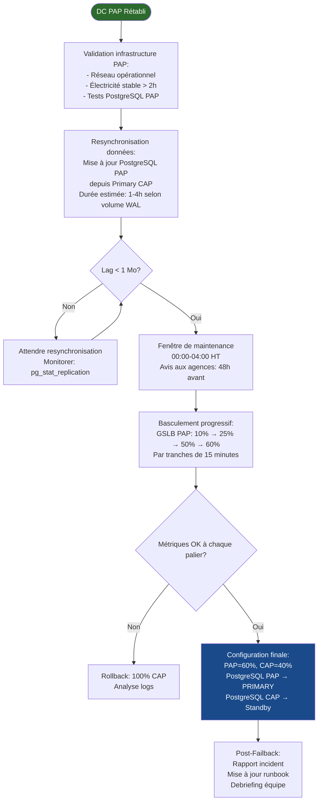

---

## 8. Architecture DR Offshore

### 8.1 Concept — Coffre-fort Numérique Souverain

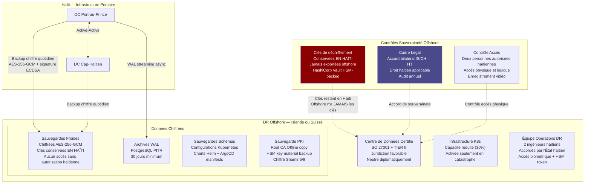

### 8.2 Procédure Activation DR Offshore

```yaml
procedure_activation_dr_offshore:
  declencheur: "Catastrophe nationale — Double perte DC PAP + CAP"
  autorisation_requise:
    - "Décision Conseil des Ministres OU"
    - "Autorisation Premier Ministre + Ministre MTIC OU"
    - "Protocole urgence: DG SNISID + CISO + Architecte en Chef (3/3)"

  etapes:
    "00:00 - Décision":
      - "Activation du Plan de Continuité d'Activité National"
      - "Notification équipe offshore (2 ingénieurs)"
      - "Préparation des clés Shamir (5/9 détenteurs)"

    "00:30 - Transport clés":
      - "Transport sécurisé des shards Shamir par valise diplomatique ou personne de confiance"
      - "Vérification identité biométrique à l'arrivée offshore"
      - "Reconstruction clé maîtresse: reconstruct_key(shards[5..9])"

    "01:00 - Déchiffrement backup":
      - "Identification du dernier backup valide et complet"
      - "Déchiffrement: gpg --decrypt backup_YYYYMMDD.tar.gz.gpg"
      - "Vérification checksum SHA-512"
      - "Restauration PostgreSQL depuis backup + WAL PITR"

    "02:00 - Activation infrastructure":
      - "Démarrage cluster Kubernetes offshore (capacité réduite)"
      - "Restauration Vault depuis PKI backup"
      - "Initialisation nouveaux certificats TLS (domaine de crise)"
      - "Configuration DNS de crise: api-dr.snisid.gouv.ht"

    "03:00 - Services essentiels":
      - "Activation: Identity Service (read-only), Auth Service, API Gateway"
      - "Services désactivés: Biometric capture (équipements non disponibles)"
      - "Mode dégradé: vérification identité par NIN uniquement"

    "04:00 - Opérationnel":
      - "Services essentiels fonctionnels"
      - "Communication officielle: portail gouvernemental, radio nationale"
      - "SLA dégradé: RTO 4h, RPO 24h maximum"

  services_en_mode_degrade:
    actifs: [identity_read, auth, api_gateway, citizen_portal_read_only]
    inactifs: [biometric_capture, enrollment_new, document_generation]
    mode: "Vérification identité existante uniquement, pas de nouveaux enrôlements"

  duree_max_operation_offshore: "6 mois"
  retour_haiti:
    condition: "Infrastructure haïtienne rétablie et testée"
    procedure: "Resync données offshore → Haïti, validation, basculement progressif"
```

---

## 9. Procédures de Drill DR

### 9.1 Calendrier des Exercices

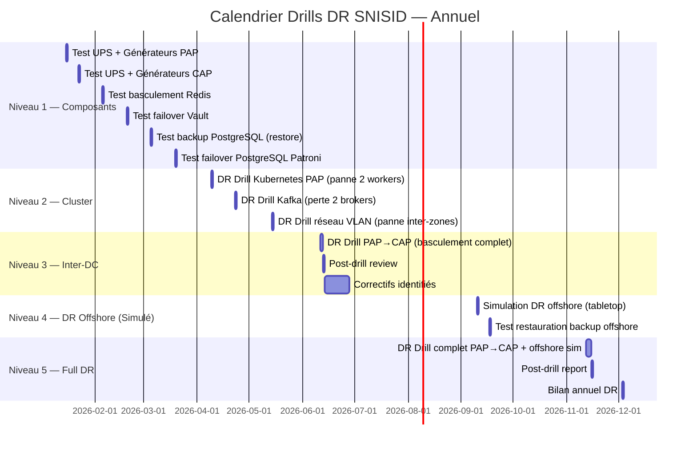

### 9.2 Checklist Drill DR — Basculement PAP → CAP

```markdown
# CHECKLIST DRILL DR — Basculement PAP → CAP
# Version: 1.0 | Date: [DATE_DRILL] | Référence: DRILL-[YYYY-NNN]

## PRÉ-DRILL (J-7)
- [ ] Notification parties prenantes (agences, direction)
- [ ] Revue procédures runbooks — dernière mise à jour < 30 jours
- [ ] Validation configuration Patroni et MirrorMaker 2
- [ ] Vérification disponibilité équipe (au moins 4 ingénieurs)
- [ ] Préparation environnement monitoring renforcé
- [ ] Backup état complet avant drill
- [ ] Confirmation fenêtre de maintenance (impact réduit)

## EXÉCUTION (Jour du Drill)

### Phase 1 — Simulation panne PAP (T+0)
- [ ] Isolation réseau simulée PAP (blocage VIPs au niveau F5)
- [ ] Observation comportement automatique Patroni (< 30s)
- [ ] Chronométrage: détection panne → promotion PostgreSQL CAP
- [ ] Vérification: Vault CAP opérationnel
- [ ] Vérification: Kafka MirrorMaker 2 (lag monitoring)

### Phase 2 — Basculement Applications (T+5min)
- [ ] Mise à jour GSLB → 100% CAP
- [ ] Vérification pods Kubernetes CAP: tous Running
- [ ] Test API health: GET /v1/health → 200
- [ ] Test identity verification: POST /v1/identity/verify → 200
- [ ] Test authentication: POST /auth/token → 200
- [ ] Chronométrage: T+0 → Services opérationnels

### Phase 3 — Validation Données (T+15min)
- [ ] Vérification intégrité: checksum PostgreSQL CAP vs dernier commit PAP
- [ ] Test Kafka: vérification que aucun message perdu (offsets)
- [ ] Test Vault: rotation d'un secret test réussie
- [ ] Vérification audit trail: tous événements du drill enregistrés

### Phase 4 — Retour Nominal (T+60min)
- [ ] Rétablissement PAP simulé (déblocage réseau)
- [ ] Resynchronisation PostgreSQL (monitoring lag)
- [ ] Test GSLB progressif: 10% PAP → 25% → 60%
- [ ] Validation métriques à chaque palier
- [ ] Retour configuration nominale 60/40

## POST-DRILL

### Métriques à Capturer
- [ ] RTO effectif: __ minutes (objectif: < 5 min)
- [ ] RPO effectif: __ secondes de données perdues (objectif: 0)
- [ ] Disponibilité services pendant basculement: __%
- [ ] Nombre d'erreurs 5xx pendant basculement: __
- [ ] Temps resynchronisation données: __ minutes

### Rapport de Drill
- [ ] Rapport écrit dans les 48h
- [ ] Liste des problèmes identifiés
- [ ] Tickets correctifs créés
- [ ] Mise à jour runbooks si nécessaire
- [ ] Présentation au COMEX si RTO > objectif

## CRITÈRES DE SUCCÈS
| Métrique | Objectif | Réel | Statut |
|---|---|---|---|
| RTO total | < 5 minutes | __ | |
| RPO | 0 | __ | |
| Erreurs 5xx | < 50 | __ | |
| Kafka lag fin basculement | < 1000 msgs | __ | |
| Services opérationnels | 100% | __ | |
```

---

## 10. Monitoring HA/DR

### 10.1 Tableau de Bord HA/DR — Métriques Clés

```yaml
monitoring_hadr:
  dashboards:
    dr_status:
      panels:
        - title: "Statut DC PAP"
          query: "up{job='snisid-pap-health'} == 1"
          alert: "if absent > 30s → PagerDuty CRITICAL"

        - title: "Statut DC CAP"
          query: "up{job='snisid-cap-health'} == 1"
          alert: "if absent > 30s → PagerDuty CRITICAL"

        - title: "PostgreSQL Replication Lag"
          query: "pg_replication_lag_seconds{cluster='identity'}"
          thresholds:
            warning: 10   # secondes
            critical: 60  # secondes
            alert_action: "PagerDuty HIGH si > 10s"

        - title: "Kafka MirrorMaker Lag"
          query: "kafka_mirrormaker_record_lag"
          thresholds:
            warning: 10000
            critical: 100000

        - title: "Vault HA Status"
          query: "vault_core_active"
          description: "1=active, 0=standby"

        - title: "Patroni Leader PAP"
          query: "patroni_master{cluster='snisid-identity-cluster', dc='pap'}"
          alert: "if 0 for > 60s → auto-failover check"

        - title: "RTO SLA Conformance"
          query: "snisid_failover_duration_seconds"
          sla: "< 300s (5 minutes)"
          review: "mensuel"

  alerting_rules:
    - name: "DR_THRESHOLD_CROSSED"
      condition: "replication_lag > 60s OR kafka_lag > 100000"
      action: "Page DBA + Infrastructure on-call"
      escalation: "Si non résolu en 15min → CTO"

    - name: "DC_DOWN_COMPLETE"
      condition: "all health checks fail on DC for 60s"
      action: "AUTO: Patroni failover\nMANUAL: Run dr-failover runbook"
      escalation: "Immédiat DG + CISO + CTO"

    - name: "VAULT_SEALED"
      condition: "vault_seal_status == 1"
      action: "Page sécurité on-call — unseal requis"
      priority: CRITICAL

  on_call_rotation:
    primary: "DBA + Infrastructure — rotation hebdomadaire"
    secondary: "Architecture team — escalade"
    management: "CTO/DG — incidents severity 1"
    contact: "PagerDuty + WhatsApp sécurisé Signal"
```

---

## Bloc d'Approbation / Approval Block

| Rôle | Nom | Signature | Date |
|---|---|---|---|
| **Architecte en Chef** | [À compléter] | [Signature] | 2026-05-25 |
| **Directeur Infrastructure** | [À compléter] | [Signature] | 2026-05-25 |
| **CISO** | [À compléter] | [Signature] | 2026-05-25 |
| **Directeur Général SNISID** | [À compléter] | [Signature] | 2026-05-25 |
| **Ministère Responsable** | [À compléter] | [Signature] | 2026-05-25 |

---

*Document SNISID-ARC-HA-DR-001 v1.0.0 — CONFIDENTIEL — © République d'Haïti, Programme SNISID, 2026*
*Révision obligatoire trimestrielle. Tests DR semi-annuels obligatoires.*
