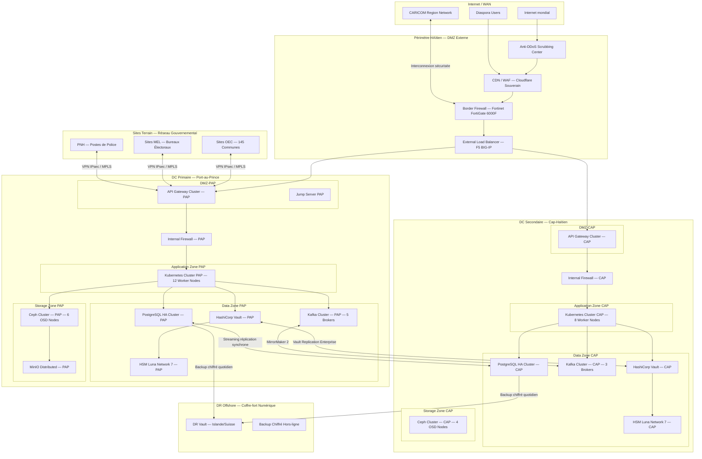
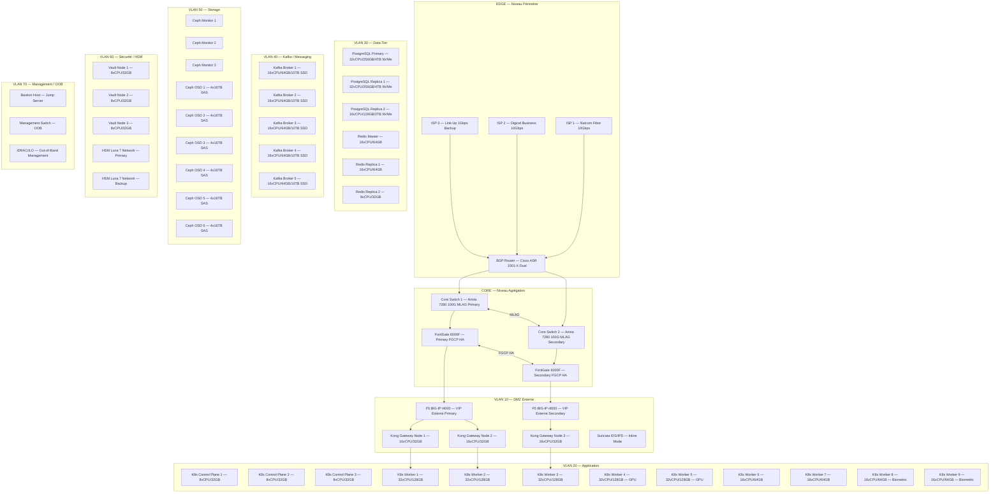
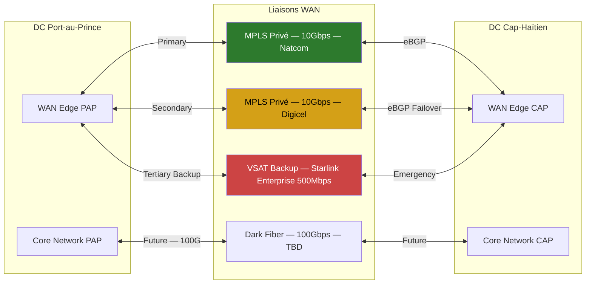
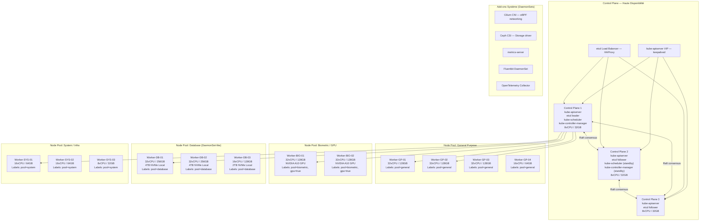
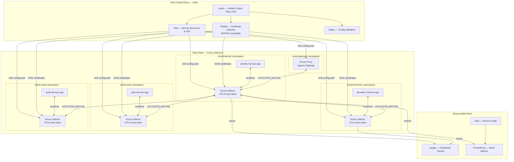
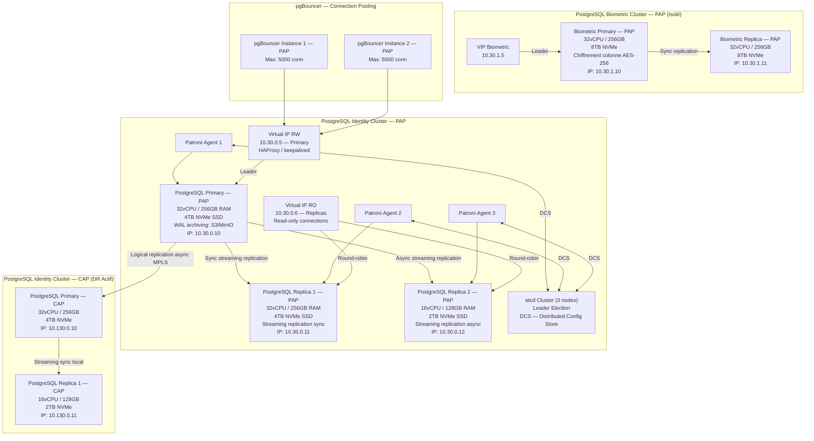
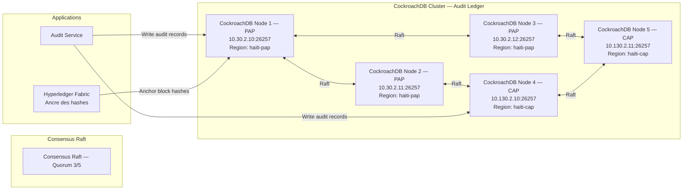
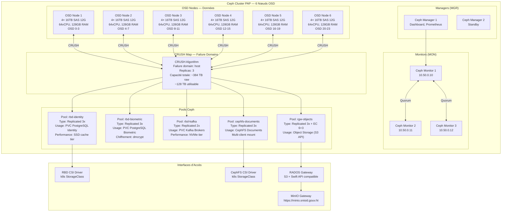
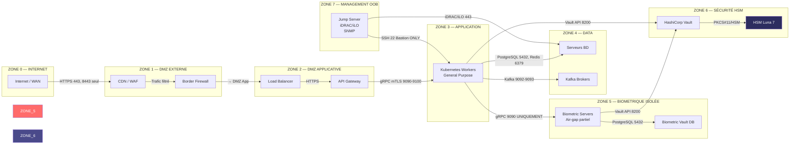

# SNISID — Topologie d'Infrastructure Complète
# SNISID — Complete Infrastructure Topology

---

| Métadonnée | Valeur |
|---|---|
| **Document ID** | SNISID-ARC-INF-001 |
| **Version** | 1.0.0 |
| **Date** | 2026-05-25 |
| **Statut** | APPROUVÉ — Production |
| **Classification** | CONFIDENTIEL / CONFIDENTIAL |
| **Auteur** | Infrastructure Team — SNISID Programme |
| **Révisé par** | Chief Architect, Network Lead, Security Architect |
| **Approuvé par** | Directeur Infrastructure, DG SNISID |
| **Standard** | ISO/IEC 27001:2022, NIST SP 800-53, TIA-942 Tier III |

---

## Table des Matières

1. [Vue Générale de la Topologie](#1-vue-générale-de-la-topologie)
2. [Topologie Réseau Complète](#2-topologie-réseau-complète)
3. [Topologie Kubernetes](#3-topologie-kubernetes)
4. [Service Mesh — Istio](#4-service-mesh--istio)
5. [Topologie Bases de Données](#5-topologie-bases-de-données)
6. [Topologie Apache Kafka](#6-topologie-apache-kafka)
7. [Topologie Stockage](#7-topologie-stockage)
8. [Architecture DNS](#8-architecture-dns)
9. [Load Balancers](#9-load-balancers)
10. [Zones Pare-feu et Règles](#10-zones-pare-feu-et-règles)
11. [Plan d'Adressage IP](#11-plan-dadressage-ip)
12. [Topologie Physique des Datacenters](#12-topologie-physique-des-datacenters)

---

## 1. Vue Générale de la Topologie

### 1.1 Macro-Topologie SNISID



---

## 2. Topologie Réseau Complète

### 2.1 Diagramme Réseau Détaillé — DC Port-au-Prince



### 2.2 Interconnexion Inter-Datacenter



---

## 3. Topologie Kubernetes

### 3.1 Architecture du Cluster Kubernetes PAP



### 3.2 Namespaces et Organisation Logique

```yaml
# Organisation des Namespaces Kubernetes SNISID
namespaces:
  production:
    - name: snisid-identity
      description: "Identity Service et composants associés"
      resource_quota:
        requests.cpu: "40"
        requests.memory: "160Gi"
        limits.cpu: "80"
        limits.memory: "320Gi"
      node_selector: {pool: general}
      labels: {tier: critical, data-class: personal, env: production}

    - name: snisid-biometric
      description: "Biometric Service — isolation maximale"
      resource_quota:
        requests.cpu: "20"
        requests.memory: "80Gi"
        limits.cpu: "40"
        limits.memory: "160Gi"
      node_selector: {pool: biometric}
      labels: {tier: critical, data-class: biometric, env: production}
      network_policy: "deny-all-ingress-except-gateway"

    - name: snisid-auth
      description: "Authentication Service, Keycloak"
      resource_quota:
        requests.cpu: "16"
        requests.memory: "64Gi"
      labels: {tier: critical, env: production}

    - name: snisid-enrollment
      description: "Enrollment orchestration"
      resource_quota:
        requests.cpu: "8"
        requests.memory: "32Gi"
      labels: {tier: high, env: production}

    - name: snisid-documents
      description: "Document generation service"
      resource_quota:
        requests.cpu: "8"
        requests.memory: "32Gi"
      labels: {tier: high, env: production}

    - name: snisid-gateway
      description: "API Gateway (Kong) — DMZ interne"
      resource_quota:
        requests.cpu: "12"
        requests.memory: "48Gi"
      labels: {tier: critical, env: production}

    - name: snisid-audit
      description: "Audit service — write-heavy"
      resource_quota:
        requests.cpu: "8"
        requests.memory: "32Gi"
      labels: {tier: critical, env: production}

    - name: snisid-interop
      description: "Interoperability gateway"
      labels: {tier: high, env: production}

    - name: snisid-notifications
      description: "SMS/Email notification service"
      labels: {tier: medium, env: production}

  infrastructure:
    - name: monitoring
      description: "Prometheus, Grafana, Loki, Tempo"
    - name: istio-system
      description: "Istio service mesh control plane"
    - name: cert-manager
      description: "Certificate automation"
    - name: vault-agent
      description: "HashiCorp Vault agent injectors"
    - name: kafka-system
      description: "Kafka Strimzi operator"
    - name: ceph-csi
      description: "Storage CSI driver"
    - name: argocd
      description: "GitOps deployment"
    - name: security-system
      description: "OPA Gatekeeper, Falco, Trivy Operator"
```

### 3.3 Configuration RKE2 Production

```yaml
# /etc/rancher/rke2/config.yaml — Control Plane
cluster-name: snisid-prod-pap
tls-san:
  - k8s-api.snisid.gouv.ht
  - 10.10.0.100  # VIP keepalived

cni: cilium

# FIPS 140-2 compliance
fips: true

# Disable cloud providers (on-premise)
cloud-provider-name: ""

# etcd snapshot
etcd-snapshot-schedule-cron: "0 */6 * * *"
etcd-snapshot-retention: 30
etcd-snapshot-dir: /var/lib/etcd-snapshots

# Audit logging
kube-apiserver-arg:
  - "--audit-log-path=/var/log/kubernetes/audit.log"
  - "--audit-log-maxage=30"
  - "--audit-log-maxbackup=10"
  - "--audit-log-maxsize=100"
  - "--audit-policy-file=/etc/kubernetes/audit-policy.yaml"
  - "--enable-admission-plugins=NodeRestriction,PodSecurityAdmission,AlwaysPullImages"
  - "--encryption-provider-config=/etc/kubernetes/encryption-config.yaml"
  - "--anonymous-auth=false"
  - "--tls-min-version=VersionTLS12"
  - "--tls-cipher-suites=TLS_ECDHE_ECDSA_WITH_AES_256_GCM_SHA384,TLS_ECDHE_RSA_WITH_AES_256_GCM_SHA384"
  - "--oidc-issuer-url=https://auth.snisid.gouv.ht/realms/snisid"
  - "--oidc-client-id=kubernetes"
  - "--oidc-username-claim=preferred_username"
  - "--oidc-groups-claim=groups"

kube-controller-manager-arg:
  - "--terminated-pod-gc-threshold=100"
  - "--use-service-account-credentials=true"

kube-scheduler-arg:
  - "--config=/etc/kubernetes/scheduler-config.yaml"

# Node labels for pools
node-label:
  - "datacenter=port-au-prince"
  - "site=snisid-dc-pap"
  - "tier=control-plane"
```

---

## 4. Service Mesh — Istio

### 4.1 Topologie Istio



### 4.2 PeerAuthentication — mTLS Strict Mode

```yaml
# PeerAuthentication — STRICT mTLS pour tous les namespaces SNISID
apiVersion: security.istio.io/v1beta1
kind: PeerAuthentication
metadata:
  name: snisid-mtls-strict-global
  namespace: istio-system
spec:
  mtls:
    mode: STRICT  # Aucune communication en clair autorisée
---
# AuthorizationPolicy — Biometric Service: accès très restreint
apiVersion: security.istio.io/v1beta1
kind: AuthorizationPolicy
metadata:
  name: biometric-service-authz
  namespace: snisid-biometric
spec:
  action: ALLOW
  rules:
    - from:
        - source:
            principals:
              - "cluster.local/ns/snisid-identity/sa/identity-service"
              - "cluster.local/ns/snisid-enrollment/sa/enrollment-service"
              - "cluster.local/ns/snisid-gateway/sa/api-gateway"
      to:
        - operation:
            methods: ["POST", "GET"]
            paths:
              - "/v1/biometric/capture/*"
              - "/v1/biometric/match/*"
              - "/v1/biometric/verify/*"
      when:
        - key: request.headers[x-purpose]
          values: ["enrollment", "verification", "emergency"]
---
# VirtualService — Canary deployment Identity Service
apiVersion: networking.istio.io/v1alpha3
kind: VirtualService
metadata:
  name: identity-service-vs
  namespace: snisid-identity
spec:
  hosts:
    - identity-service
  http:
    - name: canary-route
      match:
        - headers:
            x-canary:
              exact: "true"
      route:
        - destination:
            host: identity-service
            subset: v2-canary
          weight: 100
    - name: stable-route
      route:
        - destination:
            host: identity-service
            subset: v1-stable
          weight: 95
        - destination:
            host: identity-service
            subset: v2-canary
          weight: 5
```

---

## 5. Topologie Bases de Données

### 5.1 PostgreSQL Patroni — Haute Disponibilité



### 5.2 Configuration PostgreSQL Production

```sql
-- postgresql.conf — Configuration Production SNISID
-- Fichier: /etc/postgresql/16/main/postgresql.conf

-- CONNEXIONS ET AUTHENTIFICATION
max_connections = 200              -- pgBouncer gère le pooling
superuser_reserved_connections = 5
ssl = on
ssl_cert_file = '/etc/ssl/postgresql/server.crt'
ssl_key_file = '/etc/ssl/postgresql/server.key'
ssl_ca_file = '/etc/ssl/postgresql/ca.crt'
ssl_min_protocol_version = 'TLSv1.2'
ssl_ciphers = 'ECDHE-ECDSA-AES256-GCM-SHA384:ECDHE-RSA-AES256-GCM-SHA384'

-- MÉMOIRE ET PERFORMANCE
shared_buffers = 64GB              -- 25% RAM (256GB total)
effective_cache_size = 192GB       -- 75% RAM
work_mem = 256MB
maintenance_work_mem = 4GB
huge_pages = on
wal_buffers = 64MB

-- WAL ET RÉPLICATION
wal_level = replica
max_wal_senders = 10
wal_keep_size = 10GB
hot_standby = on
hot_standby_feedback = on
synchronous_commit = on
synchronous_standby_names = 'FIRST 1 (replica1_pap)'

-- ARCHIVAGE WAL vers MinIO
archive_mode = on
archive_command = 'aws s3 cp %p s3://snisid-wal-archive/%f --endpoint-url=https://minio.snisid.gouv.ht'
archive_timeout = 300              -- Archive toutes les 5 minutes au max

-- CHIFFREMENT DONNÉES AU REPOS (pgcrypto)
-- Note: chiffrement applicatif via AES-256-GCM pour colonnes sensibles

-- LOGGING ET AUDIT
log_destination = 'jsonlog'
logging_collector = on
log_directory = '/var/log/postgresql'
log_filename = 'postgresql-%Y-%m-%d_%H%M%S.log'
log_rotation_age = 1d
log_rotation_size = 1GB
log_min_duration_statement = 1000  -- Log requêtes > 1s
log_connections = on
log_disconnections = on
log_duration = off
log_lock_waits = on
log_checkpoints = on
log_line_prefix = '%t [%p]: [%l-1] user=%u,db=%d,app=%a,client=%h '
log_statement = 'ddl'             -- Log tous les DDL (CREATE, ALTER, DROP)

-- AUTOVACUUM
autovacuum = on
autovacuum_max_workers = 4
autovacuum_naptime = 60

-- MAINTENANCE
checkpoint_completion_target = 0.9
checkpoint_timeout = 15min
max_wal_size = 20GB
min_wal_size = 2GB
```

### 5.3 CockroachDB — Audit Ledger Distribué



---

## 6. Topologie Apache Kafka

### 6.1 Architecture Kafka Cluster

```mermaid
graph TB
    subgraph "Kafka Cluster PAP — KRaft Mode (sans ZooKeeper)"
        direction TB
        subgraph "Controllers (KRaft)"
            KC1["Kafka Controller 1\nKRaft Controller\n10.40.0.10:9093"]
            KC2["Kafka Controller 2\nKRaft Controller\n10.40.0.11:9093"]
            KC3["Kafka Controller 3\nKRaft Controller\n10.40.0.12:9093"]
        end

        subgraph "Brokers (Combined Mode)"
            KB1["Kafka Broker 1\n16vCPU / 64GB\n10TB NVMe SSD\n10.40.0.10:9092"]
            KB2["Kafka Broker 2\n16vCPU / 64GB\n10TB NVMe SSD\n10.40.0.11:9092"]
            KB3["Kafka Broker 3\n16vCPU / 64GB\n10TB NVMe SSD\n10.40.0.12:9092"]
            KB4["Kafka Broker 4\n16vCPU / 64GB\n10TB NVMe SSD\n10.40.0.13:9092"]
            KB5["Kafka Broker 5\n16vCPU / 64GB\n10TB NVMe SSD\n10.40.0.14:9092"]
        end

        subgraph "Schema Registry"
            SR[Schema Registry — Confluent\n10.40.0.20:8081\nAvro / Protobuf / JSON Schema]
        end

        subgraph "Kafka Connect"
            KC_POSTGRES[Kafka Connect — PostgreSQL Sink]
            KC_ELASTIC[Kafka Connect — Elasticsearch Sink]
            KC_S3[Kafka Connect — MinIO/S3 Sink (archivage)]
        end

        subgraph "Topics Principaux"
            T1[identity.events\nPartitions: 12\nRF: 3\nRetention: 365j]
            T2[biometric.events\nPartitions: 6\nRF: 3\nRetention: 90j\nChiffré]
            T3[enrollment.events\nPartitions: 12\nRF: 3\nRetention: 365j]
            T4[audit.events\nPartitions: 24\nRF: 5\nRetention: 7ans\nImmuable]
            T5[notification.commands\nPartitions: 6\nRF: 3\nRetention: 7j]
            T6[interop.sync\nPartitions: 12\nRF: 3\nRetention: 30j]
        end
    end

    subgraph "Kafka Cluster CAP — MirrorMaker 2"
        MM2[MirrorMaker 2\nActive-Active replication\n10.140.0.10]
        KB_CAP1[Kafka Broker 1 CAP]
        KB_CAP2[Kafka Broker 2 CAP]
        KB_CAP3[Kafka Broker 3 CAP]
    end

    subgraph "Producteurs"
        ID_SVC_P[Identity Service Producer]
        BIO_SVC_P[Biometric Service Producer]
        ENROLL_P[Enrollment Service Producer]
    end

    subgraph "Consommateurs"
        AUDIT_C[Audit Service Consumer Group: audit-writers]
        NOTIF_C[Notification Service Consumer Group: notifiers]
        SEARCH_C[Search Service Consumer Group: indexers]
        INTEROP_C[Interop Gateway Consumer Group: syncs]
    end

    KC1 <-->|Raft| KC2
    KC1 <-->|Raft| KC3

    ID_SVC_P -->|Produce TLS SASL| KB1
    BIO_SVC_P -->|Produce TLS SASL| KB2
    ENROLL_P -->|Produce TLS SASL| KB3

    KB1 <-->|Replication RF=3| KB2
    KB2 <-->|Replication RF=3| KB3
    KB3 <-->|Replication RF=3| KB4
    KB4 <-->|Replication RF=3| KB5

    KB1 --> T1
    KB2 --> T2
    KB3 --> T3
    KB4 --> T4
    KB5 --> T5

    T4 --> AUDIT_C
    T5 --> NOTIF_C
    T1 --> SEARCH_C
    T6 --> INTEROP_C

    KB1 <-->|MirrorMaker 2 replication| MM2
    MM2 --> KB_CAP1
    MM2 --> KB_CAP2
    MM2 --> KB_CAP3

    KB1 --> KC_POSTGRES
    KB2 --> KC_ELASTIC
    T4 --> KC_S3
```

### 6.2 Configuration Kafka Production

```yaml
# kafka-strimzi-cluster.yaml — Déploiement via Strimzi Operator
apiVersion: kafka.strimzi.io/v1beta2
kind: Kafka
metadata:
  name: snisid-kafka
  namespace: kafka-system
spec:
  kafka:
    version: "3.7.0"
    replicas: 5
    listeners:
      - name: tls
        port: 9093
        type: internal
        tls: true
        authentication:
          type: tls  # mTLS pour communication interne
      - name: external
        port: 9094
        type: loadbalancer
        tls: true
        authentication:
          type: scram-sha-512  # SCRAM pour agents terrain
    authorization:
      type: opa
      url: http://opa.security-system.svc.cluster.local:8181/v1/data/kafka/authz
    config:
      default.replication.factor: 3
      min.insync.replicas: 2
      offsets.topic.replication.factor: 3
      transaction.state.log.replication.factor: 3
      transaction.state.log.min.isr: 2
      log.retention.hours: 8760  # 1 an par défaut
      log.segment.bytes: 1073741824  # 1 GB
      log.retention.check.interval.ms: 300000
      compression.type: lz4
      auto.create.topics.enable: false  # Topics créés explicitement
      delete.topic.enable: true
      unclean.leader.election.enable: false  # IMPORTANT: évite perte données
      message.max.bytes: 10485760  # 10 MB max message
    storage:
      type: persistent-claim
      size: 10Ti
      class: ceph-rbd-performance
      deleteClaim: false
    metricsConfig:
      type: jmxPrometheusExporter
    jvmOptions:
      -Xms: 32g
      -Xmx: 32g

  zookeeper:  # KRaft mode: zookeeper section absent en production KRaft
    replicas: 0

  entityOperator:
    topicOperator: {}
    userOperator: {}
```

---

## 7. Topologie Stockage

### 7.1 Architecture Ceph



### 7.2 StorageClasses Kubernetes

```yaml
# StorageClasses SNISID — Ceph CSI
---
apiVersion: storage.k8s.io/v1
kind: StorageClass
metadata:
  name: ceph-rbd-performance
  annotations:
    storageclass.kubernetes.io/is-default-class: "false"
provisioner: rbd.csi.ceph.com
parameters:
  clusterID: snisid-ceph-pap
  pool: rbd-identity
  imageFormat: "2"
  imageFeatures: layering
  csi.storage.k8s.io/provisioner-secret-name: rook-csi-rbd-provisioner
  csi.storage.k8s.io/provisioner-secret-namespace: rook-ceph
  csi.storage.k8s.io/controller-expand-secret-name: rook-csi-rbd-provisioner
  csi.storage.k8s.io/node-stage-secret-name: rook-csi-rbd-node
  csi.storage.k8s.io/fstype: ext4
  encrypted: "true"  # Chiffrement LUKS2 côté volume
  encryptionKMSID: "vault-tokens-snisid"  # Clés via Vault
reclaimPolicy: Retain  # JAMAIS Delete pour données production
allowVolumeExpansion: true
volumeBindingMode: WaitForFirstConsumer
---
apiVersion: storage.k8s.io/v1
kind: StorageClass
metadata:
  name: ceph-rbd-biometric
  labels:
    data-classification: biometric
    compliance: restricted
provisioner: rbd.csi.ceph.com
parameters:
  clusterID: snisid-ceph-pap
  pool: rbd-biometric
  encrypted: "true"
  encryptionKMSID: "vault-tokens-biometric"  # Clés séparées pour biométrie
reclaimPolicy: Retain
allowVolumeExpansion: false  # Expansion manuelle après approbation
```

---

## 8. Architecture DNS

### 8.1 Hiérarchie DNS SNISID

```mermaid
graph TB
    subgraph "DNS Externe — Publiquement Résolvable"
        ROOT_DNS[Root DNS — IANA\n. root]
        HT_TLD[.ht TLD\nAHAITI — Autorité .ht]
        GOUV_HT[gouv.ht\nServeurs DNS Gouvernementaux\nns1.gouv.ht, ns2.gouv.ht]
        SNISID_EXT[snisid.gouv.ht\nZone Externe\nns1-ext.snisid.gouv.ht\nns2-ext.snisid.gouv.ht]
    end

    subgraph "Enregistrements DNS Externes"
        EXT_RECORDS["www.snisid.gouv.ht → CDN/WAF IP
        api.snisid.gouv.ht → EXT LB VIP
        portail.snisid.gouv.ht → CDN
        enroll.snisid.gouv.ht → CDN
        diaspora.snisid.gouv.ht → CDN"]
    end

    subgraph "DNS Interne — Privé"
        CORE_DNS["CoreDNS — Kubernetes\nIn-cluster DNS\n.cluster.local"]
        INT_DNS1["BIND 9 — DNS Interne PAP\nns1-int.snisid.gouv.ht\n10.10.0.53"]
        INT_DNS2["BIND 9 — DNS Interne CAP\nns2-int.snisid.gouv.ht\n10.110.0.53"]
    end

    subgraph "Zones Internes"
        ZONE_SVC["snisid.internal\nZone services internes"]
        INT_RECORDS["identity-svc.snisid.internal → 10.20.x.x
        biometric-svc.snisid.internal → 10.20.x.x
        auth-svc.snisid.internal → 10.20.x.x
        kafka.snisid.internal → 10.40.0.10-14
        vault.snisid.internal → 10.60.0.10-12
        postgres-rw.snisid.internal → 10.30.0.5
        postgres-ro.snisid.internal → 10.30.0.6"]
    end

    subgraph "DNSSEC"
        DNSSEC[DNSSEC Signing\nAlgorithme: ECDSAP384SHA384\nZSK rotation: 30j\nKSK rotation: 1an]
    end

    ROOT_DNS --> HT_TLD --> GOUV_HT --> SNISID_EXT
    SNISID_EXT --> EXT_RECORDS
    SNISID_EXT -.->|Délégation split-DNS| INT_DNS1
    INT_DNS1 <-->|Zone transfer TSIG| INT_DNS2
    INT_DNS1 --> ZONE_SVC --> INT_RECORDS
    CORE_DNS -->|Forward non-.cluster| INT_DNS1
    SNISID_EXT --> DNSSEC
```

---

## 9. Load Balancers

### 9.1 Architecture F5 BIG-IP

```yaml
# Configuration F5 BIG-IP — Virtual Servers SNISID
virtual_servers:
  vs_api_external:
    name: "VS_SNISID_API_EXT"
    ip: "203.x.x.100"  # IP publique
    port: 443
    protocol: TCP
    ssl_profile_client: "SSL_PROFILE_SNISID_TLS13"
    ssl_profile_server: "SSL_PROFILE_BACKEND_MTLS"
    pool: "POOL_KONG_GATEWAYS"
    irule: ["IRULE_GEOBLOCKING", "IRULE_HEADER_INSERT"]
    persistence: cookie_insert
    health_monitor: "MONITOR_KONG_HTTPS"

  vs_api_mtls:
    name: "VS_SNISID_API_MTLS"
    ip: "203.x.x.101"
    port: 8443
    protocol: TCP
    ssl_profile_client: "SSL_PROFILE_MTLS_GOV_AGENCIES"
    pool: "POOL_KONG_INTERNAL"
    irule: ["IRULE_CLIENT_CERT_VALIDATION", "IRULE_AGENCY_ROUTING"]

pools:
  POOL_KONG_GATEWAYS:
    load_balancing_method: least_connections
    health_monitor: MONITOR_KONG_HTTPS
    members:
      - {ip: "10.10.0.21", port: 8443, priority: 1}  # Kong 1 PAP
      - {ip: "10.10.0.22", port: 8443, priority: 1}  # Kong 2 PAP
      - {ip: "10.10.0.23", port: 8443, priority: 1}  # Kong 3 PAP
      - {ip: "10.110.0.21", port: 8443, priority: 2}  # Kong 1 CAP (failover)
    slow_ramp_time: 30

ssl_profiles:
  SSL_PROFILE_SNISID_TLS13:
    ciphers: "ECDHE-ECDSA-AES256-GCM-SHA384:ECDHE-RSA-AES256-GCM-SHA384"
    protocols: TLSv1.3
    options: "no-sslv3 no-tlsv1 no-tlsv1.1 no-tlsv1.2"
    ocsp_stapling: enabled
    hsts: "max-age=63072000; includeSubDomains; preload"

irules:
  IRULE_GEOBLOCKING: |
    when HTTP_REQUEST {
      set country [whereis [IP::client_addr] country]
      # Autoriser: HT (Haïti), FR (France diaspora), CA, US, ...
      if { not ($country equals "HT" or $country equals "FR" or
                $country equals "CA" or $country equals "US" or
                $country equals "DO" or $country equals "") } {
        HTTP::respond 403 content "Accès géo-restreint / Geo-restricted access"
      }
    }
```

---

## 10. Zones Pare-feu et Règles

### 10.1 Architecture des Zones de Sécurité



### 10.2 Règles Pare-feu Conceptuelles

```yaml
# Matrice de règles pare-feu SNISID
firewall_rules:
  zone_internet_to_dmz_ext:
    - id: FW-001
      src: "0.0.0.0/0"
      dst: "CDN-WAF-VIP"
      port: [443, 80]
      protocol: TCP
      action: ALLOW
      description: "HTTPS public vers CDN"
      log: true

    - id: FW-002
      src: "GOV-AGENCY-IPs"  # IPs des agences gouvernementales
      dst: "API-MTLS-VIP"
      port: [8443]
      protocol: TCP
      action: ALLOW
      condition: "client_cert_required=true"
      description: "API mTLS agences gouvernementales"
      log: true

    - id: FW-DEFAULT
      src: any
      dst: any
      action: DENY
      log: true
      description: "Deny all — default drop"

  dmz_app_to_application:
    - id: FW-010
      src: "API-GATEWAY-SUBNET"
      dst: "K8S-WORKER-SUBNET"
      port: [9090, 9091, 9092, 9100, 8080]
      protocol: TCP
      action: ALLOW
      description: "Kong → Kubernetes Services (gRPC, HTTP)"

  application_to_data:
    - id: FW-020
      src: "K8S-WORKER-SUBNET"
      dst: "DB-SUBNET"
      port: [5432, 5433, 6379, 6380]
      protocol: TCP
      action: ALLOW
      description: "Application → PostgreSQL, Redis"
      log: true

    - id: FW-021
      src: "K8S-WORKER-SUBNET"
      dst: "KAFKA-SUBNET"
      port: [9092, 9093, 9094]
      protocol: TCP
      action: ALLOW
      description: "Application → Kafka"

  application_to_biometric:
    - id: FW-030
      src: ["IDENTITY-SVC-IP", "ENROLLMENT-SVC-IP", "API-GW-IP"]
      dst: "BIOMETRIC-ZONE-SUBNET"
      port: [9090]  # gRPC UNIQUEMENT
      protocol: TCP
      action: ALLOW
      description: "Accès restreint Biometric Service"
      log: true
      alert_on: "source_not_in_whitelist"

    - id: FW-031
      src: any
      dst: "BIOMETRIC-ZONE-SUBNET"
      action: DENY
      log: true
      alert: true
      description: "Block all unauthorized biometric access"

  application_to_hsm_vault:
    - id: FW-040
      src: "K8S-ALL-SUBNET"
      dst: "VAULT-CLUSTER-IPs"
      port: [8200, 8201]
      protocol: TCP
      action: ALLOW
      description: "Services → Vault API"

    - id: FW-041
      src: "VAULT-CLUSTER-IPs"
      dst: "HSM-IPs"
      port: [1792]  # Luna NTLS
      protocol: TCP
      action: ALLOW
      description: "Vault → HSM Luna Network"
      log: true
```

---

## 11. Plan d'Adressage IP

### 11.1 Table d'Adressage Complète

| Réseau / Subnet | CIDR | Plage Hôtes | Usage | Datacenter |
|---|---|---|---|---|
| **Infrastructure PAP** | | | | |
| DMZ Externe | 10.10.0.0/24 | 10.10.0.1-254 | LB, API Gateway, CDN reverse | PAP |
| Application Kubernetes | 10.20.0.0/20 | 10.20.0.1-4094 | Kubernetes Pod Network | PAP |
| Services K8s | 10.21.0.0/16 | 10.21.0.1-65534 | Kubernetes Service Network | PAP |
| Data — PostgreSQL | 10.30.0.0/24 | 10.30.0.1-254 | PostgreSQL clusters | PAP |
| Data — Biométrique | 10.30.1.0/24 | 10.30.1.1-254 | Biometric DB — isolé | PAP |
| Data — Audit/Cockroach | 10.30.2.0/24 | 10.30.2.1-254 | CockroachDB audit | PAP |
| Messagerie Kafka | 10.40.0.0/24 | 10.40.0.1-254 | Kafka Brokers + Controllers | PAP |
| Stockage Ceph | 10.50.0.0/24 | 10.50.0.1-254 | Ceph Monitors, MGR, OSD | PAP |
| Ceph Storage Network | 10.51.0.0/24 | 10.51.0.1-254 | Réseau de réplication Ceph | PAP |
| Sécurité HSM/Vault | 10.60.0.0/24 | 10.60.0.1-254 | Vault cluster, HSM | PAP |
| Management OOB | 10.70.0.0/24 | 10.70.0.1-254 | iDRAC, iLO, IPMI, Bastion | PAP |
| **Infrastructure CAP** | | | | |
| DMZ Externe CAP | 10.110.0.0/24 | 10.110.0.1-254 | LB, API Gateway CAP | CAP |
| Application K8s CAP | 10.120.0.0/20 | 10.120.0.1-4094 | Kubernetes Pod Network CAP | CAP |
| Services K8s CAP | 10.121.0.0/16 | 10.121.0.1-65534 | Kubernetes Service Network CAP | CAP |
| Data — PostgreSQL CAP | 10.130.0.0/24 | 10.130.0.1-254 | PostgreSQL HA CAP | CAP |
| Data — Biométrique CAP | 10.130.1.0/24 | 10.130.1.1-254 | Biometric DB CAP | CAP |
| Messagerie Kafka CAP | 10.140.0.0/24 | 10.140.0.1-254 | Kafka Cluster CAP | CAP |
| Stockage Ceph CAP | 10.150.0.0/24 | 10.150.0.1-254 | Ceph CAP | CAP |
| **Réseau Gouvernemental** | | | | |
| Sites OEC Terrain | 172.16.0.0/16 | 172.16.0.1-65534 | 145 bureaux OEC (sous-réseaux /24) | Terrain |
| Sites MEL Terrain | 172.17.0.0/16 | 172.17.0.1-65534 | Bureaux électoraux | Terrain |
| Sites Police PNH | 172.18.0.0/16 | 172.18.0.1-65534 | Postes de police | Terrain |
| Sites MAECI | 172.19.0.0/16 | 172.19.0.1-65534 | Ambassades et consulats | International |
| **Inter-Datacenter** | | | | |
| Lien WAN PAP-CAP | 192.168.100.0/30 | 192.168.100.1-2 | eBGP point-to-point | WAN |
| Lien WAN Backup | 192.168.101.0/30 | 192.168.101.1-2 | eBGP backup | WAN |

### 11.2 IPAM et Gestion

```yaml
# IPAM Configuration — NetBox SNISID
ipam:
  tool: NetBox
  version: "3.7"
  url: "https://ipam.snisid.gouv.ht"
  auth: LDAP + MFA

  prefixes_auto_allocation:
    kubernetes_pods: "10.20.0.0/20"
    kubernetes_services: "10.21.0.0/16"
    algorithm: "first-available"

  reservations:
    - {ip: "10.10.0.1", role: "Gateway DMZ — FortiGate"}
    - {ip: "10.10.0.5", role: "VIP F5 externe"}
    - {ip: "10.30.0.5", role: "VIP PostgreSQL Read-Write"}
    - {ip: "10.30.0.6", role: "VIP PostgreSQL Read-Only"}
    - {ip: "10.70.0.100", role: "Bastion Host"}

  dns_integration:
    provider: BIND 9
    auto_register: true
    zones: ["snisid.internal", "10.in-addr.arpa"]
```

---

## 12. Topologie Physique des Datacenters

### 12.1 DC Port-au-Prince — Spécifications

```yaml
datacenter_pap:
  nom: "Centre de Données Primaire — Port-au-Prince"
  localisation: "Port-au-Prince, Haïti"
  classification: "TIA-942 Tier III (objectif Tier III+)"
  superficie: "400 m²"

  alimentation:
    utilitaire_primaire: "EDH — Électricité d'Haïti 20kV"
    utilitaire_secondaire: "Natcom Power Grid 20kV"
    ups_systeme: "APC Galaxy VM 200kVA × 2 (N+1)"
    autonomie_ups: "4 heures pleine charge"
    generateurs:
      - {modele: "Caterpillar C175 500kVA", qty: 2, config: "N+1"}
      - {carburant: "Diesel", reservoir: "10000L", autonomie: "72h"}
    pdu: "Schneider iPDU 3-phase redondant A/B"

  refrigeration:
    type: "Air conditionné de précision CRAC + Refroidissement liquide rangées"
    capacite: "300kW refroidissement"
    redondance: "N+1 (5 CRAC unités, 1 standby)"
    temperature_cible: "21°C ± 2°C"
    humidite_cible: "45-55% RH"
    free_cooling: "Economiseur pour saison fraîche"

  connectivite:
    operateurs:
      - {nom: "Natcom", capacite: "10Gbps Fibre", type: "MPLS + Internet"}
      - {nom: "Digicel Business", capacite: "10Gbps Fibre", type: "MPLS + Internet"}
      - {nom: "Link-Up", capacite: "1Gbps Fibre", type: "Internet backup"}
      - {nom: "Starlink Enterprise", capacite: "500Mbps", type: "Satellite backup"}
    diversite_physique: "Entrées câbles séparées, côtés opposés du bâtiment"

  securite_physique:
    perimetre: "Clôture électrifiée + caméras CCTV 4K"
    acces: "Biométrique (empreintes + badge) à 3 niveaux"
    gardiennage: "24/7 — 4 agents minimum"
    cctv: "128 caméras — rétention 90 jours"
    cage_faraday: "Salle HSM/PKI en cage Faraday certifiée"
    anti_intrusion: "Capteurs vibration, mouvement infrarouge, portes magnétiques"

  serveurs:
    total_serveurs: 45
    total_racks: 15
    puissance_installee: "180 kW"
    switches_core: "Arista 7280 × 2 (MLAG)"
    switches_access: "Arista 7050 × 8 (25GbE)"
    patch_panels: "Fibre LC/LC OM4 multi-mode + monomode"

  conformite:
    certifications: ["ISO 27001", "TIA-942 Tier III audit (en cours)"]
    tests: "Test basculement générateur mensuel"
    dr_drill: "Semestriel"
```

---

## Bloc d'Approbation / Approval Block

| Rôle | Nom | Signature | Date |
|---|---|---|---|
| **Directeur Infrastructure** | [À compléter] | [Signature] | 2026-05-25 |
| **Architecte Réseau** | [À compléter] | [Signature] | 2026-05-25 |
| **Architecte Sécurité** | [À compléter] | [Signature] | 2026-05-25 |
| **Directeur Général SNISID** | [À compléter] | [Signature] | 2026-05-25 |

---

*Document SNISID-ARC-INF-001 v1.0.0 — CONFIDENTIEL — © République d'Haïti, Programme SNISID, 2026*
