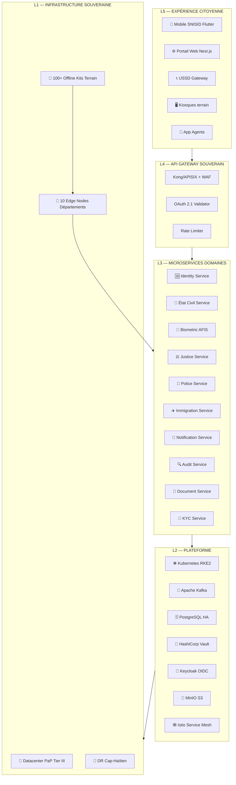
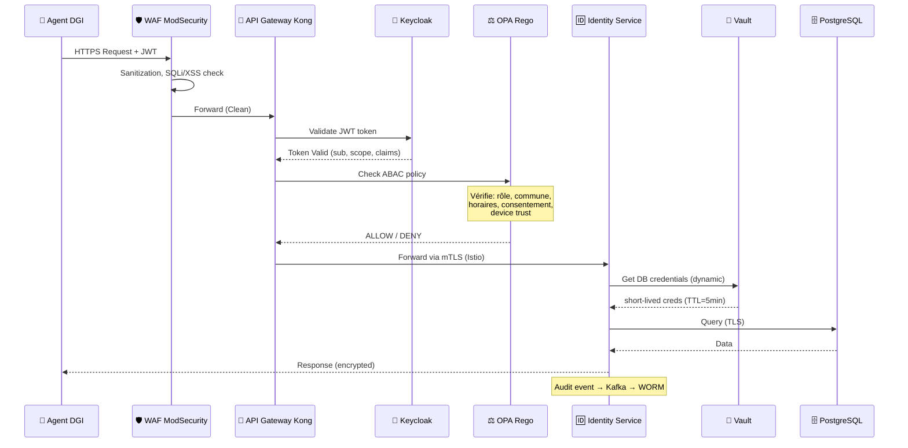
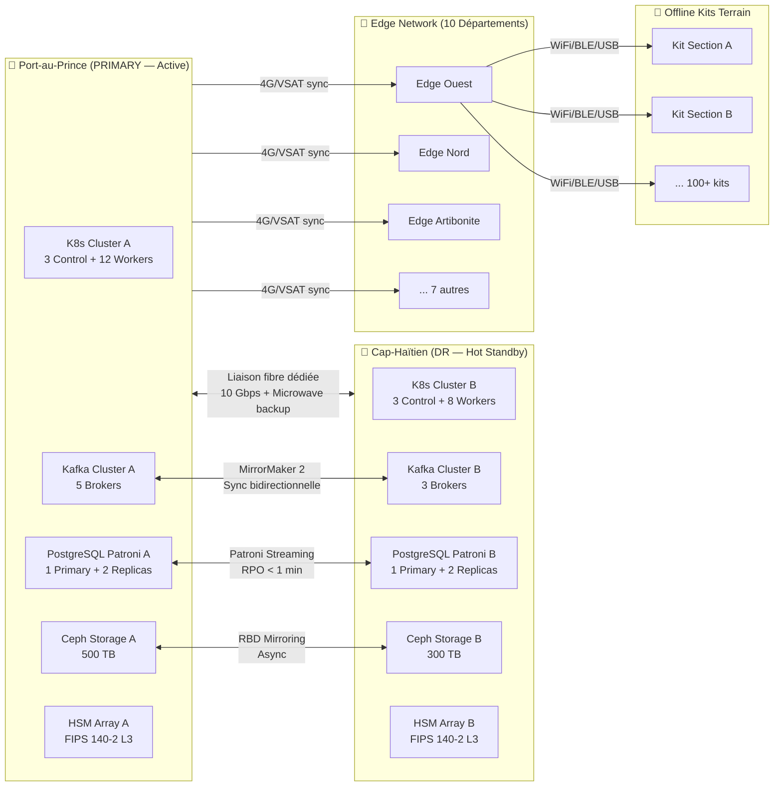
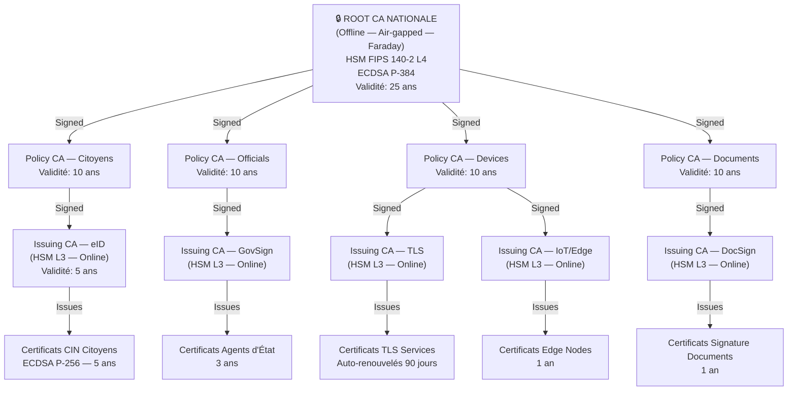
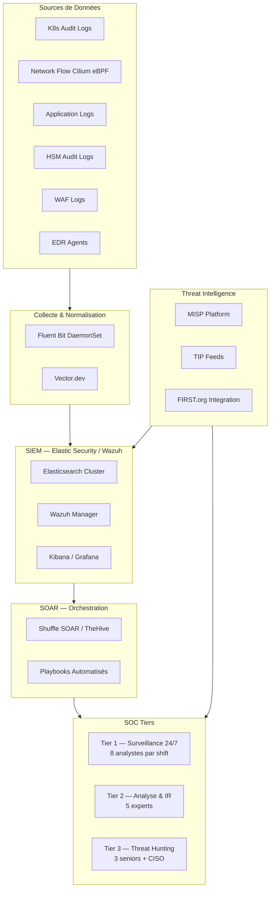
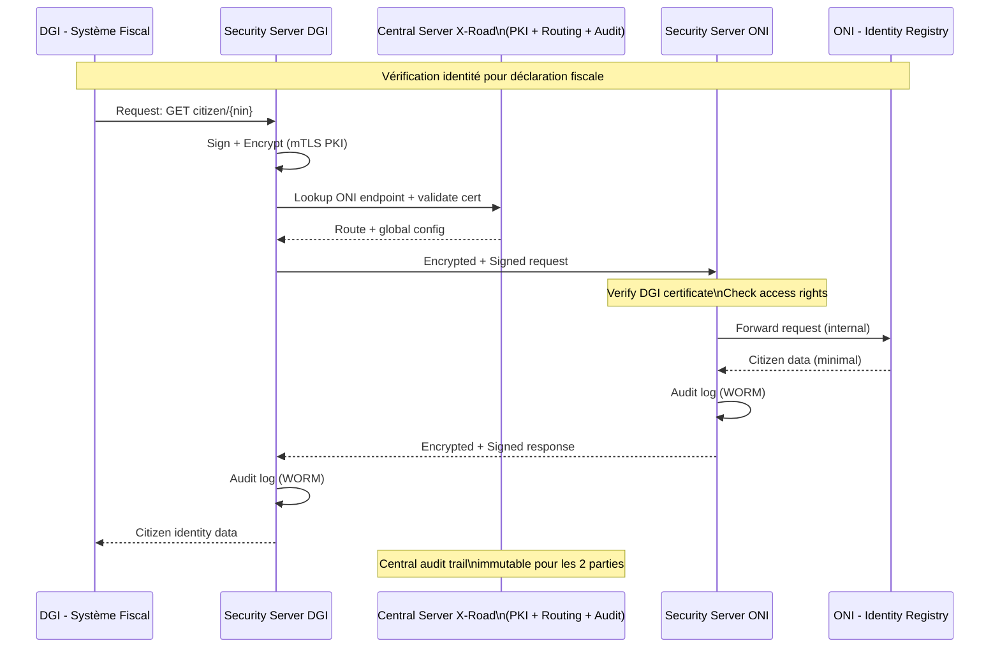
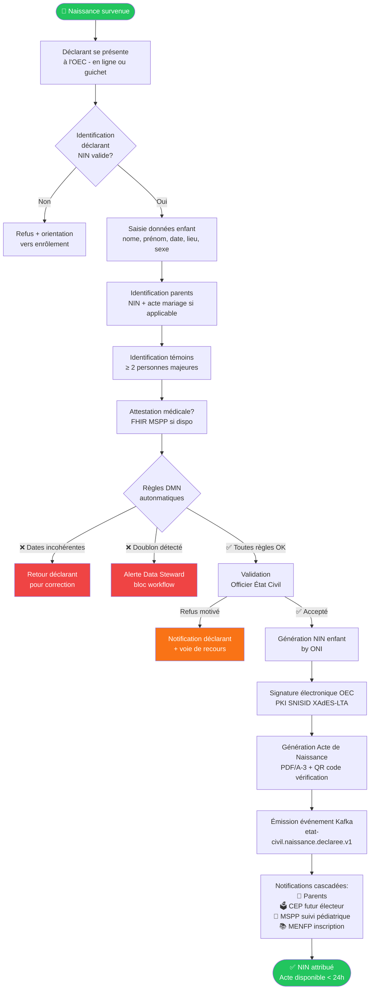
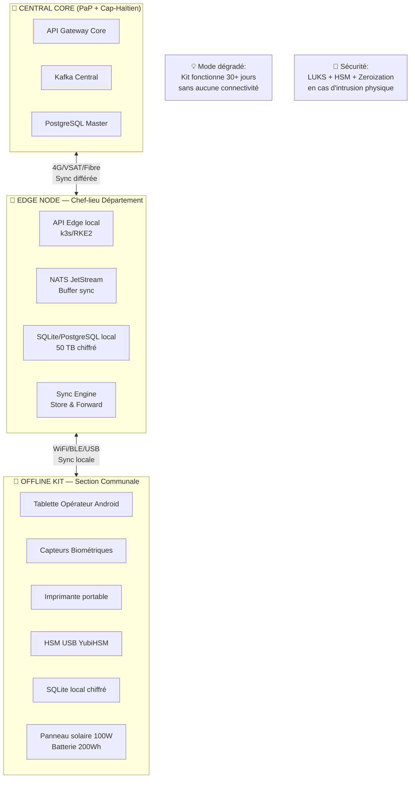
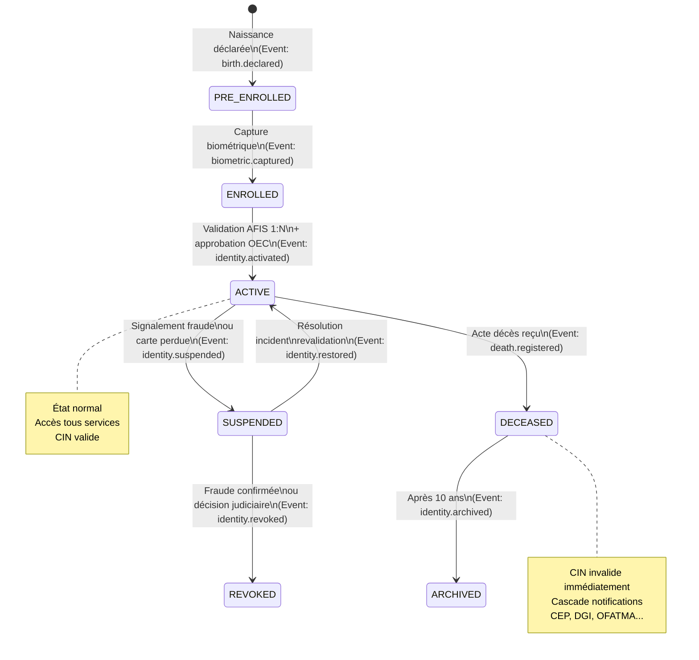
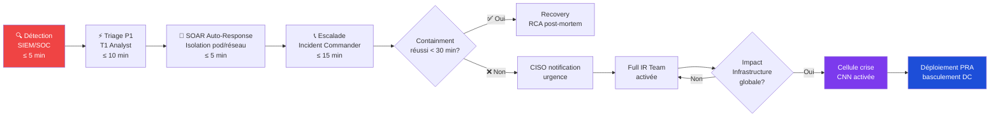

# 🗺️ SNISID — DIAGRAMS INDEX
## Index Central des Diagrammes de l'Architecture Nationale

**Document ID :** SNISID-DIA-001  
**Version :** 1.0.0  
**Date :** Mai 2026  
**Classification :** Usage Gouvernemental  

---

## DIAGRAMMES D'ARCHITECTURE PRINCIPALE

### 1. Vue Macro Système — 5 Couches

---

### 2. Architecture Zero Trust — Flux de Requête

---

### 3. Architecture Multi-Datacenter (HA/DR)

---

### 4. Architecture PKI Nationale

---

### 5. Architecture SOC National

---

### 6. Architecture Interopérabilité X-Road

---

### 7. Workflow Naissance Simple (EC-N01)

---

### 8. Architecture Offline-First

---

### 9. Cycle de Vie Identité Nationale

---

## DIAGRAMMES OPÉRATIONNELS

### 10. Escalade Incident P1

---

*Index des Diagrammes — SNISID Phase 0*  
*SNISID — République d'Haïti — Classification : Usage Gouvernemental*
