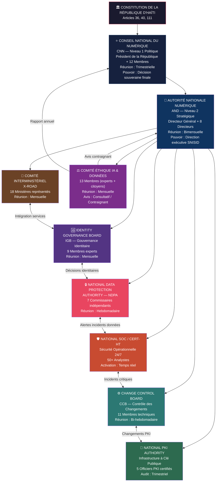
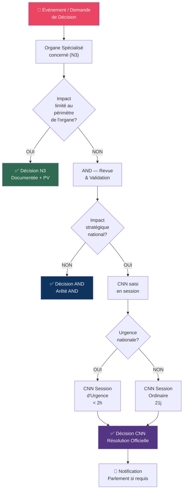
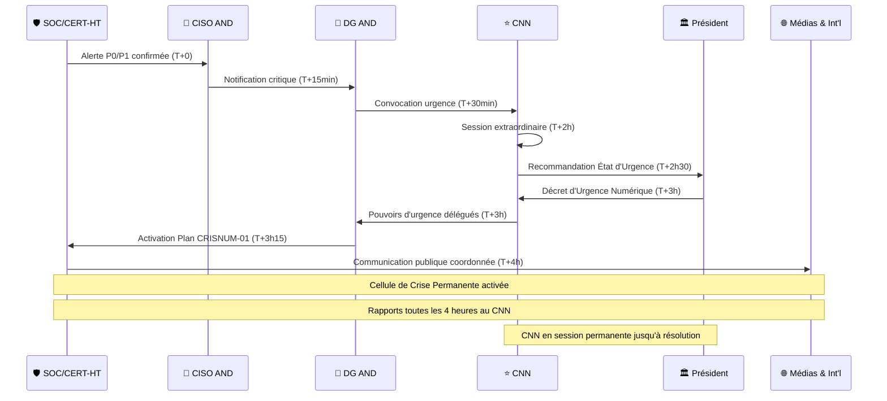

# SNISID — Organigramme National de Gouvernance
## Système National d'Identité et de Services d'Identité Digitale

---

| Métadonnée | Valeur |
|---|---|
| **Document ID** | SNISID-GOV-ORG-001 |
| **Version** | 1.0.0 |
| **Statut** | APPROUVÉ — EN VIGUEUR |
| **Date de création** | 2026-05-25 |
| **Date de révision** | 2026-11-25 |
| **Classification** | GOUVERNANCE / PUBLIC RESTREINT |
| **Propriétaire** | Autorité Nationale Numérique (AND) |
| **Révisé par** | Identity Governance Board (IGB) |
| **Approuvé par** | Conseil National du Numérique (CNN) |
| **Référence légale** | Décret Présidentiel No. 2026-001 / Arrêté Ministériel No. 2026-045 |

---

> **AVERTISSEMENT SOUVERAIN** : Ce document constitue la charte de gouvernance nationale du SNISID. Toute modification doit être approuvée par le CNN en session plénière. Toute diffusion non autorisée est passible de sanctions conformément à la Loi sur la Cybersécurité nationale.

---

## TABLE DES MATIÈRES

1. [Préambule et Principes Fondateurs](#1-préambule-et-principes-fondateurs)
2. [Organigramme National de Gouvernance — Vue Générale](#2-organigramme-national-de-gouvernance--vue-générale)
3. [Niveau 1 : Conseil National du Numérique (CNN)](#3-niveau-1--conseil-national-du-numérique-cnn)
4. [Niveau 2 : Autorité Nationale Numérique (AND)](#4-niveau-2--autorité-nationale-numérique-and)
5. [Niveau 3 : Organes Spécialisés de Gouvernance](#5-niveau-3--organes-spécialisés-de-gouvernance)
   - 5.1 [Identity Governance Board (IGB)](#51-identity-governance-board-igb)
   - 5.2 [National Data Protection Authority (NDPA)](#52-national-data-protection-authority-ndpa)
   - 5.3 [National SOC / CERT-HT](#53-national-soc--cert-ht)
   - 5.4 [Change Control Board (CCB)](#54-change-control-board-ccb)
   - 5.5 [Comité Interministériel X-Road](#55-comité-interministériel-x-road)
   - 5.6 [National PKI Authority](#56-national-pki-authority)
   - 5.7 [Comité Éthique IA & Données](#57-comité-éthique-ia--données)
6. [Chaînes Décisionnelles et Escalade](#6-chaînes-décisionnelles-et-escalade)
7. [Protocoles de Communication Inter-organes](#7-protocoles-de-communication-inter-organes)
8. [Procédures de Crise et d'Activation d'Urgence](#8-procédures-de-crise-et-dactivation-durgence)
9. [Blocs de Signature et d'Approbation](#9-blocs-de-signature-et-dapprobation)

---

## 1. Préambule et Principes Fondateurs

### 1.1 Fondement Constitutionnel

Le présent organigramme de gouvernance est établi en vertu de :
- La **Constitution de la République d'Haïti** — Articles 36 (droit à l'identité), 40 (protection des données personnelles), 111 (sécurité nationale)
- Le **Décret Présidentiel No. 2026-001** portant création du Système National d'Identité et de Services d'Identité Digitale (SNISID)
- L'**Arrêté Ministériel No. 2026-045** définissant l'architecture de gouvernance numérique nationale
- La **Loi-cadre sur l'Administration Numérique** (en cours d'adoption, Q3 2026)

### 1.2 Principes Directeurs de Gouvernance

| Principe | Description | Application |
|---|---|---|
| **Souveraineté Numérique** | Contrôle exclusif de l'État haïtien sur toutes données identitaires | Toutes décisions critiques restent en territoire haïtien |
| **Séparation des Pouvoirs** | Distinction claire entre politique, stratégie et opérations | 3 niveaux hiérarchiques indépendants |
| **Transparence et Redevabilité** | Traçabilité de toutes décisions avec audit trail | Procès-verbaux obligatoires, publication annuelle |
| **Privacy by Design** | Protection des données intégrée à chaque couche | NDPA avec droit de veto sur tout traitement |
| **Résilience Opérationnelle** | Continuité des services malgré toute perturbation | Plans de continuité, activation d'urgence |
| **Inclusivité Citoyenne** | Représentation de tous les citoyens haïtiens | Comité Éthique avec représentants citoyens |
| **Interopérabilité Souveraine** | Échanges sécurisés entre administrations | X-Road sous contrôle national |

### 1.3 Périmètre de Gouvernance

La gouvernance SNISID couvre :
- **L'identité nationale digitale** : enregistrement, émission, révocation, mise à jour
- **Les données biométriques** : capture, stockage, utilisation, destruction
- **L'infrastructure numérique** : PKI, X-Road, DataCenter, SOC, CERT-HT
- **Les services d'interopérabilité** : échanges inter-ministériels, services tiers accrédités
- **La conformité légale et réglementaire** : audit, certification, sanctions

---

## 2. Organigramme National de Gouvernance — Vue Générale

### 2.1 Diagramme Mermaid — Architecture Complète



### 2.2 Vue Hiérarchique Simplifiée

```
╔══════════════════════════════════════════════════════════════════════════╗
║         CONSTITUTION DE LA RÉPUBLIQUE D'HAÏTI (Articles 36, 40, 111)   ║
╚══════════════════════════════════════════════════════════════════════════╝
                                    │
                    ┌───────────────▼───────────────┐
                    │  NIVEAU 1 — POLITIQUE          │
                    │  Conseil National du Numérique  │
                    │  (CNN)                          │
                    │  ⭐ POUVOIR SOUVERAIN SUPRÊME    │
                    └───────────────┬───────────────┘
                                    │ Direction
                    ┌───────────────▼───────────────┐
                    │  NIVEAU 2 — STRATÉGIQUE        │
                    │  Autorité Nationale Numérique   │
                    │  (AND)                          │
                    │  🎯 DIRECTION EXÉCUTIVE         │
                    └───────┬───────────────┬───────┘
                            │               │
          ┌─────────────────┤               ├─────────────────┐
          │                 │               │                 │
    ┌─────▼─────┐    ┌──────▼─────┐  ┌─────▼──────┐  ┌──────▼─────┐
    │   IGB     │    │    NDPA    │  │  SOC/CERT  │  │    CCB     │
    │ Identity  │    │ Protection │  │  Sécurité  │  │ Changement │
    │ Governance│    │  Données   │  │   24/7     │  │  Contrôle  │
    └───────────┘    └────────────┘  └────────────┘  └────────────┘
          │                 │               │                 │
    ┌─────▼─────┐    ┌──────▼─────┐  ┌─────▼──────┐  ┌──────▼─────┐
    │   XROAD   │    │    PKI     │  │  ÉTHIQUE   │  │            │
    │ Comité    │    │ National   │  │  IA &      │  │            │
    │Intermin.  │    │ Authority  │  │  Données   │  │            │
    └───────────┘    └────────────┘  └────────────┘  └────────────┘

    NIVEAU 3 — ORGANES SPÉCIALISÉS (7 Corps)
```

---

## 3. Niveau 1 : Conseil National du Numérique (CNN)

### 3.1 Identité Institutionnelle

| Attribut | Valeur |
|---|---|
| **Dénomination officielle** | Conseil National du Numérique de la République d'Haïti |
| **Acronyme** | CNN |
| **Niveau hiérarchique** | Niveau 1 — Politique Souveraine |
| **Base légale** | Décret Présidentiel No. 2026-001, Article 3 |
| **Siège** | Palais National, Port-au-Prince, Haïti |
| **Langues de travail** | Français / Créole haïtien |

### 3.2 Composition

| Siège | Titulaire | Suppléant | Modalité |
|---|---|---|---|
| **Président** | Président de la République | Premier Ministre | Ex officio |
| **Vice-Président** | Ministre en charge du Numérique | Secrétaire d'État Numérique | Ex officio |
| **Membre** | Ministre de l'Intérieur | Directeur General OJRNH | Ex officio |
| **Membre** | Ministre de la Justice | Directeur Affaires Juridiques | Ex officio |
| **Membre** | Ministre de la Planification | DG MPCE | Ex officio |
| **Membre** | Ministre de la Santé | DG MSPP | Ex officio |
| **Membre** | Ministre des Finances | DG MEF | Ex officio |
| **Membre** | Directeur Général AND | DGA AND | Ex officio |
| **Membre Indépendant** | Expert Cybersécurité National | Suppléant désigné | Nommé 4 ans |
| **Membre Indépendant** | Expert Droit du Numérique | Suppléant désigné | Nommé 4 ans |
| **Membre Indépendant** | Représentant Société Civile | Suppléant désigné | Élu 2 ans |
| **Membre Indépendant** | Représentant Secteur Privé | Suppléant désigné | Désigné 2 ans |
| **Observateur** | Représentant Diaspora Haïtienne | — | Consultatif |

**Total : 12 membres votants + 1 observateur consultatif**

### 3.3 Mandat et Pouvoirs

#### Mandat Fondamental
Le CNN exerce la **souveraineté numérique nationale** sur le SNISID. Il est l'autorité politique suprême garantissant que le système d'identité nationale sert l'intérêt supérieur de la nation haïtienne.

#### Pouvoirs Exclusifs du CNN

| Pouvoir | Description | Procédure |
|---|---|---|
| **Décision Architecturale Majeure** | Approuver toute modification fondamentale de l'architecture SNISID | Vote en plénière, majorité des 2/3 |
| **Ratification des Partenariats Internationaux** | Approuver tout accord avec États étrangers ou OI concernant SNISID | Vote en plénière, majorité simple + avis juridique |
| **Activation État d'Urgence Numérique** | Déclencher le régime d'urgence en cas de crise cyber nationale | Vote en session extraordinaire ou Président seul en cas extrême |
| **Nomination AND** | Nommer / révoquer le Directeur Général de l'AND | Décret Présidentiel après vote CNN |
| **Budget National SNISID** | Approuver le budget pluriannuel SNISID | Vote annuel, intégré Loi de Finances |
| **Rapport au Parlement** | Rendre compte annuellement au Parlement | Rapport public annuel obligatoire |
| **Sanctions Souveraines** | Prononcer les sanctions les plus graves | Après instruction NDPA + avis juridique |
| **Évolution Légale** | Soumettre les projets de loi liés au SNISID au Parlement | Initiative législative |

### 3.4 Fonctionnement

#### Fréquence des Réunions

| Type | Fréquence | Convocation | Délai min. |
|---|---|---|---|
| **Session Ordinaire** | Trimestrielle (Q1, Q2, Q3, Q4) | Président CNN | 21 jours |
| **Session Extraordinaire** | Sur convocation | Président ou 5 membres | 72 heures |
| **Session d'Urgence Nationale** | En cas de crise | Président ou AND | 2 heures |
| **Session Virtuelle** | Autorisée si présentielle impossible | Président | 48 heures |

#### Règles de Quorum

| Décision | Quorum requis | Majorité requise |
|---|---|---|
| **Décision ordinaire** | 7/12 membres | Majorité simple (50%+1) |
| **Décision stratégique** | 8/12 membres | Majorité qualifiée (2/3) |
| **Décision constitutionnelle** | 10/12 membres | Majorité qualifiée (3/4) |
| **Urgence nationale** | 5/12 membres | Majorité simple + validation 72h |
| **Révocation AND DG** | 10/12 membres | Majorité des 3/4 |

#### Documents Obligatoires de Session

1. **Ordre du Jour** — publié 21 jours avant (session ordinaire)
2. **Dossiers de Décision** — transmis 14 jours avant
3. **Procès-Verbal** — rédigé dans les 5 jours ouvrables
4. **Résolutions CNN** — numérotées séquentiellement (CNN-YYYY-NNN)
5. **Registre des Votes** — nominatif, archivé 30 ans
6. **Rapport Trimestriel AND** — soumis 7 jours avant chaque session

---

## 4. Niveau 2 : Autorité Nationale Numérique (AND)

### 4.1 Identité Institutionnelle

| Attribut | Valeur |
|---|---|
| **Dénomination officielle** | Autorité Nationale Numérique de la République d'Haïti |
| **Acronyme** | AND |
| **Niveau hiérarchique** | Niveau 2 — Direction Stratégique |
| **Base légale** | Décret Présidentiel No. 2026-001, Articles 10-25 |
| **Siège** | Centre-Ville, Port-au-Prince / DataCenter National SNISID |
| **Statut juridique** | Établissement public à caractère administratif (EPA) |
| **Tutelle** | Ministère en charge du Numérique |
| **Budget** | Ligne budgétaire dédiée, Loi de Finances nationale |

### 4.2 Composition et Direction

#### Comité de Direction AND

| Poste | Responsabilité | Rapport à |
|---|---|---|
| **Directeur Général (DG)** | Leadership exécutif global SNISID | CNN / Ministre Numérique |
| **Directeur Général Adjoint (DGA)** | Suppléance + Coordination opérationnelle | DG AND |
| **Directeur Architecture & Innovation** | Architecture technique SNISID, roadmap technologique | DG AND |
| **Directeur Sécurité (CISO)** | Cybersécurité, SOC, PKI, CERT-HT | DG AND |
| **Directeur des Données (CDO)** | Gouvernance des données, NDPA liaison | DG AND |
| **Directeur des Opérations (COO)** | Opérations centres d'enregistrement, terrain | DG AND |
| **Directeur Juridique & Conformité** | Conformité légale, relations IGB, NDPA | DG AND |
| **Directeur Partenariats & International** | Relations internationales, OI, États partenaires | DG AND |
| **Directeur Financier (CFO)** | Budget, audit financier, procurement | DG AND |

### 4.3 Mandat et Pouvoirs

#### Mandat Stratégique
L'AND est l'**organe exécutif suprême** du SNISID. Elle traduit les décisions politiques du CNN en programmes opérationnels et supervise l'ensemble des 7 organes spécialisés de Niveau 3.

#### Pouvoirs AND

| Pouvoir | Description |
|---|---|
| **Direction des Organes Spécialisés** | Supervision hiérarchique des 7 corps de Niveau 3 |
| **Décisions Opérationnelles** | Toutes décisions techniques non réservées au CNN |
| **Procurement** | Attribution de marchés publics SNISID selon seuils légaux |
| **Accréditation** | Accréditation des prestataires et partenaires |
| **Incident Response** | Coordination des réponses aux incidents de sécurité |
| **Rapports CNN** | Production du rapport trimestriel au CNN |
| **Réglementation Technique** | Émission de standards techniques SNISID |
| **Partenariats Techniques** | Accords techniques avec États et OI (sous réserve CNN pour stratégiques) |

### 4.4 Fonctionnement

#### Réunions AND

| Type | Fréquence | Participants |
|---|---|---|
| **Comité de Direction** | Bimensuelle (1er et 3e lundi) | DG + 8 Directeurs |
| **Revue Opérationnelle** | Hebdomadaire (mercredi) | DGA + COO + CISO + CDO |
| **Revue Stratégique** | Mensuelle (dernier vendredi) | DG + tous Directeurs + Présidents organes N3 |
| **Session Urgence** | À la demande SOC/CERT-HT | DG + CISO + concernés |

#### Quorum AND

| Réunion | Quorum | Majorité |
|---|---|---|
| Comité de Direction | 5/9 | Majorité simple |
| Décision Budget >10M HTG | 7/9 | Majorité qualifiée |
| Révocation Président Organe N3 | 6/9 | Majorité qualifiée |

---

## 5. Niveau 3 : Organes Spécialisés de Gouvernance

### 5.1 Identity Governance Board (IGB)

#### 5.1.1 Identité

| Attribut | Valeur |
|---|---|
| **Document ID** | SNISID-IGB-CHARTER-001 |
| **Rapport à** | AND / DG AND |
| **Statut** | Organe consultatif avec pouvoirs décisionnels délégués |
| **Compétence** | Gouvernance du cycle de vie de l'identité nationale |

#### 5.1.2 Composition

| Siège | Profil | Durée |
|---|---|---|
| **Président** | Expert senior identité numérique (désigné AND) | 3 ans renouvelable 1x |
| **Membre** | Représentant OJRNH (État Civil) | Ex officio |
| **Membre** | Représentant MEF | Ex officio |
| **Membre** | Représentant MSPP | Ex officio |
| **Membre** | Expert biométrie (accrédité international) | 3 ans |
| **Membre** | Expert PKI / cryptographie | 3 ans |
| **Membre** | Représentant NDPA | Ex officio |
| **Membre** | Juriste droit de l'identité | 3 ans |
| **Membre** | Représentant Diaspora (consultatif) | 2 ans |

**Total : 8 membres votants + 1 consultatif**

#### 5.1.3 Mandat

L'IGB est responsable de :
- **Politique d'identité** : définir les standards de création, validation, mise à jour et révocation des identités
- **Standards biométriques** : définir les spécifications de capture, qualité et stockage biométrique
- **Cycles de vie** : définir les règles de gestion du cycle de vie des identités numériques
- **Accréditation** : accréditer les centres d'enregistrement et opérateurs
- **Audit identitaire** : superviser l'intégrité des registres d'identité
- **Procédures d'exception** : définir les procédures pour cas spéciaux (réfugiés, apatrides, diaspora)

#### 5.1.4 Fonctionnement

| Paramètre | Valeur |
|---|---|
| **Fréquence** | Mensuelle (1er mercredi) + sessions extraordinaires |
| **Quorum** | 5/8 membres votants |
| **Majorité ordinaire** | Majorité simple |
| **Décision standards biométriques** | 6/8 membres |
| **Délégation à AND** | Tout sujet non réservé |
| **Escalade à CNN** | Modifications fondamentales politique identité nationale |

---

### 5.2 National Data Protection Authority (NDPA)

#### 5.2.1 Identité

| Attribut | Valeur |
|---|---|
| **Document ID** | SNISID-NDPA-CHARTER-001 |
| **Rapport à** | CNN (indépendance fonctionnelle) / AND (budget) |
| **Statut** | **Autorité indépendante** — quasi-judiciaire |
| **Compétence** | Protection des données personnelles de tous les citoyens haïtiens |
| **Indépendance** | Garantie constitutionnelle — les Commissaires sont inamovibles |

#### 5.2.2 Composition

| Siège | Profil | Durée | Inamovibilité |
|---|---|---|---|
| **Commissaire Président** | Juriste expert données personnelles | 6 ans non renouvelable | OUI |
| **Commissaire** | Expert cybersécurité | 6 ans non renouvelable | OUI |
| **Commissaire** | Expert santé / données sensibles | 6 ans non renouvelable | OUI |
| **Commissaire** | Représentant société civile | 4 ans renouvelable 1x | OUI |
| **Commissaire** | Expert droit international | 6 ans non renouvelable | OUI |
| **Commissaire** | Technologue (IA / ML) | 4 ans renouvelable 1x | OUI |
| **Commissaire** | Économiste / Consommateurs | 4 ans renouvelable 1x | OUI |

**Total : 7 Commissaires indépendants**

> ⚠️ **DROIT DE VETO** : La NDPA dispose d'un droit de veto suspensif sur tout nouveau traitement de données personnelles dans le SNISID. Le veto est levé uniquement par vote du CNN à la majorité des 3/4.

#### 5.2.3 Pouvoirs

| Pouvoir | Description | Portée |
|---|---|---|
| **Autorisation** | Autoriser / refuser tout nouveau traitement de données | Obligatoire avant déploiement |
| **Veto Suspensif** | Bloquer tout traitement jugé non conforme | 30 jours, prolongeable |
| **Inspection** | Inspecter à tout moment les systèmes SNISID | Sans préavis |
| **Sanction** | Prononcer des sanctions administratives | Jusqu'à 5% du budget SNISID |
| **Investigation** | Instruire toute plainte citoyenne | Délai 90 jours |
| **Coopération Internationale** | Coopérer avec autorités data protection étrangères | Avec accord AND |
| **Avis Législatif** | Rendre des avis obligatoires sur tout projet de loi relatif aux données | 30 jours pour avis |

#### 5.2.4 Fonctionnement

| Paramètre | Valeur |
|---|---|
| **Fréquence** | Hebdomadaire (mardi matin) + permanence H24 |
| **Quorum** | 4/7 Commissaires |
| **Majorité ordinaire** | Majorité simple |
| **Veto** | 4/7 Commissaires |
| **Levée de veto** | CNN 3/4 uniquement |
| **Délai réponse demande** | 30 jours ouvrables (prorogeable 30j) |

---

### 5.3 National SOC / CERT-HT

#### 5.3.1 Identité

| Attribut | Valeur |
|---|---|
| **Document ID** | SNISID-SOC-CHARTER-001 |
| **Rapport à** | AND / CISO |
| **Statut** | Centre opérationnel permanent H24/7/365 |
| **Mission** | Détection, réponse et coordination des incidents cybersécurité nationaux |
| **Localisation** | DataCenter Principal + DataCenter Secondaire (réplication) |

#### 5.3.2 Composition

| Fonction | Nombre | Rotation |
|---|---|---|
| **Directeur SOC / Chef CERT-HT** | 1 | Permanence |
| **Directeur Adjoint SOC** | 1 | Permanence |
| **Analystes Tier 1 (Surveillance)** | 16 (4 équipes de 4) | Rotation 8h H24 |
| **Analystes Tier 2 (Investigation)** | 8 (2 équipes de 4) | Rotation 12h |
| **Experts Tier 3 (Forensics / Reverse)** | 6 | Astreinte |
| **Ingénieurs CERT-HT** | 8 | Rotation 12h |
| **Threat Intelligence Analysts** | 4 | Journée + astreinte |
| **Responsable Coordination Internationale** | 1 | Journée |
| **Officier de Liaison CNN/AND** | 1 | Astreinte |

**Total : 46+ personnel opérationnel**

#### 5.3.3 Niveaux d'Alerte et Activation

| Niveau | Nom | Déclencheur | Actions |
|---|---|---|---|
| **P5 — VERT** | Nominal | Aucun incident significatif | Surveillance standard |
| **P4 — BLEU** | Vigilance | Indicateurs anormaux détectés | Renforcement surveillance |
| **P3 — JAUNE** | Alerte | Incident confirmé, impact limité | Activation Tier 2, notification AND |
| **P2 — ORANGE** | Grave | Incident majeur, impact systémique | Activation Tier 3, cellule de crise AND |
| **P1 — ROUGE** | Critique | Compromission infrastructure critique | Activation CNN, coordination gouvernementale |
| **P0 — NOIR** | Guerre Cyber | Attaque étatique coordonnée | État d'urgence numérique, CNN en session |

#### 5.3.4 Fonctionnement

| Paramètre | Valeur |
|---|---|
| **Disponibilité** | H24 / 7 jours / 365 jours |
| **RTO Incident P1** | < 15 minutes |
| **Notification AND** | P3 et supérieur — dans les 30 minutes |
| **Notification CNN** | P1 et P0 — dans les 2 heures |
| **Rapport quotidien** | Transmis AND à 07h00 chaque jour |
| **Rapport hebdomadaire** | Transmis AND chaque vendredi 17h00 |
| **Exercice annuel** | Simulation nationale cyber (Q4) |

---

### 5.4 Change Control Board (CCB)

#### 5.4.1 Identité

| Attribut | Valeur |
|---|---|
| **Document ID** | SNISID-CCB-CHARTER-001 |
| **Rapport à** | AND / Directeur Architecture & Innovation |
| **Mission** | Contrôle et approbation de tous les changements techniques SNISID |
| **Périmètre** | Tout changement sur les systèmes de production SNISID |

#### 5.4.2 Composition

| Siège | Profil |
|---|---|
| **Président CCB** | Directeur Architecture & Innovation AND |
| **Membre** | CISO AND |
| **Membre** | CDO AND |
| **Membre** | COO AND |
| **Membre** | Président IGB (ou délégué) |
| **Membre** | Représentant NDPA |
| **Membre** | Architecte Principal SNISID |
| **Membre** | Responsable PKI |
| **Membre** | Responsable SOC |
| **Membre** | Responsable Qualité |
| **Membre** | Représentant Fournisseur Principal (observateur sans vote) |

**Total : 10 membres votants + 1 observateur**

#### 5.4.3 Classification des Changements

| Catégorie | Description | Délai Traitement | Approbation |
|---|---|---|---|
| **Standard (S)** | Changements préapprouvés, récurrents | 0 — déjà approuvé | Pré-approuvé |
| **Normale (N)** | Changements planifiés non urgents | 10 jours ouvrables | CCB vote |
| **Urgente (U)** | Correctif de sécurité critique | 48 heures | CCB vote accéléré |
| **Majeure (M)** | Impact architectural significatif | 21 jours + AND | CCB + AND |
| **Stratégique (ST)** | Impact sur politique identitaire | 30+ jours | CCB + AND + CNN |

#### 5.4.4 Fonctionnement

| Paramètre | Valeur |
|---|---|
| **Fréquence** | Bi-hebdomadaire (mardi et jeudi 14h00) |
| **Session urgence** | À la demande SOC ou AND (< 4h) |
| **Quorum** | 6/10 membres votants |
| **Majorité** | Majorité simple sauf changements majeurs (7/10) |
| **Délai implémentation** | Minimum 72h après approbation (sauf urgence P1) |
| **Post-implementation review** | Obligatoire pour tout changement N, U, M, ST |

---

### 5.5 Comité Interministériel X-Road

#### 5.5.1 Identité

| Attribut | Valeur |
|---|---|
| **Document ID** | SNISID-XROAD-CHARTER-001 |
| **Rapport à** | AND / Directeur Architecture & Innovation |
| **Mission** | Gouvernance de la plateforme d'interopérabilité X-Road nationale |
| **Périmètre** | Tous les échanges de données entre systèmes gouvernementaux |

#### 5.5.2 Composition — Représentants Ministériels

| Institution | Représentant | Rôle |
|---|---|---|
| **AND** | Président du Comité | Présidence |
| **OJRNH** | Directeur Informatique | Membre |
| **Ministère Intérieur** | DSI | Membre |
| **Ministère Finances (MEF)** | DSI | Membre |
| **Ministère Santé (MSPP)** | DSI | Membre |
| **Ministère Éducation** | DSI | Membre |
| **Ministère Justice** | DSI | Membre |
| **Ministère Agriculture** | DSI | Membre |
| **Ministère Travaux Publics** | DSI | Membre |
| **Ministère Commerce** | DSI | Membre |
| **MTPTC** | DSI | Membre |
| **Police Nationale d'Haïti (PNH)** | DSI | Membre |
| **BRH (Banque Centrale)** | DSI | Membre |
| **AGS (Assurance)** | Représentant Tech | Membre |
| **Mairie Port-au-Prince** | DSI | Membre |
| **CASEC (Collectivités)** | Représentant | Membre |
| **Ambassades (rotation)** | Observateur | Consultatif |
| **Partenaires Techniques** | Observateurs | Consultatifs |

**Total : 16 membres votants + observateurs**

#### 5.5.3 Pouvoirs

| Pouvoir | Description |
|---|---|
| **Approbation Connexions** | Approuver / refuser toute nouvelle connexion au X-Road SNISID |
| **Standards Échange** | Définir les standards de format et protocoles d'échange |
| **SLA Inter-systèmes** | Définir et monitorer les SLA entre systèmes connectés |
| **Accréditation Tiers** | Accréditer les entités privées accédant aux services |
| **Révocation** | Révoquer l'accès de tout membre non conforme |
| **Feuille de Route** | Définir la roadmap de déploiement X-Road nationale |

#### 5.5.4 Fonctionnement

| Paramètre | Valeur |
|---|---|
| **Fréquence** | Mensuelle (3e mercredi) + plénière semestrielle |
| **Quorum** | 9/16 membres |
| **Approbation connexion** | 8/16 membres |
| **Révocation membre** | 10/16 membres |

---

### 5.6 National PKI Authority

#### 5.6.1 Identité

| Attribut | Valeur |
|---|---|
| **Document ID** | SNISID-PKI-CHARTER-001 |
| **Rapport à** | AND / CISO |
| **Mission** | Gestion de l'Infrastructure à Clé Publique nationale |
| **Normes** | ITU-T X.509, RFC 5280, ETSI EN 319 401, WebTrust |

#### 5.6.2 Composition

| Poste | Profil | Certification requise |
|---|---|---|
| **Directeur PKI** | Expert PKI senior | CISSP + certification PKI |
| **Officier CA Racine** | Gardien CA Root haïtienne | Habilitation spéciale CNN |
| **Officier CA Intermédiaire (x2)** | Gestion CAs de signature | CISSP ou équivalent |
| **Officier Registration Authority** | Gestion des RA nationales | Certification PKI |
| **Auditeur PKI** | Audit indépendant | Expert audit PKI |

**Total : 5 officiers + auditeur externe trimestriel**

#### 5.6.3 Fonctions PKI Nationales

| Fonction | Description | Fréquence |
|---|---|---|
| **Root CA Haïti** | CA racine souveraine — ultra-sécurisée HSM | Opérations rares, cérémonie formelle |
| **CA Citoyens** | Certificats identité citoyenne | Continue |
| **CA Services Gouvernementaux** | Certificats serveurs et services | Continue |
| **CA Signatures Électroniques** | Certificats signature qualifiée | Continue |
| **CRL/OCSP** | Listes de révocation et vérification temps réel | Continue H24 |
| **Cérémonies Root** | Procédure formelle clé racine | Annuelle ou si nécessaire |
| **Audit WebTrust** | Certification international PKI | Annuelle |

#### 5.6.4 Fonctionnement

| Paramètre | Valeur |
|---|---|
| **Disponibilité OCSP** | 99.99% — SLA contractuel |
| **Cérémonie Root CA** | Formelle, enregistrée, 3 témoins minimum dont AND DG |
| **HSM** | FIPS 140-2 Level 3 minimum |
| **Audit trimestriel** | Par auditeur externe accrédité |
| **Rapport AND** | Mensuel |
| **Rapport CNN** | Annuel (inclus rapport AND) |

---

### 5.7 Comité Éthique IA & Données

#### 5.7.1 Identité

| Attribut | Valeur |
|---|---|
| **Document ID** | SNISID-ETHIQUE-CHARTER-001 |
| **Rapport à** | AND (avec ligne directe CNN pour avis contraignants) |
| **Mission** | Garantir l'utilisation éthique de l'IA et des données dans le SNISID |
| **Spécificité** | Seul organe avec représentation citoyenne directe |

#### 5.7.2 Composition

| Siège | Profil | Durée |
|---|---|---|
| **Président** | Philosophe / Éthicien (expert numérique) | 4 ans |
| **Membre** | Expert IA / Machine Learning | 4 ans |
| **Membre** | Juriste droits fondamentaux | 4 ans |
| **Membre** | Représentant Église Catholique | 3 ans |
| **Membre** | Représentant Communautés Protestantes | 3 ans |
| **Membre** | Représentant Communautés Vodou | 3 ans |
| **Membre** | Représentant ONG Droits de l'Homme | 2 ans |
| **Membre** | Représentant Femmes rurales | 2 ans |
| **Membre** | Représentant Jeunesse | 2 ans |
| **Membre** | Représentant Personnes Handicapées | 2 ans |
| **Membre** | Sociologue / Anthropologue | 4 ans |
| **Membre** | Expert Inclusion Numérique | 4 ans |
| **Membre** | Représentant Haïtiens de l'étranger | 2 ans |

**Total : 13 membres**

#### 5.7.3 Pouvoirs

| Pouvoir | Type | Description |
|---|---|---|
| **Avis Consultatif** | Non contraignant | Sur tout projet SNISID à fort impact social |
| **Avis Contraignant** | Contraignant | Sur utilisation IA dans décisions identitaires critiques |
| **Alerte Éthique** | Directe au CNN | Si violation grave des droits fondamentaux détectée |
| **Moratoire** | 90 jours max | Suspendre toute fonctionnalité IA jugée contraire à l'éthique |
| **Consultation Citoyenne** | Initiative propre | Organiser des consultations publiques |
| **Rapport Annuel Public** | Obligatoire | Rapport public sur l'usage éthique du SNISID |

#### 5.7.4 Fonctionnement

| Paramètre | Valeur |
|---|---|
| **Fréquence** | Mensuelle (2e jeudi) + sessions thématiques |
| **Quorum** | 7/13 membres |
| **Avis contraignant** | 9/13 membres |
| **Moratoire IA** | 10/13 membres |
| **Alerte directe CNN** | Président + 3 membres minimum |
| **Rapport annuel** | Publié avant 31 mars de l'année suivante |

---

## 6. Chaînes Décisionnelles et Escalade

### 6.1 Matrice d'Escalade Décisionnelle



### 6.2 Tableau des Seuils de Décision

| Catégorie de Décision | Organe Décideur | Délai Max | Escalade si bloquée |
|---|---|---|---|
| Changement technique standard | CCB | 10 j | AND |
| Incident sécurité P3-P4 | SOC/CISO | 4h | AND |
| Autorisation nouveau traitement données | NDPA | 30 j | CNN (levée veto) |
| Nouvelle connexion X-Road | Comité X-Road | 30 j | AND |
| Accréditation centre enregistrement | IGB | 21 j | AND |
| Avis éthique | Comité Éthique | 30 j | AND / CNN si contraignant |
| Changement architectural majeur | CCB + AND | 21 j | CNN |
| Partenariat international | AND | 60 j | CNN si stratégique |
| Budget >50M HTG | AND + CNN | 90 j | Parlement |
| Révocation DG AND | CNN | 30 j | — |
| Activation État d'Urgence Numérique | CNN / Président | 2h | — |

### 6.3 Règles d'Escalade Bloquée

Si une décision est bloquée (absence de quorum, vote équilibré, conflit d'organes) :

1. **Délai de blocage < 48h** : Reconvocation de l'organe sous 48h
2. **Délai de blocage 48h-7j** : Escalade automatique à l'organe supérieur
3. **Délai de blocage > 7j** : AND saisit le CNN pour arbitrage
4. **Conflit IGB-NDPA** : AND arbitre, puis CNN si nécessaire
5. **Conflit AND-Comité Éthique** : CNN arbitre en session ordinaire ou extraordinaire

---

## 7. Protocoles de Communication Inter-organes

### 7.1 Canaux de Communication Officiels

| Canal | Utilisation | Chiffrement | Archivage |
|---|---|---|---|
| **Messagerie Sécurisée SNISID** | Communications courantes inter-organes | AES-256 + PKI nationale | 10 ans |
| **Portail Gouvernance SNISID** | Soumission documents officiels, votes | TLS 1.3 + authentification forte | 30 ans |
| **Email Gouvernemental Certifié** | Correspondances formelles | S/MIME avec certificat SNISID | 10 ans |
| **Téléphone Sécurisé (VOIP chiffré)** | Urgences et coordination rapide | E2E encryption | Non archivé |
| **Liaison Physique** | Documents classificés, cérémonies PKI | Courrier sécurisé | Selon classification |

### 7.2 Protocole de Notification

#### Notification Obligatoire

| Émetteur | Destinataire | Événement | Délai |
|---|---|---|---|
| SOC/CERT-HT | AND, CISO | Tout incident P3+ | 30 min |
| SOC/CERT-HT | CNN | Tout incident P1/P0 | 2 heures |
| NDPA | AND | Veto ou sanction | Immédiat |
| NDPA | CNN | Veto non levé après 30j | 24h après délai |
| IGB | AND | Décision standard rejetée | 48h |
| CCB | AND | Changement majeur approuvé | Avant implémentation |
| PKI | AND, SOC | Révocation certificat critique | 1 heure |
| Comité Éthique | AND, CNN | Alerte éthique grave | Immédiat |
| Tout organe N3 | AND | Rapport mensuel | 1er du mois suivant |

### 7.3 Formats de Documents Standards

| Document | Format | Numérotation | Signataire |
|---|---|---|---|
| **Résolution CNN** | SNISID-CNN-RES-YYYY-NNN | Séquentiel annuel | Président CNN |
| **Arrêté AND** | SNISID-AND-ARR-YYYY-NNN | Séquentiel annuel | DG AND |
| **Décision IGB** | SNISID-IGB-DEC-YYYY-NNN | Séquentiel annuel | Président IGB |
| **Décision NDPA** | SNISID-NDPA-DEC-YYYY-NNN | Séquentiel annuel | Commissaire Président |
| **Alerte SOC** | SNISID-SOC-ALT-YYYY-MMDD-NNN | Séquentiel journalier | Directeur SOC |
| **RFC (Change)** | SNISID-CCB-RFC-YYYY-NNN | Séquentiel annuel | Demandeur + Président CCB |
| **Avis Éthique** | SNISID-ETH-AVI-YYYY-NNN | Séquentiel annuel | Président Comité Éthique |

---

## 8. Procédures de Crise et d'Activation d'Urgence

### 8.1 Niveaux de Crise SNISID

| Niveau | Nom | Critère | Durée max | Autorité |
|---|---|---|---|---|
| **N1** | Incident Mineur | Impact limité, 1 service, < 500 usagers | 24h | SOC |
| **N2** | Incident Majeur | Impact multi-services, > 500 usagers | 72h | AND / CISO |
| **N3** | Crise Nationale | Infrastructure critique compromise | 7 jours | AND + CNN informé |
| **N4** | Urgence Nationale | Compromission complète ou catastrophe | Sans limite | CNN — État d'urgence |
| **N5** | Guerre Cyber | Attaque étatique confirmée | Sans limite | Président + CNN |

### 8.2 Procédure d'Activation d'Urgence Nationale (Niveau N4/N5)



### 8.3 Plan de Continuité Gouvernance (PCG-SNISID)

#### Scénarios de Continuité

| Scénario | Impact Gouvernance | Activation PCG | Durée max |
|---|---|---|---|
| **Indisponibilité DG AND** | DGA prend le relais | Automatique | Illimitée |
| **Perte DataCenter Principal** | Basculement DC Secondaire | < 4h | Permanente |
| **Séisme / Ouragan Catégorie 5** | Mode dégradé + gouvernance délocalisée | Immédiat | Jusqu'à rétablissement |
| **Pandémie (impossibilité réunion)** | Sessions virtuelles + quorum réduit 50% | Sur décision AND | Durée crise |
| **Cyberattaque sur gouvernance** | Canaux alternatifs, communication hors-bande | Immédiat | Jusqu'à rétablissement |
| **Défaillance PKI** | Procédures dérogatoires manuelles | < 1h | 72h max |

#### Lignes de Succession AND

```
DG AND → DGA AND → Directeur Architecture → CISO → Directeur Juridique
```

#### Lignes de Succession CNN

```
Président → Premier Ministre → Ministre Numérique → Ministre Intérieur
```

### 8.4 Communication de Crise

| Audience | Canal | Responsable | Délai premier message |
|---|---|---|---|
| **CNN** | Téléphone sécurisé + Messagerie SNISID | DG AND | < 2h |
| **Ministères** | Email gouvernemental certifié + SMS sécurisé | COO AND | < 4h |
| **Partenaires internationaux** | Canal diplomatique + email certifié | Directeur Partenariats | < 6h |
| **Médias / Public** | Communiqué officiel via porte-parole AND | AND Comm | < 6h |
| **Citoyens** | SMS national + site web SNISID | AND Comm | < 8h |
| **Haïtiens de la diaspora** | Canaux consulaires + réseaux sociaux officiels | AND Comm | < 12h |

---

## 9. Blocs de Signature et d'Approbation

### 9.1 Approbation du Document

Ce document entre en vigueur à la date de signature de toutes les autorités ci-dessous.

---

**APPROUVÉ PAR LE CONSEIL NATIONAL DU NUMÉRIQUE**

```
Résolution No. : CNN-2026-001
Date de vote   : ___________________________
Résultat vote  : ___ Pour / ___ Contre / ___ Abstention

Signature du Président du CNN :
Nom            : ___________________________
Qualité        : Président de la République d'Haïti
Signature      : ___________________________  Date : __________
Sceau officiel : [SCEAU DE LA RÉPUBLIQUE]
```

---

**VALIDÉ PAR L'AUTORITÉ NATIONALE NUMÉRIQUE**

```
Arrêté AND No. : AND-2026-001
Directeur Général AND :
Nom            : ___________________________
Qualité        : Directeur Général, Autorité Nationale Numérique
Signature      : ___________________________  Date : __________
Cachet AND     : [CACHET AND]
```

---

**CERTIFIÉ CONFORME — DIRECTION JURIDIQUE**

```
Directeur Juridique AND :
Nom            : ___________________________
Qualité        : Directeur Juridique & Conformité, AND
Signature      : ___________________________  Date : __________
```

---

**HISTORIQUE DES RÉVISIONS**

| Version | Date | Auteur | Modifications | Approuvé par |
|---|---|---|---|---|
| 0.1 | 2026-04-01 | Équipe Architecture AND | Première ébauche | DG AND |
| 0.5 | 2026-05-01 | Équipe Gouvernance AND | Consultation organes N3 | DGA AND |
| 1.0 | 2026-05-25 | AND / IGB | Version finale soumise CNN | CNN — Résolution 001 |

---

*Document SNISID-GOV-ORG-001 v1.0.0 — Propriété de l'Autorité Nationale Numérique de la République d'Haïti — Reproduction interdite sans autorisation*

*© 2026 République d'Haïti — SNISID Phase 0 — Gouvernance Nationale*
