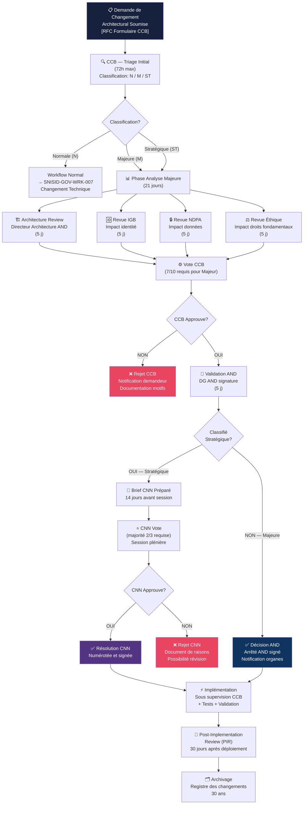
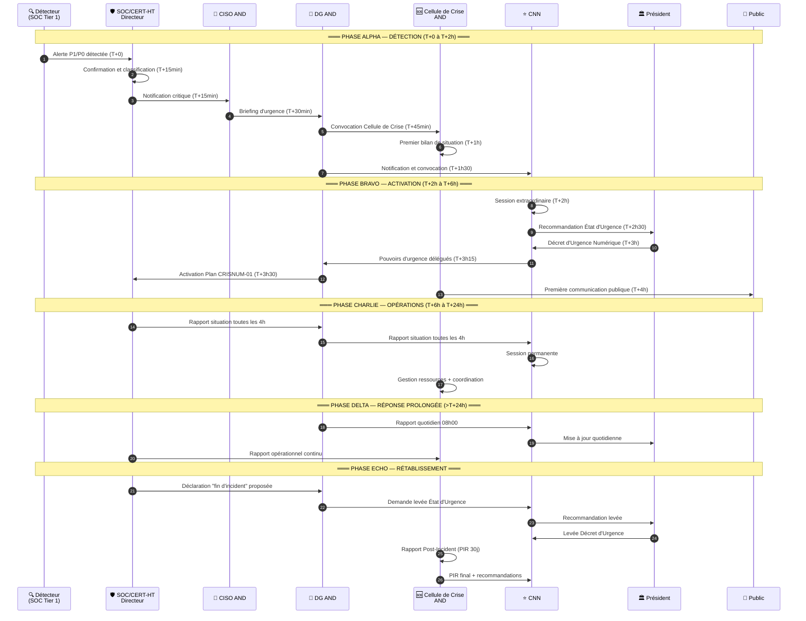
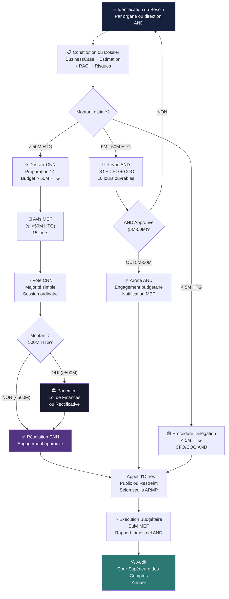
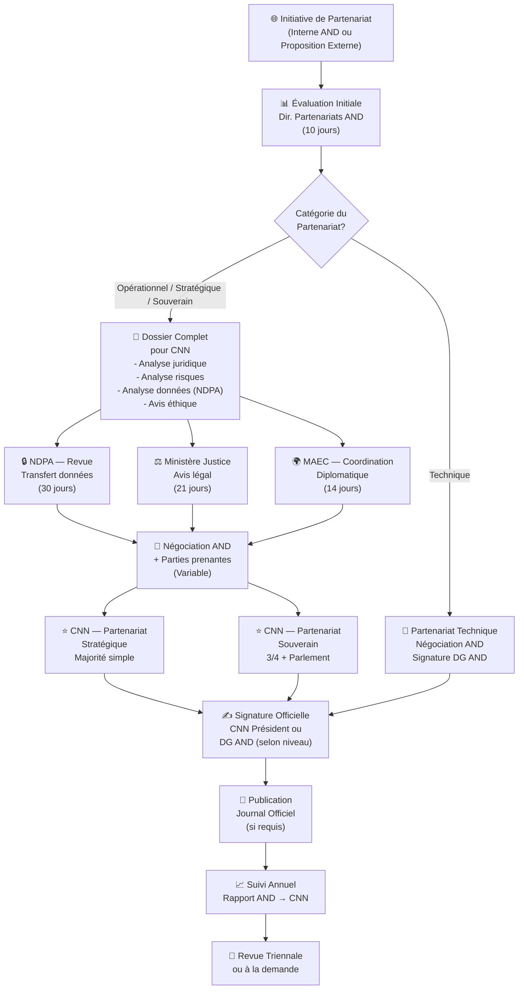
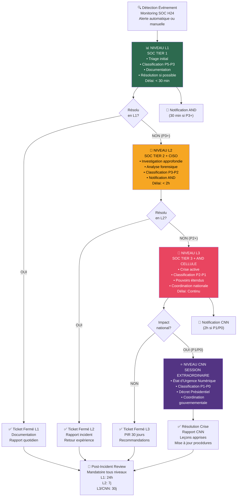
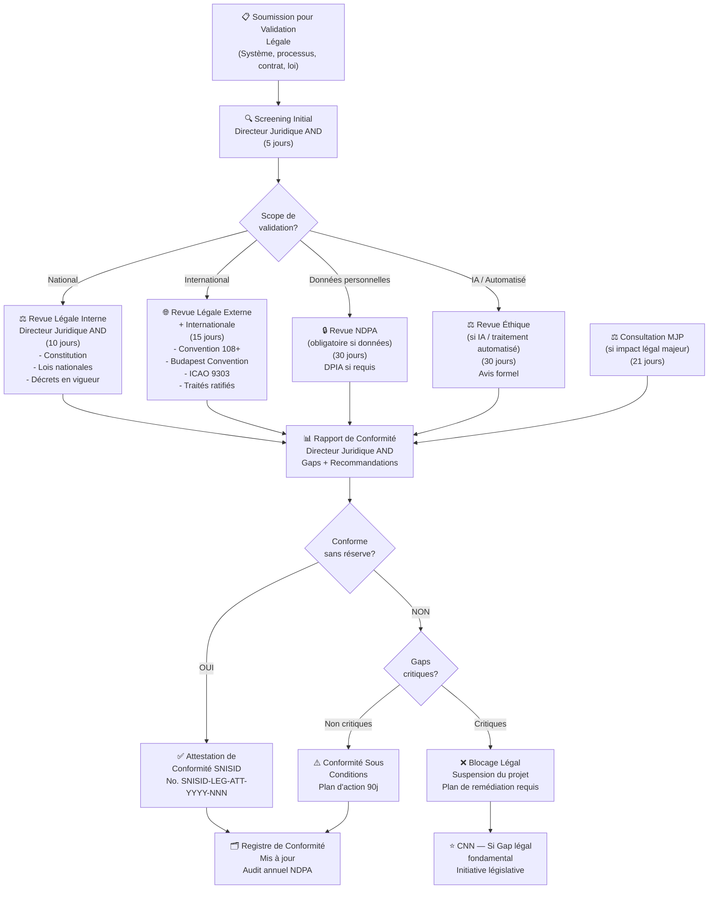
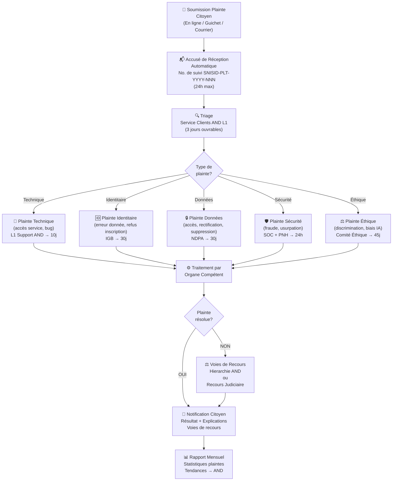

# SNISID — Documentation des Workflows de Gouvernance
## Système National d'Identité et de Services d'Identité Digitale

---

| Métadonnée | Valeur |
|---|---|
| **Document ID** | SNISID-GOV-WRK-001 |
| **Version** | 1.0.0 |
| **Statut** | APPROUVÉ — EN VIGUEUR |
| **Date de création** | 2026-05-25 |
| **Date de révision** | 2026-11-25 |
| **Classification** | GOUVERNANCE / USAGE INTERNE |
| **Propriétaire** | AND — Directeur Architecture & Innovation |
| **Révisé par** | CCB + IGB |
| **Approuvé par** | DG AND / CNN |
| **Références** | SNISID-GOV-ORG-001, SNISID-GOV-RACI-001, ISO 27001, ITIL v4 |

---

> **RAPPEL** : Ces workflows sont des procédures officielles de gouvernance. Leur non-respect constitue une faute de gestion documentée. En situation de crise, les workflows d'urgence prévalent sur les workflows standards.

---

## TABLE DES MATIÈRES

1. [Workflow 1 — Décision d'Architecture et Changements Majeurs](#workflow-1--décision-darchitecture-et-changements-majeurs)
2. [Workflow 2 — Protocole d'Urgence Gouvernance (Crise Cyber / Catastrophe)](#workflow-2--protocole-durgence-gouvernance-crise-cyber--catastrophe)
3. [Workflow 3 — Approbation Budgétaire](#workflow-3--approbation-budgétaire)
4. [Workflow 4 — Partenariat International](#workflow-4--partenariat-international)
5. [Workflow 5 — Chaîne d'Escalade d'Incidents (L1 → L2 → L3 → CNN)](#workflow-5--chaîne-descalade-dincidents-l1--l2--l3--cnn)
6. [Workflow 6 — Validation de Conformité Légale](#workflow-6--validation-de-conformité-légale)
7. [Workflow 7 — Changement Technique (RFC Process)](#workflow-7--changement-technique-rfc-process)
8. [Workflow 8 — Traitement de Plainte Citoyenne](#workflow-8--traitement-de-plainte-citoyenne)
9. [Workflow 9 — Accréditation de Fournisseur](#workflow-9--accréditation-de-fournisseur)
10. [Workflow 10 — Révocation d'Identité pour Fraude](#workflow-10--révocation-didentité-pour-fraude)
11. [Indicateurs de Performance des Workflows (KPIs)](#indicateurs-de-performance-des-workflows-kpis)

---

## WORKFLOW 1 — Décision d'Architecture et Changements Majeurs

### 1.1 Périmètre

Ce workflow s'applique à toute modification impactant :
- L'architecture technique fondamentale du SNISID
- Les protocoles de communication inter-systèmes
- L'infrastructure PKI, X-Road, DataCenter
- Les algorithmes biométriques ou cryptographiques
- Les API publiques et protocoles d'interopérabilité
- Les schémas de données du registre national d'identité

**Seuil d'activation** : Tout changement classifié **Majeur (M)** ou **Stratégique (ST)** par le CCB.

### 1.2 Acteurs

| Acteur | Rôle |
|---|---|
| **Demandeur** | Tout organe, agence, ou fournisseur autorisé |
| **CCB** | Évaluation technique et première décision |
| **AND** | Validation stratégique |
| **IGB** | Impact sur l'identité |
| **NDPA** | Impact sur les données personnelles |
| **ETH** | Impact éthique IA |
| **CNN** | Décision finale pour changements stratégiques |

### 1.3 Diagramme Mermaid — Workflow Architecture



### 1.4 Vue ASCII — Flux Simplifié

```
[DEMANDEUR] → Formulaire RFC
      ↓
[CCB] → Triage (72h) → Classification N / M / ST
      ↓
    [M/ST] ━━━━━━━━━━━━━━━━━━━━━━━━━━━━━━━━━━━━━━━┓
      ↓                                             ║
[Revues parallèles — 5j max chacune]                ║
  ├─ Arch Review (AND)                               ║
  ├─ IGB Review                                      ║
  ├─ NDPA Review                                     ║
  └─ ETH Review                                      ║
      ↓                                             ║
[CCB Vote] ← 7/10 membres → REJETÉ ←━━━━━━━━━━━━━━━┛
      ↓ (Approuvé)
[AND Validation] → DG AND signe
      ↓
    [ST?]
  OUI ↓        NON ↓
[CNN Plénière]  [Arrêté AND]
  2/3 vote         ↓
      ↓         [Implémentation CCB]
[Résolution CNN]    ↓
      ↓         [PIR 30j]
[Implémentation]    ↓
      ↓         [Archivage 30 ans]
[PIR 30j]
      ↓
[Archivage 30 ans]
```

### 1.5 Délais et SLA

| Étape | SLA Standard | SLA Urgent |
|---|---|---|
| Soumission → Triage CCB | 3 jours ouvrables | 24h |
| Revues parallèles | 5 jours ouvrables | 48h |
| Vote CCB | 2 jours après revues | 4h |
| Validation AND | 5 jours après CCB | 24h |
| Brief CNN | 14 jours avant session | — |
| Vote CNN | Session suivante (max 90j) | Session extraordinaire (72h) |
| Délai total (Majeure) | ~21 jours | ~5 jours |
| Délai total (Stratégique) | ~60 jours | ~15 jours |

---

## WORKFLOW 2 — Protocole d'Urgence Gouvernance (Crise Cyber / Catastrophe)

### 2.1 Périmètre et Déclencheurs

Ce protocole s'active en cas de :
- **Cyberattaque** classifiée P1 ou P0 par le SOC/CERT-HT
- **Catastrophe naturelle** (séisme >7.0, ouragan catégorie 4+) affectant l'infrastructure SNISID
- **Compromission** du registre national d'identité
- **Défaillance généralisée** des services SNISID (>50% indisponible)
- **Décision Présidentielle** d'activation de l'état d'urgence numérique

### 2.2 Phases du Protocole d'Urgence

```
PHASE ALPHA (T+0 à T+2h) — DÉTECTION ET ALERTE
PHASE BRAVO (T+2h à T+6h) — ACTIVATION ET MOBILISATION
PHASE CHARLIE (T+6h à T+24h) — OPÉRATIONS D'URGENCE
PHASE DELTA (T+24h à Résolution) — RÉPONSE PROLONGÉE
PHASE ECHO (Post-incident) — RÉTABLISSEMENT ET LEÇONS
```

### 2.3 Diagramme Mermaid — Protocole d'Urgence



### 2.4 Vue ASCII — Chronologie d'Urgence

```
T+0      ┌─────────────────────────────────────────────┐
         │ DÉTECTION : Alerte P1/P0 SOC Tier 1         │
T+15min  │ CONFIRMATION : SOC Directeur classifie       │
T+15min  │ NOTIFICATION : CISO AND alerté              │
T+30min  │ BRIEFING : DG AND informé                   │
T+45min  │ CELLULE : Convocation Cellule de Crise       │
T+1h     │ BILAN : Premier état de situation            │
T+1h30   │ CNN : Notification + convocation urgente     │
         └─────────────────────────────────────────────┘
T+2h     ┌─────────────────────────────────────────────┐
         │ SESSION CNN EXTRAORDINAIRE                    │
T+2h30   │ RECOMMANDATION : État d'Urgence Numérique   │
T+3h     │ DÉCRET PRÉSIDENTIEL : État d'Urgence         │
T+3h15   │ DÉLÉGATION : Pouvoirs d'urgence → DG AND    │
T+3h30   │ ACTIVATION : Plan CRISNUM-01                 │
T+4h     │ COMMUNICATION : Premier message public       │
         └─────────────────────────────────────────────┘
T+6h+    ┌─────────────────────────────────────────────┐
         │ OPÉRATIONS CONTINUES                          │
         │ Rapports SOC → DG → CNN : toutes les 4h     │
         │ CNN en session permanente                     │
         │ Communications publiques régulières          │
         └─────────────────────────────────────────────┘
```

### 2.5 Équipe de Crise et Contacts d'Urgence

| Rôle | Responsable | Backup | Canal Urgence |
|---|---|---|---|
| **Coordinateur Crise** | DG AND | DGA AND | Téléphone sécurisé H24 |
| **Responsable Technique** | CISO | Directeur Architecture | SOC Hotline |
| **Porte-Parole** | DGA AND (désigné) | Directeur Juridique | — |
| **Liaison CNN** | Directeur Juridique | DGA AND | Messagerie sécurisée |
| **Coordination Internationale** | Dir. Partenariats | — | Canal diplomatique |
| **Opérations Terrain** | COO AND | — | Radio sécurisée |

### 2.6 Plans de Continuité Activés

| Plan | Déclencheur | Durée max |
|---|---|---|
| **CRISNUM-01** (Cyber Critique) | P1/P0 SOC | Jusqu'à résolution |
| **CRISNUM-02** (Catastrophe Naturelle) | Séisme / Ouragan | Jusqu'à rétablissement |
| **CRISNUM-03** (Pandémie) | Impossibilité opérationnelle | Durée crise |
| **CRISNUM-04** (Défaillance Infra) | >50% services down | 72h max pour rétablissement |

---

## WORKFLOW 3 — Approbation Budgétaire

### 3.1 Périmètre

Applicable à tous les engagements budgétaires du SNISID selon les seuils suivants :

| Seuil | Approbateur |
|---|---|
| < 500,000 HTG | COO AND (délégation) |
| 500K – 5M HTG | CFO AND |
| 5M – 50M HTG | DG AND |
| 50M – 500M HTG | DG AND + CNN Information |
| > 500M HTG | CNN Vote + Parlement |
| Budget pluriannuel (tout montant) | CNN Vote + Parlement |

### 3.2 Diagramme Mermaid — Chaîne Budgétaire



### 3.3 Vue ASCII — Seuils Budgétaires

```
MONTANT          APPROBATEUR          DÉLAI      PROCÉDURE
─────────────────────────────────────────────────────────
< 500K HTG   → COO/CFO AND          3 j       Délégation interne
500K-5M HTG  → CFO AND              5 j       Arrêté CFO
5M-50M HTG   → DG AND               10 j      Arrêté DG AND
50M-500M HTG → DG AND + CNN (info)  30 j      Résolution CNN
> 500M HTG   → CNN + Parlement      90+ j     Loi de Finances
Pluriannuel  → CNN + Parlement      Session   Loi de Finances
─────────────────────────────────────────────────────────
```

---

## WORKFLOW 4 — Partenariat International

### 4.1 Périmètre

Applicable à tout accord avec :
- États étrangers (bilatéral)
- Organisations internationales (ONU, PNUD, BID, BM, OEA, CARICOM)
- Agences de coopération technique (GIZ, USAID, AFD, etc.)
- Entités privées internationales (accord stratégique)

### 4.2 Classification des Partenariats

| Catégorie | Description | Approbateur |
|---|---|---|
| **Technique** | Assistance technique, formation, logiciels | AND DG |
| **Opérationnel** | Fourniture de services intégrés dans SNISID | AND + CNN information |
| **Stratégique** | Accord cadre, traité bilatéral, financement majeur | CNN vote |
| **Souverain** | Traité impliquant souveraineté des données nationales | CNN 3/4 + Parlement |

### 4.3 Diagramme Mermaid — Workflow Partenariat



### 4.4 Délais Standard

| Étape | Délai |
|---|---|
| Évaluation initiale AND | 10 jours |
| Revue NDPA | 30 jours |
| Avis MJP | 21 jours |
| Coordination MAEC | 14 jours |
| Négociation (variable) | 30-180 jours |
| Brief CNN | 14 jours avant session |
| Vote CNN (session ordinaire) | ~90 jours max |
| **TOTAL Partenariat Stratégique** | **~6-12 mois** |

---

## WORKFLOW 5 — Chaîne d'Escalade d'Incidents (L1 → L2 → L3 → CNN)

### 5.1 Définition des Niveaux

| Niveau | Nom | Acteur | Périmètre |
|---|---|---|---|
| **L1** | Support Standard | SOC Tier 1 / OJRNH | Incidents mineurs, requêtes courantes |
| **L2** | Investigation | SOC Tier 2 / CISO | Incidents confirmés, impact limité |
| **L3** | Réponse Avancée | SOC Tier 3 / AND | Incidents majeurs, impact systémique |
| **CNN** | Crise Nationale | CNN / Président | Crise nationale, état d'urgence |

### 5.2 Diagramme Mermaid — Chaîne d'Escalade



### 5.3 Vue ASCII — Chaîne d'Escalade

```
ÉVÉNEMENT DÉTECTÉ
      │
      ▼
┌─────────────────────────────────┐
│         L1 — SOC Tier 1         │ P5-P4 : Nominal / Vigilance
│ Délai résolution : < 30 min     │ ← 80% des incidents résolus ici
│ Rapport : Quotidien 07h00       │
└──────────────┬──────────────────┘
               │ Non résolu ou P3+
               ▼ Notification AND 30min
┌─────────────────────────────────┐
│     L2 — SOC Tier 2 + CISO     │ P3 : Alerte
│ Délai investigation : < 2h      │ ← 15% des incidents résolus ici
│ Rapport : Immédiat au DG AND   │
└──────────────┬──────────────────┘
               │ Non résolu ou P2+
               ▼
┌─────────────────────────────────┐
│    L3 — SOC Tier 3 + AND       │ P2-P1 : Grave / Critique
│ Cellule de crise activée        │ ← 4% des incidents
│ Coordination nationale          │ Notification CNN si P1
└──────────────┬──────────────────┘
               │ P1/P0 — Impact national
               ▼ Notification CNN 2h
┌─────────────────────────────────┐
│      CNN — SESSION URGENCE      │ P1-P0 : Critique / Guerre Cyber
│ État d'Urgence Numérique        │ ← 1% des incidents
│ Décret Présidentiel             │
└─────────────────────────────────┘
```

### 5.4 SLA par Niveau

| Niveau | Délai Première Réponse | Délai Résolution | Notification |
|---|---|---|---|
| **L1** | 5 minutes | 30 minutes | Rapport quotidien |
| **L2** | 15 minutes | 2 heures | AND dans les 30 min |
| **L3** | 30 minutes | Indéfini (continu) | AND immédiat + CNN si P1 (2h) |
| **CNN** | 2 heures | Indéfini | Parlement si >72h |

---

## WORKFLOW 6 — Validation de Conformité Légale

### 6.1 Périmètre

Applicable à :
- Tout nouveau système ou processus SNISID
- Toute modification législative ou réglementaire
- Tout accord ou contrat impliquant des données personnelles
- Toute nouvelle fonctionnalité IA ou traitement automatisé

### 6.2 Diagramme Mermaid — Conformité Légale



### 6.3 Checklist de Conformité SNISID

| Exigence | Texte de Référence | Statut |
|---|---|---|
| Protection données personnelles | Convention 108+ / Loi SNISID | À valider |
| Droits du citoyen (accès, rectification) | Art. 36 Constitution / Loi Protection Données | À valider |
| Sécurité des systèmes | ISO 27001 / Budapest Convention | À valider |
| Biométrie — consentement | Loi Biométrie (en cours) | En attente loi |
| Signatures électroniques | Loi Signature Électronique (en cours) | En attente loi |
| Interopérabilité | Loi Interopérabilité (en cours) | En attente loi |
| Continuité de service | ISO 22301 / Plan BCP | À valider |
| Documents de voyage | ICAO 9303 | À valider |
| ODD 16.9 — Identité légale pour tous | Agenda 2030 ONU | En cours |

---

## WORKFLOW 7 — Changement Technique (RFC Process)

### 7.1 Vue ASCII — RFC Process Complet

```
INITIATION
  [Demandeur soumet RFC via portail CCB]
  Formulaire: Titre, Description, Impact, Catégorie estimée
  Délai dépôt: > 10j avant implémentation souhaitée (changement Normal)
       │
       ▼
TRIAGE (CCB — 72h)
  [Président CCB + Architecte Principal]
  Classification: Standard (S) / Normal (N) / Urgent (U) / Majeur (M) / Stratégique (ST)
  S → Pré-approuvé, peut être implémenté
  N → Agenda prochaine session CCB
  U → Session CCB d'urgence (48h)
  M → Workflow Architecture (WRK-001)
  ST → Workflow Architecture (WRK-001)
       │ (N ou U)
       ▼
ANALYSE TECHNIQUE (CCB)
  [Tous membres CCB]
  - Analyse impact technique
  - Analyse impact sécurité (SOC)
  - Analyse impact données (NDPA si applicable)
  - Test en environnement staging
  - Plan de rollback documenté
       │
       ▼
VOTE CCB
  Quorum: 6/10 | Majorité simple (N) | 7/10 (M)
  Options: APPROUVÉ / APPROUVÉ SOUS CONDITIONS / REJETÉ / DIFFÉRÉ
       │ (APPROUVÉ)
       ▼
PLANIFICATION
  [Responsable Changement désigné]
  - Fenêtre de maintenance définie
  - Notification parties prenantes (72h avant)
  - Plan de communication
  - Plan de rollback confirmé
       │
       ▼
IMPLÉMENTATION
  [Équipe technique + SOC en surveillance]
  - Exécution selon plan
  - Go/No-Go au début de la fenêtre
  - SOC en mode alerte pendant implémentation
  - Test smoke post-déploiement
       │
       ▼
VALIDATION
  [Responsable Changement + SOC]
  - Tests de validation fonctionnelle
  - Confirmation pas d'impact négatif
  - Métriques de performance
  - Décision: SUCCÈS / ROLLBACK
       │ (SUCCÈS)
       ▼
CLÔTURE
  [Président CCB]
  - Ticket fermé avec statut SUCCÈS
  - Documentation mise à jour (CMDB)
  - Notification parties prenantes
  - PIR planifié (si changement N, U, M, ST)
```

### 7.2 Fenêtres de Maintenance Standard

| Système | Fenêtre Standard | Fenêtre Urgence |
|---|---|---|
| **Production Core Identity** | Dimanche 02h00-06h00 | Selon incident, préavis 2h |
| **X-Road** | Samedi 22h00-02h00 | Selon incident |
| **PKI / OCSP** | Dimanche 01h00-04h00 | Cérémonie formelle requise |
| **DataCenter** | Mensuel — Dimanche 00h00-06h00 | Selon plan BCP |
| **Portails citoyens** | Quotidien 02h00-04h00 | N/A |

---

## WORKFLOW 8 — Traitement de Plainte Citoyenne

### 8.1 Diagramme Mermaid — Plainte Citoyenne



### 8.2 SLA Traitement des Plaintes

| Type | Accusé Réception | Résolution Standard | Escalade si Non Résolu |
|---|---|---|---|
| **Technique** | 24h | 10 jours | AND L3 |
| **Identitaire** | 24h | 30 jours | IGB + AND |
| **Données (DSAR)** | 24h | 30 jours (prorogeable 30j) | NDPA |
| **Sécurité / Fraude** | 2h | 24-72h | SOC + PNH |
| **Éthique** | 24h | 45 jours | Comité Éthique + AND |

---

## WORKFLOW 9 — Accréditation de Fournisseur

### 9.1 Vue ASCII

```
CANDIDATURE FOURNISSEUR
  [Soumission dossier via Portail AND]
  Documents requis:
  - Statuts légaux + K-bis ou équivalent
  - Certifications ISO (27001, 9001, etc.)
  - Références clients gouvernementaux
  - Capacités financières (bilan 3 ans)
  - Plan de continuité
  - Politique sécurité + données
  - Déclarations de conformité légale
       │
       ▼
REVUE ADMINISTRATIVE (AND — 15 jours)
  [Directeur Juridique AND]
  - Vérification complétude dossier
  - Vérification légalité entité
  - Vérification absence de sanctions
       │
       ▼
ÉVALUATION TECHNIQUE (IGB + SOC + CCB — 21 jours)
  - Capacités techniques
  - Sécurité des systèmes
  - Interopérabilité
  - Audit sur site si requis
       │
       ▼
REVUE NDPA (30 jours — si données personnelles)
  - Politique protection données
  - Mesures techniques
  - Localisation des données
  - Sous-traitants
       │
       ▼
DÉCISION (AND DG — 5 jours)
  ACCRÉDITÉ / ACCRÉDITÉ SOUS CONDITIONS / REFUSÉ
       │
       ▼
CONTRACTUALISATION
  [MJP avis si >50M HTG]
  - Contrat cadre AND
  - SLA annexé
  - Clauses de sécurité (obligatoires)
  - Clauses données (DPA annexé)
  - Clause de résiliation
       │
       ▼
SUIVI ANNUEL
  [AND + IGB + SOC]
  - Audit annuel
  - Revue des incidents
  - Renouvellement accréditation (tous les 3 ans)
```

---

## WORKFLOW 10 — Révocation d'Identité pour Fraude

### 10.1 Diagramme Mermaid — Révocation pour Fraude

```mermaid
sequenceDiagram
    autonumber
    participant DET as Détecteur<br/>(SOC/PNH/Citoyen)
    participant SOC as SOC/CERT-HT
    participant IGB as Identity<br/>Governance Board
    participant AND as AND<br/>(DG)
    participant NDPA as NDPA
    participant OJRNH as OJRNH<br/>(État Civil)
    participant CIT as Citoyen<br/>Concerné
    participant MJP as Min. Justice
    
    DET->>SOC: Signalement fraude identitaire
    SOC->>IGB: Alerte — investigation identité
    IGB->>IGB: Investigation préliminaire (72h)
    
    alt Fraude Confirmée
        IGB->>AND: Demande suspension préventive
        AND->>AND: Suspension temporaire (DG AND)
        AND->>CIT: Notification suspension + droit réponse (48h)
        AND->>NDPA: Notification suspension
        
        CIT->>IGB: Réponse citoyen (si conteste)
        IGB->>IGB: Instruction complète (21 jours)
        
        alt Fraude prouvée
            IGB->>AND: Recommandation révocation définitive
            AND->>NDPA: Consultation obligatoire
            NDPA->>AND: Avis NDPA (15 jours)
            AND->>AND: Décision révocation (DG AND signé)
            AND->>OJRNH: Instruction révocation NIN
            OJRNH->>OJRNH: Révocation dans registre
            AND->>MJP: Transmission dossier judiciaire
            AND->>CIT: Notification révocation + voies de recours
        else Fraude infirmée
            AND->>AND: Levée suspension immédiate
            AND->>CIT: Notification + excuses
            IGB->>IGB: Rapport d'incident
        end
    else Fraude Non Confirmée
        SOC->>IGB: Classement sans suite
        IGB->>IGB: Documentation
    end
```

---

## Indicateurs de Performance des Workflows (KPIs)

### Tableau de Bord Gouvernance

| KPI | Cible | Fréquence Mesure | Responsable |
|---|---|---|---|
| **Taux de respect SLA changements N** | ≥ 95% | Mensuel | CCB |
| **Délai moyen décision AND** | ≤ 5 jours | Mensuel | AND DG |
| **Délai moyen traitement plainte citoyen** | ≤ 20 jours | Mensuel | AND COO |
| **Taux d'incidents P1+ sur 12 mois** | ≤ 2 | Annuel | SOC |
| **Taux de conformité légale (attestations)** | 100% | Trimestriel | Dir. Juridique |
| **Délai moyen accréditation fournisseur** | ≤ 60 jours | Trimestriel | AND DG |
| **Taux de sessions CNN avec quorum** | 100% | Trimestriel | CNN Président |
| **Délai notification CNN (incident P1)** | ≤ 2h | Par incident | SOC |
| **Taux approbation budget dans délais** | ≥ 90% | Trimestriel | AND CFO |
| **NPS citoyen (satisfaction service)** | ≥ 70 | Semestriel | AND COO |

---

## Bloc de Signature

```
APPROUVÉ PAR LE DIRECTEUR GÉNÉRAL AND

Nom            : ___________________________
Qualité        : Directeur Général, Autorité Nationale Numérique
Signature      : ___________________________  Date : __________
Cachet AND     : [CACHET AND]

VALIDÉ PAR LE DIRECTEUR ARCHITECTURE & INNOVATION

Nom            : ___________________________
Qualité        : Directeur Architecture & Innovation, AND
Signature      : ___________________________  Date : __________

VALIDÉ PAR LE PRÉSIDENT CCB

Nom            : ___________________________
Qualité        : Président, Change Control Board SNISID
Signature      : ___________________________  Date : __________
```

**HISTORIQUE DES RÉVISIONS**

| Version | Date | Modifications | Approuvé par |
|---|---|---|---|
| 0.1 | 2026-03-01 | Workflows 1, 2, 5 initiaux | AND Architecture |
| 0.5 | 2026-04-15 | Ajout workflows 3, 4, 6, 7 | DGA AND |
| 0.8 | 2026-05-10 | Ajout workflows 8, 9, 10 + KPIs | DG AND |
| 1.0 | 2026-05-25 | Version finale, revue CCB + IGB | DG AND |

---

*Document SNISID-GOV-WRK-001 v1.0.0 — Propriété de l'Autorité Nationale Numérique de la République d'Haïti*

*© 2026 République d'Haïti — SNISID Phase 0 — Gouvernance Nationale*
