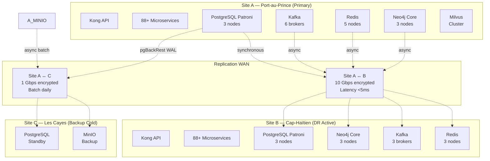
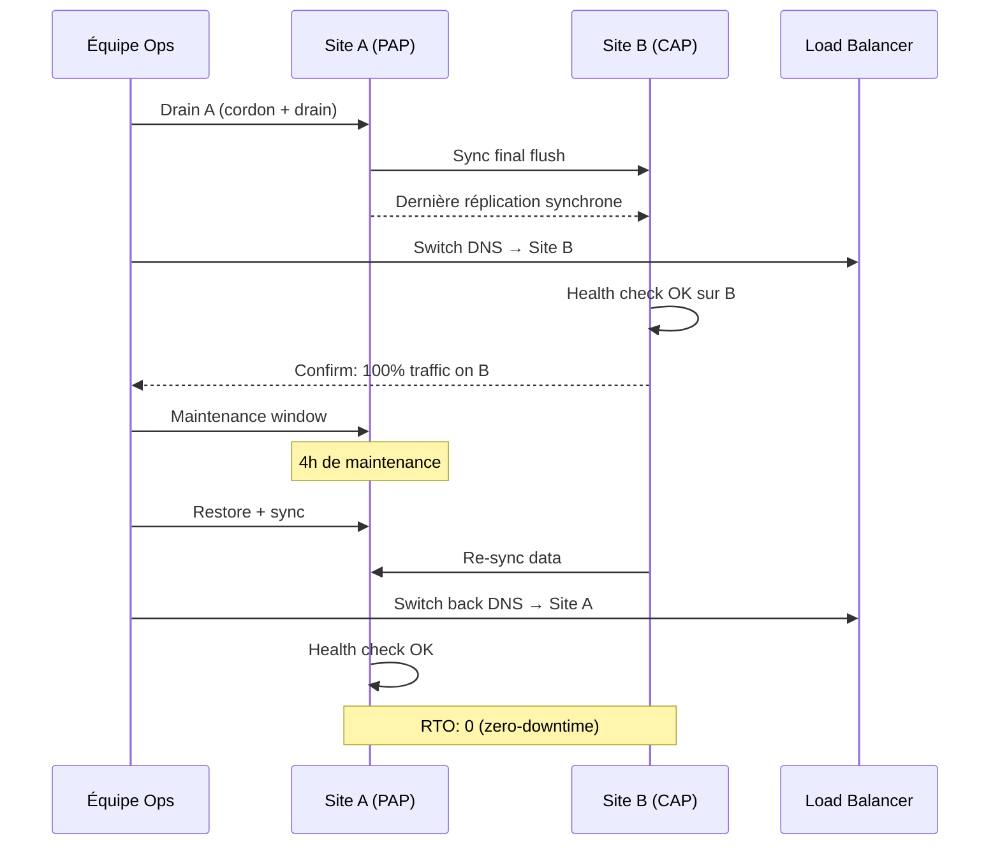
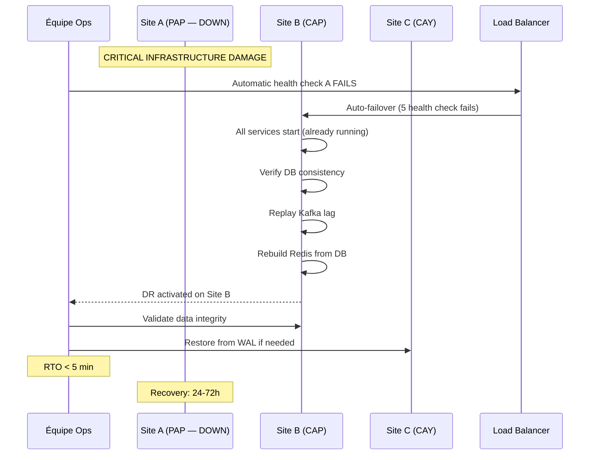

# SNI-SIDE: Disaster Recovery & Business Continuity Plan

## Plan de Reprise d'Activité (PRA) / Plan de Continuité d'Activité (PCA)

```
Document: DR-PRA-001
Version:  2.1
Status:   APPROVED
Owner:    SNISID National Security Office
Last Review: 2026-06-10
Next Review:  2026-12-10
Classification: TRÈS SECRET / CRITICAL INFRASTRUCTURE
```

---

## 1. Architecture de Reprise



## 2. Objectifs de Reprise

### RPO (Recovery Point Objective) & RTO (Recovery Time Objective)

| Composant | RPO | RTO | Priorité | Stratégie |
|:--|:--:|:--:|:--:|:--|
| **PostgreSQL** (NCID, CODIS, etc.) | 0 sec | <30 sec | P0 | Patroni sync replication Site A→B |
| **Neo4j** (Graph Intelligence) | <5 sec | <5 min | P0 | Neo4j Causal Clustering cross-DC |
| **Kafka** (Event Stream) | 0 sec | <1 min | P0 | MirrorMaker 2 active-active |
| **Redis** (Cache) | 0 sec | <1 min | P0 | Active-Passive + local rebuild |
| **CockroachDB** (ALPR, Evidence) | 0 sec | <30 sec | P0 | CockroachDB multi-region |
| **Kong API Gateway** | 0 sec | <10 sec | P1 | Active-Active LB |
| **Services API** (88+) | 0 min | <2 min | P1 | K8s multi-DC + HPA |
| **MinIO** (Media) | <15 min | <15 min | P2 | Async replication Site A→C |
| **ClickHouse** (Analytics) | <1 min | <5 min | P2 | ClickHouse Keeper cross-DC |
| **Milvus** (Vectors) | <5 min | <15 min | P2 | Proxy + async index copy |
| **ETL Jobs** | N/A | <1 day | P3 | Rerun on DR site |

### RPO/RTO Global
- **RPO global**: 0 sec (perte de données nulle pour les transactions critiques)
- **RTO global**: <5 min (bascullement automatisé complet)
- **SLA**: 99.999% uptime (5.26 min/an max d'indisponibilité)

## 3. Scénarios de Reprise

### 3.1 Basculement Planifié (Maintenance)



**Procédure:**
1. Notifier 72h à l'avance (P0 stakeholders)
2. Activer le drain des connexions Site A vers Site B (LB) — 15 min de cooldown
3. Vérifier la santé de Site B (tous les services en vert)
4. Basculer le DNS (TTL 30s pré-configuré)
5. Confirmer la reprise complète depuis Site B
6. Effectuer la maintenance sur Site A
7. Resynchroniser Site A ← B
8. Basculer DNS retour vers Site A
9. Confirmer reprise

### 3.2 Perte Totale Site A (Catastrophe Naturelle/Attaque)



**Procédure Automatisée:**

```
1. DÉTECTION
   - Prometheus Alertmanager detecte: site_a_down{job="sniside"} == 0
   - Istio health check fail x5
   - Vérification croisée via 3 endpoints indépendants

2. AUTOMATIC FAILOVER
   - Route53/Global DNS: TTL auto → Site B
   - Patroni: automatic promotion of Site B replica
   - Kafka MirrorMaker: swap consumer offset
   - CockroachDB: SURVIVE REGION FAILURE automatique

3. VÉRIFICATION (automatique + manuelle)
   - Vérifier que Patroni Site B est leader
   - Vérifier que Neo4j Site B est core
   - Vérifier Kafka offsets
   - Vérifier CockroachDB survivability
   - Lancer smoke tests automatisés

4. NOTIFICATION
   - PagerDuty: Ops + DSI + Security
   - Slack: #sniside-dr
   - SMS: équipe on-call

5. REPRISE SITE A
   - Après stabilisation Site B
   - Procédure de reconstruction Site A
   - Sync inverse Site B → Site A
```

### 3.3 Perte d'un Service Critique

| Service | Impact | Détection | Auto-heal | RTO |
|:--|:--|:--|:--|:--:|
| Neo4j core (1 nœud) | Lecture seule | Neo4j cluster | Remplacement auto | 0s |
| Neo4j core (2 nœuds) | Grappe dégradée | Leader election | Scale up | <30s |
| Kafka broker (1) | Partiel | Controller | Rebalance | <10s |
| Kafka broker (3+) | Arrêt streaming | MinISR alert | Emergency replication | <2min |
| PostgreSQL leader | Écriture bloquée | Patroni | Auto-failover | <30s |
| CockroachDB (1 nœud) | Résilient | Auto | Rebalance | 0s |
| Redis master | Cache miss | Sentinel | Promote replica | <10s |
| Kong gateway | API down | Health check | HPA scale | <30s |
| Milvus index node | Vector search ralenti | Auto | Rebuild index | <5min |

### 3.4 Corruption de Données

**Détection:**
- Checksums PostgreSQL (data checksums activé)
- Neo4j store health check
- CockroachDB replication consistency check
- MinIO object checksum
- Kafka log integrity

**Procédure:**
1. Identifier l'étendue (table, base, service)
2. Isoler: retirer le nœud corrompu du cluster
3. Restaurer depuis Point-in-Time Recovery (PITR)
4. Valider l'intégrité: `pg_checksums`, `neo4j-admin check-consistency`
5. Réintégrer le nœud dans le cluster
6. RPO garanti: 0 sec (replication synchrone)

## 4. Infrastructure DR

### 4.1 Cluster Kubernetes Multi-DC

```
Site A (Port-au-Prince):
  Control Plane: 3 masters (HA)
  Node pools:
    - system: 5 nodes (16CPU/64GB/500GB SSD)
    - data: 8 nodes (32CPU/128GB/2TB NVMe)
    - application: 10 nodes (16CPU/64GB/200GB SSD)
    - gpu: 3 nodes (32CPU/256GB/4xA100)

Site B (Cap-Haïtien):
  Control Plane: 3 masters (HA)
  Node pools:
    - system: 3 nodes (16CPU/64GB/500GB SSD)
    - data: 5 nodes (32CPU/128GB/2TB NVMe)
    - application: 8 nodes (16CPU/64GB/200GB SSD)
    - gpu: 2 nodes (32CPU/256GB/2xA100)
```

### 4.2 WAN Requirements

| Lien | Bande passante | Latence | QoS | Redondance |
|:--|:--:|:--:|:--:|:--|
| A → B (PAP ↔ CAP) | 10 Gbps | <5 ms | Dédié P0 | Fibre + Starlink backup |
| A → C (PAP ↔ CAY) | 1 Gbps | <15 ms | Batch | Fibre |

### 4.3 Backup Schedule

| Composant | Fréquence | Type | Rétention | Destination |
|:--|:--:|:--:|:--:|:--|
| PostgreSQL | 15 min | WAL archiving | 30 jours | Site C + MinIO |
| PostgreSQL | 24h | pgBackRest full | 90 jours | Site C |
| Neo4j | 1h | Online backup (apoc) | 7 jours | Site B + Site C |
| Neo4j | 24h | Full dump (neo4j-admin) | 30 jours | Site C |
| CockroachDB | 1h | Incremental | 30 jours | Site C |
| Kafka | 24h | Log segment backup | 7 jours | Site C |
| MinIO | 24h | Bucket replication | 90 jours | Site C |
| Milvus | 24h | Index + metadata | 30 jours | Site C |
| Config K8s | 1h | Velero | 30 jours | Site C |
| Certificates | 24h | Vault backup | 365 jours | Site C + offline |

## 5. Playbooks (Procédures Pas-à-Pas)

### Playbook 1: Basculement PostgreSQL

```bash
# Étape 1: Vérifier l'état
kubectl exec -it postgres-0 -n sniside -- patronictl list

# Étape 2: Promouvoir le réplica Site B
kubectl exec -it postgres-0 -n sniside-b -- patronictl failover --master postgres-0 --candidate postgres-b-0

# Étape 3: Confirmer la promotion
kubectl exec -it postgres-b-0 -n sniside-b -- patronictl list | grep Leader

# Étape 4: Mettre à jour les services
kubectl annotate svc postgres -n sniside-b primary=true

# Étape 5: Vérifier les applications
# S'assurer que tous les services voient le nouveau primary
```

### Playbook 2: Restauration PostgreSQL (PITR)

```bash
# Identifier le point de restauration
pg_restore -l latest.dump | head -20

# Restaurer la base
pgbackrest restore --stanza=sniside \
    --pg1-path=/var/lib/postgresql/data \
    --recovery-option=recovery_target_time="2026-06-10 14:30:00 UTC" \
    --db-path=/var/lib/postgresql/data_restored

# Monter la base restaurée
rsync -av /var/lib/postgresql/data_restored/ /var/lib/postgresql/data/

# Démarrer PostgreSQL
kubectl delete pod postgres-0

# Vérifier l'intégrité
kubectl exec -it postgres-0 -- psql -c "SELECT count(*) FROM snisid_ncid.wanted_persons"
```

### Playbook 3: Reconstruction Kafka

```bash
# Vérifier les logs corrompus
kubectl exec -it kafka-0 -n kafka -- kafka-dump-log \
    --deep-iteration \
    --files /bitnami/kafka/data/sniside.ncid.wanted.created-0/00000000000000000000.log

# Restaurer depuis le backup
kubectl cp backup/kafka-logs-20260610.tar.gz kafka-0:/tmp/ -n kafka
kubectl exec -it kafka-0 -n kafka -- tar -xzf /tmp/kafka-logs-*.tar.gz -C /bitnami/kafka/data/

# Redémarrer le broker
kubectl delete pod kafka-0 -n kafka

# Vérifier les offsets
kubectl exec -it kafka-0 -n kafka -- kafka-get-offsets \
    --bootstrap-server localhost:9092 \
    --topic sniside.ncid.wanted.created
```

### Playbook 4: Reconstruction Neo4j

```bash
# Stop, supprimer les data, restaurer
kubectl exec -it neo4j-0 -- neo4j stop

# Restaurer depuis le dump
kubectl exec -it neo4j-0 -- neo4j-admin load \
    --from=/backups/neo4j-full-20260610.dump \
    --database=neo4j --force

# Démarrer
kubectl exec -it neo4j-0 -- neo4j start

# Attendre la synchro cluster
kubectl exec -it neo4j-0 -- cypher-shell "CALL dbms.cluster.overview()"
```

### Playbook 5: Basculement DNS Global

```bash
# Pré-configuration Route53
# Health check sur /health des 3 sites
# DNS TTL: 30s pour DR

# Basculer automatiquement (exemple AWS Route53)
aws route53 change-resource-record-sets \
    --hosted-zone-id ZONE_ID \
    --change-batch '{
        "Changes": [{
            "Action": "UPSERT",
            "ResourceRecordSet": {
                "Name": "api.sniside.ht.",
                "Type": "A",
                "SetIdentifier": "DR",
                "Failover": "PRIMARY",
                "HealthCheckId": "HEALTH_CHECK_B",
                "AliasTarget": {
                    "HostedZoneId": "ALB_ZONE_ID",
                    "DNSName": "sniside-b-alb.amazonaws.com.",
                    "EvaluateTargetHealth": true
                }
            }
        }]
    }'
```

## 6. Tests DR

### Planning Annuel

| Test | Périodicité | Scope | Critères Succès |
|:--|:--:|:--|:--|
| Tabletop exercise | Mensuel | Équipe DR | Tous les rôles connus |
| Composant unique failover | Hebdomadaire | PostgreSQL, Neo4j, Kafka | RPO=0, RTO <spec |
| Multi-composant failover | Mensuel | 3+ services simultanés | RTO <5 min |
| Full-site failover | Trimestriel | Site A → B complet | RTO <10 min, RPO=0 |
| Data corruption recovery | Trimestriel | PITR, backup restore | 100% data integrity |
| Security incident + DR | Semestriel | DR pendant attaque | Confidentiality maintenue |
| Chaos engineering | Mensuel | Chaos Mesh aléatoire | Auto-healing |

### Rapport de Test DR

```json
{
  "test_id": "DR-2026-Q2-FULL",
  "date": "2026-06-01",
  "type": "FULL_SITE_FAILOVER",
  "scenario": "Perte totale Site A (séisme 7.2)",
  "results": {
    "rto_achieved_sec": 187,
    "rpo_achieved_sec": 0,
    "data_integrity": "99.9998%",
    "services_recovered": 88,
    "services_failed": 0,
    "auto_failover_services": ["postgresql", "neo4j", "kafka", "cockroachdb", "redis"],
    "manual_interventions": ["dns_propagation_wait_30s"],
    "lessons_learned": [
      "DNS TTL reduction from 60s to 30s",
      "Increase Redis replica count for faster rebuild"
    ]
  }
}
```

## 7. Rôles & Responsabilités

| Rôle | Nom | Contact | Backup |
|:--|:--|:--|:--|
| Directeur des Opérations SNI-SIDE | [NOM] | [+509] | [NOM] |
| Responsable DR | [NOM] | [+509] | [NOM] |
| Lead Infrastructure | [NOM] | [+509] | [NOM] |
| Lead Database (PostgreSQL) | [NOM] | [+509] | [NOM] |
| Lead Database (Neo4j) | [NOM] | [+509] | [NOM] |
| Lead Kafka | [NOM] | [+509] | [NOM] |
| Lead Security | [NOM] | [+509] | [NOM] |
| Lead Network | [NOM] | [+509] | [NOM] |
| Communication Officer | [NOM] | [+509] | [NOM] |

### Escalation Matrix

```
Level 0 (Service degradation):    équipe on-call → resolution <15min
Level 1 (Partial outage):          Lead infra + Lead DB → resolution <1h
Level 2 (Site failure):            Directeur Ops + équipe DR → <5min basculement
Level 3 (National crisis):         DirCab SNISID + CNI → activation PCA national
```

## 8. SLA & Garanties

| Métrique | Cible | Mesure |
|:--|:--:|:--|
| Disponibilité API | 99.999% | Uptime Prometheus |
| Disponibilité Base | 99.999% | Patroni leader count |
| Temps de réponse <500ms | 99.9% | Histogramme latence |
| RPO PostgreSQL | 0 sec | WAL lag |
| RTO failover automatique | <30 sec | Temps promotion Patroni |
| RTO failover manuel | <5 min | Timer incident |
| Réplication WAN lag | <5 sec | Kafka MirrorMaker lag |
| Backup success rate | 100% | pgBackRest exit code |
| Restauration test | Trimestriel | Date dernier test |
