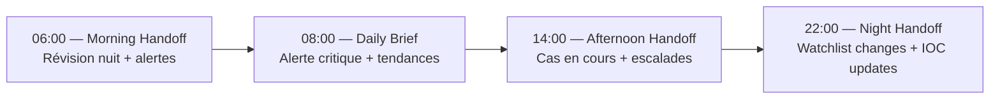

# SNI-SIDE: SOC Operations Manual

## Manuel d'Opérations du Centre de Sécurité National

```
Document: OPS-MANUAL-001
Version:  2.1
Classification: TRÈS SECRET
Audience:    SOC Analysts L1/L2/L3, Supervisors
```

---

## 1. SOC Organization

### 1.1 Shifts & Team Structure

```
┌─────────────────────────────────────────────────────┐
│              SOC Director                            │
├────────────┬────────────┬────────────┬───────────────┤
│ Shift A    │ Shift B    │ Shift C    │ Shift Manager │
│ 06:00-14:00│ 14:00-22:00│ 22:00-06:00│ Rotationnel   │
├────────────┼────────────┼────────────┼───────────────┤
│ 3 L1 Analysts (Triage)                               │
│ 2 L2 Analysts (Investigation)                        │
│ 1 L3 Analyst (Advanced Threats)                      │
└─────────────────────────────────────────────────────┘
```

| Rôle | Compétences | Responsabilités |
|:--|:--|:--|
| **L1 Analyst** | Triaging, alerting basique | Review alertes, assignation, escalade L2, documentation |
| **L2 Analyst** | Investigation, cross-domain | Recherche unifiée, analyse Neo4j, corrélation alertes |
| **L3 Analyst** | Advanced Intel, forensics | GraphRAG, AML deep dive, cyber forensics, fusion cell |
| **Shift Manager** | Supervision, décisions | Coordination, approbations, communication agences |

### 1.2 Shift Handoff Procedure (15 min)



**Handoff Checklist:**
- [ ] Alertes non résolues transférées (ticket IDs)
- [ ] Watchlist mises à jour (nouvelles entrées)
- [ ] Incidents en cours (statut, actions, prochaine étape)
- [ ] Rapports intelligence générés (GraphRAG)
- [ ] IOC mises à jour (cyber)
- [ ] Santé système dashboard
- [ ] Communication agences (emails, appels)

---

## 2. Daily Dashboard Review

### 2.1 Start of Shift — SOC L1

```yaml
checklist_morning:
  - name: "System Health Check"
    steps:
      - "Vérifier Prometheus Alertmanager — aucune alerte non-gérée"
      - "Vérifier Grafana dashboard overview — tous services verts"
      - "Vérifier Kafka consumer lag < 1000 messages"
      - "Vérifier Neo4j cluster — 3/3 core nodes OK"
      - "Vérifier PostgreSQL Patroni — leader sur Site A"
      - "Vérifier MinIO storage — <80% capacity"
      - "Vérifier Redis memory — <80%"
    timeframe: "T+0 to T+15 min"

  - name: "Critical Alerts Review"
    steps:
      - "Ouvrir /alerts?severity=CRITICAL"
      - "Chaque alerte CRITICAL: assigner analyste L2/L3"
      - "Alerte non-assignée depuis >5min → escalade Shift Manager"
    timeframe: "T+15 to T+30 min"

  - name: "Watchlist & Wanted Persons"
    steps:
      - "Vérifier nouvelles entrées watchlist (24h)"
      - "Vérifier new wanted persons (24h)"
      - "Cross-check avec border crossings"
      - "Vérifier Interpol red notices"
    timeframe: "T+30 to T+45 min"

  - name: "ALPR & Border Activity"
    steps:
      - "Vérifier alpr.wanted.detected du shift précédent"
      - "Vérifier border.wanted.match du shift précédent"
      - "Vérifier alpr.anomaly patterns"
    timeframe: "T+45 to T+60 min"
```

### 2.2 Hourly Checks (L1)

```yaml
hourly_checks:
  - "Alertes CRITICAL/HIGH non résolues → escalade si >1h"
  - "Kafka consumer group health (lag)"
  - "ALPR ingestion rate normal (>1000 reads/min attendu)"
  - "API response times (P95 <500ms)"
```

### 2.3 End of Shift

```yaml
end_of_shift:
  - "Résoudre alertes ou transférer avec notes"
  - "Mettre à jour tous les tickets avec statut actuel"
  - "Préparer brief pour prochain shift (5 min verbal)"
  - "Documenter tout incident non-résolu"
  - "Signer handoff log"
```

---

## 3. Alert Triage Playbooks

### 3.1 `ALPR_WANTED_HIT` (CRITICAL)

```yaml
severity: CRITICAL
rto: 2 minutes

triage:
  step_1_verify:
    - "Ouvrir alerte dans /alerts/{id}"
    - "Vérifier plaque + NIU + propriétaire"
    - "Cross-check: est-ce que la personne est toujours recherchée?"

  step_2_notify:
    - "Notifier PNH via canal RTCC (alerte automatique)"
    - "Si risque CRITICAL → appeler superviseur PNH"

  step_3_coordinate:
    - "Ouvrir /search/unified?q={plate}"
    - "Analyser routes via ALPR route analysis"
    - "Vérifier dernière position connue"
    - "Vérifier passager si disponible (face match)"

  step_4_document:
    - "Créer rapport dans Fusion Center"
    - "Logger toutes les actions dans le cas"

  resolution:
    - "INTERVENTION: personne appréhendée → update status CAPTURED"
    - "FALSE POSITIVE: plaque similaire → update comme false_positive"
    - "LOST: perdu trace → update statut ONGOING"
```

### 3.2 `BORDER_WANTED_MATCH` (CRITICAL)

```yaml
severity: CRITICAL
rto: 3 minutes

triage:
  step_1:
    - "Vérifier identité (face match + fingerprint)"
    - "Vérifier validité mandat"
    - "Cross-check Interpol"

  step_2:
    - "Notifier agent poste-frontière immédiatement"
    - "Si risque CRITICAL → détention immédiate"

  step_3:
    - "Rechercher historique border crossing"
    - "Vérifier complices via Neo4j"
    - "Analyser documents (passport fraud check)"
```

### 3.3 `AML_ALERT` (HIGH)

```yaml
severity: HIGH
rto: 15 minutes

triage:
  step_1:
    - "Vérifier montant, devise, banques impliquées"
    - "Cross-check PEP list"
    - "Vérifier beneficial ownership"

  step_2:
    - "Ouvrir GraphRAG → rapport FINANCIAL_FLOW"
    - "Analyser réseau transactionnel sur 3 niveaux"
    - "Identifier patterns (structuring, layering)"

  step_3:
    - "Si réseau détecté → alerte FIU"
    - "Geler compte si nécessaire (autorisation requise)"
```

### 3.4 `DNA_MATCH` (HIGH)

```yaml
severity: HIGH
rto: 10 minutes

triage:
  step_1:
    - "Vérifier type de correspondance (directe/familiale)"
    - "Vérifier laboratoire et analyste"
    - "Confirmer profil source"

  step_2:
    - "Si direct → rapprocher avec cas criminel"
    - "Si familiale → analyser arbre généalogique"
    - "Vérifier si profil déjà lié à une enquête"

  step_3:
    - "Notifier enquêteur responsable"
    - "Mettre à jour case avec correspondance"
```

### 3.5 `CYBER_INCIDENT` (CRITICAL)

```yaml
severity: CRITICAL
rto: 5 minutes

triage:
  step_1_contain:
    - "Identifier IOC (IP, domain, hash)"
    - "Bloquer au niveau firewall/Cilium"
    - "Isoler système compromis"

  step_2_analyze:
    - "Cross-check IOC dans base cyber"
    - "Vérifier campagnes associées"
    - "Analyser logs SIEM corrélés"

  step_3_respond:
    - "Notifier CERT-HT"
    - "Déclencher incident response plan"
    - "Documenter IOCs dans base"
    - "Partager IOCs avec watchlist"
```

---

## 4. Investigation Procedures

### 4.1 Standard Entity Investigation Checklist

```yaml
entity_investigation:
  - phase_1_basics:
      - "Get entity profile: /ai/report?type=ENTITY_PROFILE&id={niu}"
      - "Verify identity: biometrics 1:1"
      - "Risk score: /ai/score/{niu}"
    duration: "5 min"

  - phase_2_cross_database:
      - "NCID: wanted status, warrants, cases, gang affiliations"
      - "Missing: si signalé disparu"
      - "Border: crossings, visa, deportation history"
      - "ALPR: vehicle hits, routes"
      - "Financial: transactions, AML alerts, accounts"
      - "Cyber: IOCs, incidents"
      - "Documents: stolen/fraudulent documents"
    duration: "15 min"

  - phase_3_graph_analysis:
      - "Link analysis: /search/graph/Citizen/{niu}?depth=2"
      - "Network mapping: GraphRAG NETWORK_MAP report"
      - "Financial flow: GraphRAG FINANCIAL_FLOW report"
      - "Identify central nodes, suspicious patterns"
    duration: "20 min"

  - phase_4_intelligence:
      - "Generate Intelligence Report: /ai/report"
      - "Analyze temporal patterns"
      - "Cross-entity connections (if multiple suspects)"
      - "Document recommendations"
    duration: "15 min"

  - phase_5_documentation:
      - "Update case with findings"
      - "Create fusion cell intelligence report"
      - "Share with relevant agencies (classification check)"
      - "Escalate if risk threshold exceeded"
    duration: "10 min"
```

### 4.2 Vehicle Network Investigation

```yaml
vehicle_investigation:
  - "get /vehicles/{plate} — owner, status, theft report"
  - "get /search/graph/Vehicle/{plate} — owner network"
  - "get /alpr/route-analysis?plate={plate} — 30 day routes"
  - "get /alpr/heatmap?plate={plate} — frequent locations"
  - "Cross-check owner NIU with NCID, watchlist"
  - "Generate GraphRAG LINK_ANALYSIS on plate"
```

### 4.3 Financial Network Investigation

```yaml
financial_investigation:
  - "get /financial/suspicious?sender_niu={niu}"
  - "get /financial/suspicious?beneficiary_niu={niu}"
  - "Generate GraphRAG FINANCIAL_FLOW report"
  - "Analyze transaction pattern (structuring, round amounts)"
  - "Check PEP status"
  - "Check beneficial ownership registry"
  - "Generate AML risk update"
```

---

## 5. Escalation Procedures

### 5.1 Escalation Matrix

| Alert Type | L1 → L2 | L2 → L3 | L3 → Management | Management → Cabinet |
|:--|:--:|:--:|:--:|:--:|
| ALPR_WANTED_HIT | Immediate | Si réseau >5 | SI récidive | — |
| BORDER_WANTED | Immediate | Si multiple | — | — |
| DNA_MATCH | Immediate | Si cold case | Si série | Si médiatique |
| AML_ALERT | Immediate | Si >$100k | Si >$1M | Si réseau international |
| CYBER_INCIDENT | Immediate | SI infrastructure critique | SI escalade nationale | SI crise |
| INSIDER_THREAT | Immédiate | Confirmation | Rapport DSI | SI classification |
| RISK_ESCALATION | Immediate | SI CRITICAL | Rapport superviseur | — |
| MISSING_AMBER | Immediate | Alerte nationale | Coordination DCPJ | Médias |

### 5.2 Escalation Communication

```yaml
escalation_l1_to_l2:
  method: "Slack #sniside-alerts + assign ticket"
  rto: "2 min"
  expected: "L2 acknowledge within 1 min"

escalation_l2_to_l3:
  method: "Phone call + Slack @l3-oncall"
  rto: "5 min"
  expected: "L3 join investigation within 5 min"

escalation_l3_to_supervisor:
  method: "Phone call + critical ticket"
  rto: "10 min"
  expected: "Decision within 15 min"

crisis_declaration:
  criteria:
    - "Multiple CRITICAL alerts same entity/network"
    - "National security threat detected"
    - "Data breach confirmed"
    - "Infrastructure compromise confirmed"
  action: "Activate crisis response — notify Cabinet SNISID"
```

---

## 6. System Health Monitoring

### 6.1 Service Health Matrix

```yaml
services:
  ncid_api:
    check: "GET /intelligence/v1/ncid/health → 200"
    critical_threshold: "5 min down"
    degraded: "Latency >1s P95"
  
  biometrics_api:
    check: "POST /intelligence/v1/biometrics/health → 200"
    critical_threshold: "10 min down"
    degraded: "GPU utilization >90%"
  
  alpr_ingest:
    check: "ALPR reads/min >1000"
    critical_threshold: "0 reads/min for 5 min"
    degraded: "Lag >1000 in Kafka"
  
  kafka:
    check: "All topic partitions ISR = replicas"
    critical_threshold: "Any partition offline >1 min"
    degraded: "Under-replicated partitions"
  
  neo4j:
    check: "3/3 core nodes available"
    critical_threshold: "<2 core nodes"
    degraded: "Latency >500ms bolt"
  
  postgresql:
    check: "Patroni has leader"
    critical_threshold: "No leader for 30s"
    degraded: "Replication lag >10s"
```

### 6.2 Daily Health Report

```bash
# Generate daily health report (automatisé via CronJob)
python /opt/sniside/scripts/health_report.py \
    --output /reports/health-$(date +%Y%m%d).json \
    --notify-slack #sniside-health
```

**Report includes:**
- Uptime % (24h) per service
- P50/P95/P99 latency per endpoint
- Error rate per endpoint
- Kafka consumer lag per group
- Database connections count
- Storage utilization (MinIO, DBs)
- GPU utilization
- Event processing rate

---

## 7. Reporting Templates

### 7.1 Daily Intelligence Brief (to DCPJ/PNH Director)

```markdown
# SNI-SIDE Daily Intelligence Brief
Date: {YYYY-MM-DD}
Prepared by: {Analyst Name} (Shift {A/B/C})

## Executive Summary
{3-5 lines summary of critical events}

## Critical Alerts (24h)
| Time | Type | Entity | Status | Action |
|------|------|--------|--------|--------|
| 14:32 | ALPR_WANTED | AB-123-CD | INTERVENTION | Appréhendé @ Delmas |
| 16:45 | BORDER_WANTED | HT12345678 | NOTIFIED | Détention @ Malpasse |

## Watchlist Updates
- {N} new entries added
- {N} entries expired
- {N} matches detected

## Intelligence Reports Generated
- Entity Profile: {NIUs}
- Link Analysis: {entities}
- AML Reports: {transactions}

## System Health
- All services operational: Yes/No
- Incidents: {N}
- Degradations: {N}

## Recommended Actions
- {Action items for next 24h}
```

### 7.2 Fusion Intelligence Report

```markdown
# FUSION CELL INTELLIGENCE REPORT
FUSION-{YYYYMMDD}-{NNN}
Classification: {TRÈS SECRET | SECRET | CONFIDENTIEL}

## Subject
{Entity description}

## Sources
- NCID: {wanted, cases, gangs}
- Biometrics: {matches found}
- ALPR: {routes, locations detected}
- Border: {crossings}
- Financial: {transactions, networks}
- Cyber: {IOCs, incidents}
- Telecom: {calls, devices}

## Graph Analysis (Neo4j)
- Node count: {N}
- Relationship count: {N}
- Key connections: {list}
- Suspicious patterns: {list}

## AI Assessment (GraphRAG)
{Executive summary from GraphRAG}

## Risk Level: {CRITICAL | HIGH | MEDIUM | LOW}
Confidence: {N}%

## Recommendations
1. {Action 1}
2. {Action 2}
3. {Action 3}

## Distribution
- {Agency 1} — {Clearance}
- {Agency 2} — {Clearance}

## Attachments
- Graph visualization (PNG)
- Timeline (PDF)
- Entity dossier (PDF)
```
