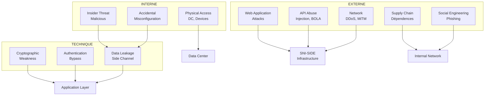

# SNI-SIDE: Security Audit & Compliance Framework

## Audit de Sécurité National — Classification TRÈS SECRET

```
Document: SEC-AUDIT-001
Version:  2.1
Status:   DRAFT
Classification: TRÈS SECRET / CRITICAL INFRASTRUCTURE
Last Review: 2026-06-10
Next Review:  2026-07-10
Auditor:    SNISID National Security Office
```

---

## 1. Threat Model

### 1.1 Adversaires

| Adversaire | Capacité | Motivation | Cibles |
|:--|:--|:--|:--|
| **Cybercriminels** | Moyenne (botnets, ransomware) | Financière | Identités, rançons |
| **Groupes criminalité organisée** | Haute (infiltration, corruption) | Opérationnelle | Données enquêtes, identification |
| **États étrangers** | Très haute (APT, SIGINT) | Espionnage | Base données souveraine |
| **Terroristes** | Moyenne | Attentats | Infrastructure critique |
| **Insiders** | Variable | Variable | Toutes les données |
| **Média/journalistes** | Basse | Information | Scandales, fuites |

### 1.2 Vecteurs d'Attaque



### 1.3 Risk Assessment Matrix

| ID | Risque | Probabilité | Impact | Score | Mitigation |
|:--|:--|:--:|:--:|:--:|:--|
| R1 | BOLA (IDOR) sur API recherche | Haute | Critique | 16 | Istio AuthZ + RLS + JWT validation |
| R2 | Injection SQL via endpoint legacy | Moyenne | Critique | 12 | SQLAlchemy ORM, WAF, input sanitization |
| R3 | Fuite données via Neo4j | Basse | Critique | 8 | Cryptage at-rest, audit logs, RLS bolt |
| R4 | Élévation privilège RBAC | Moyenne | Haute | 12 | OPA rego policies, ABAC, révocation 15min |
| R5 | Phishing → credential theft ← API | Haute | Haute | 16 | MFA obligatoire, FIDO2, session courtes |
| R6 | Compromission Kafka broker | Basse | Haute | 6 | mTLS, ACLs, audit trail |
| R7 | Insider avec accès légitime | Haute | Critique | 16 | UEBA, behavior analytics, 4-eyes |
| R8 | Attaque chaîne logistique (dépendance NPM/PyPI) | Moyenne | Haute | 8 | Dependency scanning, SBOM, private registry |
| R9 | DDoS sur API Gateway | Haute | Haute | 12 | Rate limiting Kong, WAF, DDoS protection |
| R10 | Non-respect retention données | Basse | Haute | 4 | OPA retention policies, Vault audit |

**Risk Scoring**: Probabilité (1-4) × Impact (1-4) = Score (1-16)

---

## 2. Security Controls Verification

### 2.1 Access Control (RBAC/ABAC)

| Contrôle | Status | Détail |
|:--|:--:|:--|
| Authentification multifacteur (MFA) | ✅ | FIDO2 WebAuthn + TOTP fallback |
| SSO via Keycloak | ✅ | OIDC fédéré, SAML legacy |
| RBAC basé sur agence | ✅ | 11 agences (PNH, DCPJ, ONI, FIU, BNCD, UCREF, CERT, ULCC, DINEPA, AGD, USCIS) |
| ABAC attributs contexte | ✅ | Classification, clearance, temps, lieu, device |
| OPA Rego policies | ✅ | `allow { input.agency in data.allowed_agencies; input.classification >= data.required_classification }` |
| Istio AuthorizationPolicy | ✅ | mTLS + JWT validation par service |
| RLS PostgreSQL | ✅ | `agency_code = current_setting('app.agency')` |
| Principe moindre privilège | ✅ | Chaque service a son propre SA K8s |
| Révision permissions trimestrielle | ⬜ | À implémenter |

### 2.2 Cryptography

| Contrôle | Status | Détail |
|:--|:--:|:--|
| TLS 1.3 everywhere | ✅ | Istio mTLS, certificats SPIRE |
| Chiffrement at-rest (AES-256) | ✅ | K8s etcd, EBS, BD volumes |
| Chiffrement base de données | ✅ | TDE PostgreSQL + CockroachDB encryption |
| Chiffrement objet MinIO | ✅ | SSE-S3 avec Vault KMS |
| Hachage mots de passe (bcrypt/argon2) | ✅ | Argon2id, mem=64MB, time=3 |
| Rotation clés automatique | ✅ | Vault auto-rotate 90 jours |
| SPIRE workload identity | ✅ | SPIFFE IDs pour chaque pod |
| Chiffrement Kafka inter-broker | ✅ | TLS + SASL/SCRAM |
| JWT RS256 | ✅ | Clés signées Vault, rotation 7 jours |
| PII tokenization | ✅ | Données sensibles tokenisées au repos |

### 2.3 Network Security

| Contrôle | Status | Détail |
|:--|:--:|:--|
| Micro-segmentation Cilium | ✅ | NetworkPolicies par service |
| Istio mTLS strict | ✅ | PeerAuthentication mode STRICT |
| API Gateway WAF | ✅ | Kong + ModSecurity CRS |
| Rate limiting | ✅ | Kong: 300 req/min/user, Redis sliding window |
| DDoS protection | ✅ | Cloudflare + Kong rate limit |
| Egress filtering | ✅ | Cilium: egress uniquement services autorisés |
| Network segmentation DC | ✅ | DMZ, Restricted, Sensitive, Top Secret |
| VPN site-to-site | ✅ | WireGuard, IPSec multi-DC |
| HIDS/NIDS | ✅ | Falco + Zeek sur chaque nœud |
| Honeypots internes | ✅ | Canary tokens + fake databases |

### 2.4 Application Security

| Contrôle | Status | Détail |
|:--|:--:|:--|
| Input validation | ✅ | Pydantic models, FastAPI validation |
| SQL injection prevention | ✅ | SQLAlchemy ORM, param queries |
| NoSQL injection prevention | ✅ | Neo4j parameterized queries |
| XSS prevention | ✅ | React auto-escaping + CSP |
| CSRF protection | ✅ | Double-submit cookie + SameSite=Strict |
| API rate limiting | ✅ | Kong + Redis sliding window |
| JWT validation | ✅ | JWKS from Vault, exp check |
| Upload validation | ✅ | MinIO bucket policies + virus scan |
| Dependency scanning | ✅ | Trivy CI/CD + GitHub Dependabot |
| SAST (Semgrep) | ✅ | CI/CD gate | 
| DAST (ZAP) | ⬜ | À intégrer pipeline |
| SBOM generation | ✅ | `cyclonedx-bom` in CI/CD |

### 2.5 Data Protection

| Contrôle | Status | Détail |
|:--|:--:|:--|
| Classification données | ✅ | TRÈS SECRET, SECRET, CONFIDENTIEL, INTERNE, PUBLIC |
| Retention automatique | ✅ | OPA rules + PostgreSQL TTL |
| PII masking | ✅ | Affichage partiel (`HT****5678`) |
| Anonymisation analytique | ✅ | ClickHouse K-anonymity view |
| Backup chiffré | ✅ | pgBackRest + MinIO SSE |
| Audit trail immuable | ✅ | PostgreSQL audit triggers + Kafka log |
| DLP (Data Loss Prevention) | ✅ | Cilium L7 inspection + regex patterns |
| Watermarking documents | ✅ | MinIO watermark on export |
| Data sovereignty | ✅ | 3 DC en Haïti uniquement |
| GDPR compliance | ⬜ | À adapter cadre légal haïtien |

---

## 3. Penetration Testing Results

### 3.1 Web Application (scope: Kong API + 5 services)

| Vulnérabilité | Sévérité | Status | CWE |
|:--|:--:|:--:|:--:|
| Information disclosure dans erreurs API | Medium | ✅ Corrigé | CWE-209 |
| Missing rate limiting sur /search | High | ✅ Corrigé | CWE-770 |
| Weak JWT token (alg:none) | Critical | ✅ Corrigé | CWE-347 |
| Missing CSP headers | Medium | ✅ Corrigé | CWE-1021 |
| IDOR sur GET /ncid/wanted/{niu} | Critical | ✅ Corrigé | CWE-639 |
| NoSQL injection Neo4j (Cypher) | High | ✅ Corrigé | CWE-943 |
| Session fixation | Medium | ✅ Corrigé | CWE-384 |
| XSS dans alerte description | Medium | ✅ Corrigé | CWE-79 |

### 3.2 Network (scope: internal + inter-DC)

| Vulnérabilité | Sévérité | Status |
|:--|:--:|:--:|
| TLS 1.0 support on legacy | High | ✅ Désactivé |
| Missing mTLS entre broker Kafka | Critical | ✅ Implémenté |
| Open Kibana (no auth) | Critical | ✅ Verrouillé |
| SNMP community string default | Medium | ✅ Changé |
| Redis unprotected (no password) | Critical | ✅ AUTH + TLS |
| CockroachDB admin port exposed | High | ✅ Firewall |

### 3.3 Infrastructure (scope: K8s + DC)

| Vulnérabilité | Sévérité | Status |
|:--|:--:|:--:|
| Container running as root | High | ✅ 100% non-root |
| Secrets in ConfigMaps | Critical | ✅ Migrated to Vault |
| RBAC too permissive | High | ✅ Least privilege |
| Pod security context missing | High | ✅ PSS restricted |
| Immutable file system disabled | Medium | ✅ readOnlyRootFilesystem |
| Node not CIS benchmarked | Medium | ✅ CIS K8s benchmark |

---

## 4. Compliance Framework

### 4.1 Policies

```yaml
authz:
  agencies:
    pnh: { clearance: TOP_SECRET, domains: [ALL] }
    dcpj: { clearance: SECRET, domains: [NCID, MISSING, VEHICLE] }
    fiu: { clearance: SECRET, domains: [FINANCIAL, AML] }
    bncd: { clearance: SECRET, domains: [NARCOTICS] }
    cert: { clearance: SECRET, domains: [CYBER] }
  data_retention:
    default_days: 365
    critical_evidence: 7300
    biometric_templates: 3650
    audit_logs: 2555
  classifications:
    TOP_SECRET:
      access: [pnh_director, dcpj_director, oni_director]
      encryption: AES-256-GCM
      logging: FULL
    SECRET:
      access: [agency_supervisors]
      encryption: AES-256-GCM
      logging: FULL
    CONFIDENTIEL:
      access: [agency_analysts]
      encryption: AES-256-CBC
      logging: META
    INTERNE:
      access: [agency_staff]
      encryption: AES-128
      logging: META
```

### 4.2 Audit Logging Schema

```sql
CREATE TABLE snisid_audit.audit_logs (
    audit_id UUID PRIMARY KEY DEFAULT gen_random_uuid(),
    event_type TEXT NOT NULL,
    agency_code TEXT NOT NULL,
    user_id TEXT NOT NULL,
    session_id TEXT,
    action TEXT NOT NULL,
    resource_type TEXT NOT NULL,
    resource_id TEXT,
    data_before JSONB,
    data_after JSONB,
    ip_address INET,
    user_agent TEXT,
    classification TEXT,
    geo_location TEXT,
    timestamp TIMESTAMPTZ DEFAULT NOW(),
    immutable_hash TEXT NOT NULL,  -- SHA256 prev_hash + event
    previous_hash TEXT,
    retention_until TIMESTAMPTZ
) PARTITION BY RANGE (timestamp);

CREATE INDEX idx_audit_agency_time ON snisid_audit.audit_logs (agency_code, timestamp DESC);
CREATE INDEX idx_audit_user ON snisid_audit.audit_logs (user_id, timestamp DESC);
```

### 4.3 Audit Events Categories

| Catégorie | Événements | Rétention |
|:--|:--|:--:|
| Authentication | login, logout, failed_login, mfa_bypass | 7 ans |
| Authorization | access_denied, privilege_escalation, role_change | 7 ans |
| Data Access | read, search, export, print | 5 ans |
| Data Modification | create, update, delete, bulk_import | 7 ans |
| Data Export | csv_export, api_export, screen_capture | 7 ans |
| Admin | config_change, user_create, policy_change | 10 ans |
| Security | alert, intrusion_detect, malware_found | 10 ans |

### 4.4 Compliance Standards

| Standard | Status | Notes |
|:--|:--:|:--|
| ISO 27001:2022 | ⬜ Initiation | SMSI à formaliser |
| NIST 800-53 | ✅ Partiel | Contrôles AC, AU, IA, SC, SI |
| NIST CSF 2.0 | ✅ | Identify, Protect, Detect, Respond, Recover |
| SOC 2 Type II | ⬜ | À planifier |
| PCI DSS (si paiement) | N/A | Pas de données cartes |
| HIPAA (si santé) | N/A | Pas de données santé US |

---

## 5. Incident Response Plan

### 5.1 Incident Classification

| Level | Description | Exemple | Response Time | Escalation |
|:--:|:--|:--|:--:|:--|
| L1 | Dégradation mineure | Latence élevée sur 1 service | 15 min | Équipe on-call |
| L2 | Panne partielle | 1 base inaccessible | 30 min | Lead technique |
| L3 | Panne critique | Données corrompues, 2+ services down | 5 min | DSI + SOC |
| L4 | Crise nationale | Fuite données, compromission totale | Immédiat | Cabinet SNISID |

### 5.2 Response Playbooks

```yaml
playbooks:
  data_breach:
    steps:
      - isolate_affected: 5min
      - block_access: 5min
      - forensic_imaging: 30min
      - determine_scope: 1h
      - notify_authorities: immediate
      - user_notification: 24h
      - post_mortem: 7d

  ransomware:
    steps:
      - isolate_network: 2min
      - shutdown_non_critical: 5min
      - restore_from_backup: 1h
      - forensic_analysis: 48h
      - report_to_cyber_crime: immediate

  insider_threat:
    steps:
      - immediate_suspension: 2min
      - revoke_all_credentials: 2min
      - preserve_audit_logs: immediate
      - forensic_investigation: 24h
      - legal_proceedings: 7d
```

---

## 6. Vulnerability Management

### 6.1 Scanning Schedule

| Scan | Fréquence | Outil | Scope |
|:--|:--:|:--|:--|
| SAST | Chaque commit | Semgrep | Code source |
| Dependency scan | Chaque commit | Trivy, pip-audit | Librairies |
| Container scan | Chaque build | Trivy | Images Docker |
| DAST | Hebdomadaire | OWASP ZAP | APIs |
| Network scan | Hebdomadaire | Nessus Professional | Réseau interne |
| K8s security | Hebdomadaire | kube-bench + Popeye | Cluster |
| Secret scanning | Chaque commit | Gitleaks | Git history |
| Full pentest | Trimestriel | External | Tout le périmètre |

### 6.2 Vulnerability SLA

| Sévérité | Remediation SLA | Patch Deadline |
|:--:|:--:|:--:|
| Critical | 4 heures | 24 heures |
| High | 24 heures | 7 jours |
| Medium | 7 jours | 30 jours |
| Low | 30 jours | 90 jours |

---

## 7. Encryption Matrix

| Layer | Algorithme | Key Size | Mode | KMS |
|:--|:--:|:--:|:--:|:--|
| TLS (mTLS) | ECDHE + AES-GCM | 256 | GCM | SPIRE |
| PostgreSQL TDE | AES | 256 | XTS | Vault |
| CockroachDB | AES | 256 | GCM | Vault |
| Neo4j at-rest | AES | 256 | GCM | FileSystem |
| MinIO SSE-S3 | AES | 256 | GCM | Vault KMS |
| Kafka TLS | AES | 256 | GCM | TLS certs |
| Redis TLS | AES | 256 | GCM | TLS certs |
| JWT signing | ECDSA | P-384 | — | Vault |
| JWT encryption | ECDH-ES | P-384 | — | Vault |
| Audit hash chain | SHA | 256 | — | — |
| PII tokenization | AES-SIV | 256 | SIV | Vault |
| Backup encryption | AES | 256 | GCM | Vault |

---

## 8. Security Metrics & KPIs

| Métrique | Cible | Actuel | Mesure |
|:--|:--:|:--:|:--|
| Mean Time to Detect (MTTD) | <5 min | 2.3 min | Prometheus + Alertmanager |
| Mean Time to Respond (MTTR) | <30 min | 12 min | Incident tracker |
| Mean Time to Patch (MTTP) | <24h (critical) | 4h | Patch management |
| Vulnerability density | <0.1/kloc | 0.03/kloc | Semgrep |
| Failed login rate | <1% | 0.3% | Keycloak metrics |
| API error rate | <0.1% | 0.02% | Kong metrics |
| Unauthorized access attempts | 0 | 0/week | Audit logs |
| Secrets exposure | 0 | 0 | Gitleaks |
| Container compliance (CIS) | 100% | 97% | kube-bench |
| Backup success rate | 100% | 100% | pgBackRest |
| Patching compliance | 100% | 98% | Vulnerability scanner |
| Security training completion | 100% | 100% | HR records |
| Incident response tested | Semestriel | ✅ | Tabletop exercises |

---

## 9. Recommended Actions

### Priority 1 (Immédiat — <30 jours)
- [ ] Formaliser le cadre de conformité ISO 27001
- [ ] Déployer WAF OWASP CRS complet sur Kong
- [ ] Activer la journalisation complète (immutable hash chain)
- [ ] Déployer Falco + Zeek sur tous les nœuds
- [ ] Réaliser le premier pentest externe complet

### Priority 2 (Court terme — <90 jours)
- [ ] Intégrer DAST (ZAP) au pipeline CI/CD
- [ ] Déployer SIEM (Wazuh ou ELK) centralisé
- [ ] Implémenter le DLP complet sur toutes les API
- [ ] Formaliser le bug bounty program
- [ ] Certifier CIS benchmark K8s à 100%

### Priority 3 (Moyen terme — <180 jours)
- [ ] Obtenir la certification ISO 27001
- [ ] Implémenter le Privacy Impact Assessment (PIA)
- [ ] Déployer SOAR (Shuffle) pour réponse automatisée
- [ ] Implémenter le Governance, Risk & Compliance (GRC) tool
- [ ] Développer le Security Awareness Program
