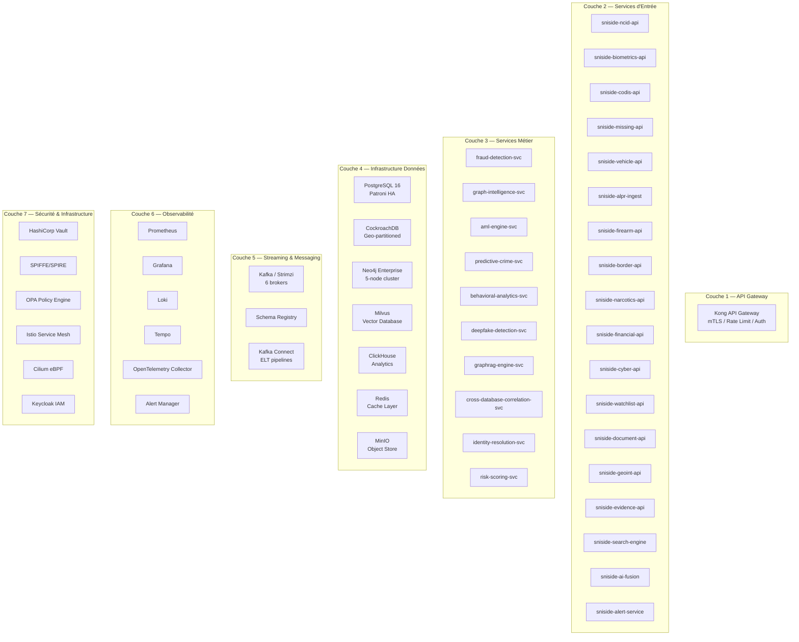
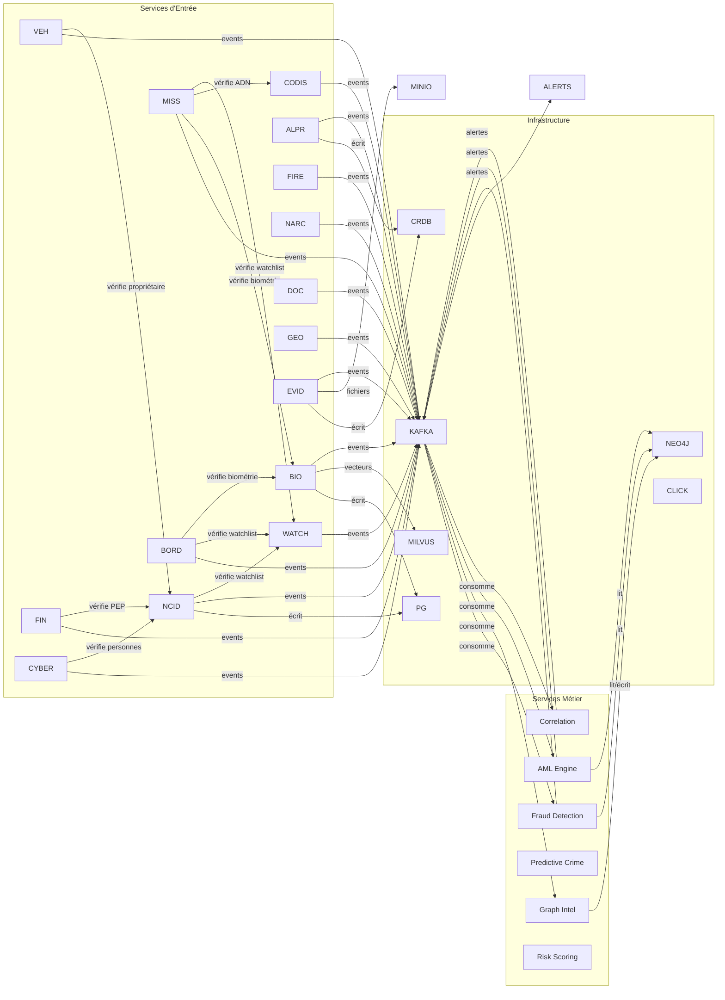
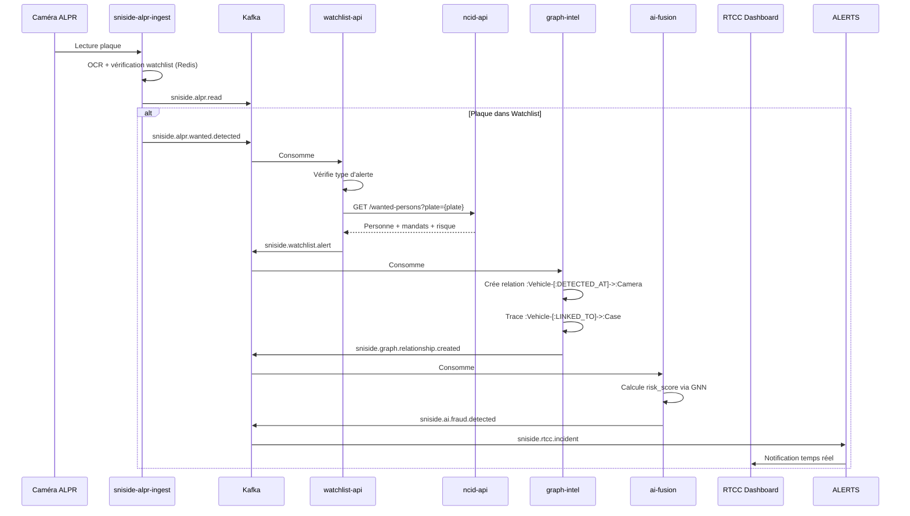
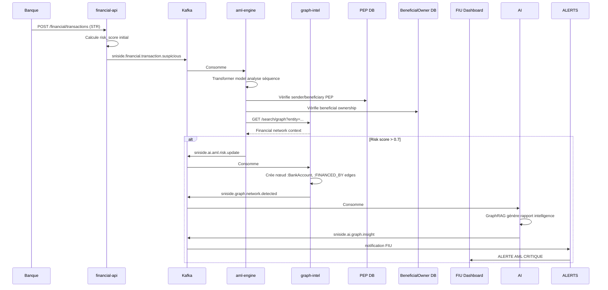
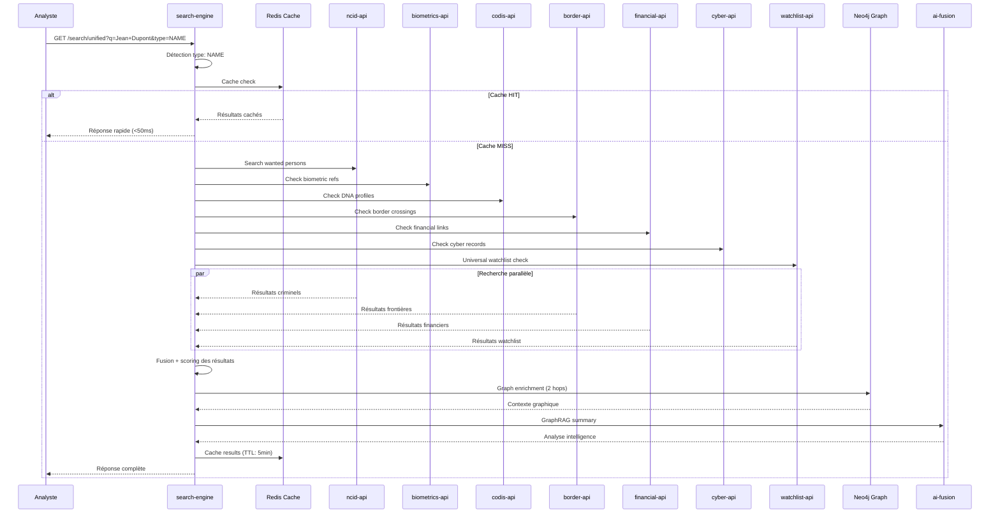

# SNI-SIDE: Topologie des Services & Flux de Données

## Architecture Microservices Complète



## 1. API Gateway (Kong)

| Propriété | Valeur |
|:--|:--|
| **Service** | `sniside-kong` |
| **Réplicas** | 3 (HA) |
| **Ports** | 443 (HTTPS), 8443 (gRPC) |
| **Plugins** | JWT, mTLS, Rate Limiting, ACL, Prometheus, OpenTelemetry |
| **Amonts** | Tous les services API de la couche 2 (17 services) |

**Routes:**

```
POST /intelligence/v1/ncid/*          → sniside-ncid-api:8080
POST /intelligence/v1/biometrics/*    → sniside-biometrics-api:8080
POST /intelligence/v1/codis/*         → sniside-codis-api:8080
POST /intelligence/v1/missing/*       → sniside-missing-api:8080
POST /intelligence/v1/vehicles/*      → sniside-vehicle-api:8080
POST /intelligence/v1/alpr/*          → sniside-alpr-ingest:8080
POST /intelligence/v1/firearms/*      → sniside-firearm-api:8080
POST /intelligence/v1/border/*        → sniside-border-api:8080
POST /intelligence/v1/narcotics/*     → sniside-narcotics-api:8080
POST /intelligence/v1/financial/*     → sniside-financial-api:8080
POST /intelligence/v1/cyber/*         → sniside-cyber-api:8080
POST /intelligence/v1/watchlist/*     → sniside-watchlist-api:8080
POST /intelligence/v1/documents/*     → sniside-document-api:8080
POST /intelligence/v1/geoint/*        → sniside-geoint-api:8080
POST /intelligence/v1/evidence/*      → sniside-evidence-api:8080
POST /intelligence/v1/search/*        → sniside-search-engine:8080
POST /intelligence/v1/ai/*            → sniside-ai-fusion:8080
POST /intelligence/v1/alerts/*        → sniside-alert-service:8080
```

---

## 2. Services d'Entrée (17 services)

### 2.1 `sniside-ncid-api` — Criminal Intelligence

| Propriété | Valeur |
|:--|:--|
| **Langage** | Go / Python (FastAPI) |
| **Réplicas** | 3 (HPA: 3–15, CPU 70%) |
| **Ressources** | req: 2 CPU / 4GB, lim: 4 CPU / 8GB |
| **Base** | PostgreSQL 16 — `snisid_ncid` schema |
| **Cache** | Redis (wanted person cache, TTL: 5min) |
| **Topics Kafka produits** | `sniside.ncid.wanted.created`, `.updated`, `.warrant.issued`, `.case.opened` |
| **Topics Kafka consommés** | `sniside.border.wanted.match`, `.alpr.wanted.detected`, `.watchlist.match` |
| **Dépendances** | pg_pool, redis, kafka_producer |

**API exposée:**
```
GET    /ncid/wanted-persons         → Search
GET    /ncid/wanted-persons/{niu}   → Get by NIU
POST   /ncid/wanted-persons         → Create
GET    /ncid/wanted-persons/{niu}/warrants → List warrants
GET    /ncid/wanted-persons/{niu}/aliases  → List aliases
GET    /ncid/cases                  → Search cases
GET    /ncid/cases/{id}             → Get case
GET    /ncid/gangs                  → Search gangs
GET    /ncid/organizations          → Search orgs
GET    /ncid/interpol-notices       → Search Interpol
```

### 2.2 `sniside-biometrics-api` — HN-NGI Biometrics

| Propriété | Valeur |
|:--|:--|
| **Langage** | Python (FastAPI) |
| **Réplicas** | 5 (HPA: 5–30, CPU 70%) |
| **Ressources** | req: 4 CPU / 8GB + 1 GPU, lim: 8 CPU / 16GB + 1 GPU |
| **Base** | PostgreSQL 16 + Milvus |
| **Modèles IA** | ArcFace (face), MinutiaeNet (fingerprint), IrisNet (iris) |
| **Topics produits** | `sniside.biometric.enrolled`, `.verified`, `.match.found`, `.duplicate.detected` |
| **Dépendances** | milvus_client, arcface_model, pg_pool, kafka |

**API exposée:**
```
POST /biometrics/verify              → 1:1 Verification
POST /biometrics/identify            → 1:N Identification
POST /biometrics/search/face         → Face search
POST /biometrics/search/fingerprint  → Fingerprint search
POST /biometrics/search/iris         → Iris search
POST /biometrics/search/voice        → Voice search
POST /biometrics/search/palm         → Palm search
POST /biometrics/duplicate-detection → Duplicate detection
POST /biometrics/enroll              → Enroll biometric
```

### 2.3 `sniside-codis-api` — HN-CODIS DNA

| Propriété | Valeur |
|:--|:--|
| **Langage** | Python |
| **Réplicas** | 3 (HPA: 3–10) |
| **Ressources** | req: 4 CPU / 8GB, lim: 8 CPU / 16GB |
| **Base** | PostgreSQL 16 |
| **Topics** | `sniside.codis.profile.created`, `.match.positive`, `.match.familial`, `.victim.identified` |
| **Dépendances** | pg_pool, kafka |

**API exposée:**
```
GET    /codis/profiles           → Search profiles
POST   /codis/search/exact       → Exact DNA search
POST   /codis/search/familial    → Familial search
POST   /codis/search/missing-person → Missing person DNA
POST   /codis/profiles           → Create profile
```

### 2.4 `sniside-missing-api` — Missing Persons

| Propriété | Valeur |
|:--|:--|
| **Réplicas** | 3 (HPA: 3–10) |
| **Ressources** | req: 2 CPU / 4GB |
| **Topics** | `sniside.missing.reported`, `.sighting`, `.alert.triggered`, `.found`, `.border.crossing` |
| **Dépendances** | pg_pool, kafka, ncid_api (biometric reference) |

**API exposée:**
```
GET    /missing-persons                  → Search
GET    /missing-persons/{id}             → Get details
GET    /missing-persons/{id}/sightings   → Get sightings
POST   /missing-persons/{id}/alert       → Trigger AMBER/SILVER
```

### 2.5 `sniside-vehicle-api` — Vehicle Intelligence

| Propriété | Valeur |
|:--|:--|
| **Réplicas** | 3 |
| **Ressources** | req: 2 CPU / 4GB |
| **Topics** | `sniside.vehicle.registered`, `.stolen`, `.wanted`, `.ownership.changed` |
| **Dépendances** | pg_pool, kafka |

**API exposée:**
```
GET    /vehicles          → Search (VIN, plate, owner)
GET    /vehicles/{vin}    → Get by VIN
GET    /vehicles/{vin}/ownership-history
GET    /vehicles/{vin}/network
POST   /vehicles          → Register vehicle
```

### 2.6 `sniside-alpr-ingest` — National ALPR (Haute Capacité)

| Propriété | Valeur |
|:--|:--|
| **Langage** | Go (haute performance) |
| **Réplicas** | 10 (HPA: 5–50) |
| **Ressources** | req: 4 CPU / 8GB, lim: 8 CPU / 16GB |
| **Base** | CockroachDB + Redis |
| **Topics** | `sniside.alpr.read` (24 partitions, zstd compressé), `.wanted.detected`, `.anomaly`, `.cross.border` |
| **Dépendances** | cockroach_pool, redis_stream, kafka_producer |

**Flux d'ingestion:**
```
Camera IP → ALPR Reader → Kafka: sniside.alpr.read (24 partitions)
  → Kafka Consumer (sniside-alpr-ingest)
    → CockroachDB: snisid_alpr.alpr_reads (partitionné par date)
    → Redis Stream: 5min cache pour détection de patterns
    → Vérification Watchlist (cache Redis)
    → Si wanted → Kafka: sniside.alpr.wanted.detected
    → Si anormal → Kafka: sniside.alpr.anomaly
```

**API exposée:**
```
GET    /alpr/reads              → Search reads
POST   /alpr/ingest             → Bulk ingest (for cameras)
POST   /alpr/route-analysis     → Route analysis
GET    /alpr/heatmap            → Heatmap data
GET    /alpr/cross-border       → Cross border tracking
```

### 2.7 `sniside-firearm-api` — Firearms Intelligence

| **Réplicas** 3 | req: 2 CPU / 4GB |
| **Topics** | `sniside.firearm.stolen`, `.recovered`, `.ballistic.match` |

### 2.8 `sniside-border-api` — Border Intelligence

| **Réplicas** 3 | req: 2 CPU / 4GB |
| **Topics** | `sniside.border.crossing`, `.wanted.match`, `.visa.issued`, `.deportation` |

### 2.9 `sniside-narcotics-api` — Counter Narcotics

| **Réplicas** 3 | req: 2 CPU / 4GB |
| **Topics** | `sniside.narcotics.seizure`, `.route.identified`, `.intelligence` |

### 2.10 `sniside-financial-api` — Financial Crime

| **Réplicas** 3 | req: 2 CPU / 4GB |
| **Topics** | `sniside.financial.transaction.suspicious`, `.aml.alert`, `.pep.identified`, `.network.detected` |

### 2.11 `sniside-cyber-api` — Cybercrime Intelligence

| **Réplicas** 3 | req: 2 CPU / 4GB |
| **Topics** | `sniside.cyber.ioc.submitted`, `.ioc.critical`, `.incident`, `.campaign.detected` |

### 2.12 `sniside-watchlist-api` — National Watchlist

| **Réplicas** 3 | req: 2 CPU / 4GB |
| **Topics** | `sniside.watchlist.entry.created`, `.match`, `.alert` |

### 2.13 `sniside-document-api` — Document Fraud

| **Réplicas** 3 | req: 2 CPU / 4GB |
| **Topics** | `sniside.document.fraud.detected`, `.stolen.reported` |

### 2.14 `sniside-geoint-api` — GEOINT

| **Réplicas** 2 | req: 4 CPU / 8GB |
| **Base** | PostgreSQL + PostGIS |

### 2.15 `sniside-evidence-api` — Digital Evidence

| **Réplicas** 3 | req: 4 CPU / 8GB |
| **Base** | CockroachDB + MinIO |
| **Topics** | `sniside.evidence.uploaded`, `.analyzed`, `.face.match` |

### 2.16 `sniside-search-engine` — National Sovereign Search Engine

| Propriété | Valeur |
|:--|:--|
| **Langage** | Python |
| **Réplicas** | 5 (HPA: 3–20) |
| **Ressources** | req: 4 CPU / 8GB, lim: 8 CPU / 16GB |
| **Cache** | Redis (résultats, TTL: 5min) |
| **Dépendances** | Tous les services API (orchestrateur fédéré), Neo4j, Redis, ClickHouse, Kafka |

### 2.17 `sniside-ai-fusion` — National AI Fusion Center

| Propriété | Valeur |
|:--|:--|
| **Réplicas** | 3 (HPA: 3–10) |
| **Ressources** | req: 8 CPU / 16GB + 2 GPU, lim: 16 CPU / 32GB + 2 GPU |
| **Modèles** | Fraud GNN, ArcFace, DNA AI, AML Transformer, Cyber Threat AI, Predictive Crime, Deepfake, Behavioral VAE, GraphRAG |
| **Topics** | `sniside.ai.fraud.detected`, `.predictive.alert`, `.graph.insight`, `.deepfake.detected` |

---

## 3. Services Métier (Couche 3)

### 3.1 `fraud-detection-svc`

Consomme les événements Kafka de toutes les bases et exécute le modèle GNN.

```
Input Kafka:  sniside.ncid.wanted.*, sniside.financial.transaction.suspicious,
              sniside.border.wanted.match, sniside.graph.relationship.created
Output Kafka: sniside.ai.fraud.detected
Base:         Neo4j (lecture du graphe)
```

### 3.2 `graph-intelligence-svc`

Maintient et analyse le graphe Neo4j.

```
Input Kafka:  tous les topics `sniside.*` (crée/maj les nœuds et relations)
Output Kafka: sniside.graph.relationship.created, sniside.graph.network.detected,
              sniside.graph.link.analysis
Base:         Neo4j (écriture)

Workflows:
- Nouvelle personne recherchée → Crée nœud :Citizen + relations OWNS, USES
- Transaction suspecte → Crée/relie :BankAccount → :FINANCED_BY
- Lecture ALPR → Relie :Vehicle → :VISITED à :Address
- Passage frontière → Relie :Citizen → :TRAVELLED_WITH
```

### 3.3 `aml-engine-svc`

Moteur AML avec le Transformer model.

```
Input Kafka:  sniside.financial.transaction.suspicious
Output Kafka: sniside.ai.aml.risk.update
Base:         PostgreSQL (lecture transactions, PEP, BO), Neo4j (réseau financier)
```

### 3.4 `predictive-crime-svc`

Prédiction spatio-temporelle de la criminalité.

```
Input:  sniside.ncid.case.opened, sniside.narcotics.seizure, sniside.alpr.read
Base:   ClickHouse (historique), PostGIS (zones)
```

### 3.5 `cross-database-correlation-svc`

Corrèle les entités à travers les 15 bases.

```
Input Kafka: tous les topics
Output:     sniside.graph.network.detected, base entity_correlations dans ClickHouse

Logique:
- Même NIU apparaît dans NCID + Border + Financial → corrélation
- Même plaque dans ALPR + NCID + Narcotics → corrélation
- Même téléphone dans NCID + Cyber → corrélation
```

### 3.6 `risk-scoring-svc`

Calcule le score de risque consolidé pour chaque entité.

```
Input:      scores des différents modèles (fraud, AML, behavioral, graph, watchlist)
Output:     risk_score mis à jour dans toutes les bases et Neo4j
Algorithme: weighted ensemble: risk = 0.3*fraud + 0.2*aml + 0.2*graph + 0.15*watchlist + 0.15*behavioral
```

---

## 4. Matrice de Dépendances Entre Services



---

## 5. Flux de Données Complets

### Flux 1: Alerte Personne Recherchée Détectée



### Flux 2: Analyse AML Multi-Domaine



### Flux 3: Recherche Unifiée



---

## 6. Déploiement et Dépendances

### Ordre de Déploiement

| Phase | Services | Dépendances | Durée estimée |
|:--|:--|:--|:--:|
| 0 | Infrastructure: Prometheus, Grafana, Loki, cert-manager, CSI | Aucune | 2h |
| 1 | Vault, SPIRE, Keycloak, OPA | Phase 0 | 1h |
| 2 | PostgreSQL Patroni, CockroachDB, Neo4j, Milvus, Kafka, Redis, MinIO | Phase 1 (Vault secrets) | 3h |
| 3 | ClickHouse, Schema Registry, Kafka Connect | Phase 2 (Kafka) | 1h |
| 4 | Kong API Gateway, Istio, Cilium | Phase 1 (SPIRE mTLS) | 2h |
| 5 | Base schemas (SQL migrations) | Phase 2 (PostgreSQL, CockroachDB) | 1h |
| 6 | **Services Entrée**: NCID, Biometrics, CODIS, Watchlist, Alerts | Phase 4 + 5 | 2h |
| 7 | **Services Entrée suite**: Missing, Vehicle, ALPR, Firearms, Border | Phase 6 | 2h |
| 8 | **Services Entrée suite**: Narcotics, Financial, Cyber, Documents, GEOINT, Evidence | Phase 6 | 2h |
| 9 | **Services Métier**: Graph Intelligence, Fraud Detection, AML Engine | Phase 6 (Kafka) + Neo4j | 2h |
| 10 | **Services Métier suite**: Predictive Crime, Correlation, Risk Scoring | Phase 9 | 1h |
| 11 | **National Sovereign Search Engine** | Tous les services entrée | 1h |
| 12 | **National AI Fusion Center** + GraphRAG | Phase 9 + 11 | 2h |
| 13 | Grafana dashboards + Prometheus rules + Alert Manager | Tous les services | 1h |

### Dépendances par Service

```
sniside-ncid-api:          pg, redis, kafka
sniside-biometrics-api:    pg, milvus, kafka, arcface-model
sniside-codis-api:         pg, kafka
sniside-missing-api:       pg, kafka, sniside-ncid-api, sniside-biometrics-api
sniside-vehicle-api:       pg, kafka
sniside-alpr-ingest:       cockroach, redis, kafka
sniside-firearm-api:       pg, kafka
sniside-border-api:        pg, kafka, sniside-biometrics-api
sniside-narcotics-api:     pg, kafka
sniside-financial-api:     pg, kafka, sniside-ncid-api
sniside-cyber-api:         pg, kafka
sniside-watchlist-api:     pg, kafka
sniside-document-api:      pg, kafka
sniside-geoint-api:        pg+postgis, kafka
sniside-evidence-api:      cockroach, minio, kafka, milvus
sniside-search-engine:     redis, kafka, tous les services entrée, neo4j, clickhouse, ai-fusion
sniside-ai-fusion:         kafka, neo4j, clickhouse, tous les modèles IA

fraud-detection-svc:       kafka, neo4j
graph-intelligence-svc:    kafka, neo4j
aml-engine-svc:            kafka, neo4j, pg
predictive-crime-svc:      clickhouse, postgis
cross-database-correlation-svc: kafka, clickhouse, neo4j
risk-scoring-svc:          kafka, neo4j, pg, redis
```

---

## 7. Ports et Protocoles

| Service | Port | Protocole | Description |
|:--|:--:|:--:|:--|
| Kong | 443 | HTTPS | API Gateway |
| Kong | 8443 | gRPC | gRPC Gateway |
| Kong | 8001 | HTTP | Admin API |
| PostgreSQL | 5432 | PostgreSQL | Base relationnelle principale |
| CockroachDB | 26257 | CockroachDB | Base géo-distribuée |
| Neo4j | 7687 | Bolt | Graph database |
| Neo4j | 7474 | HTTP | Browser |
| Milvus | 19530 | gRPC | Vector DB |
| ClickHouse | 9000 | Native | Analytics |
| Kafka | 9092 | Kafka | Event streaming |
| Kafka | 9093 | Kafka | Internal TLS |
| Schema Registry | 8081 | HTTP | Avro schemas |
| Redis | 6379 | RESP | Cache |
| MinIO | 9000 | S3 | Object store |
| MinIO | 9001 | HTTP | Console |
| Prometheus | 9090 | HTTP | Metrics |
| Grafana | 3000 | HTTP | Dashboards |
| Loki | 3100 | HTTP | Logs |
| Tempo | 3200 | HTTP | Traces |
| OTel Collector | 4318 | HTTP | Traces/Metrics |
| OTel Collector | 4317 | gRPC | Traces/Metrics |
| Vault | 8200 | HTTP | Secrets |
| SPIRE | 8081 | gRPC | Workload identity |

---

## 8. Topologie Kubernetes

### Namespaces

```yaml
sniside:           # Production — services SNI-SIDE
sniside-staging:   # Pre-production
sniside-dev:       # Développement
istio-system:      # Service mesh
cilium-system:     # eBPF network
monitoring:        # Prometheus, Grafana, Loki
vault:             # Secrets management
spire:             # Workload identity
kafka:             # Strimzi operator
```

### Distribution des Services par Nœud

```
┌─────────────────────────────────────────────────────────────┐
│                    Node Pool: sniside-system                  │
│  (16 CPU, 64GB RAM, 500GB SSD — 5 nœuds)                    │
├─────────────────────────────────────────────────────────────┤
│  kong x3     │  vault x3    │  spire x3    │  keycloak x3  │
│  istiod x2   │  hubble x2   │  otel-col x3 │  prometheus x2│
│  grafana x2  │  loki x3     │  tempo x3    │  alertmgr x2  │
└─────────────────────────────────────────────────────────────┘

┌─────────────────────────────────────────────────────────────┐
│              Node Pool: sniside-data                          │
│  (32 CPU, 128GB RAM, 2TB NVMe — 5 nœuds)                    │
├─────────────────────────────────────────────────────────────┤
│  postgres-0  │  postgres-1  │  postgres-2  │  cockroach x3 │
│  neo4j-core  │  neo4j-core  │  neo4j-core  │  neo4j-core   │
│  milvus-idx  │  milvus-qn   │  milvus-dn   │  redis x3     │
│  kafka x3    │  zk x3       │  clickhouse   │  minio x4     │
└─────────────────────────────────────────────────────────────┘

┌─────────────────────────────────────────────────────────────┐
│              Node Pool: sniside-application                   │
│  (16 CPU, 64GB RAM, 200GB SSD — 10 nœuds)                   │
├─────────────────────────────────────────────────────────────┤
│  ncid-api x3      │  bio-api x5      │  codis-api x3        │
│  missing-api x3   │  vehicle-api x3  │  alpr-ingest x10     │
│  firearm-api x2   │  border-api x3   │  narcotics-api x2    │
│  financial-api x3 │  cyber-api x3    │  watchlist-api x3    │
│  document-api x2  │  geoint-api x2   │  evidence-api x3     │
│  search-engine x5 │  ai-fusion x3    │  alert-svc x3        │
└─────────────────────────────────────────────────────────────┘

┌─────────────────────────────────────────────────────────────┐
│              Node Pool: sniside-gpu                           │
│  (32 CPU, 256GB RAM, 1TB SSD, 4x NVIDIA A100 — 3 nœuds)    │
├─────────────────────────────────────────────────────────────┤
│  ai-fusion x3 (GPU: 2)  │  bio-api x3 (GPU: 1)              │
│  fraud-detection x2     │  graph-rag x2                      │
│  aml-engine x2          │  deepfake-detector x2              │
└─────────────────────────────────────────────────────────────┘
```
