# SNI-SIDE — Architecture Nationale Souveraine

## SNISID National Intelligence, Security, Investigation and Sovereign Data Ecosystem

---

## Architecture Globale

```mermaid
graph TB
    subgraph "Couche Présentation"
        NCIP["National Crime Intelligence Portal"]
        BIP["Border Intelligence Portal"]
        FIP["Financial Intelligence Portal"]
        CIP["Cyber Intelligence Portal"]
        SIP["Sovereign Intelligence Portal"]
    end

    subgraph "API Gateway / Service Mesh (Kong + Istio)"
        GW["API Gateway<br/>mTLS / OAuth2 / OPA"]
    end

    subgraph "National Sovereign Search Engine"
        NSSE["Unified Search Orchestrator"]
        SF["Search Federation Bus"]
    end

    subgraph "Couche Services — 15 Databases Nationales"
        DB1["NCID<br/>Criminal Intelligence"]
        DB2["HN-NGI<br/>Biometrics"]
        DB3["HN-CODIS<br/>DNA"]
        DB4["Missing Persons"]
        DB5["Vehicle Intelligence"]
        DB6["National ALPR"]
        DB7["Firearms Intelligence"]
        DB8["Border Intelligence"]
        DB9["Counter Narcotics"]
        DB10["Financial Crime"]
        DB11["Cybercrime"]
        DB12["National Watchlist"]
        DB13["Document Fraud"]
        DB14["GEOINT"]
        DB15["Digital Evidence"]
    end

    subgraph "National Sovereign Intelligence Graph"
        NEO4J["Neo4j Enterprise<br/>Graph Intelligence"]
    end

    subgraph "National AI Fusion Center"
        AI_FRAUD["Fraud Detection AI"]
        AI_FACE["Face Recognition AI"]
        AI_DNA["DNA Intelligence AI"]
        AI_AML["AML AI"]
        AI_CYBER["Cyber Threat AI"]
        AI_PREDICT["Predictive Crime Analytics"]
        AI_GRAPH["Graph AI / GraphRAG"]
        AI_DEEPFAKE["Deepfake Detection"]
    end

    subgraph "Event Streaming & Data Layer"
        KAFKA["Kafka Event Bus"]
        CLICKHOUSE["ClickHouse Analytics"]
        MILVUS["Milvus Vector DB"]
        MINIO["MinIO Object Store"]
        REDIS["Redis Cache"]
    end

    subgraph "Infrastructure Souveraine"
        K8S["Kubernetes RKE2"]
        POSTGRES["PostgreSQL 16"]
        COCKROACH["CockroachDB"]
        VAULT["HashiCorp Vault"]
        SPIRE["SPIFFE/SPIRE"]
    end

    subgraph "Zero Trust Security"
        OPA["OPA Policy Engine"]
        ISTIO["Istio mTLS"]
        CILIUM["Cilium eBPF"]
        KEYCLOAK["Keycloak IAM"]
    end

    NCIP --> GW
    BIP --> GW
    FIP --> GW
    CIP --> GW
    SIP --> GW
    GW --> NSSE
    NSSE --> SF
    SF --> DB1 & DB2 & DB3 & DB4 & DB5 & DB6 & DB7 & DB8 & DB9 & DB10 & DB11 & DB12 & DB13 & DB14 & DB15
    DB1 & DB2 & DB3 & DB4 & DB5 & DB6 & DB7 & DB8 & DB9 & DB10 & DB11 & DB12 & DB13 & DB14 & DB15 --> NEO4J
    NEO4J --> AI_GRAPH
    DB1 & DB2 & DB3 & DB4 & DB5 & DB6 & DB7 & DB8 & DB9 & DB10 & DB11 & DB12 & DB13 & DB14 & DB15 --> KAFKA
    KAFKA --> CLICKHOUSE
    KAFKA --> AI_FRAUD & AI_FACE & AI_DNA & AI_AML & AI_CYBER & AI_PREDICT & AI_DEEPFAKE
    MILVUS --> DB2
    MINIO --> DB15
    REDIS --> NSSE
    POSTGRES --> DB1 & DB3 & DB4 & DB5 & DB7 & DB8 & DB9 & DB10 & DB11 & DB12 & DB13 & DB14
    COCKROACH --> DB6 & DB15
    VAULT --> GW
    SPIRE --> GW
    OPA --> GW
    ISTIO --> GW
    CILIUM --> K8S
    KEYCLOAK --> GW
```



---

## 1. National Criminal Intelligence Database (NCID)

```mermaid
erDiagram
    WANTED_PERSONS {
        string niu PK "National Identity Unique"
        string full_name
        string alias
        date date_of_birth
        string place_of_birth
        string gender
        string nationality
        string height_cm
        string weight_kg
        string eye_color
        string hair_color
        string skin_tone
        string scars_marks
        string last_known_address
        string occupation
        string risk_level "CRITICAL | HIGH | MEDIUM | LOW"
        string status "ACTIVE | CAPTURED | DECEASED | INACTIVE"
        jsonb photos
        jsonb biometric_references
        timestamp created_at
        timestamp updated_at
    }

    ARREST_WARRANTS {
        string warrant_id PK
        string warrant_type "NATIONAL | INTERNATIONAL | INTERPOL"
        string issuing_authority
        string issuing_country
        string person_niu FK
        string case_id FK
        string charges text[]
        string status "ACTIVE | EXECUTED | CANCELLED | EXPIRED"
        date issued_date
        date expiry_date
        string risk_level
        jsonb extradition_info
        timestamp created_at
    }

    CRIMINAL_CASES {
        string case_id PK
        string case_number UK
        string case_type
        string case_category
        string jurisdiction
        string status "OPEN | UNDER_INVESTIGATION | CLOSED | COLD"
        string lead_agency
        string lead_investigator
        text description
        date incident_date
        date opened_date
        date closed_date
        string location
        float latitude
        float longitude
        jsonb entities "suspects, victims, witnesses"
        timestamp created_at
    }

    GANGS {
        string gang_id PK
        string name
        string alias
        string territory
        string criminal_activities text[]
        string risk_level
        int member_count
        string leader_name
        jsonb members
        jsonb rival_gangs
        jsonb allied_gangs
        string status "ACTIVE | DISBANDED | INVESTIGATING"
        timestamp created_at
    }

    CRIMINAL_ORGANIZATIONS {
        string org_id PK
        string name
        string type "CARTEL | MAFIA | TERRORIST | TRAFFICKING | OTHER"
        string structure
        string geographic_reach
        string primary_activities text[]
        string estimated_membership
        string estimated_revenue
        string risk_level
        jsonb hierarchy
        jsonb known_associates
        timestamp created_at
    }

    CRIMINAL_NETWORKS {
        string network_id PK
        string network_type
        string description
        jsonb nodes "persons, organizations"
        jsonb edges "relationships"
        float centrality_score
        string status
        timestamp detected_at
    }

    JUDICIAL_HISTORY {
        string record_id PK
        string person_niu FK
        string case_id FK
        string conviction_type
        string sentence
        date conviction_date
        string court
        string judge
        string status "ACTIVE | APPEALED | SERVED | EXPUNGED"
        jsonb details
        timestamp created_at
    }

    INTERPOL_NOTICES {
        string notice_id PK
        string notice_type "RED | BLUE | GREEN | YELLOW | BLACK | ORANGE | PURPLE"
        string person_niu FK
        string person_name
        string nationality
        string issuing_country
        string charges text[]
        string status "ACTIVE | WITHDRAWN | EXECUTED"
        date issued_date
        date expiry_date
        jsonb diffusions
        timestamp created_at
    }

    CRIMINAL_ALIASES {
        string alias_id PK
        string person_niu FK
        string alias_name
        string alias_type "BIRTH | MARRIED | PROFESSIONAL | STREET | CRIMINAL"
        date first_used
        date last_used
        jsonb associated_documents
        timestamp created_at
    }

    WANTED_PERSONS ||--o{ ARREST_WARRANTS : "has"
    WANTED_PERSONS ||--o{ JUDICIAL_HISTORY : "has"
    WANTED_PERSONS ||--o{ INTERPOL_NOTICES : "referenced_in"
    WANTED_PERSONS ||--o{ CRIMINAL_ALIASES : "uses"
    CRIMINAL_CASES ||--o{ ARREST_WARRANTS : "issued_for"
    CRIMINAL_CASES ||--o{ JUDICIAL_HISTORY : "results_in"
    GANGS }o--o{ WANTED_PERSONS : "members"
    CRIMINAL_ORGANIZATIONS }o--o{ GANGS : "controls"
    CRIMINAL_ORGANIZATIONS }o--o{ WANTED_PERSONS : "associates"
```

### NCID — SQL Schema

```sql
-- ============================================================
-- SNI-SIDE: National Criminal Intelligence Database (NCID)
-- PostgreSQL 16 + Partitioning
-- ============================================================

CREATE SCHEMA IF NOT EXISTS snisid_ncid;
SET search_path TO snisid_ncid;

-- Extensions
CREATE EXTENSION IF NOT EXISTS pgcrypto;
CREATE EXTENSION IF NOT EXISTS pg_partman;
CREATE EXTENSION IF NOT EXISTS postgis;
CREATE EXTENSION IF NOT EXISTS pg_cron;

-- ============ WANTED PERSONS ============
CREATE TABLE wanted_persons (
    niu VARCHAR(10) PRIMARY KEY,
    full_name VARCHAR(255) NOT NULL,
    alias VARCHAR(255),
    date_of_birth DATE,
    place_of_birth VARCHAR(255),
    gender VARCHAR(1) CHECK (gender IN ('M','F','O')),
    nationality VARCHAR(100),
    height_cm DECIMAL(5,2),
    weight_kg DECIMAL(5,2),
    eye_color VARCHAR(50),
    hair_color VARCHAR(50),
    skin_tone VARCHAR(50),
    scars_marks TEXT,
    last_known_address TEXT,
    occupation VARCHAR(255),
    risk_level VARCHAR(20) CHECK (risk_level IN ('CRITICAL','HIGH','MEDIUM','LOW')),
    status VARCHAR(20) CHECK (status IN ('ACTIVE','CAPTURED','DECEASED','INACTIVE')),
    photos JSONB DEFAULT '[]',
    biometric_references JSONB DEFAULT '{}',
    created_at TIMESTAMPTZ DEFAULT NOW(),
    updated_at TIMESTAMPTZ DEFAULT NOW(),
    CONSTRAINT fk_citizen FOREIGN KEY (niu) REFERENCES snisid_identity.citizens(niu)
) PARTITION BY LIST (status);

CREATE TABLE wanted_persons_active PARTITION OF wanted_persons
    FOR VALUES IN ('ACTIVE');
CREATE TABLE wanted_persons_captured PARTITION OF wanted_persons
    FOR VALUES IN ('CAPTURED');
CREATE TABLE wanted_persons_inactive PARTITION OF wanted_persons
    FOR VALUES IN ('DECEASED','INACTIVE');

CREATE INDEX idx_wanted_name ON wanted_persons USING gin(to_tsvector('french', full_name));
CREATE INDEX idx_wanted_alias ON wanted_persons USING gin(to_tsvector('french', COALESCE(alias,'')));
CREATE INDEX idx_wanted_risk ON wanted_persons(risk_level);
CREATE INDEX idx_wanted_nationality ON wanted_persons(nationality);
CREATE INDEX idx_wanted_created ON wanted_persons(created_at DESC);

-- ============ ARREST WARRANTS ============
CREATE TABLE arrest_warrants (
    warrant_id UUID PRIMARY KEY DEFAULT gen_random_uuid(),
    warrant_type VARCHAR(30) CHECK (warrant_type IN ('NATIONAL','INTERNATIONAL','INTERPOL')),
    issuing_authority VARCHAR(255) NOT NULL,
    issuing_country VARCHAR(100) DEFAULT 'HT',
    person_niu VARCHAR(10) NOT NULL REFERENCES wanted_persons(niu),
    case_id UUID REFERENCES criminal_cases(case_id),
    charges TEXT[] NOT NULL DEFAULT '{}',
    status VARCHAR(20) CHECK (status IN ('ACTIVE','EXECUTED','CANCELLED','EXPIRED')),
    issued_date DATE NOT NULL DEFAULT CURRENT_DATE,
    expiry_date DATE,
    risk_level VARCHAR(20),
    extradition_info JSONB DEFAULT '{}',
    created_at TIMESTAMPTZ DEFAULT NOW(),
    CONSTRAINT chk_dates CHECK (expiry_date IS NULL OR expiry_date > issued_date)
) PARTITION BY LIST (status);

CREATE INDEX idx_warrant_person ON arrest_warrants(person_niu);
CREATE INDEX idx_warrant_status ON arrest_warrants(status);
CREATE INDEX idx_warrant_type ON arrest_warrants(warrant_type);
CREATE INDEX idx_warrant_issued ON arrest_warrants(issued_date DESC);

-- ============ CRIMINAL CASES ============
CREATE TABLE criminal_cases (
    case_id UUID PRIMARY KEY DEFAULT gen_random_uuid(),
    case_number VARCHAR(50) UNIQUE NOT NULL,
    case_type VARCHAR(100) NOT NULL,
    case_category VARCHAR(100),
    jurisdiction VARCHAR(100),
    status VARCHAR(30) CHECK (status IN ('OPEN','UNDER_INVESTIGATION','CLOSED','COLD')),
    lead_agency VARCHAR(255),
    lead_investigator VARCHAR(255),
    description TEXT,
    incident_date DATE,
    opened_date DATE NOT NULL DEFAULT CURRENT_DATE,
    closed_date DATE,
    location VARCHAR(500),
    latitude DECIMAL(10,7),
    longitude DECIMAL(10,7),
    location_geom GEOMETRY(Point, 4326),
    entities JSONB DEFAULT '{}',
    created_at TIMESTAMPTZ DEFAULT NOW(),
    updated_at TIMESTAMPTZ DEFAULT NOW()
) PARTITION BY LIST (status);

CREATE INDEX idx_case_number ON criminal_cases(case_number);
CREATE INDEX idx_case_type ON criminal_cases(case_type);
CREATE INDEX idx_case_agency ON criminal_cases(lead_agency);
CREATE INDEX idx_case_location ON criminal_cases USING gist(location_geom);
CREATE INDEX idx_case_incident ON criminal_cases(incident_date DESC);
CREATE INDEX idx_case_created ON criminal_cases(created_at DESC);

-- ============ GANGS ============
CREATE TABLE gangs (
    gang_id UUID PRIMARY KEY DEFAULT gen_random_uuid(),
    name VARCHAR(255) NOT NULL,
    alias VARCHAR(255),
    territory VARCHAR(500),
    criminal_activities TEXT[] DEFAULT '{}',
    risk_level VARCHAR(20),
    member_count INT DEFAULT 0,
    leader_name VARCHAR(255),
    members JSONB DEFAULT '[]',
    rival_gangs JSONB DEFAULT '[]',
    allied_gangs JSONB DEFAULT '[]',
    status VARCHAR(20) CHECK (status IN ('ACTIVE','DISBANDED','INVESTIGATING')),
    created_at TIMESTAMPTZ DEFAULT NOW(),
    updated_at TIMESTAMPTZ DEFAULT NOW()
);

CREATE INDEX idx_gang_name ON gangs(name);
CREATE INDEX idx_gang_territory ON gangs USING gin(to_tsvector('french', territory));
CREATE INDEX idx_gang_risk ON gangs(risk_level);
CREATE INDEX idx_gang_status ON gangs(status);
CREATE INDEX idx_gang_members ON gangs USING gin(members);

-- ============ CRIMINAL ORGANIZATIONS ============
CREATE TABLE criminal_organizations (
    org_id UUID PRIMARY KEY DEFAULT gen_random_uuid(),
    name VARCHAR(255) NOT NULL,
    type VARCHAR(50) CHECK (type IN ('CARTEL','MAFIA','TERRORIST','TRAFFICKING','OTHER')),
    structure VARCHAR(255),
    geographic_reach VARCHAR(500),
    primary_activities TEXT[] DEFAULT '{}',
    estimated_membership VARCHAR(100),
    estimated_revenue VARCHAR(100),
    risk_level VARCHAR(20),
    hierarchy JSONB DEFAULT '{}',
    known_associates JSONB DEFAULT '[]',
    created_at TIMESTAMPTZ DEFAULT NOW(),
    updated_at TIMESTAMPTZ DEFAULT NOW()
);

CREATE INDEX idx_criminal_org_name ON criminal_organizations(name);
CREATE INDEX idx_criminal_org_type ON criminal_organizations(type);
CREATE INDEX idx_criminal_org_risk ON criminal_organizations(risk_level);

-- ============ CRIMINAL NETWORKS ============
CREATE TABLE criminal_networks (
    network_id UUID PRIMARY KEY DEFAULT gen_random_uuid(),
    network_type VARCHAR(100),
    description TEXT,
    nodes JSONB NOT NULL DEFAULT '[]',
    edges JSONB NOT NULL DEFAULT '[]',
    centrality_score DECIMAL(10,6),
    status VARCHAR(20),
    detected_at TIMESTAMPTZ DEFAULT NOW(),
    last_analyzed_at TIMESTAMPTZ DEFAULT NOW()
);

CREATE INDEX idx_network_type ON criminal_networks(network_type);
CREATE INDEX idx_network_score ON criminal_networks(centrality_score DESC);
CREATE INDEX idx_network_detected ON criminal_networks(detected_at DESC);
CREATE INDEX idx_network_nodes ON criminal_networks USING gin(nodes);

-- ============ JUDICIAL HISTORY ============
CREATE TABLE judicial_history (
    record_id UUID PRIMARY KEY DEFAULT gen_random_uuid(),
    person_niu VARCHAR(10) NOT NULL REFERENCES wanted_persons(niu),
    case_id UUID REFERENCES criminal_cases(case_id),
    conviction_type VARCHAR(100),
    sentence TEXT,
    conviction_date DATE,
    court VARCHAR(255),
    judge VARCHAR(255),
    status VARCHAR(20) CHECK (status IN ('ACTIVE','APPEALED','SERVED','EXPUNGED')),
    details JSONB DEFAULT '{}',
    created_at TIMESTAMPTZ DEFAULT NOW()
) PARTITION BY RANGE (conviction_date);

CREATE INDEX idx_judicial_person ON judicial_history(person_niu);
CREATE INDEX idx_judicial_conviction ON judicial_history(conviction_date DESC);
CREATE INDEX idx_judicial_status ON judicial_history(status);

-- ============ INTERPOL NOTICES ============
CREATE TABLE interpol_notices (
    notice_id UUID PRIMARY KEY DEFAULT gen_random_uuid(),
    notice_type VARCHAR(10) CHECK (notice_type IN ('RED','BLUE','GREEN','YELLOW','BLACK','ORANGE','PURPLE')),
    person_niu VARCHAR(10) REFERENCES wanted_persons(niu),
    person_name VARCHAR(255) NOT NULL,
    nationality VARCHAR(100),
    issuing_country VARCHAR(100) NOT NULL,
    charges TEXT[] DEFAULT '{}',
    status VARCHAR(20) CHECK (status IN ('ACTIVE','WITHDRAWN','EXECUTED')),
    issued_date DATE NOT NULL,
    expiry_date DATE,
    diffusions JSONB DEFAULT '[]',
    created_at TIMESTAMPTZ DEFAULT NOW()
);

CREATE INDEX idx_interpol_type ON interpol_notices(notice_type);
CREATE INDEX idx_interpol_status ON interpol_notices(status);
CREATE INDEX idx_interpol_person ON interpol_notices(person_niu);
CREATE INDEX idx_interpol_issued ON interpol_notices(issued_date DESC);

-- ============ CRIMINAL ALIASES ============
CREATE TABLE criminal_aliases (
    alias_id UUID PRIMARY KEY DEFAULT gen_random_uuid(),
    person_niu VARCHAR(10) NOT NULL REFERENCES wanted_persons(niu),
    alias_name VARCHAR(255) NOT NULL,
    alias_type VARCHAR(20) CHECK (alias_type IN ('BIRTH','MARRIED','PROFESSIONAL','STREET','CRIMINAL')),
    first_used DATE,
    last_used DATE,
    associated_documents JSONB DEFAULT '[]',
    created_at TIMESTAMPTZ DEFAULT NOW()
);

CREATE INDEX idx_alias_person ON criminal_aliases(person_niu);
CREATE INDEX idx_alias_name ON criminal_aliases(alias_name);
CREATE INDEX idx_alias_type ON criminal_aliases(alias_type);

-- ============ NCID Audit Trail ============
CREATE TABLE ncid_audit_log (
    log_id UUID PRIMARY KEY DEFAULT gen_random_uuid(),
    table_name VARCHAR(100) NOT NULL,
    record_id UUID NOT NULL,
    operation VARCHAR(10) CHECK (operation IN ('INSERT','UPDATE','DELETE','SELECT')),
    user_id VARCHAR(100) NOT NULL,
    agency VARCHAR(100) NOT NULL,
    old_values JSONB,
    new_values JSONB,
    ip_address INET,
    user_agent VARCHAR(500),
    performed_at TIMESTAMPTZ DEFAULT NOW()
) PARTITION BY RANGE (performed_at);

CREATE INDEX idx_ncid_audit_table ON ncid_audit_log(table_name);
CREATE INDEX idx_ncid_audit_user ON ncid_audit_log(user_id);
CREATE INDEX idx_ncid_audit_time ON ncid_audit_log(performed_at DESC);
CREATE INDEX idx_ncid_audit_agency ON ncid_audit_log(agency);

-- ============ Row-Level Security ============
ALTER TABLE wanted_persons ENABLE ROW LEVEL SECURITY;
ALTER TABLE criminal_cases ENABLE ROW LEVEL SECURITY;
ALTER TABLE arrest_warrants ENABLE ROW LEVEL SECURITY;

CREATE POLICY ncid_pnh_select ON wanted_persons FOR SELECT USING (
    current_setting('snisid.agency') = 'PNH' OR
    current_setting('snisid.agency') = 'DCPJ' OR
    current_setting('snisid.agency') = 'SNISID_ADMIN'
);

CREATE POLICY ncid_interpol_select ON interpol_notices FOR SELECT USING (
    current_setting('snisid.agency') IN ('PNH','DCPJ','INTERPOL','SNISID_ADMIN')
);

-- ============ Audit Trigger ============
CREATE OR REPLACE FUNCTION ncid_audit_trigger()
RETURNS TRIGGER AS $$
BEGIN
    INSERT INTO ncid_audit_log(table_name, record_id, operation, user_id, agency, old_values, new_values)
    VALUES (TG_TABLE_NAME, COALESCE(NEW.case_id, NEW.warrant_id, NEW.niu::UUID), TG_OP,
            current_setting('snisid.user_id'), current_setting('snisid.agency'),
            CASE WHEN TG_OP = 'UPDATE' THEN row_to_json(OLD)::jsonb ELSE '{}'::jsonb END,
            row_to_json(NEW)::jsonb);
    RETURN NEW;
END;
$$ LANGUAGE plpgsql SECURITY DEFINER;

CREATE TRIGGER trg_ncid_cases_audit AFTER INSERT OR UPDATE OR DELETE ON criminal_cases
    FOR EACH ROW EXECUTE FUNCTION ncid_audit_trigger();
```
