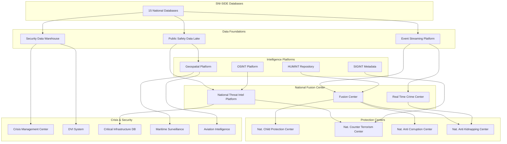

# Advanced Systems — Inspirés des USA

## 1. Fusion Center National
Centre national de fusion du renseignement intégrant toutes les 15 bases SNI-SIDE avec le National Intelligence Graph pour une analyse cross-domaine en temps réel. Équipes d'analystes multi-agences (PNH, DCPJ, FIU, SOC, Immigration, Douanes) opérant 24/7/365.

**Capacités:**
- Fusion en temps réel des alertes de toutes les bases
- Analyse criminelle intégrée (NCID + Financier + Cyber + Narcotiques)
- Rapports d'intelligence quotidiens
- Coordination multi-agences

## 2. Real Time Crime Center (RTCC)
Centre de réponse immédiate exploitant les flux ALPR, caméras, biométrie, et bases criminelles pour la détection et l'interception en temps réel.

**Capacités:**
- ALPR temps réel + recherche criminelle instantanée
- Reconnaissance faciale sur flux CCTV
- Tracking véhicule en direct
- Dispatching automatique des unités les plus proches
- Intégration drone pour poursuite aérienne

## 3. National Threat Intelligence Platform (NTIP)
Plateforme nationale de renseignement sur les menaces, agrégant les données des 15 bases pour produire une évaluation continue des risques.

**Capacités:**
- Threat scoring automatisé
- Indicateurs de menace nationaux
- Alertes précoces terrorisme, narcotiques, cyber
- Partage avec INTERPOL, CARICOM, EUROPOL

## 4. National Child Protection Center
Centre dédié à la protection des enfants, intégrant Missing Persons, NCID, HN-NGI, et Digital Evidence.

**Capacités:**
- AMBER Alert System automatisé (téléphone, ALPR, border, médias)
- Détection CSAM (Child Sexual Abuse Material) par IA
- Réseau de traçage des trafiquants d'enfants
- Base de données ADN spécifique enfants
- Coopération internationale (ICMEC, INTERPOL)

## 5. Disaster Victim Identification System (DVI)
Système d'identification des victimes de catastrophes, intégrant HN-NGI, HN-CODIS, Missing Persons, et Digital Evidence.

**Capacités:**
- Ante-mortem / Post-mortem matching
- ADN catastrophes (feu, inondation, ouragan)
- Reconnaissance faciale sur dépouilles
- Gestion de crise avec déploiement d'unités mobiles DVI

## 6. National Public Safety Data Lake
Data Lake national pour les données de sécurité publique, avec ClickHouse comme moteur d'analytics.

**Capacités:**
- Données historiques 15+ ans
- Analytics prédictifs (hotspots criminels)
- Rapports de performance agence
- Tableaux de bord publics (statistiques agrégées)

## 7. National Security Data Warehouse
Entrepôt de données pour le renseignement de sécurité nationale.

**Capacités:**
- Intégration bases classifiées (SECRET, TOP SECRET)
- OLAP cubes multidimensionnels
- Rapports Parlementaires
- Analyse de tendances 20+ ans

## 8. National Event Streaming Platform
Plateforme de streaming événementiel temps réel avec Kafka.

**Capacités:**
- 5M+ événements/seconde
- Latence < 10ms
- Event Sourcing pour toutes les bases
- Replay cronologique complet
- Audit en continu

## 9. National Geospatial Intelligence Platform
Plateforme GEOINT nationale avec PostGIS et visualisation cartographique.

**Capacités:**
- Cartographie criminelle temps réel
- Heatmaps criminels et narcotiques
- Routes de trafic visualisées
- Zone de risque dynamique
- Intégration satellite et drone

## 10. National OSINT Platform
Plateforme de renseignement open source automatisée.

**Capacités:**
- Social media monitoring
- Dark web monitoring
- Telegram/WhatsApp public groups
- News intelligence
- Person of Interest tracking

## 11. National HUMINT Repository
Registre national du renseignement humain.

**Capacités:**
- Source management (anonymisé)
- Informant tracking
- Debriefing database
- Source validation scoring

## 12. National SIGINT Metadata Repository
Repository des métadonnées de renseignement d'origine électromagnétique.

**Capacités:**
- Metadata analysis
- Communication pattern analysis
- Network mapping
- Geolocation tracking

## 13. National Crisis Management Center
Centre national de gestion de crise.

**Capacités:**
- Activation automatique (catastrophe, terrorisme, crise sanitaire)
- Dashboard crise temps réel
- Coordination multi-agences
- Communication publique
- Resource tracking

## 14. National Counter Terrorism Center
Centre national anti-terrorisme.

**Capacités:**
- Watchlist terroriste intégrée
- Analyse de réseaux terroristes (Neo4j)
- Financement terroriste tracking (Financial Crime)
- Border terror watch
- Radicalization indicators
- International liaison (INTERPOL, CTED)

## 15. National Anti Corruption Center
Centre national anti-corruption.

**Capacités:**
- PEP database intégrée
- Asset declaration verification
- Beneficial owner tracing
- Corruption network analysis (Neo4j)
- International asset recovery

## 16. National Anti Kidnapping Center
Centre national anti-enlèvement.

**Capacités:**
- Kidnapping case management
- Vehicle tracking (ALPR + Vehicle Intelligence)
- Phone tracking
- Ransom negotiation support
- Tactical response coordination

## 17. National Maritime Surveillance Platform
Plateforme de surveillance maritime nationale.

**Capacités:**
- Vessel tracking (AIS + radar)
- Narcotics vessel intelligence
- Illegal fishing detection
- Search and rescue coordination
- Port security integration

## 18. National Aviation Intelligence Platform
Plateforme de renseignement aérien.

**Capacités:**
- Flight tracking (ADS-B)
- Private aircraft intelligence
- Narcotics aircraft tracking
- No-fly zone enforcement
- Airport security integration

## 19. National Critical Infrastructure Protection Database
Base de données de protection des infrastructures critiques.

**Capacités:**
- Infrastructure mapping
- Vulnerability assessment
- Threat monitoring
- Incident reporting
- Resilience planning

# Architecture d'Intégration des Advanced Systems

