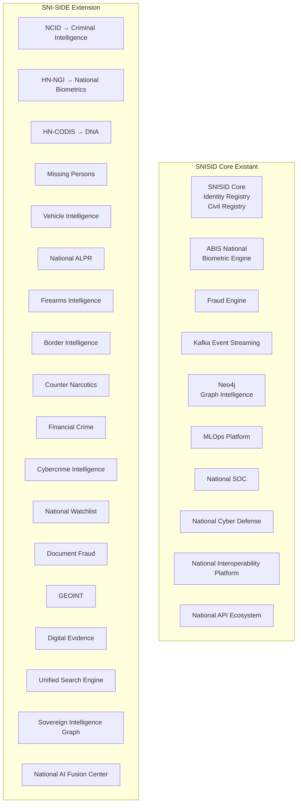

# SNI-SIDE → SNISID Integration Mapping

## Comment SNI-SIDE s'intègre à l'écosystème SNISID existant



## Matrice d'Intégration

| SNI-SIDE Database | SNISID Core | ABIS | Fraud Engine | Kafka | Neo4j | MLOps | SOC | Notes |
|:--|:--:|:--:|:--:|:--:|:--:|:--:|:--:|:--|
| NCID | ✅ | ✅ | ✅ | ✅ | ✅ | ✅ | ✅ | Wanted persons liés à Identity Registry par NIU |
| HN-NGI | ✅ | ✅ | ✅ | ✅ | ✅ | ✅ | ✅ | Templates biométriques dans Milvus |
| HN-CODIS | ✅ | - | ✅ | ✅ | ✅ | ✅ | - | ADN lié aux citoyens par NIU |
| Missing Persons | ✅ | ✅ | ✅ | ✅ | ✅ | ✅ | ✅ | AMBER alerts via SOC |
| Vehicle Intelligence | ✅ | - | ✅ | ✅ | ✅ | - | ✅ | Propriétaires liés Identity Registry |
| ALPR | - | - | ✅ | ✅ | ✅ | - | ✅ | Alertes temps réel via SOC |
| Firearms | ✅ | - | ✅ | ✅ | ✅ | - | ✅ | Propriétaires certifiés Identity |
| Border | ✅ | ✅ | ✅ | ✅ | ✅ | ✅ | ✅ | Biometric exit/entry ABIS |
| Counter Narcotics | - | - | ✅ | ✅ | ✅ | ✅ | ✅ | Intelligence fusion Fraud Engine |
| Financial Crime | ✅ | - | ✅ | ✅ | ✅ | ✅ | ✅ | PEP lié Identity, AML AI |
| Cybercrime | - | - | - | ✅ | ✅ | ✅ | ✅ | IOCs → SOC / Cyber Defense |
| Watchlist | ✅ | - | ✅ | ✅ | ✅ | ✅ | ✅ | Entrée unique via Watchlist Service |
| Document Fraud | ✅ | - | ✅ | ✅ | ✅ | - | ✅ | Documents liés Identity Registry |
| GEOINT | - | - | ✅ | ✅ | ✅ | - | ✅ | Hotspots → National Cyber Defense |
| Evidence | ✅ | ✅ | ✅ | ✅ | ✅ | ✅ | ✅ | MinIO + Milvus multimodal |

## Points d'Intégration Clés

### 1. Identity Registry (Identity Registry)
- Toutes les personnes sont référencées par **NIU** (10-char National Identity Unique)
- Les NIU dans SNI-SIDE sont des FK vers `snisid_identity.citizens(niu)`
- Les documents fraudés sont vérifiés contre le registre des documents officiels
- Les mandats d'arrêt sont liés à l'identité légale

### 2. ABIS National (Biometric Engine)
- **HN-NGI** utilise directement le pipeline ABIS pour l'enrôlement et la vérification
- Les templates biométriques (face, empreintes, iris) sont stockés dans **Milvus** via ABIS
- Les recherches 1:N s'appuient sur les galeries ABIS existantes
- La détection de doublons étend les capacités ABIS actuelles

### 3. Fraud Engine
- Le Fraud Engine existant reçoit les événements de **toutes** les bases SNI-SIDE via Kafka
- Les alertes de fraude sont enrichies avec le contexte graphique (Neo4j)
- Le scoring de risque combine les signaux de 15 bases vs. 3 actuellement
- Les réseaux de fraude trans-domaines sont détectés par Graph Neural Network

### 4. Kafka Event Streaming
- Chaque base SNI-SIDE produit des événements dans son topic dédié
- Le Consumer existant `snisid.ingress` est étendu pour router les nouveaux topics
- Les Avro schemas SNI-SIDE sont enregistrés dans le Schema Registry existant
- Dead Letter Queue existante (`dlq-manager-group`) gère les échecs SNI-SIDE

### 5. Neo4j Graph Intelligence
- Les nœuds existants (`Identity`, `Agency`) sont étendus avec 15 nouveaux labels
- Les relations existantes sont complétées par les types `FINANCED_BY`, `TRAVELLED_WITH`, `LINKED_TO`
- Le modèle GNN de fraude (`ai-fraud-gnn`) est réentraîné sur le graphe enrichi
- GraphRAG permet le questionnement en langage naturel sur l'ensemble du graphe

### 6. MLOps Platform
- Les nouveaux modèles SNI-SIDE sont enregistrés dans le Model Registry existant
- Les pipelines de retraining sont étendus pour inclure les données des 15 bases
- Federated Learning entre agences pour préserver la souveraineté des données
- MLflow tracking pour tous les modèles AI Fusion Center

### 7. National SOC
- Les alertes SNI-SIDE suivent le workflow SOAR existant (Shuffle)
- Les règles Sigma sont enrichies pour les nouveaux types d'alertes
- Les incidents cyber sont corrélés avec les bases criminelles (NCID → SOC)
- Les deepfakes détectés déclenchent des playbooks SOC spécifiques

### 8. National Cyber Defense
- Les IOC de Cybercrime Intelligence alimentent le SOC et la Cyber Defense
- Les campagnes APT sont corrélées avec les organisations criminelles (NCID)
- Le threat hunting inclut les données biométriques compromises
- Les wallets crypto suspects sont surveillés en continu

### 9. Interoperability Platform
- Toutes les APIs SNI-SIDE sont exposées via l'API Gateway existante (Kong)
- Le format d'échange standard (enveloppe Avro) est conservé
- X-Road federation pour l'échange international (INTERPOL, CARICOM)
- Les contrats d'interopérabilité sont étendus pour les 15 nouvelles bases

### 10. API Ecosystem
- Les endpoints SNI-SIDE suivent le pattern REST existant
- Les services gRPC sont intégrés au mesh Istio existant
- Rate limiting, quotas et throttling via les politiques existantes
- Documentation OpenAPI pour toutes les nouvelles API

## Flux de Données Transversaux

### Flux Critique: Alerte Personne Recherchée
```
NCID (wanted_person crée)
  → Kafka: sniside.ncid.wanted.created
  → AI Fusion (risk scoring)
  → Neo4j (graph link analysis)
  → Watchlist (entry created)
  → ALPR (plate watchlist update)
  → Border (passport watchlist update)
  → ALPR détecte plaque → alerte → SOC
  → Border détecte passeport → alerte → SOC
  → SOC: playbook d'intervention
```

### Flux Intelligence: Analyse Réseau Criminel
```
Graph query sur NIU seed
  → Neo4j traverse OWNS, ASSOCIATED_WITH, FINANCED_BY
  → Détecte cluster criminals + véhicules + comptes + téléphones
  → GraphRAG génère rapport intelligence
  → AI Fusion calcule risk_score réseau
  → Événement Kafka: sniside.ai.graph.insight
  → Notification SOC + DCPJ
```

### Flux Anti-Blanchiment: AML Corrélation
```
Transaction suspecte (Financial Crime Database)
  → Kafka: sniside.financial.transaction.suspicious
  → AML Transformer AI analyse séquence
  → Neo4j: FINANCED_BY traverse le réseau
  → PEP check (Politically Exposed Persons)
  → Beneficial Owner chain analysis
  → Risk score combiné: transaction + réseau + PEP
  → ALERTE si score > 0.85 → FIU
```
