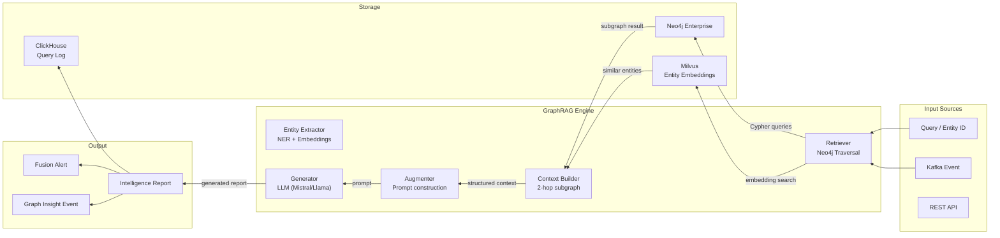

# SNI-SIDE: GraphRAG Intelligence Engine

## Architecture



## Core Components

### 1. Retriever
- exécute des requêtes Cypher paramétrées (1-hop, 2-hop, k-hop)
- recherche vectorielle Milvus pour les entités similaires (embeddings des profils)
- fusionne les résultats en un contexte structuré

### 2. Context Builder
- construit un sous-graphe JSON à partir des nœuds et relations récupérés
- déduplique et priorise les entités
- limite la taille du contexte (fenêtre de tokens configurables)

### 3. Generator
- utilise un LLM local (Mistral 7B via ollama ou vLLM) ou distant
- prompting few-shot avec des templates d'analyse criminelle
- génération structurée (JSON) : résumé, liens, risques, recommandations

### 4. Embedding Service
- encode les entités (personnes, véhicules, lieux) en vecteurs 768d
- stockage dans Milvus pour recherche de similarité sémantique
- mise à jour automatique sur les événements Kafka

## Query Patterns Supportés

| Pattern | Description | Requêtes Cypher |
|:--|:--|:--|
| `Entity Profile` | Profil complet d'une entité | (
  MATCH (c:Citizen {niu}) OPTIONAL MATCH (c)-[r]-(connected)
  RETURN c, type(r), connected
) |
| `Entity Link Analysis` | Analyse des connexions (2 hops) | MATCH (c:Citizen {niu})-[*1..2]-(connected) RETURN * |
| `Vehicle Network` | Réseau autour d'un véhicule | MATCH (v:Vehicle {plate})<-[*1..2]-(connected) RETURN * |
| `Financial Flow` | Flux financiers suspects | MATCH (a:BankAccount)-[:TRANSFERRED_TO*1..5]->(path) RETURN path |
| `Communication Network` | Réseau téléphonique/IP | MATCH (p:Phone {number})-[*1..2]-(connected) RETURN * |
| `Gang Network` | Structure et membres d'un gang | MATCH (g:Gang {name})-[*1..3]-(connected) RETURN * |
| `Cross-Entity Search` | Recherche d'entités similaires par embedding | Milvus search → Neo4j traversal |
| `Temporal Analysis` | Évolution temporelle d'un réseau | MATCH (c:Citizen {niu})-[r]-(connected) WHERE r.timestamp > $since RETURN * |

## Intelligence Report Schema

```json
{
  "report_id": "uuid",
  "report_type": "ENTITY_PROFILE | LINK_ANALYSIS | NETWORK_MAP | FINANCIAL_FLOW | TEMPORAL_ANALYSIS | CROSS_ENTITY",
  "generated_at": "timestamp",
  "target_entity": {
    "type": "Citizen | Vehicle | Phone | etc",
    "id": "niu | plate | etc",
    "label": "display name"
  },
  "executive_summary": "LLM-generated summary",
  "key_findings": ["finding 1", "finding 2", ...],
  "risk_assessment": {
    "overall_risk": "CRITICAL | HIGH | MEDIUM | LOW",
    "risk_factors": ["factor 1", ...],
    "confidence": 0.95
  },
  "graph_context": {
    "node_count": 42,
    "relationship_count": 87,
    "max_depth": 3,
    "subgraph_json": {...}
  },
  "connections": [
    {"entity": "...", "relationship": "...", "strength": 0.8}
  ],
  "timeline": [
    {"date": "...", "event": "...", "source": "..."}
  ],
  "recommendations": ["recommendation 1", ...],
  "related_cases": ["case_id_1", ...],
  "alerts_triggered": [
    {"alert_type": "...", "severity": "...", "description": "..."}
  ],
  "confidence_score": 0.92,
  "model_used": "Mistral-7B-Instruct-v0.3",
  "model_version": "2.1"
}
```

## Templates de Prompt (Few-Shot)

### Template Analyse Criminelle

```
Tu es un analyste de renseignement criminel senior pour le SNI-SIDE.
Analyse le profil et les connexions de l'entité suivante à partir du graphe d'intelligence.

ENTITÉ CIBLE:
- Type: {entity_type}
- Identifiant: {entity_id}
- Nom: {entity_label}

CONTEXTE DU GRAPHE:
{nœuds, relations, métriques}

Utilise uniquement les informations du graphe. Ne fabrique pas de preuves.
Structure ta réponse en JSON avec:
1. executive_summary (2-3 phrases)
2. key_findings (liste)
3. risk_level (CRITICAL/HIGH/MEDIUM/LOW)
4. connections_analysis (par type de relation)
5. recommendations (liste)
6. confidence (0.0-1.0)

Réponds uniquement en JSON valide.
```
