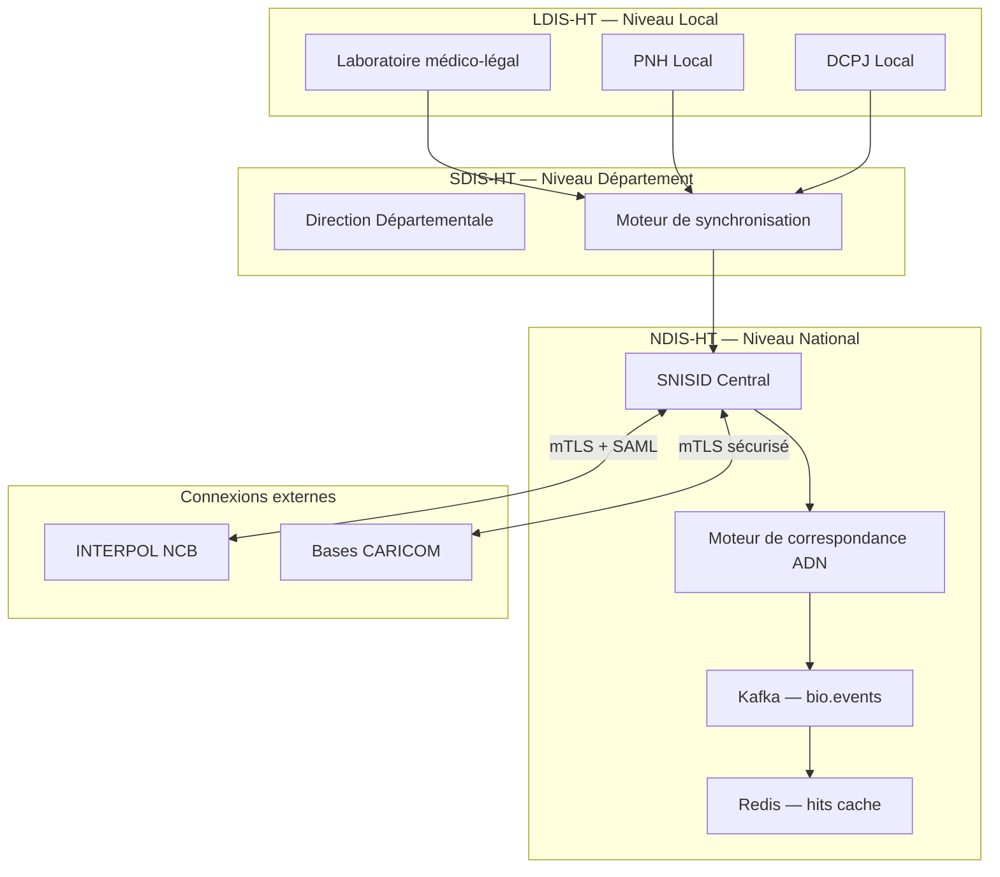

# 🧬 SNISID-BIO-ADN — Base de Données Biométrique et Criminelle Nationale
## Système National d'Indexation Sécurisée des Données ADN et Criminelles d'Haïti

**Document ID :** SNISID-BIO-ADN-001  
**Version :** 1.0.0  
**Date :** Juin 2026  
**Classification :** SOUVERAIN / INFRASTRUCTURE CRITIQUE NATIONALE  
**Statut :** ARCHITECTURE APPROUVÉE — PRODUCTION-READY  
**Modèle de référence :** CODIS (Combined DNA Index System) + NCIC (National Crime Information Center) — FBI/USA  

---

## 1. VISION ET MISSION

Le SNISID-BIO-ADN est l'**autorité nationale souveraine** de stockage, comparaison et gestion des profils biométriques et des données criminelles de la République d'Haïti. Il constitue l'équivalent haïtien du système CODIS-NCIC américain, adapté aux réalités juridiques, institutionnelles et techniques d'Haïti.

### 1.1 Objectifs fondamentaux

| Objectif | Description |
|----------|-------------|
| **Identification ADN** | Lier des profils ADN de scènes de crime à des individus fichés |
| **Personnes recherchées** | Centraliser les mandats d'arrêt nationaux (PNH, DCPJ, MJSP) |
| **Personnes disparues** | Index national des personnes portées disparues |
| **Registre criminel** | Casiers judiciaires inter-institutionnels |
| **Biens volés** | Véhicules, armes, documents, objets de valeur |
| **Terrorisme / gangs** | Index des personnes connues ou suspectées — tier sécurisé |

### 1.2 Différence avec SNISID Core

```
SNISID Core (identité civile)
    └── Qui est ce citoyen ? (NIU, biométrie, état civil)

SNISID-BIO-ADN (identité judiciaire)
    └── Ce citoyen a-t-il un profil ADN / casier / mandat ?
```

---

## 2. ARCHITECTURE HIÉRARCHIQUE (Modèle CODIS)

SNISID-BIO-ADN adopte la même architecture à trois niveaux que CODIS, adaptée à la structure administrative haïtienne.

```
┌─────────────────────────────────────────────────────────────────┐
│         NDIS-HT — Index National (SNISID Central / PAP)         │
│         Correspond au NDIS américain — FBI                       │
│         Opéré par : Direction Nationale SNISID + DCPJ centrale  │
└────────────────────┬────────────────────────────────────────────┘
                     │
         ┌───────────┼───────────┐
         ▼           ▼           ▼
┌──────────────┐ ┌──────────────┐ ┌──────────────────────────────┐
│  SDIS-OUEST  │ │  SDIS-NORD   │ ... 10 SDIS départementaux ...  │
│  (Port-au-   │ │  (Cap-       │                                  │
│  Prince)     │ │  Haïtien)    │                                  │
└──────┬───────┘ └──────┬───────┘ └──────────────────────────────┘
       │                │
  ┌────┴────┐      ┌────┴────┐
  ▼         ▼      ▼         ▼
LDIS      LDIS   LDIS      LDIS
(PNH)    (DCPJ) (Labo     (Parquet)
                 Légiste)
```

### 2.1 Les trois niveaux

| Niveau | Nom complet | Responsable | Correspond à |
|--------|-------------|-------------|--------------|
| **LDIS-HT** | Local Data Index System — Haïti | Laboratoires locaux PNH/DCPJ/ANH | LDIS — FBI |
| **SDIS-HT** | State Data Index System — Haïti | Direction Départementale SNISID | SDIS — FBI |
| **NDIS-HT** | National Data Index System — Haïti | SNISID Central + DCPJ Nationale | NDIS — FBI |

---

## 3. INDEX DE DONNÉES (Équivalent NCIC — 21 fichiers)

SNISID-BIO-ADN contient **23 index** répartis en 3 catégories.

### Catégorie A — Index ADN (inspiré CODIS)

| Index | Code | Description |
|-------|------|-------------|
| ADN Condamné | `BIO-CON` | Profils ADN des personnes condamnées |
| ADN Arresté | `BIO-ARR` | Profils ADN au moment de l'arrestation |
| ADN Scène de crime | `BIO-FSC` | Profils ADN issus de scènes de crime |
| ADN Personnes disparues | `BIO-DIS` | Profils ADN familiaux pour identification |
| ADN Restes humains non identifiés | `BIO-RNI` | Restes humains non identifiés |

### Catégorie B — Index Personnes (inspiré NCIC — 14 fichiers personnes)

| Index | Code | Description |
|-------|------|-------------|
| Personnes recherchées | `PER-REC` | Mandats nationaux (PNH, DCPJ, MJSP) |
| Fugitifs étrangers | `PER-FUG` | Recherchés par INTERPOL / pays étrangers |
| Personnes disparues | `PER-DIS` | Toutes catégories (enfants, adultes, catastrophe) |
| Personnes non identifiées | `PER-NID` | Cadavres ou personnes sans identité |
| Délinquants sexuels | `PER-SEX` | Registre national délinquants sexuels |
| Ordres de protection | `PER-OPR` | Ordonnances restrictives actives |
| Gang | `PER-GNG` | Membres connus de gangs armés |
| Terrorisme | `PER-TER` | Personnes suspectes terrorisme / financement |
| Violence connue | `PER-VIO` | Historique de violence grave |
| Vol d'identité | `PER-IDV` | Victimes et auteurs de vol d'identité |
| Libération conditionnelle | `PER-LIB` | Personnes sous surveillance judiciaire |

### Catégorie C — Index Biens (inspiré NCIC — 7 fichiers biens)

| Index | Code | Description |
|-------|------|-------------|
| Véhicules volés | `BIE-VEH` | Intégration avec FOVeS/SIV (MP-15) |
| Armes à feu volées | `BIE-ARM` | Numéros de série, calibres, types |
| Documents volés | `BIE-DOC` | Passeports, CINs, actes d'état civil |
| Biens précieux volés | `BIE-OBJ` | Bijoux, œuvres d'art, équipements |
| Plaques minéralogiques | `BIE-PLQ` | Intégration avec LAPI (MP-16) |
| Titres et valeurs | `BIE-TIT` | Chèques, obligations, titres de propriété |
| Embarcations | `BIE-EMB` | Bateaux (critique pour Haïti — côtes) |

---

## 4. FLUX DE DONNÉES ET COMMUNICATION



---

## 5. INTÉGRATION AVEC LES MODULES SNISID EXISTANTS

| Module SNISID | Type d'intégration | Kafka Topic |
|---------------|-------------------|-------------|
| **FPR (MP-17)** | Alimentation de `PER-REC` et `PER-FUG` | `snisid.fpr.wanted.events` |
| **LAPI (MP-16)** | Lecture de `BIE-PLQ` en temps réel | `snisid.lapi.plate.query` |
| **FOVeS/SIV (MP-15)** | Alimentation de `BIE-VEH` | `snisid.foves.vehicle.events` |
| **SNISID Core** | Validation NIU pour indexation ADN | `snisid.identity.verified` |
| **DCPJ** | Écriture dans `PER-TER`, `PER-GNG` | `snisid.dcpj.intel.events` |

---

## 6. STRUCTURE DES FICHIERS DE CE MODULE

```
SNISID-BIO-ADN/
├── SNISID-BIO-ADN-MASTER.md          ← Ce document
├── core/
│   ├── SNISID-BIO-ARCHITECTURE.md    ← Architecture technique détaillée
│   ├── SNISID-BIO-DATA-MODELS.md     ← Schémas PostgreSQL complets
│   └── SNISID-BIO-SECURITY.md        ← Contrôles d'accès et chiffrement
├── LDIS/
│   └── SNISID-LDIS-OPERATIONS.md     ← Opérations niveau local
├── SDIS/
│   └── SNISID-SDIS-SYNC.md           ← Synchronisation départementale
├── NDIS/
│   └── SNISID-NDIS-NATIONAL.md       ← Index national et matching
├── indexes/
│   ├── SNISID-INDEX-ADN.md           ← Spécifications index ADN (CODIS)
│   ├── SNISID-INDEX-PERSONNES.md     ← Spécifications index personnes (NCIC)
│   └── SNISID-INDEX-BIENS.md         ← Spécifications index biens (NCIC)
├── governance/
│   ├── SNISID-BIO-LEGAL.md           ← Base légale haïtienne
│   └── SNISID-BIO-QUALITY.md         ← Normes qualité ADN (ISO 18385)
├── kafka/
│   └── SNISID-BIO-KAFKA-TOPICS.md    ← Topics et schémas Avro
├── postgresql/
│   └── SNISID-BIO-SCHEMAS.md         ← Migrations SQL complètes
├── go-services/
│   └── SNISID-BIO-SERVICES.md        ← Services Go (gRPC + REST)
├── api/
│   └── SNISID-BIO-API.md             ← Endpoints FastAPI + OpenAPI
└── tests/
    └── SNISID-BIO-TESTS.md           ← Plan de tests et cas de validation
```

---

## 7. STATUT DE CONFORMITÉ

| Norme | Statut | Note |
|-------|--------|------|
| ISO 18385 (Contamination ADN) | 🟡 À implémenter | Standard international labo |
| SWGDAM Guidelines | 🟡 À adapter | Guide ADN forensique USA |
| INTERPOL DNA Gateway | 🟡 À certifier | Partage international ADN |
| NIST STR loci (20 loci CODIS) | ✅ Intégré | Standard profil ADN |
| RGPD / LGPD Haïti | 🔴 Décret requis | Base légale biométrie judiciaire |
| ISO/IEC 27001 | 🟡 En cours | Sécurité système |
