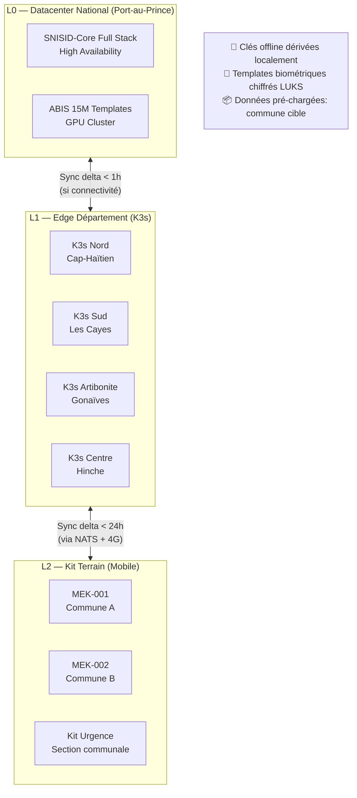

---
# ============================================================
# SNISID-Core — Offline-First Architecture
# K3s Edge + NATS JetStream + Delta Sync + Conflict Resolution
# Document ID: SNISID-OFFLINE-001
# Version: 1.0.0
# ============================================================

## 1. ARCHITECTURE OFFLINE-FIRST

SNISID est conçu pour fonctionner **sans connexion** vers les datacenters centraux pendant 30+ jours. L'offline-first est un impératif souverain, pas une fonctionnalité optionnelle.

### 1.1 Niveaux d'Autonomie



### 1.2 Capacités par Niveau

| Capacité | L0 (Central) | L1 (Département) | L2 (Kit) |
|---------|-------------|-----------------|--------|
| Enrôlement | ✅ Full | ✅ Full (30j) | ✅ Limited (30j) |
| Vérification 1:1 bio | ✅ < 100ms | ✅ < 150ms | ✅ < 300ms |
| Vérification 1:N bio | ✅ Full ABIS | ✅ Département | ❌ Différé |
| État civil | ✅ Full | ✅ Local | ✅ Local |
| PKI émission | ✅ Online | ✅ Pré-issuée | ✅ Pré-issuée |
| Sync vers central | — | < 1h | < 24h |
| Autonomie | 24/7 | 30 jours | 30 jours |

---

## 2. K3S EDGE NODE — Configuration

```yaml
# k3s-edge-config.yaml (déployé sur serveur Linux edge)
# Compatible: Ubuntu 22.04 LTS, 8 vCPU, 16GB RAM, 500GB NVMe (LUKS)

# Installation K3s
# curl -sfL https://get.k3s.io | K3S_TOKEN=${CLUSTER_TOKEN} sh -s - server \
#   --cluster-init \
#   --disable=traefik \
#   --disable=servicelb \
#   --tls-san="${EDGE_FQDN}" \
#   --node-label="snisid.gov.ht/tier=edge" \
#   --node-label="snisid.gov.ht/departement=${DEPARTEMENT}" \
#   --protect-kernel-defaults \
#   --secrets-encryption \
#   --kube-apiserver-arg="audit-log-path=/var/log/k3s-audit.log" \
#   --kube-apiserver-arg="audit-log-maxsize=100" \
#   --kube-apiserver-arg="audit-log-maxbackup=10"

---
# Edge namespace
apiVersion: v1
kind: Namespace
metadata:
  name: snisid-edge
  labels:
    snisid.gov.ht/role: edge-node
    snisid.gov.ht/departement: "${DEPARTEMENT}"

---
# Edge Identity Service (version légère)
apiVersion: apps/v1
kind: Deployment
metadata:
  name: identity-service-edge
  namespace: snisid-edge
spec:
  replicas: 1
  selector:
    matchLabels:
      app: identity-service-edge
  template:
    metadata:
      labels:
        app: identity-service-edge
    spec:
      containers:
      - name: identity-service
        image: harbor.snisid.gov.ht/snisid/identity-service:1.0.0-edge
        env:
        - name: MODE
          value: OFFLINE_EDGE
        - name: DEPARTEMENT
          valueFrom:
            fieldRef:
              fieldPath: metadata.labels['snisid.gov.ht/departement']
        - name: CENTRAL_SYNC_URL
          value: "https://api.snisid.gov.ht/v1/sync"
        - name: LOCAL_DB_PATH
          value: "/data/snisid.db"
        - name: NATS_URL
          value: "nats://nats-edge.snisid-edge.svc.cluster.local:4222"
        resources:
          requests:
            memory: 512Mi
            cpu: 250m
          limits:
            memory: 2Gi
            cpu: "1"
        volumeMounts:
        - name: edge-data
          mountPath: /data
          readOnly: false
      volumes:
      - name: edge-data
        persistentVolumeClaim:
          claimName: edge-data-pvc

---
apiVersion: v1
kind: PersistentVolumeClaim
metadata:
  name: edge-data-pvc
  namespace: snisid-edge
spec:
  accessModes: [ReadWriteOnce]
  storageClassName: local-path
  resources:
    requests:
      storage: 100Gi  # Templates biométriques département + données civiles

---
# NATS JetStream (Message Queue Offline)
apiVersion: apps/v1
kind: StatefulSet
metadata:
  name: nats-edge
  namespace: snisid-edge
spec:
  serviceName: nats-edge
  replicas: 1
  selector:
    matchLabels:
      app: nats-edge
  template:
    metadata:
      labels:
        app: nats-edge
    spec:
      containers:
      - name: nats
        image: harbor.snisid.gov.ht/nats/nats:2.10-alpine
        args:
        - --config
        - /etc/nats/nats.conf
        - --jetstream
        - --store_dir=/data
        - --max_file_store=50GB
        ports:
        - name: client
          containerPort: 4222
        - name: cluster
          containerPort: 6222
        - name: monitor
          containerPort: 8222
        resources:
          requests:
            memory: 256Mi
            cpu: 100m
          limits:
            memory: 1Gi
            cpu: 500m
        volumeMounts:
        - name: nats-data
          mountPath: /data
      volumes:
      - name: nats-data
        persistentVolumeClaim:
          claimName: nats-data-pvc

---
apiVersion: v1
kind: PersistentVolumeClaim
metadata:
  name: nats-data-pvc
  namespace: snisid-edge
spec:
  accessModes: [ReadWriteOnce]
  storageClassName: local-path
  resources:
    requests:
      storage: 50Gi   # Queue offline pour 30 jours

---
apiVersion: v1
kind: Service
metadata:
  name: nats-edge
  namespace: snisid-edge
spec:
  selector:
    app: nats-edge
  ports:
  - name: client
    port: 4222
    targetPort: 4222
  - name: monitor
    port: 8222
    targetPort: 8222
  type: ClusterIP
```

---

## 3. NATS JETSTREAM — Streams & Consumers

```go
// offline-sync/streams/setup.go
package streams

import (
    "context"
    "github.com/nats-io/nats.go/jetstream"
)

// SetupOfflineStreams configure les streams JetStream sur le node edge
func SetupOfflineStreams(ctx context.Context, js jetstream.JetStream) error {
    // Stream: Enrollments (accumule pendant offline)
    _, err := js.CreateOrUpdateStream(ctx, jetstream.StreamConfig{
        Name:     "SNISID_ENROLLMENTS",
        Subjects: []string{"snisid.enrollment.>"},
        MaxAge:   30 * 24 * time.Hour,  // 30 jours de rétention
        Storage:  jetstream.FileStorage,
        Replicas: 1,
        MaxBytes: 10 * 1024 * 1024 * 1024,  // 10GB
        Compression: jetstream.S2Compression,
    })
    if err != nil {
        return fmt.Errorf("enrollment stream: %w", err)
    }

    // Stream: Civil Acts (actes état civil offline)
    _, err = js.CreateOrUpdateStream(ctx, jetstream.StreamConfig{
        Name:     "SNISID_CIVIL_ACTS",
        Subjects: []string{"snisid.civil.>"},
        MaxAge:   30 * 24 * time.Hour,
        Storage:  jetstream.FileStorage,
        Replicas: 1,
        MaxBytes: 5 * 1024 * 1024 * 1024,   // 5GB
    })
    if err != nil {
        return fmt.Errorf("civil stream: %w", err)
    }

    // Stream: Sync Queue (vers datacenter central)
    _, err = js.CreateOrUpdateStream(ctx, jetstream.StreamConfig{
        Name:       "SNISID_SYNC_QUEUE",
        Subjects:   []string{"snisid.sync.>"},
        MaxAge:     30 * 24 * time.Hour,
        Storage:    jetstream.FileStorage,
        Replicas:   1,
        MaxBytes:   20 * 1024 * 1024 * 1024,  // 20GB
        Discard:    jetstream.DiscardOld,
        MaxMsgsPerSubject: 10000,
    })
    if err != nil {
        return fmt.Errorf("sync queue stream: %w", err)
    }

    return nil
}
```

---

## 4. DELTA SYNC ENGINE

```go
// offline-sync/engine/sync.go
package engine

import (
    "context"
    "crypto/sha256"
    "encoding/json"
    "fmt"
    "time"
)

// SyncEngine gère la synchronisation bidirectionnelle edge ↔ central
type SyncEngine struct {
    localDB     *sqlite.DB
    natsClient  *nats.Conn
    centralURL  string
    httpClient  *http.Client
    deviceID    string
    logger      *zap.Logger
}

// SyncResult résultat d'une synchronisation
type SyncResult struct {
    SessionID    string        `json:"session_id"`
    StartedAt    time.Time     `json:"started_at"`
    CompletedAt  time.Time     `json:"completed_at"`
    Pushed       int           `json:"records_pushed"`
    Pulled       int           `json:"records_pulled"`
    Conflicts    int           `json:"conflicts"`
    Errors       []string      `json:"errors,omitempty"`
    NetworkBytes int64         `json:"network_bytes"`
}

// Sync déclenche une synchronisation complète
func (s *SyncEngine) Sync(ctx context.Context) (*SyncResult, error) {
    sessionID := uuid.New().String()
    result := &SyncResult{
        SessionID: sessionID,
        StartedAt: time.Now(),
    }
    
    s.logger.Info("Démarrage synchronisation",
        zap.String("session_id", sessionID),
        zap.String("device_id", s.deviceID))
    
    // Phase 1: Push les données offline vers le central
    pushed, err := s.pushPending(ctx, sessionID)
    if err != nil {
        return nil, fmt.Errorf("push failed: %w", err)
    }
    result.Pushed = pushed
    
    // Phase 2: Pull les mises à jour depuis le central (delta)
    pulled, err := s.pullUpdates(ctx, sessionID)
    if err != nil {
        s.logger.Warn("Pull partiel", zap.Error(err))
    }
    result.Pulled = pulled
    
    // Phase 3: Résolution des conflits
    conflicts, err := s.resolveConflicts(ctx, sessionID)
    if err != nil {
        s.logger.Error("Conflict resolution failed", zap.Error(err))
    }
    result.Conflicts = conflicts
    
    result.CompletedAt = time.Now()
    
    s.logger.Info("Synchronisation terminée",
        zap.String("session_id", sessionID),
        zap.Int("pushed", pushed),
        zap.Int("pulled", pulled),
        zap.Int("conflicts", conflicts),
        zap.Duration("duration", result.CompletedAt.Sub(result.StartedAt)))
    
    return result, nil
}

// pushPending envoie les enrôlements et actes locaux vers le central
func (s *SyncEngine) pushPending(ctx context.Context, sessionID string) (int, error) {
    rows, err := s.localDB.QueryContext(ctx, `
        SELECT id, type, payload, created_at, device_id, agent_id, signature
        FROM pending_sync
        WHERE synced_at IS NULL
        ORDER BY created_at ASC
        LIMIT 1000
    `)
    if err != nil {
        return 0, err
    }
    defer rows.Close()
    
    var records []SyncRecord
    for rows.Next() {
        var r SyncRecord
        if err := rows.Scan(&r.ID, &r.Type, &r.Payload, &r.CreatedAt, &r.DeviceID, &r.AgentID, &r.Signature); err != nil {
            return 0, err
        }
        records = append(records, r)
    }
    
    if len(records) == 0 {
        return 0, nil
    }
    
    // Vérifier les signatures avant d'envoyer
    for i, r := range records {
        if !s.verifySignature(r) {
            s.logger.Warn("Enregistrement avec signature invalide ignoré",
                zap.String("id", r.ID))
            records = append(records[:i], records[i+1:]...)
        }
    }
    
    // Batch push vers API centrale
    batch := SyncBatch{
        SessionID: sessionID,
        DeviceID:  s.deviceID,
        Records:   records,
        Hash:      s.computeBatchHash(records),
    }
    
    resp, err := s.httpClient.PostJSON(ctx, s.centralURL+"/v1/sync/push", batch)
    if err != nil {
        // Conserver en queue NATS pour retry
        s.natsClient.Publish("snisid.sync.retry", mustMarshal(batch))
        return 0, fmt.Errorf("central push failed: %w", err)
    }
    
    // Marquer comme synchronisés
    ids := make([]string, len(records))
    for i, r := range records {
        ids[i] = r.ID
    }
    s.localDB.ExecContext(ctx, `
        UPDATE pending_sync SET synced_at = NOW(), sync_session_id = ?
        WHERE id IN (?)
    `, sessionID, strings.Join(ids, ","))
    
    s.logger.Info("Push complété", zap.Int("records", len(records)), zap.Int("ack", resp.AcknowledgedCount))
    return len(records), nil
}

// resolveConflicts gère les conflits de synchronisation
func (s *SyncEngine) resolveConflicts(ctx context.Context, sessionID string) (int, error) {
    // Politique "Last-Write-Wins avec exceptions"
    // - Données démographiques: version centrale prime (SI signée par admin)
    // - Biométrie: version enrollée la plus récente prime
    // - Actes état civil: JAMAIS écrasés (immutables)
    // - Statut identité: central prime toujours (DECEASED, SUSPENDED)
    
    conflicts, err := s.localDB.QueryContext(ctx, `
        SELECT id, type, local_version, central_version, conflict_type
        FROM sync_conflicts
        WHERE resolved_at IS NULL
        AND session_id = ?
    `, sessionID)
    if err != nil {
        return 0, err
    }
    
    count := 0
    for conflicts.Next() {
        var c ConflictRecord
        conflicts.Scan(&c.ID, &c.Type, &c.LocalVersion, &c.CentralVersion, &c.ConflictType)
        
        switch c.ConflictType {
        case "DEMOGRAPHIC_MISMATCH":
            // Central prime (données démographiques)
            s.resolveUseCentral(ctx, c)
        case "STATUS_CONFLICT":
            // Central prime TOUJOURS (DECEASED, SUSPENDED)
            s.resolveUseCentral(ctx, c)
        case "BIOMETRIC_DUPLICATE":
            // Signaler au système central — investigation DCPJ
            s.reportConflictToCentral(ctx, c)
        case "CIVIL_ACT_OVERLAP":
            // Impossible (immutable) — log d'erreur
            s.logger.Error("Conflit acte état civil — impossible!", zap.String("id", c.ID))
        }
        count++
    }
    
    return count, nil
}
```

---

## 5. PROTOCOLE DE SYNC MULTI-NIVEAU

```
MEK (Kit Terrain) → Edge Node Département → Datacenter Central

Étape 1: Compression + Signature
    gzip compress payload
    Signer avec certificat PKI MEK (ECDSA P-256)
    
Étape 2: Transmission (TLS 1.3 minimum)
    Si 4G disponible: HTTPS direct
    Si WiFi: HTTPS via edge local
    Si aucune connectivité: USB chiffré (air-gap transfer)
    
Étape 3: Validation centrale
    Vérifier signature PKI MEK
    Valider format et intégrité des données
    Exécuter déduplication biométrique ABIS (1:N)
    Résoudre conflits
    Retourner ACK signé

Étape 4: Mise à jour locale
    Appliquer mises à jour (statuts, corrections)
    Rafraîchir cache biométrique local
    Mettre à jour liste CRL (révocations)
    
SLA:
    Sync automatique: toutes les 4h (si connectivité)
    Sync manuel: sur demande agent (avant fin de journée)
    Sync urgence: < 15 min (cas critiques: décès, fraude)
```

---

## 6. CHIFFREMENT DES DONNÉES OFFLINE

```bash
# Chiffrement du volume de données offline (MEK)
# LUKS2 + Argon2id KDF + clé liée au TPM 2.0

# Créer volume LUKS2 chiffré
cryptsetup luksFormat \
    --type luks2 \
    --cipher aes-xts-plain64 \
    --key-size 512 \
    --hash sha512 \
    --pbkdf argon2id \
    --pbkdf-memory 2097152 \    # 2GB mémoire pour dériver la clé
    --pbkdf-parallel 4 \
    --iter-time 5000 \
    /dev/nvme0n1p2

# Lier la clé au TPM 2.0 (clevis)
clevis luks bind -d /dev/nvme0n1p2 tpm2 '{"pcr_ids":"0,1,4,7"}'
# PCR 0: BIOS firmware
# PCR 1: BIOS configuration  
# PCR 4: Bootloader
# PCR 7: Secure Boot state

# Ouvrir le volume (nécessite TPM intact + PCR values)
clevis luks unlock -d /dev/nvme0n1p2 -n snisid-data

# Monter
mount /dev/mapper/snisid-data /mnt/snisid-data
```

---

*Document ID : SNISID-OFFLINE-001 v1.0.0 — Mai 2026*  
*K3s Edge + NATS JetStream + Delta Sync + Conflict Resolution*  
*Approuvé par : DG-AND | Platform Engineering Lead | CISO National*
