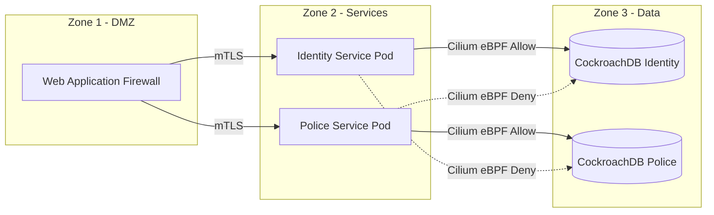

# SNISID — GLOBAL SYSTEM TOPOLOGY
**Architecture Transversale des 7 Phases**

Ce document cartographie l'interaction entre les 7 phases du programme SNISID. 
L'objectif est de démontrer comment une donnée (ex: l'empreinte digitale d'un citoyen) traverse l'ensemble de l'architecture gouvernementale.

## 1. MACRO-ARCHITECTURE GOUVERNEMENTALE

Le système repose sur un modèle en couches (Layered Architecture). Le trafic Nord-Sud représente l'accès des utilisateurs finaux (Fonctionnaires, Citoyens), et le trafic Est-Ouest représente l'interopérabilité entre les ministères.

```mermaid
graph TD
    %% EXTERNAL ACTORS
    User[Fonctionnaire / Police Terrain (Phase 7)]
    Citoyen[Portail Citoyen]

    %% PHASE 4 - INTEROPERABILITY
    subgraph "Phase 4 - Interoperability Layer"
        APIGW[National API Gateway - Kong]
        KAFKA[Event Bus - Data Exchange]
    end

    %% PHASE 2 - IDENTITY & CIVIL
    subgraph "Phase 2 - National Identity Services"
        ID_REG[(Identity Registry DB)]
        ABIS[Biometric Engine GPU]
        CIVIL[Civil Registry BPMN]
    end

    %% PHASE 3 - SECURITY & JUSTICE
    subgraph "Phase 3 - National Security Platform"
        POLICE[(Police Database)]
        JUSTICE[Justice Workflow]
    end

    %% PHASE 6 - CYBERDEFENSE
    subgraph "Phase 6 - Cyber Defense Shield"
        SOC[SOC / SIEM]
        ZT[Zero Trust Policy Engine]
    end

    %% PHASE 5 - INFRASTRUCTURE
    subgraph "Phase 5 & 1 - Sovereign Infrastructure"
        K8S[RKE2 Kubernetes Clusters]
        MINIO[(MinIO WORM Storage)]
    end

    %% CONNECTIONS
    User -->|mTLS| APIGW
    Citoyen -->|HTTPS| APIGW
    
    APIGW -->|Check Policy| ZT
    ZT -->|Allow| ID_REG
    ZT -->|Allow| POLICE
    
    ID_REG -->|Event Stream| KAFKA
    POLICE -->|Event Stream| KAFKA
    
    KAFKA -->|Triggers| CIVIL
    KAFKA -->|Triggers| JUSTICE
    
    APIGW -.->|Logs| SOC
    ID_REG -.->|Logs| SOC
    
    ID_REG --- K8S
    POLICE --- K8S
    SOC --- MINIO
```

## 2. CYCLE DE VIE TRANSVERSAL D'UNE DONNÉE (Ex: Décès)

Lorsqu'un citoyen décède dans un hôpital de province, voici comment l'information traverse les 7 phases :

1. **Phase 7 (Offline Edge) :** Un médecin dans un dispensaire de montagne (sans réseau) constate le décès et l'enregistre sur sa tablette. La tablette chiffre l'information et la stocke.
2. **Phase 7 (Sync) :** Dès que le réseau VSAT remonte, la tablette pousse l'acte de décès vers le *Sync Engine*.
3. **Phase 4 (API Gateway) :** L'acte de décès frappe la *National API Gateway*.
4. **Phase 6 (Zero Trust) :** Le *Policy Engine* (OPA) vérifie que la tablette du médecin est certifiée et que le certificat PKI du médecin est valide.
5. **Phase 2 (Civil Registry) :** L'acte de décès est inscrit dans le registre d'État Civil. Le *Citizen Lifecycle Engine* fait passer le statut de l'identité de `ACTIVE` à `DECEASED`.
6. **Phase 4 (Data Exchange) :** Un événement Kafka `IdentityDeceased` est publié sur le bus national.
7. **Phase 3 (Police/Justice) :** La Police et la Justice reçoivent l'événement et clôturent automatiquement d'éventuelles enquêtes ou mandats en cours contre le défunt.
8. **Phase 6 (Cyber) :** Le SIEM ingère les logs de toute la transaction. Le SOC vérifie l'absence de comportement suspect (ex: médecin déclarant 50 décès en 1 minute).
9. **Phase 5 (Infrastructure) :** Les données sont sauvegardées de manière immuable sur le stockage S3 WORM du Datacenter Primaire, et répliquées au Datacenter de Secours.
10. **Phase 0 (Gouvernance) :** L'ensemble de la transaction respecte l'article de loi sur l'État Civil, validant ainsi la chaîne de bout en bout.

## 3. MODÈLE ZERO TRUST DE MICROSEGMENTATION

Même au sein du Datacenter, l'accès est strictement segmenté (Phase 6 & 1).


*(Le service d'identité ne peut pas parler physiquement à la base de la police, même s'ils sont sur le même réseau Kubernetes, bloquant ainsi tout mouvement latéral d'un attaquant).*
