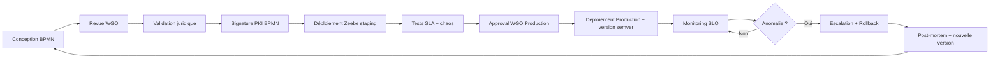

# 📐 NATIONAL WORKFLOW FACTORY — ARCHITECTURE

> **Document fondateur — Phase 3 / Étape 1**
> Version : 1.0.0 — Classification : OFFICIEL / DIFFUSION RESTREINTE

---

## 1. Mission

Le **National Workflow Factory (NWF)** est le **moteur administratif central** de la République d'Haïti.
Il orchestre, standardise et industrialise **l'ensemble des processus de l'État** :
état civil, identité, justice, élections, fiscalité, immigration, santé, audit, sécurité.

> Une action administrative non exécutée par le NWF est **réputée invalide**.

---

## 2. Principes Fondateurs (NON NÉGOCIABLES)

| # | Principe | Description |
|---|----------|-------------|
| P1 | **Tout est workflow** | Chaque acte administratif = une instance BPMN |
| P2 | **Tout est événement** | Chaque transition produit un événement Kafka |
| P3 | **Tout est audité** | Event sourcing immuable + signature PKI |
| P4 | **Tout est versionné** | SemVer + GitOps + Camunda version sets |
| P5 | **Tout est mesurable** | SLA/SLO par workflow |
| P6 | **Tout est résilient** | Offline-first + replay + saga compensation |
| P7 | **Tout est gouverné** | Aucune mise en production sans WGO approval |
| P8 | **Tout est légalement opposable** | Signature qualifiée + horodatage RFC 3161 |

---

## 3. Domaines fonctionnels du Factory

| Domaine | Fonction | Moteur |
|---------|----------|--------|
| **BPMN** | Orchestration de processus métier | Camunda 8 / Zeebe |
| **Event workflows** | Réaction à événements asynchrones | Kafka + Temporal |
| **Human workflows** | Validation humaine, 4-eyes, approvals | Camunda Tasklist |
| **Legal workflows** | Contrôle juridique, signature qualifiée | PKI + DocuSign-like |
| **Escalation workflows** | Gestion de crise, dépassement SLA | Temporal + PagerDuty |
| **Audit workflows** | Traçabilité, signature, conservation légale | Event Sourcing + WORM |
| **Offline workflows** | Résilience terrain, sync différée | CRDT + Outbox + Temporal |

---

## 4. Stack Technologique de Référence

| Couche | Technologie | Justification |
|--------|-------------|---------------|
| Modélisation BPMN | **Camunda 8 Modeler** (BPMN 2.0 + DMN 1.3) | Standard ISO 19510, open source |
| Moteur BPMN | **Zeebe** (Camunda 8) | Cloud-native, scale horizontal |
| Orchestration code-first | **Temporal.io** | Workflows long-running, sagas, retries natifs |
| Bus d'événements | **Apache Kafka 3.7+** (KRaft mode) | Standard industrie, replay, multi-DC |
| Schéma événements | **Apache Avro** + **Confluent Schema Registry** | Compatibilité forte, versioning |
| State Machines | **Temporal Signals** + **Camunda DMN** | Décisions auditables |
| API orchestration | **gRPC** (interne) + **REST/OpenAPI** (externe) | Performance + interop |
| Identité workflow | **OIDC** + **mTLS** + **SPIFFE/SPIRE** | Zero-trust |
| Stockage state | **PostgreSQL 16** (Camunda) + **Cassandra** (Temporal) | Durabilité + scale |
| Signatures | **PKI nationale SNISID** (Phase 1) + **RFC 3161 TSA** | Opposabilité légale |
| Observabilité | **Prometheus + Grafana + Loki + Tempo + OpenTelemetry** | CNCF, ouvert |
| GitOps BPMN | **GitLab + ArgoCD + Camunda Modeler CLI** | Reproductibilité |

---

## 5. Architecture Cible (Vue Logique)

```
                  ┌──────────────────────────────────────────────┐
                  │   CITIZEN / AGENT / AGENCY  (UI / API / Mobile / Kiosk) │
                  └───────────────────────┬──────────────────────┘
                                          │
                                          ▼
                  ┌──────────────────────────────────────────────┐
                  │      🛡  API GATEWAY (Kong + OIDC + mTLS)     │
                  └───────────────────────┬──────────────────────┘
                                          │
        ┌─────────────────────────────────┼─────────────────────────────────┐
        ▼                                 ▼                                 ▼
┌───────────────┐                ┌───────────────┐                ┌───────────────┐
│  CAMUNDA 8    │◄──── DMN ────► │  TEMPORAL.IO  │◄──── gRPC ───► │  HUMAN TASK   │
│  (Zeebe)      │                │  (Sagas long  │                │   SERVICE     │
│  BPMN engine  │                │   running)    │                │  (Tasklist)   │
└───────┬───────┘                └───────┬───────┘                └───────┬───────┘
        │                                │                                │
        └────────────────┬───────────────┴────────────────┬───────────────┘
                         │                                │
                         ▼                                ▼
              ┌─────────────────────┐         ┌─────────────────────┐
              │  KAFKA EVENT MESH   │◄───────►│  SCHEMA REGISTRY    │
              │  (KRaft, mTLS, ACL) │         │   (Avro, SemVer)    │
              └──────────┬──────────┘         └─────────────────────┘
                         │
   ┌─────────────────────┼───────────────────────────────────────────┐
   ▼                     ▼                                           ▼
┌────────┐         ┌────────────┐                              ┌──────────┐
│ AUDIT  │         │ DOMAIN     │  …(Civil Reg, Identity,      │ OFFLINE  │
│ (WORM) │         │ MICROSVCS  │     Judicial, Fiscal, etc.)  │ SYNC HUB │
└────────┘         └────────────┘                              └──────────┘
                         │
                         ▼
                ┌──────────────────────┐
                │ PKI + TSA + SIGNATURE│
                │  (Phase 1 backbone)  │
                └──────────────────────┘
```

---

## 6. Topologie Physique (Régions Haïti)

| Région | Rôle | Réplication |
|--------|------|-------------|
| **Port-au-Prince DC1** | Primaire — moteur, leader Kafka | Active |
| **Cap-Haïtien DC2** | Secondaire — moteur, broker Kafka | Active-Active |
| **Les Cayes DC3** | DR — réplication asynchrone | Standby |
| **Communes (700+)** | Edge offline — Outbox local + sync | Périodique |

- **RPO** : ≤ 60 secondes (zone critique)
- **RTO** : ≤ 15 minutes (zone critique)
- **Stretch cluster Kafka** entre DC1↔DC2 avec `min.insync.replicas=2`

---

## 7. Cycle de Vie d'un Workflow



---

## 8. Sécurité du Factory

| Contrôle | Mise en œuvre |
|----------|---------------|
| Authentification | OIDC (Keycloak national) + mTLS SPIFFE |
| Autorisation | RBAC + ABAC (OPA/Rego) par workflow |
| Confidentialité | TLS 1.3 partout, chiffrement at-rest AES-256-GCM |
| Intégrité | Signature BPMN (PKI) + hash SHA-384 |
| Non-répudiation | Horodatage TSA RFC 3161 + journal WORM |
| Disponibilité | Multi-DC + offline-first |
| Audit | Tous les événements en append-only sur Kafka topic `audit.*` |

---

## 9. Interfaces avec autres phases

| Phase | Interface |
|-------|-----------|
| Phase 1 (Identité) | API `identity.verify`, événements `identity.*` |
| Phase 2 (Cyber) | SIEM ingestion via topic `security.*`, OPA policies |
| Phase 4 (Interop intl) | Pont ICAO via topic `interop.icao.*` |

---

## 10. Gouvernance (cf. doc 08)

- **Workflow Governance Office (WGO)** : autorité unique de mise en production
- **BPMN Review Board (BRB)** : revue technique
- **Legal Validation Board (LVB)** : conformité juridique
- **CAB Tickets** : changements suivis via GitOps

---

## 11. Indicateurs Clés (KPI Factory)

| KPI | Cible |
|-----|-------|
| Disponibilité moteur | 99,95 % |
| Latence p99 démarrage workflow | < 500 ms |
| Taux de succès workflows critiques | ≥ 99,9 % |
| Délai moyen escalade respect SLA | < 5 min |
| Couverture audit | 100 % |
| Workflows signés PKI | 100 % |

---

## 12. Annexes

- A. Glossaire BPMN / Temporal / Kafka
- B. Matrice de criticité par domaine
- C. Plan de capacité (cf. `docs/capacity-plan.md`)
- D. Risques et registre RACI

---

**Approuvé par :** Workflow Governance Office — Office National d'Identification
**Date d'effet :** Phase 3 — 2026
