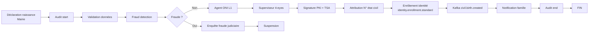

# 📜 BPMN ÉTAT CIVIL — Industrialisation de l'État Civil National

> **Phase 3 / Étape 3** — Workflows état civil haïtien.
> Version : 1.0.0
> Classification : OFFICIEL

---

## 1. Mission

> **Industrialiser l'état civil national** : naissance, décès, mariage, divorce, adoption, disparition.

Chaque acte d'état civil devient un workflow BPMN national, versionné, signé, audité et opposable devant les tribunaux haïtiens.

---

## 2. Cadre Légal

| Source | Référence |
|--------|-----------|
| **Code civil haïtien** | Livre Ier — Des personnes (état civil) |
| **Loi sur la nationalité** | 1984 et amendements |
| **Code de l'enfance** | IBESR pour adoption |
| **Convention de La Haye** | 1993 (adoption internationale) |
| **Constitution 1987 amendée** | Droit à l'identité |
| **Loi sur les officiers d'état civil** | Mairies + tribunaux |
| **Décret SNISID-WGO-001** | Création du Workflow Governance Office |

---

## 3. Catalogue des Workflows État Civil (16 BPMN)

### 3.1 NAISSANCE (5 workflows)

| Workflow | Fichier | SLA | Description |
|----------|---------|-----|-------------|
| `civil-registry.birth.simple` | `BPMN/Civil-Registry/birth-simple.v1.0.0.bpmn` | **24h** | Naissance déclarée dans le délai légal (Mairie) |
| `civil-registry.birth.recognition` | `BPMN/Civil-Registry/birth-recognition.v1.0.0.bpmn` | **72h** | Naissance par reconnaissance juridique (paternité/maternité tardive) |
| `civil-registry.birth.late-declaration` | `BPMN/Civil-Registry/birth-late-declaration.v1.0.0.bpmn` | **30j** | Déclaration tardive — régularisation (preuves : témoins, médical, école) |
| `civil-registry.birth.executive-decree` | `BPMN/Civil-Registry/birth-executive-decree.v1.0.0.bpmn` | **90j** | Naissance par décret exécutif (cas exceptionnels) |
| `civil-registry.birth.judicial-judgment` | `BPMN/Civil-Registry/birth-judicial-judgment.v1.0.0.bpmn` | **60j** | Naissance par jugement (minutes judiciaires) |

### 3.2 DÉCÈS (4 workflows)

| Workflow | Fichier | SLA | Description |
|----------|---------|-----|-------------|
| `civil-registry.death.standard` | `BPMN/Civil-Registry/death-standard.v1.0.0.bpmn` | **24h** | Décès standard avec certificat médical |
| `civil-registry.death.judicial` | `BPMN/Civil-Registry/death-judicial.v1.0.0.bpmn` | **30j** | Décès constaté par décision judiciaire |
| `civil-registry.death.disaster` | `BPMN/Civil-Registry/death-disaster.v1.0.0.bpmn` | **7j** | Décès collectif (séisme, ouragan, épidémie) — batch DGPC |
| `civil-registry.disappearance.administrative` | `BPMN/Civil-Registry/disappearance-administrative.v1.0.0.bpmn` | **1 an** | Disparition administrative (jugement déclaratif après délai légal) |

### 3.3 MARIAGE (3 workflows)

| Workflow | Fichier | SLA | Description |
|----------|---------|-----|-------------|
| `civil-registry.marriage.civil` | `BPMN/Civil-Registry/marriage-civil.v1.0.0.bpmn` | **7j** | Mariage civil (officier d'état civil, bans 10j) |
| `civil-registry.marriage.judicial` | `BPMN/Civil-Registry/marriage-judicial.v1.0.0.bpmn` | **30j** | Mariage prononcé par tribunal |
| `civil-registry.marriage.religious-recognized` | `BPMN/Civil-Registry/marriage-religious-recognized.v1.0.0.bpmn` | **30j** | Mariage religieux reconnu (cultes agréés) |

### 3.4 DIVORCE (2 workflows)

| Workflow | Fichier | SLA | Description |
|----------|---------|-----|-------------|
| `civil-registry.divorce.administrative` | `BPMN/Civil-Registry/divorce-administrative.v1.0.0.bpmn` | **30j** | Divorce administratif (consentement mutuel, notaire) |
| `civil-registry.divorce.judicial` | `BPMN/Civil-Registry/divorce-judicial.v1.0.0.bpmn` | **180j** | Divorce contentieux (tribunal, délai appel) |

### 3.5 ADOPTION (2 workflows)

| Workflow | Fichier | SLA | Description |
|----------|---------|-----|-------------|
| `civil-registry.adoption.national` | `BPMN/Civil-Registry/adoption-national.v1.0.0.bpmn` | **180j** | Adoption nationale (IBESR + tribunal) |
| `civil-registry.adoption.international` | `BPMN/Civil-Registry/adoption-international.v1.0.0.bpmn` | **365j** | Adoption internationale (Convention La Haye 1993) |

---

## 4. Acteurs Impliqués

| Acteur | Rôle | Groupes Camunda |
|--------|------|-----------------|
| **Officier d'état civil (mairie)** | Réception déclaration | `civil-officers` |
| **Agent ONI L1** | Saisie + validation primaire | `oni-agents-l1` |
| **Agent ONI L2** | Cas complexes | `oni-agents-l2` |
| **Superviseur ONI** | Validation 4-eyes | `oni-supervisors` |
| **Greffier tribunal** | Réception minutes | `court-clerks` |
| **Juge état civil** | Jugement déclaratif/rectificatif | `civil-judges` |
| **Notaire** | Divorce administratif | `notaries` |
| **Avocat** | Représentation parties | `lawyers` |
| **IBESR** | Adoption | `ibesr-agents` |
| **Psychologue** | Évaluation adoption | `psychologists` |
| **Médecin / hôpital** | Certificat médical (décès, naissance) | `medical-staff` |
| **DGPC** | Catastrophe — décès collectifs | `dgpc-officers` |
| **MoH** | Validation sanitaire | `moh-officers` |
| **Cabinet Présidence** | Décret exécutif | `executive-cabinet` |
| **MJSP** | Validation MJSP | `moj-officers` |

---

## 5. Garde-fous Obligatoires (chaque BPMN état civil)

| # | Garde-fou | Réalisation |
|---|-----------|-------------|
| 1 | **SLA** | `boundaryEvent` timer (24h, 72h, 30j, etc.) |
| 2 | **Escalade** | `callActivity` → `escalation.sla.breach` |
| 3 | **Audit trail** | `audit.emit` au start et à chaque transition |
| 4 | **Human validation** | au moins une `userTask` (4-eyes pour CRITIQUE) |
| 5 | **PKI validation** | `pki.sign.qualified` sur l'acte final + TSA RFC 3161 |
| 6 | **Fraud detection** | `callActivity` → `fraud.detection.automated` |
| 7 | **Event sourcing** | `kafka.emit` sur le topic `civil-registry.<entity>.<event>.v1` |
| 8 | **Notifications** | SMS + Email + Push au déclarant et famille |
| 9 | **Versioning** | `zeebe:versionTag` SemVer |
| 10 | **Legal admissibility** | Signature officier + greffier/magistrat selon le cas |

---

## 6. Événements Kafka Produits (extrait)

| Événement | Consommateurs |
|-----------|---------------|
| `civil.birth.declared.v1` | Civil-Registry-Svc |
| `civil.birth.created.v1` | Identity-Svc (enrôlement), Health-Svc, Stats, BI, Diaspora |
| `civil.birth.recognized.v1` | Identity-Svc, Audit, Notaires |
| `civil.birth.late-regularized.v1` | Identity-Svc, Audit |
| `civil.birth.decreed.v1` | Identity-Svc, Le Moniteur, Audit |
| `civil.birth.from-judgment.v1` | Identity-Svc, Audit |
| `civil.death.registered.v1` | Identity-Svc (révocation), Tax, Pension, Banking, Notaires |
| `civil.death.mass.v1` | DGPC, MoH, ICRC, Diaspora |
| `civil.disappearance.v1` | Identity-Svc (suspension), Tax, Famille |
| `civil.marriage.civil.registered.v1` | Identity-Svc (MAJ statut), Tax (foyer fiscal), Notaires |
| `civil.marriage.judicial.v1` | Identity-Svc, Tax, Notaires |
| `civil.marriage.religious.v1` | Identity-Svc, Cultes agréés |
| `civil.divorce.administrative.v1` | Identity-Svc, Tax |
| `civil.divorce.judicial.v1` | Identity-Svc, Tax, Pensions alimentaires |
| `civil.adoption.national.completed.v1` | Identity-Svc (filiation), IBESR |
| `civil.adoption.international.completed.v1` | MAE, Identity-Svc, Convention La Haye |

---

## 7. Flux Type — Exemple Naissance Simple

---

## 8. Anti-fraude renforcée (cas critiques)

| Cas | Mesure |
|-----|--------|
| Déclaration tardive > 1 an | Témoins obligatoires + jugement |
| Reconnaissance paternité tardive | Test ADN possible |
| Décès catastrophe | Croisement ABIS + DGPC + médical |
| Adoption | Évaluations IBESR + psy + juge |
| Mariage | Anti-bigamie (check statut marital + âge + lien) |
| Divorce | Anti-précipitation (délai réflexion légal) |

---

## 9. Mode Offline (régions isolées, sinistres)

- Tous les workflows naissance/décès peuvent être déclenchés via `BPMN/Offline/offline-enrollment.v1.0.0.bpmn`
- Signature kit terrain (HKT) — synchronisation différée
- Audit local Merkle (preuve juridique préservée même hors-ligne)
- Voir : [`docs/11-Offline-Workflows.md`](11-Offline-Workflows.md)

---

## 10. Métriques Clés (SLO)

| Indicateur | Cible |
|------------|-------|
| Disponibilité workflows naissance | 99,99 % |
| Disponibilité workflows décès | 99,99 % |
| p95 délai naissance simple | < 18 h |
| p95 délai décès standard | < 12 h |
| Taux d'échec workflows critiques | < 0,1 % |
| Détection fraude état civil | > 95 % rappel |
| Audit complet | 100 % |

---

## 11. Gouvernance

- Tout BPMN état civil doit être approuvé par :
  - **BRB** (Bureau de Revue BPMN — technique)
  - **LVB** (Legal Validation Board — Code civil + jurisprudence)
  - **WGO** (signature finale Workflow Governance Office)
- Modifications MAJOR : double-run 90 jours minimum
- Audit semestriel obligatoire par la Cour Supérieure des Comptes

---

## 12. Roadmap (v1.1+)

- v1.1 : Mariage entre Haïtiens à l'étranger (via consulats)
- v1.2 : Changement de prénom / sexe (procédure dédiée)
- v1.3 : Rectification d'acte (procédure express ONI)
- v2.0 : Refonte selon nouveau Code Civil (en attente promulgation)

---

**Maintenu par :** Workflow Governance Office + Direction État Civil ONI + LVB
