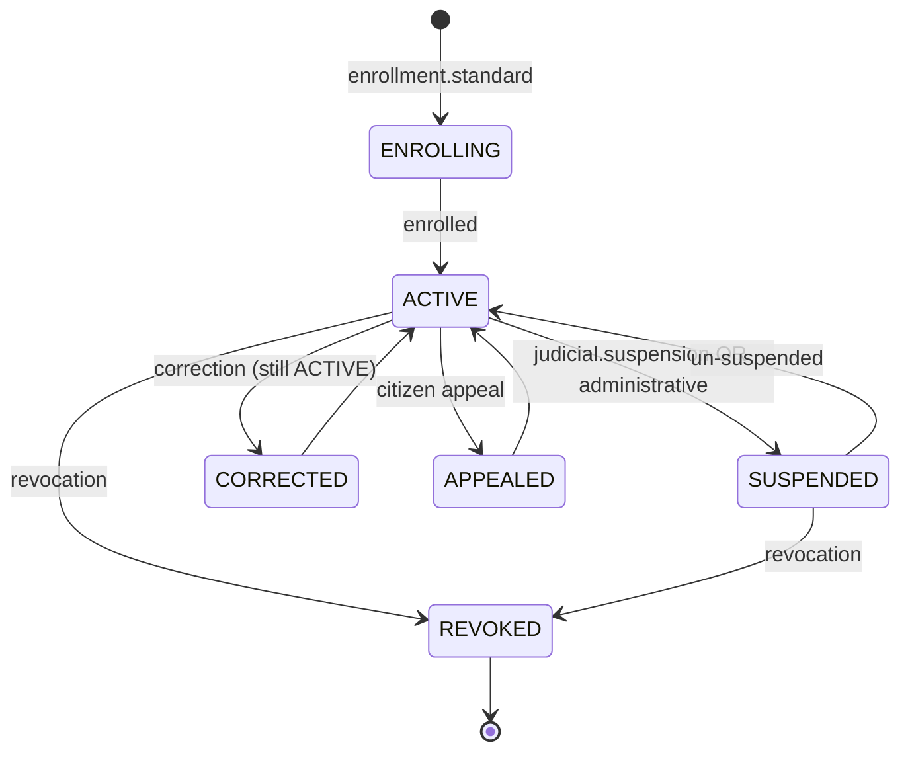

# 🆔 WORKFLOWS IDENTITÉ NATIONALE

> **Phase 3 / Étape 4** — Industrialiser l'identité nationale haïtienne.
> Version : 1.0.0
> Classification : OFFICIEL / DIFFUSION RESTREINTE

---

## 1. Mission

> **Industrialiser l'identité nationale.**
> Chaque identité haïtienne (NIN) suit un workflow auditable, immuable et opposable.

---

## 2. Principes Cardinaux

| Principe | Description |
|----------|-------------|
| **Unicité** | Un humain = un seul NIN (anti-doublon ABIS) |
| **Auditabilité** | Chaque opération est tracée, signée, horodatée |
| **Immutabilité** | Aucun acte n'est effacé ; seules les versions sont ajoutées (event sourcing) |
| **Reversibilité contrôlée** | Toute correction passe par un workflow signé (jamais un UPDATE brut en DB) |
| **Souveraineté citoyenne** | Droit de contestation (citizen appeal) opposable |
| **Sécurité** | PKI nationale + biométrie ICAO/NIST + 4-eyes |
| **Disponibilité** | Verification < 30 s p99, enrôlement 24h max |

---

## 3. Catalogue des Workflows Identité (8 BPMN)

| Workflow | Fichier | SLA | Description |
|----------|---------|-----|-------------|
| `identity.enrollment.standard` | `BPMN/Identity/enrollment.v1.0.0.bpmn` | **24h** | Création identité (NIN) — biométrie + KYC + 4-eyes |
| `identity.verification.online` | `BPMN/Identity/verification.v1.0.0.bpmn` | **5 min** (p99 < 30s) | Vérification 1:1 en ligne (token signé) |
| `identity.recovery.standard` | `BPMN/Identity/recovery.v1.0.0.bpmn` | **72h** | Récupération identité (perte / vol carte) |
| `identity.revocation.administrative` | `BPMN/Identity/revocation.v1.0.0.bpmn` | **24h** | Révocation administrative (décès, erreur, etc.) |
| `identity.correction` | `BPMN/Identity/correction.v1.0.0.bpmn` | **7j / 30j** | Correction mineure ou majeure |
| `identity.duplicate.resolution` | `BPMN/Identity/duplicate-resolution.v1.0.0.bpmn` | **14j** | Résolution anti-doublon (forensic biométrique) |
| `identity.appeal.citizen` | `BPMN/Identity/citizen-appeal.v1.0.0.bpmn` | **30j** | Contestation citoyen (ombudsman) |
| `identity.suspension.judicial` | `BPMN/Identity/judicial-suspension.v1.0.0.bpmn` | **24h** | Suspension judiciaire (façade vers `judicial.suspension.identity`) |

---

## 4. Détail des Workflows

### 4.1 Enrollment (Création d'identité)

**Objectif :** créer un NIN unique avec biométrie de qualité + 4-eyes + dedup ABIS.

**Étapes clés :**
1. Audit start
2. Capture biométrique (10 fingers FAP60 + face FRVT + iris ISO 19794-6)
3. Contrôle qualité ICAO/NIST (NFIQ2 ≥ 60)
4. Anti-doublon ABIS (1:N)
5. Fraud detection
6. Validation Agent ONI L1
7. **Validation Superviseur (4-eyes)**
8. Génération NIN
9. Signature PKI + TSA
10. Émission carte e-ID
11. Kafka `identity.enrolled.v1`
12. Notification citoyen

**Garanties :**
- Aucun NIN sans biométrie validée
- Aucun NIN sans 2 validations humaines
- Aucun NIN sans signature PKI

### 4.2 Verification (Vérification en ligne)

**Objectif :** vérifier en < 30s qu'un humain présent est bien le titulaire d'un NIN.

**Étapes :**
1. Audit
2. Lookup NIN + statut (ACTIVE / SUSPENDED / REVOKED)
3. Match biométrique 1:1 (template stocké)
4. Détection vivacité (anti-spoofing : PAD ISO 30107)
5. Fraud detection
6. Émission token signé (JWT court, 5 min)
7. Kafka `identity.verified.v1`

**Garanties :**
- Pas de PII dans le token
- Token signé + non-rejouable
- Audit consultable par citoyen (transparence)

### 4.3 Recovery (Perte / vol)

**Étapes :**
1. Audit + blocage immédiat de l'ancienne carte (CRL)
2. Re-capture biométrique
3. Match 1:1 contre la biométrie historique
4. Fraud detection
5. Validation superviseur
6. Signature PKI
7. Émission nouvelle carte (même NIN)
8. Kafka `identity.recovered.v1`
9. Notification

**Anti-fraude :** vérifier que la personne n'a pas déjà déclaré la perte récemment.

### 4.4 Revocation (Administrative)

**Étapes :**
1. Audit
2. Saisie motif (décès, erreur de doublon, demande citoyen, ordre légal)
3. **Validation juridique (LVB)**
4. **Validation superviseur**
5. Révocation NIN + carte + credentials
6. Mise à jour CRL/OCSP PKI
7. Signature PKI
8. Kafka `identity.revoked.v1`
9. Notification

**⚠️** : la révocation est **réversible** uniquement via un nouveau workflow `identity.un-revoke` (rare, judiciaire).

### 4.5 Correction (mineure / majeure)

| Type | Exemple | Approbation |
|------|---------|-------------|
| **Mineure** | Faute frappe prénom | Agent L1 + superviseur |
| **Majeure** | Date de naissance | Légal + superviseur + tribunal selon cas |

**Préserve l'historique** : la version précédente est conservée (event sourcing).

### 4.6 Duplicate Resolution (Anti-doublon)

**Quand ?** Quand ABIS détecte un score similarité > seuil.

**Étapes :**
1. Audit
2. Calcul score similarité (ABIS, multi-modal)
3. Analyse forensique biométrique (humain expert)
4. **Décision juridique** (fusion / maintien / suspension)
5. Application décision
6. Kafka `identity.duplicate.resolved.v1`

**Cas extrême** : doublon malveillant → workflow `judicial.investigation.fraud`.

### 4.7 Citizen Appeal (Contestation)

**Objectif :** garantir le **droit opposable** du citoyen contre une décision identité.

**Étapes :**
1. Audit
2. Accusé de réception (Ombudsman ONI)
3. Instruction dossier
4. Audition si nécessaire (Appeal Board)
5. Décision motivée
6. Signature PKI
7. Kafka `identity.appeal.decided.v1`
8. Notification

**Délai légal :** 30 jours max, sinon décision réputée favorable au citoyen.

### 4.8 Judicial Suspension (Façade)

**Objectif :** invoquer le workflow judiciaire `judicial.suspension.identity` depuis l'API identité.

**Garantie :** un acte judiciaire signé (greffier + magistrat) est obligatoire (cf. doc 05).

---

## 5. Acteurs

| Acteur | Groupes |
|--------|---------|
| Citoyen | (auto-service) |
| Agent ONI L1 | `oni-agents-l1` |
| Agent ONI L2 | `oni-agents-l2` |
| Superviseur ONI | `oni-supervisors` |
| Officier juridique | `legal-officers` |
| Analyste forensique | `forensic-analysts` |
| Ombudsman | `ombudsman-office` |
| Appeal Board | `appeal-board` |
| Magistrat civil | `civil-judges` |

---

## 6. Garde-fous (chaque BPMN identité)

| # | Garde-fou | Obligatoire |
|---|-----------|:-----------:|
| 1 | Versioning SemVer | ✅ |
| 2 | Audit trail (Merkle chain) | ✅ |
| 3 | PKI signature qualifiée + TSA | ✅ |
| 4 | Event sourcing Kafka | ✅ |
| 5 | Validation humaine | ✅ |
| 6 | 4-eyes pour création/révocation/correction majeure | ✅ |
| 7 | Fraud detection avant action irréversible | ✅ |
| 8 | SLA + escalation | ✅ |
| 9 | Notification citoyen | ✅ |
| 10 | Anti-doublon ABIS | ✅ (enrôlement) |
| 11 | Liveness detection | ✅ (verification) |

---

## 7. Immutabilité — Event Sourcing

Toute identité est reconstituée à partir d'événements append-only :

```
identity.enrolled.v1         → état initial
identity.corrected.v1        → correction (version N+1)
identity.suspended.v1        → suspension
identity.revoked.v1          → révocation finale
identity.appeal.decided.v1   → contestation
identity.duplicate.resolved  → fusion ou maintien
```

Le **read model** (cache lecture) est dérivé via projection. Le **source of truth** reste les événements Kafka + WORM 30 ans.

> Conséquence : il est **impossible** d'effacer un acte identité. Toute correction est elle-même un acte signé.

---

## 8. Sécurité Identitaire

| Couche | Mécanisme |
|--------|-----------|
| **Stockage biométrique** | Template chiffré AES-256-GCM + clé KMS par enrollement |
| **NIN** | Format opaque (non-déductible de la date de naissance) |
| **Carte e-ID** | Smartcard ISO/IEC 7816 + NFC + signature embarquée |
| **Wallet mobile** | mDL ISO 18013-5 + clés dans Secure Enclave |
| **Réseau** | mTLS + SPIFFE/SPIRE |
| **Accès agents** | OIDC + MFA biométrique + RBAC + ABAC (OPA) |
| **Audit accès** | Topic `audit.data.access.v1` (alerte si abus) |

---

## 9. Métriques (SLO Identité)

| Indicateur | Cible |
|------------|-------|
| Disponibilité enrôlement | 99,9 % |
| Disponibilité verification | 99,95 % |
| p99 verification online | < 30 s |
| p99 verification biométrique | < 5 s |
| Taux de réussite enrôlement | > 99,9 % |
| Faux rejets biométrie (FRR) | < 1 % |
| Faux accept biométrie (FAR) | < 0,001 % |
| Doublons détectés ABIS | > 99,99 % |
| Contestation citoyen traitée < 30j | 100 % |

---

## 10. Cycle de Vie d'une Identité



---

## 11. Cas Particuliers

### 11.1 Mineur
- Enrôlement sans 4-eyes mais avec **tuteur légal** comme co-signataire
- Re-enrôlement à 18 ans (biométrie majeure)

### 11.2 Diaspora (Phase 4)
- Consulats deviennent acteurs `consular-officers`
- Workflow `identity.enrollment.diaspora` (Phase 4)

### 11.3 Crise nationale
- Mode dégradé : enrôlement minimal sans face si scanner indisponible
- Sync différée garantie

### 11.4 Décès
- Auto-déclenchement de `identity.revocation.administrative` via event `civil.death.registered.v1`

---

## 12. Gouvernance

- WGO + LVB approuvent chaque modification BPMN identité
- Audit trimestriel par DPO (protection PII)
- Audit semestriel par Cour Supérieure des Comptes
- Rapport annuel au Parlement (transparence)

---

**Maintenu par :** Workflow Governance Office + Direction Identité Nationale ONI + DPO
