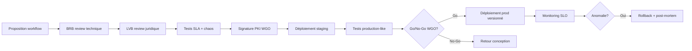

# 🏛 WORKFLOW GOVERNANCE OFFICE (WGO)

> **Phase 3 / Étape 8** — Autorité unique de gouvernance des workflows nationaux.
> Version : 1.0.0

---

## 1. Mission

> **Aucun workflow n'entre en production sans WGO.**

Le WGO est l'organe permanent qui :
1. Valide les BPMN avant déploiement.
2. Audite les workflows en production.
3. Définit, surveille et fait respecter les SLA.
4. Gère les versions et le cycle de vie.
5. Approuve les rollbacks et exceptions.
6. Signe juridiquement (avec LVB) les workflows opposables.

---

## 2. Structure Organisationnelle

```
┌───────────────────────────────────────────────────────┐
│  WORKFLOW GOVERNANCE OFFICE (rattaché Présidence ONI) │
├───────────────────────────────────────────────────────┤
│  Directeur Général WGO                                │
│   │                                                   │
│   ├── BPMN Review Board (BRB)        — technique      │
│   ├── Legal Validation Board (LVB)   — juridique      │
│   ├── SLA Governance Cell            — performance    │
│   ├── Versioning & Release Cell      — GitOps         │
│   ├── Audit & Forensics Cell         — investigation  │
│   └── Rollback & Crisis Cell         — sécurité       │
└───────────────────────────────────────────────────────┘
```

---

## 3. Responsabilités

| Fonction | Description | Délai standard |
|----------|-------------|----------------|
| **BPMN Approval** | Validation technique + métier | 5 j ouvrables |
| **Workflow Audit** | Audit semestriel obligatoire | continu |
| **SLA Governance** | Définition + surveillance + sanctions | continu |
| **Version Management** | SemVer + matrice compat. | continu |
| **Legal Validation** | Conformité Code civil + procédures | 10 j ouvrables |
| **Workflow Rollback** | Retour version précédente d'urgence | < 30 min |
| **Production Approval** | Go/No-Go final | 48 h |

---

## 4. Workflow d'Approbation (Méta-workflow)



---

## 5. Règles d'Approbation (gate)

| Critère | Seuil |
|---------|-------|
| Couverture tests unitaires | ≥ 80 % |
| Couverture tests intégration | ≥ 70 % |
| Tests chaos passés | 100 % |
| SLA mesuré ≤ SLO cible | 100 % |
| Signatures PKI | 100 % des actes |
| Audit trail | 100 % des transitions |
| Émission Kafka | 100 % des transitions majeures |
| Documentation runbook | obligatoire |
| Compatibilité backward | obligatoire (sauf MAJOR signé exception) |

---

## 6. Quorum et Décisions

| Décision | Quorum requis |
|----------|---------------|
| Approbation MINOR/PATCH | 1 BRB + 1 LVB |
| Approbation MAJOR | 2 BRB + 2 LVB + 1 DG |
| Rollback urgence (< 1h) | 1 Astreinte + 1 DG (téléphone) |
| Suspension workflow critique | 1 DG + Cyber + Légal |
| Exception SLA temporaire | 1 SLA Cell + 1 DG |

---

## 7. GitOps & Pipeline

Tout BPMN suit ce pipeline :

```
[Author PR] → [CI: lint+test] → [WGO review] → [LVB review]
   → [Signature PKI] → [Merge main] → [ArgoCD sync staging]
   → [Tests E2E] → [Approval prod] → [ArgoCD sync prod]
   → [Smoke tests] → [SLO monitoring]
```

Hooks Git :
- `pre-commit` : validation XSD BPMN
- `pre-push` : vérification SLA + escalation présents
- `merge-train` : signature PKI obligatoire (`.bpmn-signatures/`)

---

## 8. Sanctions / Conséquences

| Violation | Conséquence |
|-----------|-------------|
| Déploiement sans approbation | **rollback immédiat** + sanction admin |
| Signature manquante | refus déploiement |
| SLA dépassé 3 mois | revue obligatoire + plan correctif |
| Audit incomplet | suspension workflow |
| Tampering audit log | **sanction pénale** (Code pénal HT) |

---

## 9. Reporting

| Rapport | Fréquence | Destinataire |
|---------|-----------|--------------|
| Tableau de bord SLA | quotidien | DG ONI |
| Conformité audit | mensuel | Présidence + Cour des Comptes |
| Rapport gouvernance | trimestriel | Conseil des Ministres |
| Audit indépendant | annuel | Parlement |

---

## 10. RACI WGO

| Activité | WGO | Métier | Sécurité | Direction |
|----------|----:|-------:|---------:|----------:|
| Conception workflow | C | R | C | I |
| Signature BPMN | R | C | C | A |
| Approbation prod | A/R | C | C | I |
| Rollback urgence | A/R | I | C | A |
| Audit semestriel | R | C | C | I |

(R=Responsible, A=Accountable, C=Consulted, I=Informed)

---

**Décret de constitution :** ANNEXE A — Décret présidentiel #SNISID-WGO-001 (à publier au Moniteur).
