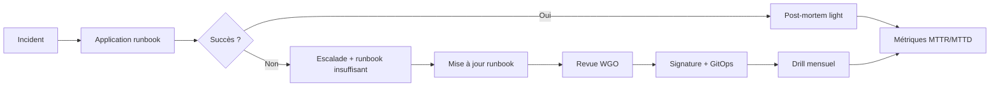

# 📕 RUNBOOKS OPÉRATIONNELS — Vue d'ensemble

> **Phase 3 / Étape 10** — Industrialiser l'exploitation des workflows.
> Version : 1.0.0

---

## 1. Mission

> **Toute opération critique sur SNISID doit être : répétable et documentée.**

Aucune intervention humaine sur le système national ne doit reposer sur la mémoire d'un individu. Tout est dans les runbooks — versionnés, testés, signés.

---

## 2. Catalogue des Runbooks (10 runbooks)

| # | Sujet | Fichier | Severity |
|---|-------|---------|----------|
| 01 | Échec d'un workflow | `runbooks/01-workflow-failure.md` | Sev2-Sev1 |
| 02 | Panne Kafka / Event Mesh | `runbooks/02-kafka-outage.md` | Sev1 |
| 03 | Rollback BPMN | `runbooks/03-bpmn-rollback.md` | Sev1 |
| 04 | Escalation fraude critique | `runbooks/04-fraud-escalation.md` | Sev1 |
| 05 | Récupération sync terrain | `runbooks/05-offline-sync-recovery.md` | Sev2 |
| 06 | Panne PKI / TSA | `runbooks/06-pki-failure.md` | Sev1 |
| 07 | Cluster Zeebe HS | `runbooks/07-zeebe-cluster-failure.md` | Sev1 |
| 08 | Cluster Temporal HS | `runbooks/08-temporal-cluster-failure.md` | Sev1 |
| 09 | Failover Datacenter | `runbooks/09-dc-failover.md` | Sev0 |
| 10 | Catastrophe nationale | `runbooks/10-mass-events.md` | Sev0 |

---

## 3. Niveaux de Sévérité

| Sev | Description | SLA réponse | Notification |
|-----|-------------|-------------|--------------|
| **Sev0** | Crise nationale | < 5 min | Présidence + SMS direction + PagerDuty |
| **Sev1** | Service critique HS | < 15 min | PagerDuty + Slack incidents |
| **Sev2** | Dégradation | < 1 h | Slack + Email astreinte |
| **Sev3** | Information | < 1 j | Email digest |

---

## 4. Format Standard d'un Runbook

Chaque runbook contient obligatoirement :

```
1. Symptômes
2. Alertes Prometheus / dashboards Grafana liés
3. Diagnostic (commandes prêtes à copier-coller)
4. Procédure de remédiation (étape par étape, cas A/B/C/D)
5. Vérification post-remédiation
6. Communication (qui, quoi, quand)
7. Post-mortem (template + conditions de déclenchement)
```

---

## 5. Cycle de vie d'un Runbook



Règles :
- ✅ Tout incident Sev0/Sev1 → **post-mortem obligatoire**
- ✅ Runbook révisé après chaque incident où il a été utilisé
- ✅ Test des runbooks Sev0 → **drill semestriel** (game day)
- ✅ Test des runbooks Sev1 → **drill trimestriel**

---

## 6. Industrialisation : scripts associés

Chaque runbook référence des scripts placés dans `scripts/runbooks/` :

| Script | Runbook |
|--------|---------|
| `freeze-workflow.sh` | 04 |
| `forensic-snapshot.sh` | 04 |
| `flush-outbox-to-kafka.sh` | 02 |
| `gslb-failover.sh` | 09 |
| `dc-resync.sh` | 09 |
| `audit-chain-verify.sh` | 09, 10 |
| `death-batch-ingest.sh` | 10 |
| `replay-workflows-from-audit.sh` | 07 |
| `pki-activate-dc2.sh` | 06, 09 |
| `edge-broadcast.sh` | 09, 10 |
| `emit-event.sh` | 01, 03 |
| `dr-readiness.sh` | 10 |

Tous les scripts sont :
- **Idempotents** (peuvent être relancés sans dégât)
- **Audités** (génèrent eux-mêmes un event `ops.runbook.executed.v1`)
- **Signés** (binaire ou hash dans Git)

---

## 7. Tableau de bord opérationnel

| Métrique | Cible |
|----------|-------|
| MTTD (Mean Time To Detect) | < 1 min (Sev0/1), < 5 min (Sev2) |
| MTTR (Mean Time To Resolve) | < 15 min (Sev1), < 5 min (Sev0 contournement) |
| % incidents avec runbook | 100 % |
| % drills planifiés réalisés | 100 % |
| Délai mise à jour post-incident | < 7 jours |
| Couverture runbook par alerte | 100 % (chaque alerte référence un runbook) |

---

## 8. Drills (exercices planifiés)

| Drill | Fréquence | Scénario |
|-------|-----------|----------|
| Bascule DC | semestriel | Runbook 09 complet |
| Fraude massive | trimestriel | Runbook 04 |
| Panne Kafka | trimestriel | Runbook 02 |
| Rollback BPMN | mensuel | Runbook 03 |
| Catastrophe nationale | annuel | Runbook 10 (avec DGPC, MoH) |

---

## 9. Règle Absolue

> Un runbook qui n'a jamais été exécuté ne fonctionne pas.
> Drill ou poubelle.

---

**Maintenu par :** WGO Rollback & Crisis Cell + SRE Lead
