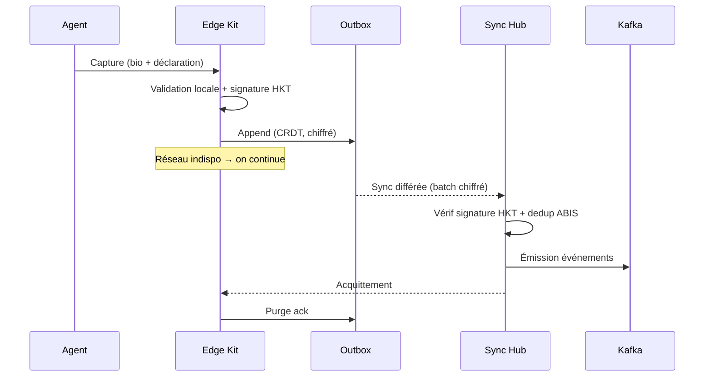

# 📶 OFFLINE-FIRST WORKFLOWS

> **Phase 3 / Étape 11** — Permettre le fonctionnement terrain en toutes circonstances.
> Version : 1.0.0

---

## 1. Mission

> En Haïti, un workflow d'État DOIT survivre :
> - une panne internet,
> - une panne fibre,
> - une crise régionale,
> - une catastrophe naturelle.

L'État n'a pas le droit de s'arrêter parce qu'un câble est coupé.

---

## 2. Réalités du terrain haïtien

| Contrainte | Réponse SNISID |
|------------|----------------|
| Connectivité fragmentée | Mode offline-first par défaut sur tous les kits terrain |
| Coupures électriques fréquentes | Batterie + solar kits, UPS |
| Fibre nationale partielle | 4G + LTE + Starlink en secours |
| Communes isolées (montagnes) | Sync par convoi physique (chiffré) tolérée |
| Séismes / ouragans | Plan crise + audit local Merkle |

---

## 3. Catalogue des workflows offline

| Workflow | Fichier | Support |
|----------|---------|---------|
| `offline.enrollment.field` | `BPMN/Offline/offline-enrollment.v1.0.0.bpmn` | ✅ Enrôlement terrain |
| `offline.validation.field` | `BPMN/Offline/offline-validation.v1.0.0.bpmn` | ✅ Validation identité hors-ligne |
| `offline.sync.delayed` | `BPMN/Offline/delayed-sync.v1.0.0.bpmn` | ✅ Sync différée |
| `offline.biometrics.capture` | `BPMN/Offline/offline-biometrics.v1.0.0.bpmn` | ✅ Biométrie hors-ligne |
| `offline.audit.logs` | `BPMN/Offline/offline-audit-logs.v1.0.0.bpmn` | ✅ Journal d'audit local |

---

## 4. Architecture Offline-First

```
        ┌─────────────────────────────────────────────────────────────┐
        │                       EDGE KIT TERRAIN                       │
        │  (tablette renforcée + scanner biométrique + carte HSM)      │
        │                                                              │
        │  ┌──────────┐  ┌──────────┐  ┌──────────────┐ ┌──────────┐  │
        │  │  UI PWA  │→ │  Local   │→ │ Outbox CRDT  │→│  Sync    │  │
        │  │ (capture)│  │ Engine   │  │ chiffrée AES │ │  Daemon  │  │
        │  └──────────┘  └──────────┘  └──────────────┘ └──────────┘  │
        │                      │              │              │         │
        │                      ▼              ▼              ▼         │
        │              Hardware Kit    Audit Local      Pre-cached     │
        │              PKI (signature) Merkle Chain     TSA tokens     │
        └──────────────────────────────────┬──────────────────────────┘
                                           │ (intermittent)
                                           ▼
                              ┌──────────────────────────┐
                              │   SYNC HUB CENTRAL       │
                              │  (DC1 / DC2 / DC3)       │
                              │  - Vérif signatures kit  │
                              │  - Résolution CRDT       │
                              │  - Réémission Kafka      │
                              │  - Anti-doublon ABIS     │
                              └──────────────────────────┘
                                           │
                                           ▼
                                Workflow standard SNISID
                              (identity.enrollment.standard, etc.)
```

---

## 5. Garanties offline (invariants)

| Garantie | Mise en œuvre |
|----------|---------------|
| **Pas de perte de données** | Outbox local chiffré, append-only, replay garanti |
| **Audit immuable** | Merkle chain locale + chaîne TSA pre-cachés |
| **Signature légale** | Hardware kit signe avec clé dédiée enregistrée à la PKI |
| **Anti-double saisie** | Idempotence par UUIDv7 + dedup serveur (ABIS) |
| **Confidentialité** | AES-256-GCM at-rest + clé enclave hardware |
| **Intégrité** | Hash SHA-384 + signature kit |
| **Non-répudiation** | Signature + horodatage (TSA token pré-récupéré) |
| **Détectabilité tampering** | Vérification chaîne Merkle à la sync |

---

## 6. Le Hardware Kit Terrain (HKT)

Spécification matérielle (référence SNISID) :

| Composant | Spec minimale |
|-----------|---------------|
| Tablette | Ruggedized 10", IP68, batterie 12h, GPS |
| Scanner biométrique | 10 fingers FAP 60, face NIST FRVT, iris ISO 19794-6 |
| Lecteur carte | NFC + contact ISO/IEC 7816 |
| Stockage | SSD chiffré 256 Go |
| HSM embarqué | Smartcard NFC OU TPM 2.0 (clé signature kit) |
| Connectivité | WiFi 6 + 4G/LTE + slot SIM nano |
| Solar | Panneau pliable 30W |
| OS | Linux durci (debianoid) + PWA |

Configuration logicielle :
- Engine local (Node + SQLite chiffré + Merkle store)
- PKI client (clé kit + cert serveur épinglé)
- Pre-cached TSA tokens (rolling 7 jours)
- Pre-cached CRL (mise à jour à chaque sync)
- Bundle BPMN offline déployé (mis à jour à chaque sync)

---

## 7. Cycle de vie d'une opération offline



---

## 8. Résolution des conflits (CRDT)

Stratégie par type :

| Type de donnée | Stratégie CRDT |
|----------------|----------------|
| Création (`identity.enrollment`) | **Add-only set** — pas de conflit |
| Mise à jour scalaire | **LWW (Last-Write-Wins)** par horodatage TSA |
| Mise à jour liste (parents) | **Add-Wins Observed-Remove Set** |
| Compteur (visites) | **PN-Counter** |
| Décision binaire (suspension) | **Multi-Value Register** + résolution humaine |

Si conflit non résoluble automatiquement → workflow `offline.conflict.detected.v1` qui ouvre une tâche humaine WGO.

---

## 9. Sync : fréquences recommandées

| Réseau | Fréquence batch |
|--------|-----------------|
| WiFi/fibre stable | 1 minute |
| 4G correct | 5 minutes |
| 4G intermittent | 15 minutes |
| Satellite (Starlink) | 1 heure |
| Convoi physique (vrai bush) | 1 jour |

Chaque batch est :
- Signé par HKT
- Compressé (zstd)
- Chiffré (AES-256-GCM par enveloppe à la clé serveur SNISID)
- Acquitté positivement (ack signé par le hub)

---

## 10. Mode dégradé total ("Black-out national")

Si **tous** les DC sont injoignables :

1. Tous les kits passent en pur offline.
2. Les communes (mairies, hôpitaux, tribunaux) reçoivent un **Mini-Hub Local** :
   - Aggregator des kits d'une zone géographique
   - Cache local des CRL/TSA
   - Replication étoile (mairie ⇄ kits)
3. Sync vers DC quand connectivité revient (peut être plusieurs jours).
4. Audit Merkle protège contre toute falsification a posteriori.

Cf. Runbook **10-mass-events.md** pour le détail.

---

## 11. Observabilité offline

Métriques exposées dès qu'un kit se reconnecte :

| Métrique | Description |
|----------|-------------|
| `snisid_offline_outbox_size_bytes` | Taille du buffer local |
| `snisid_offline_pending_count` | Opérations en attente de sync |
| `snisid_offline_last_sync_seconds_ago` | Dernière sync réussie |
| `snisid_offline_conflicts_total` | Conflits CRDT détectés |
| `snisid_offline_sync_duration_seconds` | Durée de la sync |
| `snisid_offline_kit_battery_percent` | Batterie kit |
| `snisid_offline_kit_signal_quality` | Qualité réseau |

Dashboard Grafana : "SNISID — Edge Fleet" (à créer en Phase 3.5).

---

## 12. Gouvernance des kits

| Évènement | Workflow |
|-----------|----------|
| Mise en service kit | `identity.enrollment` agent + `device.enroll.kit` |
| Perte / vol kit | `device.revoke.kit` → CRL kit révoquée + suspension data en attente |
| Maintenance | `device.maintenance` planifié |
| Mise à jour firmware | Signée WGO + déploiement progressif |
| Audit kit | Trimestriel obligatoire (logs kit comparés au central) |

---

## 13. Critères de succès Phase 3

- ✅ 100 % des kits terrain en mode offline-first par défaut
- ✅ 100 % des opérations offline auditées et signées
- ✅ < 0,01 % de conflits CRDT non auto-résolvables
- ✅ Drill mensuel "déconnexion totale 24h" passé
- ✅ Sync hub disponible 99,9 %
- ✅ Aucun citoyen perdu dans une zone sinistrée par incapacité technique

---

**Maintenu par :** WGO Offline Cell + Edge Engineering + DGPC liaison
