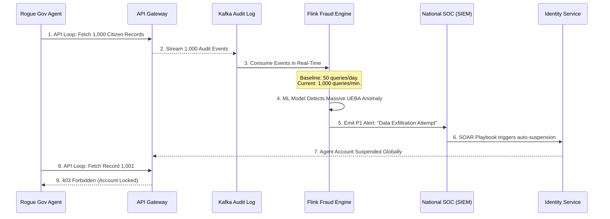

# SNISID AI-Powered Fraud Detection Service
## Machine Learning, UEBA, and Real-Time Risk Scoring

This document details the architectural design for the **AI Fraud Detection Service**. Within the SNISID ecosystem, detecting fraud—whether from an external attacker utilizing synthetic biometrics or an internal government agent attempting mass data exfiltration—must be instantaneous. This service leverages distributed stream processing and Machine Learning (ML) to score every transaction in real-time.

---

## 1. Core Threat Vectors & Detection Strategies

### Biometric Fraud & Duplicate Detection
- **1:N Deduplication Conflicts:** The primary vector for citizen fraud is attempting to register multiple times under different aliases. While the Biometric Service handles the raw 1:N ABIS search, the Fraud Service analyzes the metadata (e.g., matching a fingerprint hit, but noticing completely disjointed birthdates and locations) to assign a probability score of intentional fraud vs. administrative error.
- **Liveness & Presentation Attacks:** Analyzes telemetry from the edge capture devices to detect deepfakes, morphing attacks, or high-resolution photos presented to the scanner.

### Insider Threat Detection (UEBA)
- **User and Entity Behavior Analytics (UEBA):** Builds a baseline profile for every government agent utilizing the SNISID API.
- **Anomaly Detection:** If a civil servant at a rural immigration office typically queries 50 passports a day during business hours, and suddenly their account begins querying 5,000 citizens across the country at 2:00 AM, the ML model instantly calculates a massive risk score anomaly.

### API Fraud & Impossible Travel
- **Geo-Velocity Checks:** If a citizen cryptographically signs a consent grant from an IP address in Cap-Haïtien, and 10 minutes later their account attempts an authentication from Paris, France, the transaction is flagged for "Impossible Travel".

---

## 2. ML Architecture & Streaming Pipeline

The service utilizes **Apache Flink** or **Kafka Streams** for complex event processing.

1. **Ingestion:** Consumes raw events from `snisid.audit.events` and `snisid.identity.events`.
2. **Feature Extraction:** A sliding time-window aggregates features (e.g., "Queries in last 10 minutes", "Geographic distance from last query").
3. **ML Serving Layer:** The extracted features are passed to a highly available inference server (e.g., TensorFlow Serving or KServe) running optimized Random Forest and Deep Neural Network models.
4. **Risk Scoring:** The model returns a normalized `Risk_Score` between `0.0` and `1.0`.

---

## 3. Automated Mitigation & SOC Integration

Depending on the `Risk_Score`, the system takes autonomous action:
- **Low Risk (0.0 - 0.4):** Transaction proceeds normally.
- **Medium Risk (0.4 - 0.7):** Transaction proceeds, but requires adaptive "Step-Up" authentication (e.g., prompting the user for a secondary FIDO2 biometric check).
- **High Risk (0.7 - 1.0):** Transaction is instantly blocked. An event is fired to the National SOC's SIEM/SOAR platform, and the identity/agent account is automatically suspended pending a manual investigation via the Workflow Engine.

---

## 4. Architecture Diagrams (Mermaid)

### 1. Real-Time Kafka Stream Processing Pipeline
This diagram illustrates how raw events are transformed into risk scores and actionable mitigations.

```mermaid
graph TD
    classDef stream fill:#fff3e0,stroke:#e65100,stroke-width:2px;
    classDef ml fill:#e1bee7,stroke:#6a1b9a,stroke-width:2px;
    classDef action fill:#ffebee,stroke:#c62828,stroke-width:2px;
    classDef data fill:#e3f2fd,stroke:#1565c0,stroke-width:2px;

    subgraph Kafka_Event_Bus
        K1[(Identity Stream)]:::stream
        K2[(Audit / API Stream)]:::stream
    end

    subgraph Stream_Processing [Apache Flink Engine]
        Extract[Extract Features & Aggregate Time Windows]:::stream
        Enrich[Enrich with Citizen/Agent Baseline]:::stream
    end

    subgraph AI_Serving [ML Inference Layer]
        Model[TensorFlow Serving <br/> Anomaly Model]:::ml
    end

    subgraph Action_Engine
        Score{Evaluate <br/> Risk Score}:::action
        Allow[Allow Transaction]:::data
        StepUp[Trigger FIDO2 Adaptive Auth]:::data
        Block[Suspend Account & Alert SOC]:::action
    end

    K1 --> Extract
    K2 --> Extract
    Extract --> Enrich
    Enrich --> Model
    Model -->|Risk Score (0.0 - 1.0)| Score

    Score -- Score < 0.4 --> Allow
    Score -- Score 0.4 - 0.7 --> StepUp
    Score -- Score > 0.7 --> Block
```

### 2. UEBA Insider Threat Scenario (DCPJ Investigation)
This sequence diagram demonstrates the flow when a malicious government agent attempts mass data exfiltration.



---
*Prepared by the SNISID Cloud Infrastructure & Resilience Board.*
