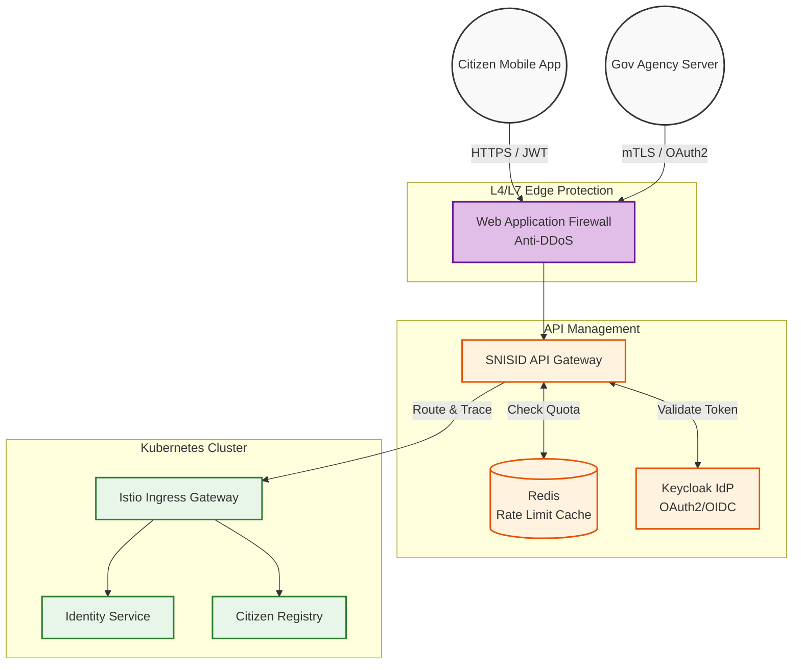
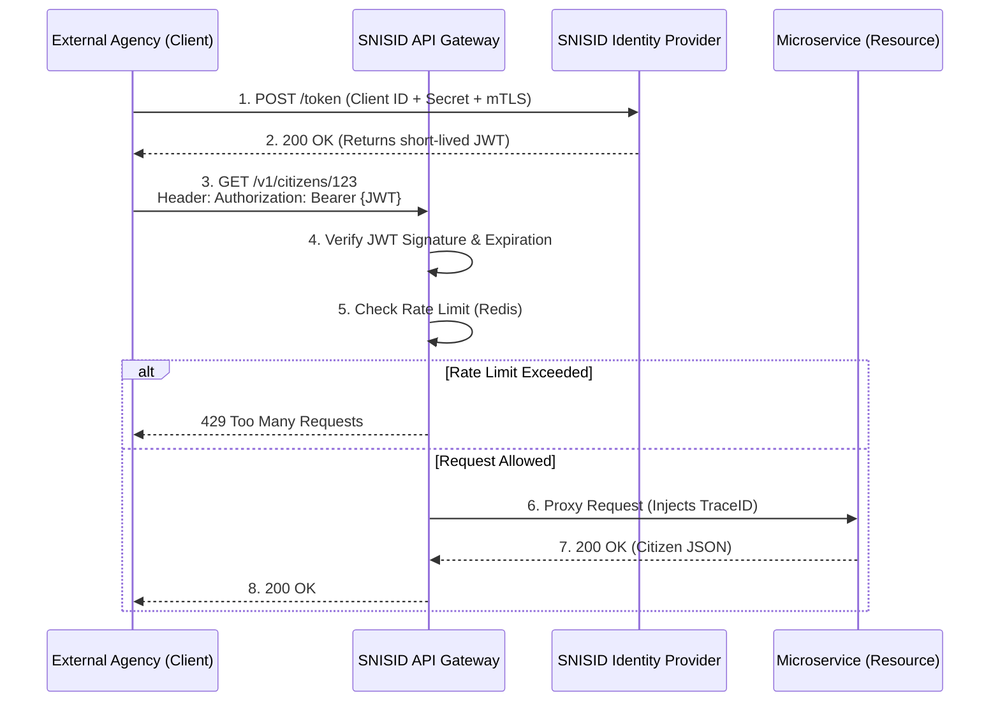

# SNISID National API Gateway Architecture
## Unified Ingress & API Governance Strategy

This document details the **National API Gateway Architecture** for the Système National d’Identification et d’Interopérabilité Sécurisée des Identités et des Données (SNISID). The Gateway (e.g., Kong Enterprise or Tyk) acts as the unified, highly secure "front door" for all internal, citizen-facing, and inter-agency traffic, abstracting away the complexity of the underlying Kubernetes microservices.

---

## 1. API Security & Identity Federation

### OAuth 2.0 & OpenID Connect (OIDC)
- **Citizen Traffic (B2C):** Citizen mobile apps and web portals authenticate via OIDC. The API Gateway intercepts the request, validates the JWT signature against the national Identity Provider (IdP / Keycloak), and forwards the request to the microservices.
- **Inter-Agency Traffic (B2B):** Agencies (e.g., DGI, Customs) act as OAuth 2.0 Confidential Clients. They use the Client Credentials Grant flow to obtain short-lived access tokens.

### Mutual TLS (mTLS)
- For extreme security on sensitive endpoints (e.g., Judicial Warrants, Biometric deduplication), the API Gateway enforces **strict mTLS**. The calling agency must present a valid X.509 certificate issued by the SNISID Root CA, effectively tying the physical server identity to the request.

---

## 2. Traffic Management & Resilience

### Rate Limiting & Throttling
To prevent DDoS attacks and "noisy neighbor" scenarios where one agency consumes all bandwidth:
- **Per-Client Quotas:** Enforced using Redis-backed rate limiters (e.g., DGI is allotted 1,000 req/sec, while a small municipal office is allotted 50 req/sec).
- **Throttling (Spike Arrest):** Sudden bursts above the limit are throttled (returning HTTP `429 Too Many Requests`) with a `Retry-After` header.

### Circuit Breaking & Service Discovery
- The API Gateway integrates with the **Istio Service Mesh**. If a backend microservice fails, the gateway will attempt automatic exponential backoff retries.
- If failures exceed a threshold (e.g., 50% errors in 10s), the circuit breaks, failing fast to prevent cascading system collapse.

---

## 3. API Governance & OpenAPI Strategy

### OpenAPI 3.0 Specification
- **Design-First Principle:** All SNISID APIs are designed using OpenAPI 3.0 YAML specifications *before* any code is written. These specifications form the immutable contract between the consumer and the provider.
- **Contract Testing:** CI/CD pipelines run automated contract tests (e.g., Pact) to ensure backend changes do not violate the OpenAPI specification.

### Versioning & Backwards Compatibility
- APIs are versioned strictly via URI path (e.g., `https://api.snisid.ht/v1/identity`).
- **No Breaking Changes:** Minor additive changes (e.g., adding a new field to a JSON response) are permitted in `v1`. Any breaking change (removing a field, changing a type) forces the creation of `v2`.

---

## 4. Developer Portal & API Analytics

### National Developer Portal
- A self-service portal (similar to Backstage) where authorized government IT departments can:
  1. Browse the SNISID API Catalog (interactive Swagger UI).
  2. Request access to specific APIs.
  3. Generate OAuth 2.0 Client IDs and Secrets.
  4. View their agency's API usage metrics.

### API Observability
- The Gateway emits standard RED metrics (Rate, Errors, Duration) to the OpenTelemetry Collector.
- **Audit Logging:** Every API request/response metadata (excluding PII payloads) is injected with a `TraceID` and sent to the immutable WORM SIEM ledger for non-repudiation.

---

## 5. Architecture Diagrams (Mermaid)

### 1. Unified Edge Ingress Architecture
This diagram illustrates the flow of traffic from the internet, through the security perimeter, and into the service mesh.

### 2. OAuth2 Client Credentials Flow (Agency to SNISID)
This sequence diagram shows how an external government agency securely accesses SNISID data using OAuth 2.0 and the API Gateway.

---
*Prepared by the SNISID Cloud Infrastructure & Resilience Board.*
