# SNISID: National Digital Identity BPMN Workflow Architecture
## Enterprise-Grade Government Orchestration

This document details the exact Business Process Model and Notation (BPMN) workflows for the **Système National d’Identification et d’Interopérabilité Sécurisée des Identités et des Données (SNISID)**. These stateful, saga-driven workflows are designed to execute on an enterprise workflow orchestration engine (e.g., Temporal.io or Camunda Zeebe).

---

## 1. Citizen Enrollment Workflow
**Actors:** Citizen, Registration Agent, ONI Supervisor.
**Triggers:** Citizen physical appearance at an ONI center.
**SLA:** 15 mins (processing), 24h (supervisor approval). **Escalation:** Escalates to Regional Director if unapproved >48h.
**API Calls:** `POST /api/v1/enrollments`, `POST /api/v1/fraud/deduplicate`.
**Validation/Security:** ABAC check on Agent, MRZ scan of supporting documents.
**Exceptions/Rollback:** If fraud check fails, rollback enrollment record, trigger Fraud Investigation (Workflow 13).

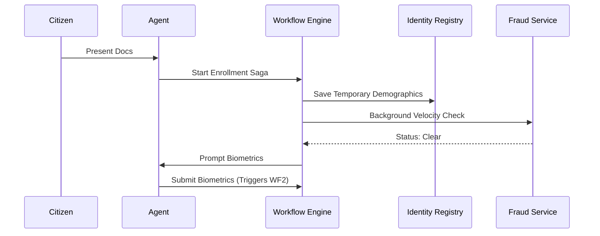

## 2. Biometric Enrollment Workflow
**Actors:** Automated Biometric Identification System (ABIS), Registration Agent.
**Triggers:** Invoked as a sub-process of WF1.
**SLA:** 10s matching speed. **Escalation:** Manual AFIS reviewer intervention if match score is ambiguous.
**API Calls:** `POST /api/v1/biometrics/templates`.
**Audit:** Hash of raw template logged to WORM storage.
**Security:** Images encrypted at rest (AES-256) and transit (mTLS).

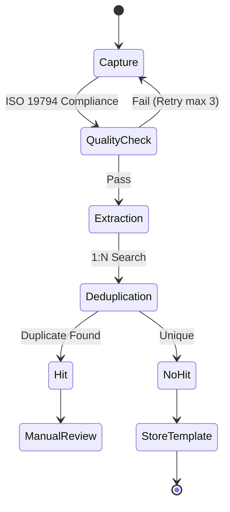

## 3. Identity Verification Workflow
**Actors:** Verifying Agency (e.g., DGI, Bank), Citizen.
**Triggers:** API request via X-Road or NFC scan of eID.
**API Calls:** `POST /api/v1/verify`.
**Exceptions/Retries:** Max 3 PIN attempts before card lockout.

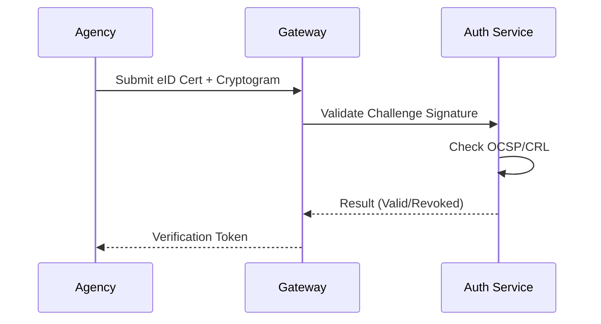

## 4. Birth Registration Workflow
**Actors:** Hospital Admin, Civil Registry (National Archives).
**Triggers:** Birth at registered medical facility.
**Compliance:** Automatic generation of a unique NNI (Numéro National d'Identification) pre-enrollment ID.

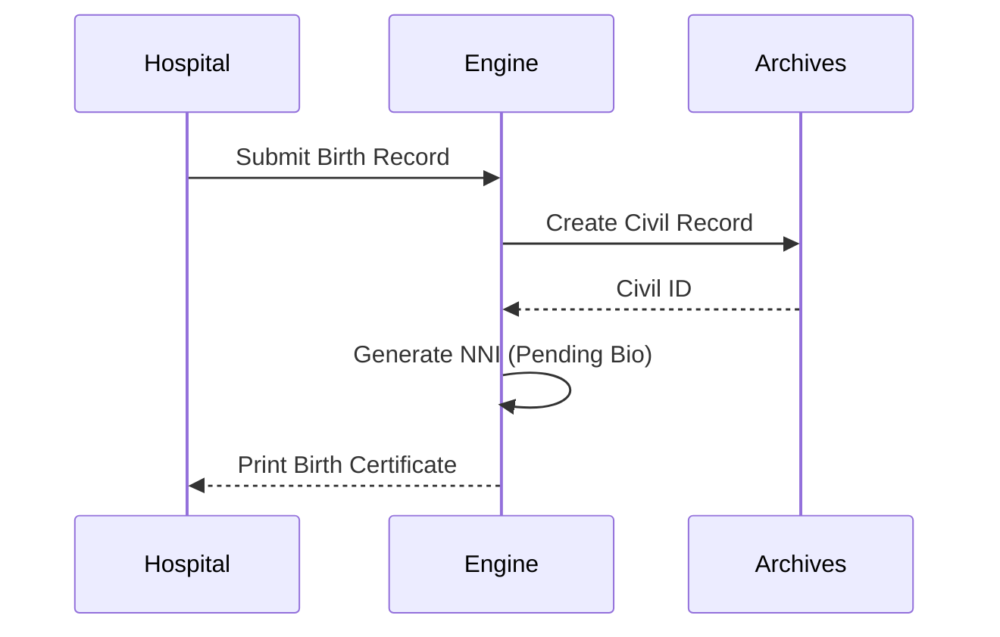

## 5. Death Registration Workflow
**Actors:** Medical Examiner, Civil Registry.
**Triggers:** Issuance of Death Certificate.
**Security Validation:** Maker-checker principle. Medical examiner drafts, Civil Registry official approves.

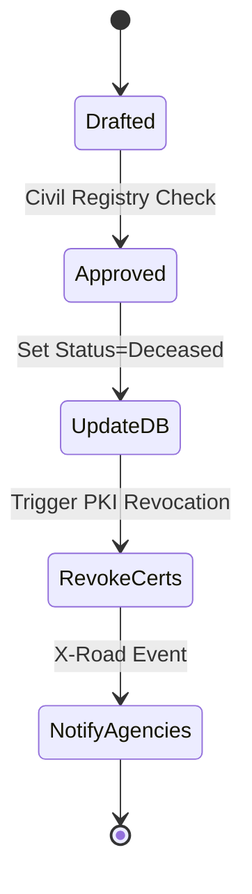

## 6. Marriage Registration Workflow
**Actors:** Civil Officer, Citizen A, Citizen B.
**Triggers:** Civil marriage ceremony.
**API Calls:** `PATCH /api/v1/citizens/marital-status`.

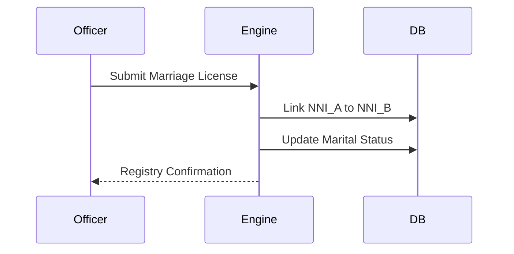

## 7. Address Changes Workflow
**Actors:** Citizen, Utility Provider (Oracle).
**Triggers:** Citizen web portal submission.
**Validation:** Cross-references utility bill APIs to verify physical existence of the address.

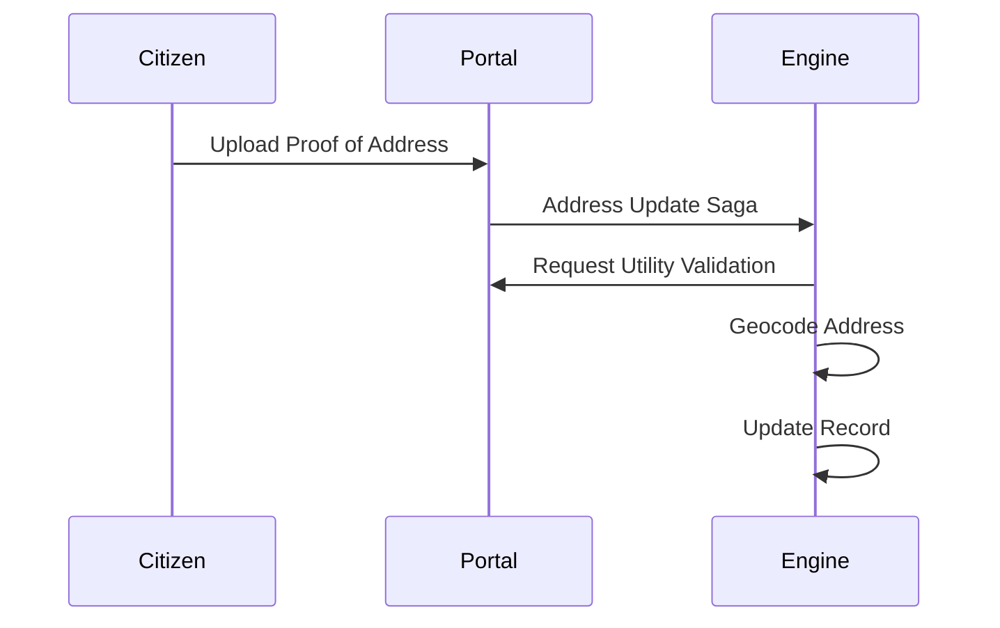

## 8. Identity Correction Workflow
**Actors:** Citizen, High-Level Adjudicator.
**Triggers:** Found error in name/DOB.
**SLA:** 30 days. **Audit:** Mandatory preservation of historical records.

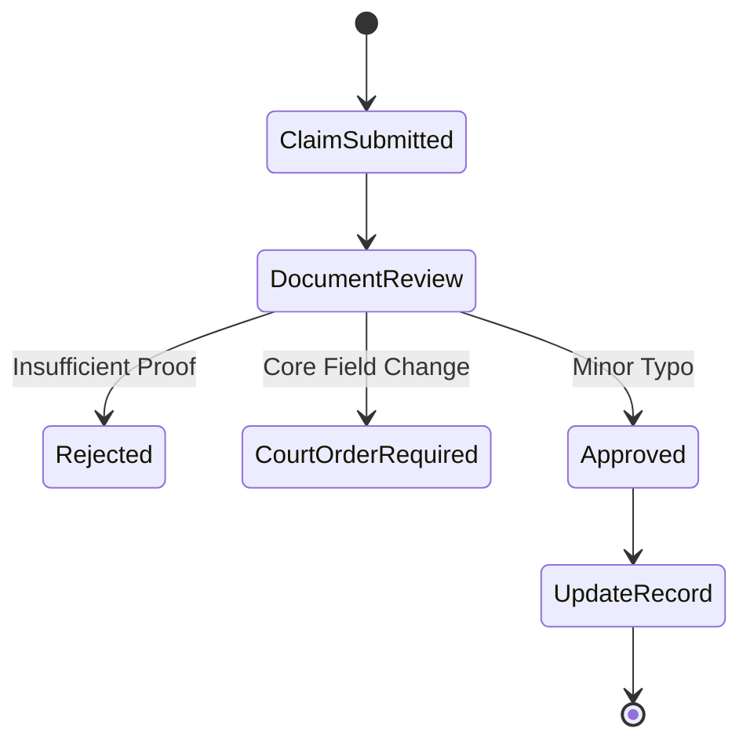

## 9. Identity Revocation Workflow
**Actors:** Judicial Court, ONI Director.
**Triggers:** Court order of severe identity fraud.
**Rollback:** Restores to previous NNI if merged incorrectly.

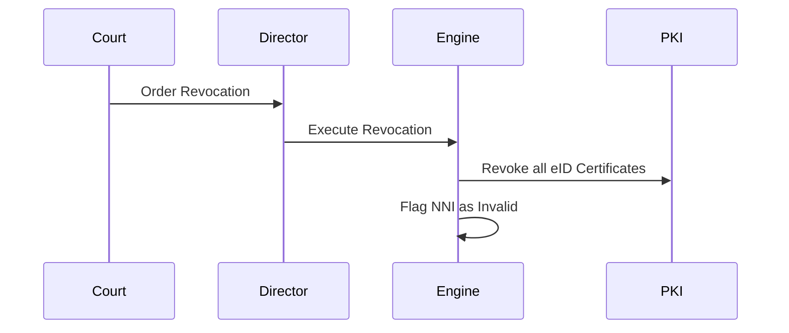

## 10. Lost Credential Replacement Workflow
**Actors:** Citizen, Registration Agent.
**Triggers:** Citizen reports card lost.
**Security:** Instant certificate suspension to prevent misuse.

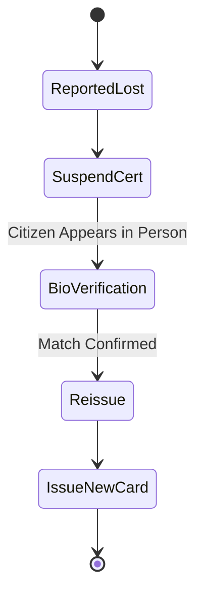

## 11. Consent Management Workflow
**Actors:** Citizen, Third-Party Agency.
**Triggers:** Agency requests data, Citizen approves via Mobile Push.
**Compliance:** GDPR/Privacy-by-design. Consent expires after TTL.

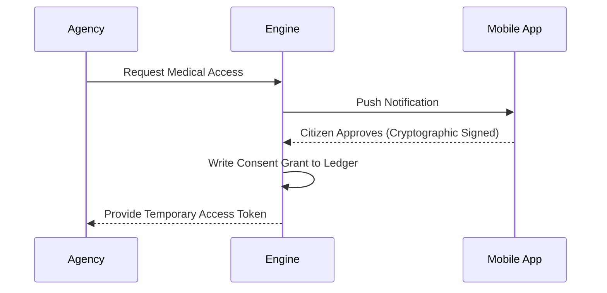

## 12. Inter-Agency Verification Workflow
**Actors:** Agency A, Agency B, X-Road Central Server.
**Triggers:** Agency A requires data from Agency B.
**Exception Handling:** If Agency B is down, Circuit Breaker trips, returns gracefully to A.

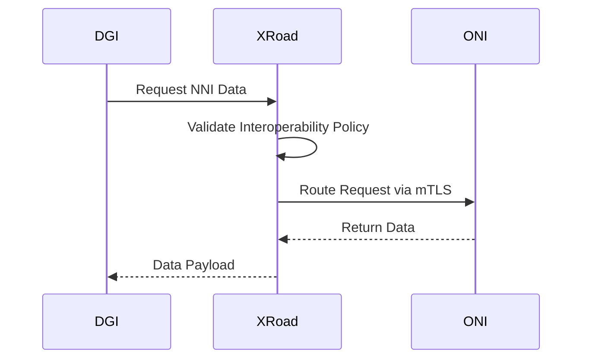

## 13. Fraud Investigation Workflow
**Actors:** Fraud Analyst, ABIS, SOC.
**Triggers:** Velocity check failure or Biometric 1:N duplicate hit.

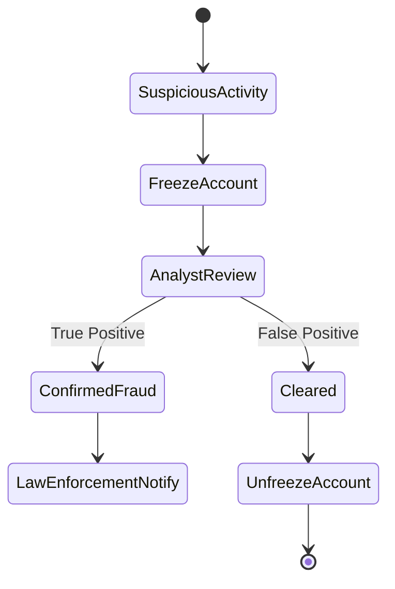

## 14. Judicial Verification Workflow
**Actors:** Police (DCPJ), Judge.
**Triggers:** Warrant issued for data extraction.
**Security:** Requires M-of-N split key approval to export bulk records.

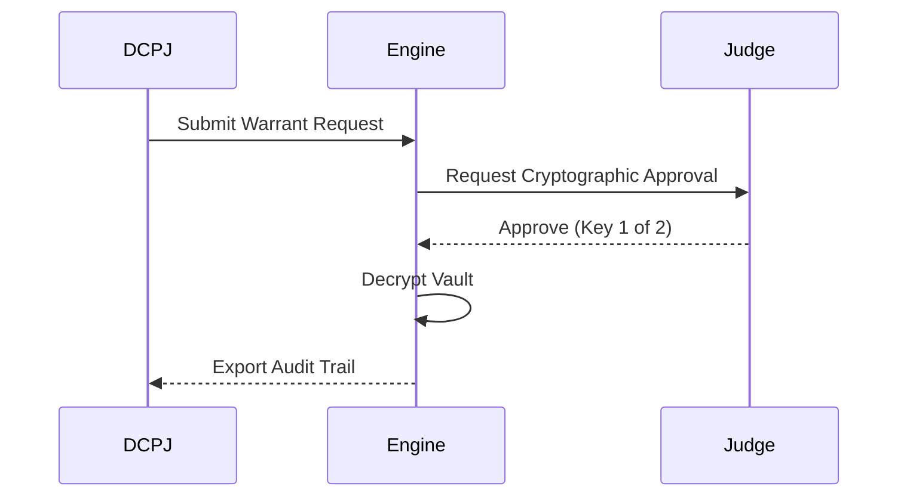

## 15. Immigration Verification Workflow
**Actors:** Border Control Agent.
**Triggers:** Citizen crosses border.
**API Calls:** `POST /api/v1/border/crossings`.

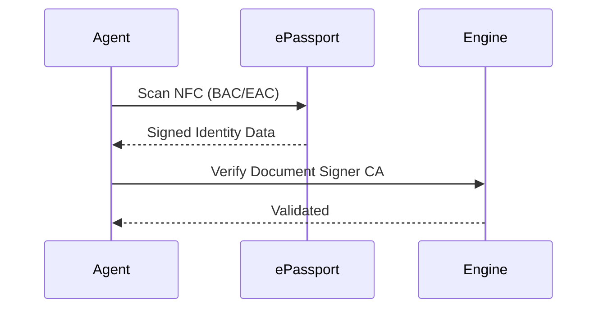

## 16. Voter Verification Workflow
**Actors:** CEP (Electoral Council), Polling Station.
**Triggers:** Election day check-in.
**Offline:** Polling stations use pre-cached Bloom filters to verify offline.

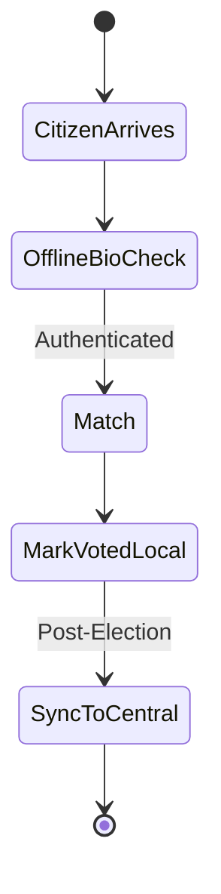

## 17. Social Benefits Verification Workflow
**Actors:** Social Affairs, Citizen.
**Triggers:** Application for welfare.
**Validation:** Checks Death Registry and Identity Registry to prevent "Ghost" payments.

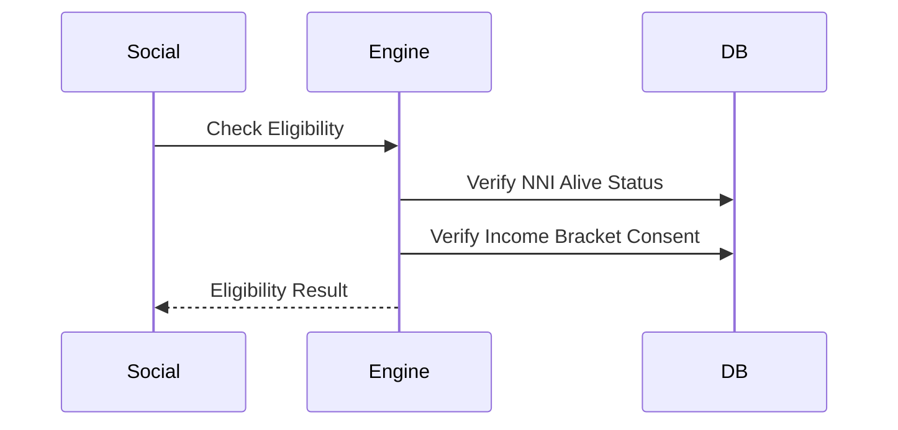

## 18. Offline Synchronization Workflow
**Actors:** Edge Node, Central Core.
**Triggers:** Internet connectivity restored at remote site.
**Retries:** Exponential backoff if central core is busy.

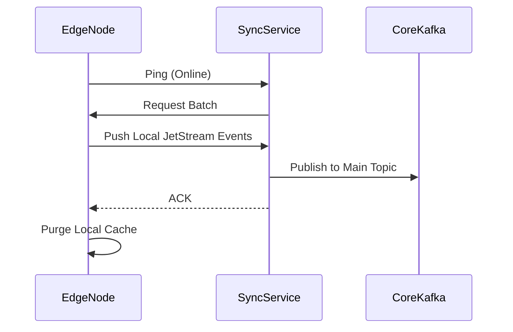

## 19. Disaster Recovery Operations Workflow
**Actors:** Infrastructure Admin.
**Triggers:** Region A goes offline entirely.
**SLA:** RTO < 15 mins.

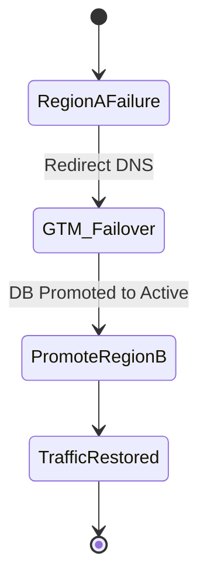

## 20. Security Incident Workflows
**Actors:** SOC SOAR, Threat Intel.
**Triggers:** Falco runtime alert (e.g., unauthorized shell in Identity Service).
**Escalation:** Isolates pod instantly.

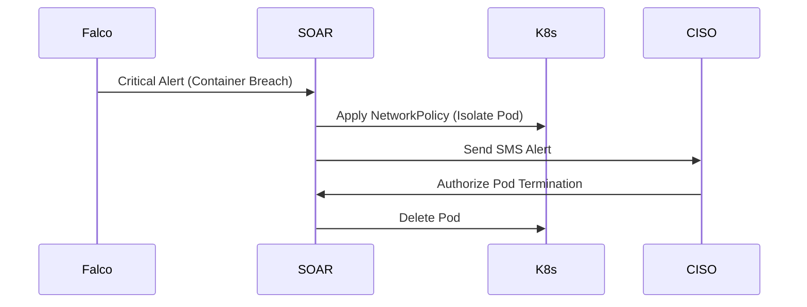

---
*Enterprise Architect Note: All workflows are designed to emit OpenTelemetry spans. Exceptions at any node automatically trigger compensating transactions (Saga pattern) ensuring eventual consistency across the entire national infrastructure.*
