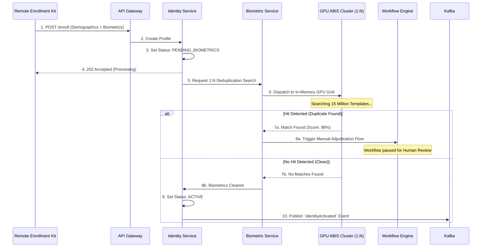
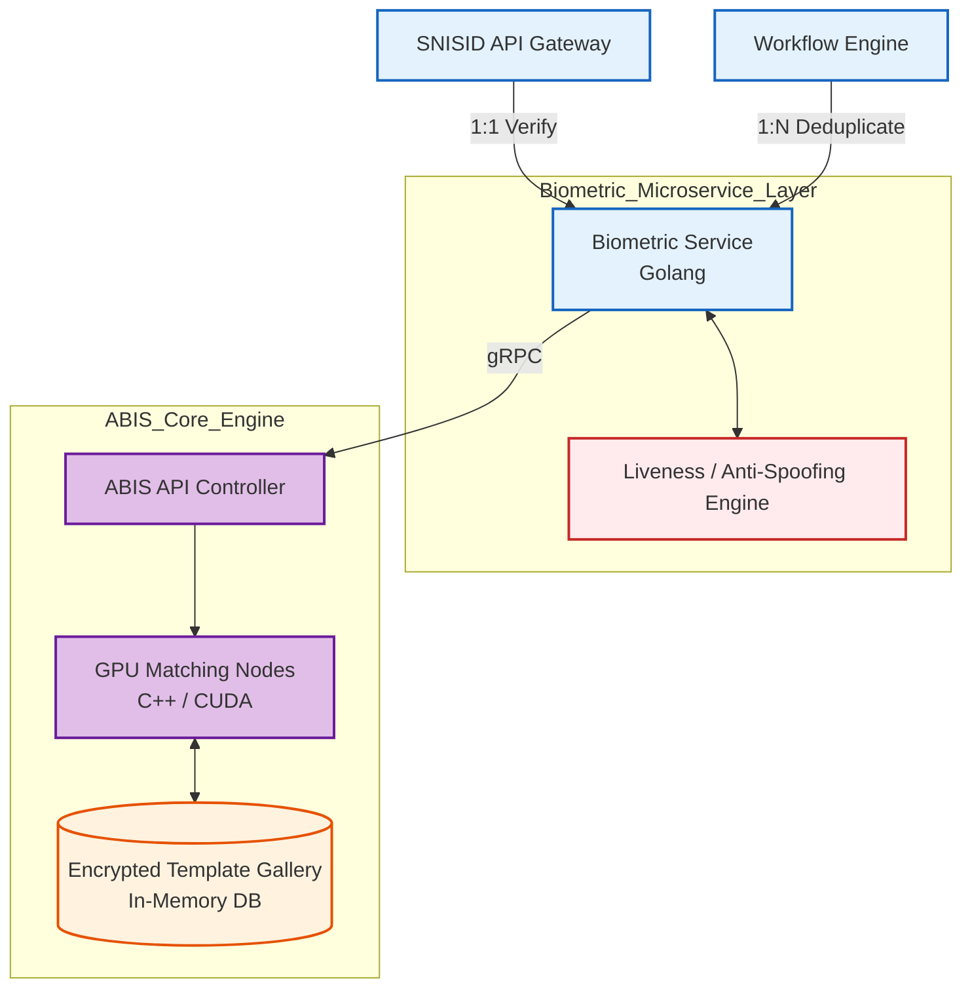

# SNISID Biometric Architecture & ABIS Integration
## Multi-Modal Identity Deduplication & Authentication

This document outlines the architectural design for the **Biometric Validation Service** and its integration with the core **Automated Biometric Identification System (ABIS)**. The biometric engine is the absolute anchor of SNISID; it is the sole mechanism that guarantees the principle of "One Citizen, One Identity," preventing identity fraud, double-voting, and ghost workers in the Haitian government.

---

## 1. Multi-Modal Capture & Anti-Spoofing

SNISID mandates multi-modal capture during enrollment to achieve a false acceptance rate (FAR) approaching zero.
1. **Fingerprints (10-print):** Captured via FBI-certified slap scanners. Stored internally as ISO/IEC 19794-2 standard minutiae templates and WSQ images.
2. **Iris Recognition:** Dual-iris capture using near-infrared (NIR) sensors. Crucial for deduplication as irises do not degrade with manual labor (unlike fingerprints).
3. **Facial Recognition:** ICAO-compliant frontal portrait capture.
4. **Liveness Detection (Anti-Spoofing):** The edge capture software utilizes Presentation Attack Detection (PAD) to actively reject 2D photos, 3D silicone masks, and screen replays before the data ever reaches the API Gateway.

---

## 2. Cryptographic Template Protection

SNISID operates under a strict data sovereignty and security mandate. 
- **No Raw Storage:** While raw images (WSQ/JPEG) are temporarily captured, they are immediately converted into proprietary, mathematical templates (vectors). The raw images are cryptographically archived in the WORM vault.
- **Irreversibility:** Biometric templates cannot be reverse-engineered back into an image of a fingerprint or face.
- **At-Rest Encryption:** The ABIS gallery (the database holding all 15+ million templates) is encrypted at the block level using LUKS and hardware TPMs.

---

## 3. Biometric Matching Workflows

### 1:N Deduplication (Enrollment)
When a new citizen enrolls, the system must search their biometrics against the entire gallery of 15 million citizens.
- **Workflow:** The Identity Service sets the citizen's status to `PENDING_BIOMETRICS` and passes the payload to the ABIS. The ABIS utilizes massive, in-memory GPU clusters to perform the 1:N search in under 30 seconds.
- **Adjudication:** If the ABIS returns a similarity score above the threshold (e.g., indicating this citizen might already be enrolled as someone else), the workflow halts and routes the case to a human DCPJ forensic examiner for manual adjudication.

### 1:1 Verification (Authentication)
Used when a citizen claims an identity (e.g., presenting their ID card at a bank) and needs to prove they are the owner of that identity.
- **Workflow:** The bank sends the citizen's claimed NIU and a live fingerprint scan to SNISID. The system retrieves only *that specific* template and performs a 1:1 match. This takes `< 100 milliseconds`.

### Offline Verification (Edge Compute)
As detailed in the Offline Architecture, remote enrollment kits maintain a hyper-compressed, encrypted cache of 1:1 templates strictly for their local commune. This allows a rural clinic to verify a patient's identity without requiring an internet connection to the Port-au-Prince ABIS.

---

## 4. API & Event Contracts

### API Contract (OpenAPI Snippet)
The Biometric Service exposes a synchronous 1:1 verification endpoint for rapid authentication.

```yaml
paths:
  /v1/biometrics/verify:
    post:
      summary: Perform a 1:1 biometric verification against a claimed NIU.
      requestBody:
        content:
          application/json:
            schema:
              type: object
              properties:
                niu: { type: string }
                modality: { type: string, enum: [FINGERPRINT, IRIS, FACE] }
                template_data: { type: string, description: "Base64 encoded ISO template" }
      responses:
        '200':
          description: Verification Successful (Match)
          content:
            application/json:
              schema:
                properties:
                  match_score: { type: integer }
                  decision: { type: string, example: "VERIFIED" }
```

---

## 5. Architecture Diagrams (Mermaid)

### 1. The 1:N Deduplication Pipeline (Enrollment)
This sequence diagram shows the asynchronous flow of a new enrollment passing through the ABIS engine.



### 2. Biometric Service Deployment Topology
This diagram illustrates the separation between the SNISID microservice and the heavy-compute ABIS engine.



---
*Prepared by the SNISID Cloud Infrastructure & Resilience Board.*
