# SNISID: Conflict Resolution BPMN Diagrams
## Complete Workflow Orchestration (Mermaid Notation)

---

## Table of Contents
1. [Master Conflict Resolution Orchestration](#master-conflict-resolution-orchestration)
2. [Tier 1: Auto-Resolution Subprocess](#tier-1-auto-resolution-subprocess)
3. [Tier 2: Biometric Adjudication Loop](#tier-2-biometric-adjudication-loop)
4. [Tier 3: Forensic Examination Subprocess](#tier-3-forensic-examination-subprocess)
5. [Tier 4: Multi-Record Reconciliation Subprocess](#tier-4-multi-record-reconciliation-subprocess)
6. [Tier 5: Fraud Investigation Subprocess](#tier-5-fraud-investigation-subprocess)
7. [Tier 6: Judicial Escalation Subprocess](#tier-6-judicial-escalation-subprocess)
8. [Citizen Appeals Subprocess](#citizen-appeals-subprocess)
9. [Auto-Escalation Decision Flow](#auto-escalation-decision-flow)
10. [Evidence Preservation & Chain-of-Custody](#evidence-preservation--chain-of-custody)

---

## Master Conflict Resolution Orchestration

This is the top-level workflow that orchestrates all conflict cases from detection through resolution.

```mermaid
graph TD
    Start([Conflict Detected]) --> DetectionSource{Detection Source?}
    
    DetectionSource -->|ABIS 1:N Match| ABISPath[ABIS 1:N Dedup<br/>Score Recorded]
    DetectionSource -->|Batch Reconciliation| BatchPath[Cross-Registry<br/>Reconciliation Check]
    DetectionSource -->|Citizen Report| CitizenPath[Citizen Self-Report<br/>via Portal]
    DetectionSource -->|Inter-Agency Alert| InterAgencyPath[Inter-Agency<br/>Data Discrepancy]
    DetectionSource -->|AI Fraud Engine| FraudPath[AI Fraud Detection<br/>Velocity/UEBA Anomaly]
    DetectionSource -->|Judicial Order| JudicialPath[Court-Ordered<br/>Identity Challenge]
    DetectionSource -->|Death Registry| DeathPath[Death Registry Conflict<br/>with Active NNI]
    
    ABISPath --> CreateCase[Create ConflictCase<br/>Record & WORM Archive]
    BatchPath --> CreateCase
    CitizenPath --> CreateCase
    InterAgencyPath --> CreateCase
    FraudPath --> CreateCase
    JudicialPath --> CreateCase
    DeathPath --> CreateCase
    
    CreateCase --> ClassifyTier{Classify Tier<br/>T1-T6}
    
    ClassifyTier -->|T1: Admin Duplicate| T1Path["Route to Tier 1<br/>Auto-Resolution<br/>Authority: Enrollment Agent<br/>SLA: 24h"]
    ClassifyTier -->|T2: Biometric Near| T2Path["Route to Tier 2<br/>Biometric Adjudication<br/>Authority: 2 Adjudicators<br/>SLA: 48h"]
    ClassifyTier -->|T3: Biometric Hard| T3Path["Route to Tier 3<br/>Forensic Examination<br/>Authority: Senior Examiner<br/>SLA: 72h"]
    ClassifyTier -->|T4: Multi-Record| T4Path["Route to Tier 4<br/>Director + Legal<br/>Authority: Regional Director<br/>SLA: 7 days"]
    ClassifyTier -->|T5: Fraud| T5Path["Route to Tier 5<br/>Fraud Investigation<br/>Authority: DCPJ<br/>SLA: 30 days"]
    ClassifyTier -->|T6: Judicial| T6Path["Route to Tier 6<br/>Judicial Escalation<br/>Authority: Courts<br/>SLA: 90 days"]
    
    T1Path --> T1Sub["[Subprocess: T1 Resolution]"]
    T2Path --> T2Sub["[Subprocess: T2 Adjudication]"]
    T3Path --> T3Sub["[Subprocess: T3 Forensic]"]
    T4Path --> T4Sub["[Subprocess: T4 Multi-Record]"]
    T5Path --> T5Sub["[Subprocess: T5 Fraud]"]
    T6Path --> T6Sub["[Subprocess: T6 Judicial]"]
    
    T1Sub --> ResolutionDecision{Resolution<br/>Decision Made?}
    T2Sub --> ResolutionDecision
    T3Sub --> ResolutionDecision
    T4Sub --> ResolutionDecision
    T5Sub --> ResolutionDecision
    T6Sub --> ResolutionDecision
    
    ResolutionDecision -->|MERGE| MergeAction["Execute Merge:<br/>Archive Secondary NNI<br/>Consolidate Records"]
    ResolutionDecision -->|DEACTIVATE| DeactivateAction["Deactivate Secondary NNI<br/>Update Status"]
    ResolutionDecision -->|REFER_JUDICIAL| JudicialRef["Escalate to Court<br/>Prepare Evidence Package"]
    ResolutionDecision -->|FRAUD_CONFIRMED| FraudConf["Revoke NNI: FRAUD<br/>Refer to Prosecution"]
    ResolutionDecision -->|FRAUD_SUSPECTED| FraudSusp["Revoke NNI: FRAUD_SUSPECTED<br/>Close Case"]
    ResolutionDecision -->|CLEARED| Cleared["No Conflict Found<br/>Both NNIs Remain Active"]
    ResolutionDecision -->|INCONCLUSIVE| Inconclusive["Cannot Resolve<br/>Escalate to Higher Authority"]
    
    MergeAction --> ImplementRes[Implement Resolution:<br/>Update Registries<br/>Issue New ID Cards]
    DeactivateAction --> ImplementRes
    JudicialRef --> ImplementRes
    FraudConf --> ImplementRes
    FraudSusp --> ImplementRes
    Cleared --> ImplementRes
    Inconclusive --> EscalateRes["Escalate to<br/>Next Authority"]
    
    ImplementRes --> NotifyCitizen["Notify Citizen:<br/>Decision + Appeal Rights<br/>Appeal Deadline"]
    EscalateRes --> NotifyCitizen
    
    NotifyCitizen --> SealEvidence["Seal Evidence in WORM:<br/>SHA-256 Hash Chain<br/>Dual-Key Access Control"]
    
    SealEvidence --> CaseClose["Case Status: CLOSED<br/>OR APPEALED (if appeal filed)"]
    
    CaseClose --> End([Conflict Resolution Complete])
    
    classDef process fill:#e3f2fd,stroke:#1565c0,stroke-width:2px
    classDef decision fill:#fff3e0,stroke:#e65100,stroke-width:2px
    classDef subprocess fill:#f3e5f5,stroke:#6a1b9a,stroke-width:2px
    classDef action fill:#e8f5e9,stroke:#2e7d32,stroke-width:2px
    classDef start fill:#fff9c4,stroke:#f57f17,stroke-width:2px
    classDef end fill:#ffccbc,stroke:#d84315,stroke-width:2px
    
    class Start,End start,end
    class CreateCase,NotifyCitizen,SealEvidence,CaseClose process
    class DetectionSource,ClassifyTier,ResolutionDecision decision
    class T1Sub,T2Sub,T3Sub,T4Sub,T5Sub,T6Sub subprocess
    class MergeAction,DeactivateAction,JudicialRef,FraudConf,FraudSusp,Cleared,ImplementRes,EscalateRes action
```

---

## Tier 1: Auto-Resolution Subprocess

Handles administrative duplicates with confidence ≥95%.

```mermaid
graph TD
    T1Start([Tier 1 Case:<br/>Admin Duplicate Suspected]) --> Assignment["Assignment:<br/>Route to Enrollment Agent<br/>+5 Supervisor<br/>SLA: 24 hours"]
    
    Assignment --> AgentReview["Agent Review Checklist:<br/>- Compare both NNI records<br/>- Verify name/DOB/gender match<br/>- Check document numbers<br/>- Cross-check enrollment times<br/>- Review prior flags"]
    
    AgentReview --> ConfidenceCheck{Confidence<br/>Level?}
    
    ConfidenceCheck -->|≥95%| HighConfidence["HIGH CONFIDENCE<br/>Likely Same Person"]
    ConfidenceCheck -->|85-94%| MediumConfidence["MEDIUM CONFIDENCE<br/>Requires Clarification"]
    ConfidenceCheck -->|<85%| LowConfidence["LOW CONFIDENCE<br/>Not Likely Duplicate"]
    
    HighConfidence --> AutoMerge["Auto-Merge Decision:<br/>Supervisor Approves<br/>(Dual-Control)"]
    
    MediumConfidence --> CitizenContact["Contact Citizen:<br/>Request Clarification<br/>Call/SMS/Portal Message<br/>5-Day Response Window"]
    
    LowConfidence --> NotDuplicate["Not a Duplicate:<br/>Close Case"]
    
    AutoMerge --> MergeExecution["Execute Merge:<br/>1. Designate Primary NNI<br/>2. Archive Secondary NNI<br/>3. Consolidate Documents<br/>4. Consolidate Biometrics<br/>5. Update Status"]
    
    CitizenContact --> CitizenResponse{Citizen<br/>Response?}
    
    CitizenResponse -->|Confirms Same Person| ConfirmMerge["Confirmed:<br/>Proceed to Merge"]
    CitizenResponse -->|Denies Same Person| DenyDuplicate["Denied:<br/>Not Duplicate<br/>Escalate to T2"]
    CitizenResponse -->|No Response| SupervisorDecision["Supervisor Decision<br/>Based on Evidence"]
    
    ConfirmMerge --> MergeExecution
    SupervisorDecision --> MergeOrEsc{Authority<br/>Decides?}
    MergeOrEsc -->|Merge| MergeExecution
    MergeOrEsc -->|Escalate| Escalate["Escalate to T2<br/>Requires Adjudication"]
    
    NotDuplicate --> LogEvent["Log Event:<br/>NOT_DUPLICATE<br/>Close Case"]
    
    MergeExecution --> UpdateRegistries["Update Public Registries:<br/>- Voter Registry<br/>- Benefits System<br/>- Passport Database<br/>- Employment Registry"]
    
    Escalate --> EscEnd([Escalate to Tier 2])
    LogEvent --> LogEnd([Case Closed])
    DenyDuplicate --> DenyEnd([Escalate to Tier 2])
    
    UpdateRegistries --> NotifyMerge["Notify Citizen:<br/>Consolidation Completed<br/>New Primary NNI<br/>Appeal Rights (7 days)"]
    
    NotifyMerge --> SealT1["Seal Evidence & Archive:<br/>WORM Storage<br/>Case Closed"]
    
    SealT1 --> T1End([T1 Subprocess Complete])
    
    classDef process fill:#e3f2fd,stroke:#1565c0,stroke-width:2px
    classDef decision fill:#fff3e0,stroke:#e65100,stroke-width:2px
    classDef action fill:#e8f5e9,stroke:#2e7d32,stroke-width:2px
    classDef start fill:#fff9c4,stroke:#f57f17,stroke-width:2px
    classDef end fill:#ffccbc,stroke:#d84315,stroke-width:2px
    
    class T1Start start
    class T1End,EscEnd,LogEnd,DenyEnd end
    class Assignment,AgentReview,AutoMerge,CitizenContact,NotDuplicate,MergeExecution,UpdateRegistries,NotifyMerge,SealT1 process
    class ConfidenceCheck,CitizenResponse,MergeOrEsc,AuthorityDecides decision
```

---

## Tier 2: Biometric Adjudication Loop

Two-person consensus review for near-matches (85-94% ABIS score).

```mermaid
graph TD
    T2Start([Tier 2 Case:<br/>Biometric Near-Match<br/>ABIS 85-94%]) --> QueueAssign["Queue Assignment:<br/>Route to Adjudicator #1<br/>SLA: 48 hours"]
    
    QueueAssign --> Adj1Blind["Adjudicator #1:<br/>BLIND REVIEW<br/>(No visibility to Adj #2)"]
    
    Adj1Blind --> Adj1Checklist["Adjudication Checklist:<br/>- Review ABIS score & quality<br/>- Examine fingerprint patterns<br/>- Check iris Hamming distance<br/>- Verify face similarity<br/>- Cross-check demographics"]
    
    Adj1Checklist --> Adj1Decision{Adj #1<br/>Decision?}
    
    Adj1Decision -->|LIKELY_MATCH| Adj1Match["Preliminary: LIKELY_MATCH<br/>Confidence: [HIGH/MED/LOW]"]
    Adj1Decision -->|INCONCLUSIVE| Adj1Incon["Preliminary: INCONCLUSIVE<br/>Quality Issues?"]
    Adj1Decision -->|NOT_MATCH| Adj1NotMatch["Preliminary: NOT_MATCH<br/>Patterns Different"]
    
    Adj1Match --> Adj1Doc["Document Findings:<br/>- Fingerprint match: ___<br/>- Iris match: ___<br/>- Face match: ___<br/>- Confidence: ___<br/>- Rationale: ≥100 words"]
    
    Adj1Incon --> Adj1Doc
    Adj1NotMatch --> Adj1Doc
    
    Adj1Doc --> AssignAdj2["Auto-Assign Adjudicator #2:<br/>Different region<br/>Random selection<br/>BLIND REVIEW"]
    
    AssignAdj2 --> Adj2Blind["Adjudicator #2:<br/>BLIND REVIEW<br/>(Cannot see Adj #1 decision)"]
    
    Adj2Blind --> Adj2Checklist["Same Checklist as Adj #1:<br/>Independent Review<br/>Complete Analysis"]
    
    Adj2Checklist --> Adj2Decision{Adj #2<br/>Decision?}
    
    Adj2Decision -->|LIKELY_MATCH| Adj2Match["Preliminary: LIKELY_MATCH"]
    Adj2Decision -->|INCONCLUSIVE| Adj2Incon["Preliminary: INCONCLUSIVE"]
    Adj2Decision -->|NOT_MATCH| Adj2NotMatch["Preliminary: NOT_MATCH"]
    
    Adj2Match --> Adj2Doc["Document Findings:<br/>Same format as Adj #1"]
    Adj2Incon --> Adj2Doc
    Adj2NotMatch --> Adj2Doc
    
    Adj2Doc --> ConsensusCheck["Compare Decisions:<br/>Do Adj #1 & Adj #2 agree?"]
    
    ConsensusCheck -->|BOTH MATCH| Consensus_MATCH["CONSENSUS:<br/>LIKELY_MATCH<br/>Escalate to T3"]
    ConsensusCheck -->|BOTH NOT_MATCH| Consensus_NOMATCH["CONSENSUS:<br/>NOT_MATCH<br/>Close Case"]
    ConsensusCheck -->|BOTH INCONCLUSIVE| Consensus_INCON["CONSENSUS:<br/>INCONCLUSIVE<br/>Escalate to T3"]
    ConsensusCheck -->|DISAGREEMENT| Disagreement["DISAGREEMENT:<br/>One says MATCH<br/>One says NOT_MATCH<br/>→ T3 Tiebreaker"]
    ConsensusCheck -->|MIXED| Mixed["MIXED:<br/>One or both INCONCLUSIVE<br/>Escalate to T3"]
    
    Consensus_MATCH --> EscalateT3["Escalate to Tier 3:<br/>Senior Examiner Tiebreaker<br/>Reset SLA to 72h"]
    Consensus_NOMATCH --> CloseT2["CASE CLOSED:<br/>No Conflict Found<br/>Both NNIs Remain ACTIVE"]
    Consensus_INCON --> EscalateT3
    Disagreement --> EscalateT3
    Mixed --> EscalateT3
    
    CloseT2 --> NotifyClose["Notify Citizen:<br/>Case Review Complete<br/>No Conflicts Identified"]
    
    NotifyClose --> SealT2Close["Seal Evidence:<br/>Archive to WORM<br/>Case CLOSED"]
    
    EscalateT3 --> Combine["Combine Evidence:<br/>Both adjudicator reports<br/>Highlight agreements/disagreements<br/>Unified brief"]
    
    Combine --> SendSenior["Send to Senior Examiner:<br/>Route to T3 subprocess<br/>Mark as 'T2 Escalation'<br/>Provide both reports"]
    
    SendSenior --> T2End_Esc([Escalate to Tier 3])
    SealT2Close --> T2End_Close([T2 Subprocess Complete])
    
    classDef process fill:#e3f2fd,stroke:#1565c0,stroke-width:2px
    classDef decision fill:#fff3e0,stroke:#e65100,stroke-width:2px
    classDef action fill:#e8f5e9,stroke:#2e7d32,stroke-width:2px
    classDef start fill:#fff9c4,stroke:#f57f17,stroke-width:2px
    classDef end fill:#ffccbc,stroke:#d84315,stroke-width:2px
    
    class T2Start start
    class T2End_Close,T2End_Esc end
    class QueueAssign,Adj1Blind,Adj1Checklist,Adj1Doc,AssignAdj2,Adj2Blind,Adj2Checklist,Adj2Doc,ConsensusCheck,EscalateT3,CloseT2,Combine,SendSenior,NotifyClose,SealT2Close process
    class Adj1Decision,Adj2Decision decision
```

---

## Tier 3: Forensic Examination Subprocess

Expert forensic analysis for hard-matches (≥95% ABIS) or T2 disagreements.

```mermaid
graph TD
    T3Start([Tier 3 Case:<br/>Hard-Match ≥95%<br/>or T2 Escalation]) --> ExamAssign["Examiner Assignment:<br/>Senior Forensic Examiner<br/>Conflict-of-interest cleared<br/>Certifications current"]
    
    ExamAssign --> CasePrep["Case Preparation:<br/>- Access biometric templates<br/>- Review demographic data<br/>- Identify analysis priorities<br/>- Create examination plan"]
    
    CasePrep --> FingerprintPhase["FINGERPRINT ANALYSIS<br/>Phase 1: Pattern Assessment"]
    
    FingerprintPhase --> FP_Patterns["- Compare ridge patterns<br/>- Identify whorl/loop/arch<br/>- Examine core position<br/>- Compare delta<br/>- Assess print quality"]
    
    FP_Patterns --> FP_Minutiae["Phase 2: Minutiae Extraction<br/>- Extract ridge endings<br/>- Extract bifurcations<br/>- Create minutiae matrix<br/>- Match minutiae pairs<br/>- Document confidence"]
    
    FP_Minutiae --> FP_Quality["Phase 3: Quality Verification<br/>- Score each print (0-10)<br/>- Note wear/scarring<br/>- Flag quality issues<br/>- Adjust confidence"]
    
    FP_Quality --> FP_Result{Fingerprint<br/>Result?}
    
    FP_Result -->|STRONG_MATCH| FP_MATCH["STRONG MATCH<br/>≥12 minutiae<br/>Patterns match"]
    FP_Result -->|POSSIBLE_MATCH| FP_POSSIBLE["POSSIBLE MATCH<br/>9-11 minutiae<br/>Patterns match"]
    FP_Result -->|INCONCLUSIVE| FP_INCON["INCONCLUSIVE<br/>Quality issues<br/><9 minutiae usable"]
    FP_Result -->|NOT_MATCH| FP_NOMATCH["NOT A MATCH<br/>Patterns different<br/><5 minutiae"]
    
    FP_MATCH --> IrisPhase["IRIS ANALYSIS<br/>(if available)"]
    FP_POSSIBLE --> IrisPhase
    FP_INCON --> IrisPhase
    FP_NOMATCH --> FacePhase
    
    IrisPhase --> Iris_Quality["Quality Assessment:<br/>- Iris diameter ≥200px<br/>- Occlusion <10%<br/>- Frontal position<br/>- Lighting adequate"]
    
    Iris_Quality --> Iris_Extract["Feature Extraction:<br/>- Extract iris codes<br/>- Calculate Hamming distance<br/>- Analyze both eyes"]
    
    Iris_Extract --> Iris_Result{Iris<br/>Result?}
    
    Iris_Result -->|HD≤0.28| IRIS_MATCH["IRIS MATCH<br/>Hamming distance<br/>indicates match"]
    Iris_Result -->|HD>0.35| IRIS_NOMATCH["IRIS NO MATCH<br/>Significant distance<br/>Different individuals"]
    Iris_Result -->|Otherwise| IRIS_INCON["IRIS INCONCLUSIVE<br/>Quality or<br/>borderline distance"]
    
    IRIS_MATCH --> FacePhase["FACIAL ANALYSIS<br/>(if available)"]
    IRIS_NOMATCH --> FacePhase
    IRIS_INCON --> FacePhase
    
    FacePhase --> Face_Quality["Quality Assessment:<br/>- Frontal position<br/>- Neutral expression<br/>- No occlusion<br/>- Sufficient lighting"]
    
    Face_Quality --> Face_Extract["Extract 3D Mesh:<br/>- Facial landmarks<br/>- Geometric distances<br/>- Age adjustment<br/>(allow ±2 years)"]
    
    Face_Extract --> Face_Result{Face<br/>Result?}
    
    Face_Result -->|≥92% Match| FACE_MATCH["FACE MATCH<br/>Geometric correspondence"]
    Face_Result -->|<92%| FACE_NOMATCH["FACE NOMATCH<br/>Insufficient correspondence"]
    
    FACE_MATCH --> DemoCheck["DEMOGRAPHIC VERIFICATION:<br/>- Name consistency<br/>- DOB consistency<br/>- Gender/nationality<br/>- Document validation"]
    FACE_NOMATCH --> DemoCheck
    FP_NOMATCH --> DemoCheck
    
    DemoCheck --> AltHypoth["ALTERNATIVE HYPOTHESES:<br/>- Consider twin possibilities<br/>- Assess spoofing likelihood<br/>- Review fraud indicators<br/>- Document reasoning"]
    
    AltHypoth --> FinalDetermine["FINAL DETERMINATION:<br/>Examiner Decision:<br/>- STRONG MATCH<br/>- PROBABLE MATCH<br/>- INCONCLUSIVE<br/>- NOT A MATCH"]
    
    FinalDetermine --> ExamReport["Generate Forensic Report:<br/>- Methodology (≥300 words)<br/>- Findings per biometric<br/>- Quality assessments<br/>- Alternative hypotheses<br/>- Confidence level<br/>- Recommendation"]
    
    ExamReport --> SupervisorReview["DUAL-CONTROL:<br/>Supervisor Counter-Signature<br/>- Verify methodology<br/>- Check certifications<br/>- Assess reasoning<br/>- Approve or Require Revision"]
    
    SupervisorReview --> SuperDecision{Supervisor<br/>Approval?}
    
    SuperDecision -->|APPROVED| SignOff["Decision APPROVED<br/>Examiner + Supervisor<br/>Digital Signatures"]
    SuperDecision -->|REVISION| Revise["Return for Revision:<br/>Address specific issues"]
    SuperDecision -->|REJECTED| Reject["Decision REJECTED:<br/>Reassign to different examiner<br/>Escalate to National Director"]
    
    Revise --> ExamReport
    
    SignOff --> Recommendation{Examiner<br/>Recommendation?}
    
    Recommendation -->|MERGE| T3_MERGE["Decision: MERGE<br/>Immediate merge authorization"]
    Recommendation -->|DEACTIVATE| T3_DEACT["Decision: DEACTIVATE<br/>Secondary NNI revoked"]
    Recommendation -->|INCONCLUSIVE| T3_INCON["Decision: INCONCLUSIVE<br/>Escalate to T4"]
    Recommendation -->|FRAUD| T3_FRAUD["Decision: FRAUD SUSPECTED<br/>Escalate to T5 (DCPJ)"]
    
    T3_MERGE --> ImplementT3["Implement Resolution"]
    T3_DEACT --> ImplementT3
    T3_INCON --> EscalateT4["Escalate to Tier 4<br/>Regional Director"]
    T3_FRAUD --> EscalateT5["Escalate to Tier 5<br/>DCPJ Fraud Investigation"]
    Reject --> RejectEsc["Escalate to<br/>National Director"]
    
    ImplementT3 --> NotifyT3["Notify Citizen:<br/>Decision + Appeal Rights"]
    
    NotifyT3 --> SealT3["Seal Evidence:<br/>WORM Archive<br/>Chain-of-Custody"]
    
    EscalateT4 --> T3End_Esc4([Escalate to Tier 4])
    EscalateT5 --> T3End_Esc5([Escalate to Tier 5])
    RejectEsc --> T3End_Reject([Escalate to National Director])
    SealT3 --> T3End([T3 Subprocess Complete])
    
    classDef process fill:#e3f2fd,stroke:#1565c0,stroke-width:2px
    classDef decision fill:#fff3e0,stroke:#e65100,stroke-width:2px
    classDef action fill:#e8f5e9,stroke:#2e7d32,stroke-width:2px
    classDef start fill:#fff9c4,stroke:#f57f17,stroke-width:2px
    classDef end fill:#ffccbc,stroke:#d84315,stroke-width:2px
    
    class T3Start start
    class T3End,T3End_Esc4,T3End_Esc5,T3End_Reject end
    class ExamAssign,CasePrep,FP_Patterns,FP_Minutiae,FP_Quality,Iris_Quality,Iris_Extract,Face_Quality,Face_Extract,DemoCheck,AltHypoth,FinalDetermine,ExamReport,SupervisorReview,SignOff,ImplementT3,NotifyT3,SealT3 process
    class FP_Result,Iris_Result,Face_Result,SuperDecision,Recommendation decision
```

---

## Tier 4: Multi-Record Reconciliation Subprocess

Regional director + legal counsel resolution for multi-record conflicts.

```mermaid
graph TD
    T4Start([Tier 4 Case:<br/>Multi-Record Conflict<br/>Contradictory Demographics]) --> CaseIntake["Case Intake:<br/>- Access all conflicting NNIs<br/>- Extract demographics<br/>- Identify authoritative record<br/>- Flag data discrepancies"]
    
    CaseIntake --> DataMatrix["Build Reconciliation Matrix:<br/>Field | Record A | Record B | Source A | Source B<br/>- First/Last Name<br/>- Date of Birth<br/>- Gender/Nationality<br/>- Address<br/>- Documents"]
    
    DataMatrix --> SourceAnalysis["Analyze Data Sources:<br/>- Document issue dates<br/>- Issuing authorities<br/>- Enrollment locations/agents<br/>- Priority sources:<br/>  1. National Registry (highest)<br/>  2. Passport Office<br/>  3. National Police<br/>  4. Self-Service (lowest)"]
    
    SourceAnalysis --> CheckCivil["Cross-Check Civil Registry:<br/>- Marriage certificates?<br/>- Divorce decrees?<br/>- Name change documents?<br/>- Death records?"]
    
    CheckCivil --> CivilResult{Civil Registry<br/>Documents?}
    
    CivilResult -->|Marriage Found| MarriageDoc["Legal Marriage Document:<br/>- Validate issuer<br/>- Verify citizen signed<br/>- Determine name change<br/>→ Legal basis for consolidation"]
    
    CivilResult -->|Divorce Found| DivorceDoc["Divorce Document:<br/>- Validate decree<br/>- Check name reversion<br/>- Verify finality"]
    
    CivilResult -->|None Found| NoDoc["No Civil Documents:<br/>→ Address discrepancies<br/>→ Assess fraud risk"]
    
    MarriageDoc --> LegalAnalysis["LEGAL COUNSEL REVIEW:<br/>- Assess legal validity<br/>- Determine precedence<br/>- Identify conflicts<br/>- Recommend resolution"]
    
    DivorceDoc --> LegalAnalysis
    NoDoc --> FraudAssess["Fraud Assessment:<br/>- Are discrepancies suspicious?<br/>- Escalate to T5?<br/>→ Or natural variation?"]
    
    FraudAssess --> FraudResult{Fraud<br/>Suspected?}
    
    FraudResult -->|YES| EscalateT5["Escalate to Tier 5:<br/>DCPJ Fraud Investigation"]
    
    FraudResult -->|NO| ContinueT4["Continue T4 Resolution<br/>Non-fraud conflict"]
    
    LegalAnalysis --> MergeDecision["MERGE AUTHORIZATION:<br/>Regional Director + Legal Counsel<br/>(Joint Decision)"]
    
    ContinueT4 --> MergeDecision
    
    MergeDecision --> DualApproval{Both Approve?}
    
    DualApproval -->|YES| MergeAuth["MERGE AUTHORIZED:<br/>- Primary NNI: [Selected]<br/>- Secondary: [Archived]<br/>- Official Name: [per legal docs]<br/>- Address: [Latest confirmed]"]
    
    DualApproval -->|NO| Disagreement["DISAGREEMENT:<br/>Director & Legal Counsel<br/>Cannot reach consensus<br/>→ Escalate to National Director"]
    
    Disagreement --> EscalateNat["Escalate to Tier 4 National:<br/>Director of SNISID<br/>+ Chief Legal Counsel"]
    
    MergeAuth --> UpdateProc["UPDATE PROCEDURE:<br/>1. Designate primary NNI<br/>2. Archive secondary NNI<br/>3. Update name in system<br/>4. Update address<br/>5. Consolidate documents<br/>6. Update public registries"]
    
    UpdateProc --> RegistryUpdate["Public Registry Updates:<br/>- Voter Registry<br/>- Benefits Database<br/>- Passport System<br/>- Employment Registry<br/>- All agencies within 5 days"]
    
    RegistryUpdate --> NotifyT4["Notify Citizen:<br/>- Consolidation details<br/>- New official NNI<br/>- New official name<br/>- Appeal rights (14 days)"]
    
    EscalateNat --> T4End_Esc([Escalate to National Director])
    EscalateT5 --> T4End_Fraud([Escalate to Tier 5])
    
    NotifyT4 --> SealT4["Seal Evidence:<br/>WORM Archive<br/>Chain-of-Custody<br/>Case Status: CLOSED"]
    
    SealT4 --> T4End([T4 Subprocess Complete])
    
    classDef process fill:#e3f2fd,stroke:#1565c0,stroke-width:2px
    classDef decision fill:#fff3e0,stroke:#e65100,stroke-width:2px
    classDef action fill:#e8f5e9,stroke:#2e7d32,stroke-width:2px
    classDef start fill:#fff9c4,stroke:#f57f17,stroke-width:2px
    classDef end fill:#ffccbc,stroke:#d84315,stroke-width:2px
    
    class T4Start start
    class T4End,T4End_Esc,T4End_Fraud end
    class CaseIntake,DataMatrix,SourceAnalysis,CheckCivil,MarriageDoc,DivorceDoc,NoDoc,LegalAnalysis,FraudAssess,ContinueT4,MergeDecision,MergeAuth,Disagreement,UpdateProc,RegistryUpdate,NotifyT4,SealT4 process
    class CivilResult,FraudResult,DualApproval decision
```

---

## Tier 5: Fraud Investigation Subprocess

DCPJ investigation for suspected fraud, synthetic biometrics, identity theft.

```mermaid
graph TD
    T5Start([Tier 5 Case:<br/>Fraud Investigation<br/>DCPJ Authority]) --> FraudIntake["DCPJ Intake:<br/>- Assign fraud investigator<br/>- Review case flags<br/>- Determine investigation type:<br/>  1. Synthetic biometrics<br/>  2. Identity theft<br/>  3. Credential mill<br/>  4. Insider threat"]
    
    FraudIntake --> InvestType{Fraud Type?}
    
    InvestType -->|Synthetic| SyntheticPath["SYNTHETIC BIOMETRIC<br/>INVESTIGATION"]
    InvestType -->|Identity Theft| TheftPath["IDENTITY THEFT<br/>INVESTIGATION"]
    InvestType -->|Credential Mill| MillPath["CREDENTIAL MILL<br/>INVESTIGATION"]
    InvestType -->|Insider| InsiderPath["INSIDER THREAT<br/>INVESTIGATION"]
    
    SyntheticPath --> TechAnalysis["Technical Analysis:<br/>- Extract biometric features<br/>- Run anomaly detection<br/>- Analyze GAN artifacts<br/>- PAD (liveness) testing<br/>- Statistical analysis"]
    
    TechAnalysis --> SynthResult{Synthetic<br/>Evidence?}
    
    SynthResult -->|CONFIRMED| SynthConf["SYNTHETIC BIOMETRICS<br/>CONFIRMED"]
    SynthResult -->|SUSPECTED| SynthSusp["SYNTHETIC BIOMETRICS<br/>SUSPECTED<br/>Insufficient certainty"]
    SynthResult -->|REAL| SynthReal["BIOMETRICS AUTHENTIC<br/>Likely not synthetic"]
    
    TheftPath --> PersonInterview["In-Person Interview:<br/>- Visit citizen at address<br/>- Verify identity (secondary ID)<br/>- Ask about enrollments<br/>- Record statement<br/>- Video evidence (if consent)"]
    
    PersonInterview --> TheftResult{Citizen Aware<br/>of Enrollment?}
    
    TheftResult -->|DENIES| TheftConf["IDENTITY THEFT<br/>CONFIRMED<br/>Unauthorized enrollment"]
    TheftResult -->|ADMITS| TheftAdmin["VOLUNTARY DUPLICATE<br/>OR TEST ENROLLMENT<br/>Possible system test"]
    TheftResult -->|UNAVAILABLE| TheftUn["UNABLE TO VERIFY<br/>→ Continue investigation"]
    
    MillPath --> VelocityCheck["Velocity & Pattern Analysis:<br/>- Multiple enrollments same docs<br/>- Different biometrics<br/>- Rapid enrollment sequence<br/>- Same agents involved<br/>- Same documents issuer"]
    
    VelocityCheck --> MillResult{Mill Pattern<br/>Detected?}
    
    MillResult -->|YES| MillConf["CREDENTIAL MILL<br/>CONFIRMED<br/>Organized fraud ring"]
    MillResult -->|POSSIBLE| MillPoss["CREDENTIAL MILL<br/>SUSPECTED"]
    
    InsiderPath --> AgentAudit["Agent Audit:<br/>- Pull all agent's cases<br/>- Check for patterns<br/>- Interview supervisors<br/>- Review digital access logs<br/>- Check bank/asset records"]
    
    AgentAudit --> InsiderResult{Insider<br/>Involvement?}
    
    InsiderResult -->|CONFIRMED| InsiderConf["INSIDER THREAT<br/>CONFIRMED<br/>Agent assisting fraud"]
    InsiderResult -->|SUSPECTED| InsiderSusp["INSIDER THREAT<br/>SUSPECTED"]
    
    SynthConf --> WarrantDecision["WARRANT DECISION:<br/>Sufficient evidence<br/>for court warrant?"]
    SynthSusp --> WarrantDecision
    TheftConf --> WarrantDecision
    TheftAdmin --> AdminClose["CLOSE INVESTIGATION:<br/>Legitimate admin action<br/>Not fraud"]
    MillConf --> WarrantDecision
    InsiderConf --> WarrantDecision
    
    WarrantDecision -->|YES| WarrantRequest["Request Warrant:<br/>Prosecutor Review:<br/>- Case summary<br/>- Evidence package<br/>- Legal grounds<br/>- Scope requested"]
    
    WarrantDecision -->|NO| NoWarrant["Insufficient for Warrant:<br/>- Continue investigation<br/>- Gather more evidence<br/>- OR Close investigation<br/>  (FRAUD_SUSPECTED)"]
    
    WarrantRequest --> ProsecutorDecision{Prosecutor<br/>Approves?}
    
    ProsecutorDecision -->|YES| WarrantGranted["WARRANT GRANTED:<br/>Authorize execution"]
    ProsecutorDecision -->|NO| WarrantDenied["WARRANT DENIED:<br/>Insufficient grounds<br/>Case closes (FRAUD_SUSPECTED)"]
    
    WarrantGranted --> ExecuteWarrant["Execute Warrant:<br/>- Seize devices<br/>- Digital forensics<br/>- Interview witnesses<br/>- Collect evidence<br/>- Document chain-of-custody"]
    
    ExecuteWarrant --> DigitalForensics["Digital Evidence Analysis:<br/>- Recover communications<br/>- Financial records<br/>- Document modifications<br/>- Metadata analysis<br/>- Timeline reconstruction"]
    
    DigitalForensics --> CriminalCharges{Criminal Case<br/>Warranted?}
    
    CriminalCharges -->|YES| Prosecution["Refer to Prosecution:<br/>- File charges<br/>- Coordinate with courts<br/>- Prepare case brief"]
    
    CriminalCharges -->|NO| NoCharges["Close Investigation:<br/>Insufficient for prosecution<br/>FRAUD_SUSPECTED status"]
    
    Prosecution --> Charging["CRIMINAL PROSECUTION:<br/>- Charges filed<br/>- Court proceedings<br/>- Trial scheduled<br/>- Conviction possible"]
    
    SynthReal --> NotFraud["NO FRAUD FOUND:<br/>Case closed<br/>Both NNIs remain ACTIVE"]
    
    AdminClose --> CloseAdmin([Close Investigation])
    WarrantDenied --> CloseDenied([Close Investigation])
    NoWarrant --> CloseNoWar([Investigation Open/Close])
    NoCharges --> CloseNoChg([Close Investigation])
    NotFraud --> CloseNotFr([Close Investigation])
    
    Charging --> NniBan["NNI Status Change:<br/>- Secondary NNI: REVOKED<br/>- Status: FRAUD_CONFIRMED<br/>- Permanent flag"]
    
    TheftUn --> MoreInvestig["Continue Investigation:<br/>Parallel tracks:<br/>- Interview more witnesses<br/>- Check address validity<br/>- Bank account activity<br/>- Travel records"]
    
    MoreInvestig --> FinalDecision["Final Investigation Decision:<br/>Fraud confirmed or<br/>Fraud suspected or<br/>No fraud found"]
    
    FinalDecision --> InvestReport["Investigation Report:<br/>- Methodology (≥500 words)<br/>- Evidence summary<br/>- Findings<br/>- Conclusion<br/>- Recommendation"]
    
    InvestReport --> SupervisorApprove["DCPJ Supervisor Approval:<br/>- Review findings<br/>- Verify evidence<br/>- Approve recommendation"]
    
    SupervisorApprove --> FinalStatus["Final Status Assignment:<br/>- FRAUD_CONFIRMED → Prosecution<br/>- FRAUD_SUSPECTED → NNI Revoked<br/>- NOT_FRAUD → Close case"]
    
    NniBan --> FinalStatus
    FinalStatus --> SealT5["Seal Evidence:<br/>Dual-key access control<br/>7-year retention<br/>Appeal board review (if applicable)"]
    
    SealT5 --> T5End([T5 Subprocess Complete])
    
    classDef process fill:#e3f2fd,stroke:#1565c0,stroke-width:2px
    classDef decision fill:#fff3e0,stroke:#e65100,stroke-width:2px
    classDef action fill:#e8f5e9,stroke:#2e7d32,stroke-width:2px
    classDef start fill:#fff9c4,stroke:#f57f17,stroke-width:2px
    classDef end fill:#ffccbc,stroke:#d84315,stroke-width:2px
    
    class T5Start start
    class T5End,CloseAdmin,CloseDenied,CloseNoWar,CloseNoChg,CloseNotFr end
    class FraudIntake,TechAnalysis,PersonInterview,VelocityCheck,AgentAudit,WarrantRequest,ExecuteWarrant,DigitalForensics,Charging,InvestReport,SupervisorApprove,FinalStatus,NniBan,SealT5 process
    class InvestType,SynthResult,TheftResult,MillResult,InsiderResult,WarrantDecision,ProsecutorDecision,CriminalCharges decision
```

---

## Tier 6: Judicial Escalation Subprocess

Court coordination for court-contested identity issues.

```mermaid
graph TD
    T6Start([Tier 6 Case:<br/>Judicial Escalation<br/>Court Authority]) --> LegalBrief["Prepare Court Briefing:<br/>- Case summary (parties, issue)<br/>- Factual narrative<br/>- Legal questions<br/>- Evidence index<br/>- Expert witness list"]
    
    LegalBrief --> EvidencePackage["Compile Evidence Package:<br/>- Forensic reports<br/>- Biometric analysis<br/>- ABIS scores<br/>- Demographic comparison<br/>- Civil registry documents<br/>- Hash verification (WORM)"]
    
    EvidencePackage --> DetermineTribunal["Determine Tribunal:<br/>- Case complexity?<br/>- Parties involved?<br/>- Legal precedent?"]
    
    DetermineTribunal --> TribunalClass{Tribunal<br/>Classification?}
    
    TribunalClass -->|Simple| TrialPaix["TRIBUNAL DE PAIX<br/>- Local jurisdiction<br/>- Simpler factual issues<br/>- No complex precedent<br/>SLA: 30-60 days"]
    
    TribunalClass -->|Complex| TrialCivil["TRIBUNAL CIVIL<br/>- Complex legal issues<br/>- Multiple parties<br/>- Constitutional questions<br/>- Precedent significance<br/>SLA: 60-120 days"]
    
    TrialPaix --> FileMot["FILE MOTION:<br/>Submit to Tribunal de Paix<br/>- Motion document<br/>- Evidence package<br/>- Exhibit list<br/>- Certified translations (if needed)"]
    
    TrialCivil --> FileMot
    
    FileMot --> MotiontFiling["Motion Filed:<br/>- Case docket created<br/>- Hearing date scheduled<br/>- Parties notified<br/>- Citation published (if required)"]
    
    MotiontFiling --> WitnessPrep["EXPERT WITNESS PREPARATION:<br/>- Senior Examiner brief<br/>- Testimony outline<br/>- Cross-examination practice<br/>- Technical terms glossary<br/>- Visual aids (if allowed)"]
    
    WitnessPrep --> HearingReady["Hearing Day Preparation:<br/>- Final evidence check<br/>- Witness confirmation<br/>- Legal team briefing<br/>- Contingency plans"]
    
    HearingReady --> Hearing["TRIBUNAL HEARING:<br/>- SNISID presents case<br/>- Expert witness testimony<br/>- Cross-examination<br/>- Opposing party arguments<br/>- Tribunal questions"]
    
    Hearing --> Deliberation["Tribunal Deliberation:<br/>- Judge(s) review evidence<br/>- Apply legal standards<br/>- Consider arguments<br/>- Draft judgment"]
    
    Deliberation --> Judgment{Tribunal<br/>Judgment?}
    
    Judgment -->|CONSOLIDATION APPROVED| JudgConsolidate["JUDGMENT:<br/>Consolidation Authorized<br/>- NNI consolidation approved<br/>- Primary NNI designated<br/>- Official name determined<br/>- Secondary NNI CANCELLED"]
    
    Judgment -->|CONSOLIDATION DENIED| JudgDenied["JUDGMENT:<br/>Consolidation DENIED<br/>- Both NNIs remain ACTIVE<br/>- Different identity status<br/>- Citizens retain separate records"]
    
    Judgment -->|CONDITIONAL| JudgConditional["JUDGMENT:<br/>Consolidation CONDITIONAL<br/>- Requires additional evidence<br/>- OR requires citizen action<br/>- OR partial consolidation"]
    
    JudgConsolidate --> AppealRights["Appeal Rights Notice:<br/>- Right to appeal to<br/>  Tribunal de Cassation<br/>- Appeal deadline (30 days)<br/>- Process description"]
    
    JudgDenied --> AppealRights
    JudgConditional --> AppealRights
    
    AppealRights --> AppealDecision{Parties<br/>Appeal?}
    
    AppealDecision -->|YES| AppellateTrack["APPELLATE TRIBUNAL:<br/>- Tribunal de Cassation<br/>- Higher court review<br/>- Precedent review<br/>- Re-argument possible<br/>SLA: 60-180 days"]
    
    AppealDecision -->|NO| FinalJudgment["JUDGMENT IS FINAL:<br/>No further appeals"]
    
    AppellateTrack --> CassationJudgment["Cassation Judgment:<br/>- Affirm<br/>- Reverse<br/>- Remand<br/>- Modify"]
    
    CassationJudgment --> AppealFinal["FINAL JUDGMENT:<br/>Cassation decision<br/>is final"]
    
    FinalJudgment --> ImplementCourt["IMPLEMENT COURT ORDER:<br/>Within 10 days<br/>- Verify order authenticity<br/>- Update identity records<br/>- Issue new ID cards<br/>- Update public registries"]
    
    AppealFinal --> ImplementCourt
    
    ImplementCourt --> UpdateRegistry["Update Public Registries:<br/>- Voter registry<br/>- Passport database<br/>- Benefits system<br/>- Employment records<br/>- All agencies within 5 days"]
    
    UpdateRegistry --> NewCards["Issue New ID Cards:<br/>- Reflect court-ordered name<br/>- Reflect new NNI (if consolidated)<br/>- Deliver to citizen<br/>- Update biometric database"]
    
    NewCards --> NotifyJudicial["Notify Citizen:<br/>- Court order implemented<br/>- New NNI assigned<br/>- New ID card ready<br/>- Appeal period (if applicable)"]
    
    NotifyJudicial --> SealCourt["Seal Judicial Evidence:<br/>- Archive in WORM<br/>- Court order certified copy<br/>- Judgment document<br/>- All evidence<br/>- 7-year retention<br/>- Dual-key access<br/>  (SNISID Legal + Inspector General)"]
    
    SealCourt --> CaseClose["Case Status: CLOSED<br/>Judicial Resolution Complete"]
    
    CaseClose --> T6End([T6 Subprocess Complete])
    
    classDef process fill:#e3f2fd,stroke:#1565c0,stroke-width:2px
    classDef decision fill:#fff3e0,stroke:#e65100,stroke-width:2px
    classDef action fill:#e8f5e9,stroke:#2e7d32,stroke-width:2px
    classDef start fill:#fff9c4,stroke:#f57f17,stroke-width:2px
    classDef end fill:#ffccbc,stroke:#d84315,stroke-width:2px
    
    class T6Start start
    class T6End end
    class LegalBrief,EvidencePackage,DetermineTribunal,FileMot,MotiontFiling,WitnessPrep,HearingReady,Hearing,Deliberation,JudgConsolidate,JudgDenied,JudgConditional,AppealRights,AppellateTrack,CassationJudgment,AppealFinal,ImplementCourt,UpdateRegistry,NewCards,NotifyJudicial,SealCourt,CaseClose process
    class TribunalClass,Judgment,AppealDecision decision
```

---

## Citizen Appeals Subprocess

Tiered appeal process for all decisions.

```mermaid
graph TD
    AppealStart([Citizen Files Appeal<br/>Against Decision]) --> AppealCheck{Within Appeal<br/>Window?}
    
    AppealCheck -->|YES| RegisterAppeal["Register Appeal:<br/>- Create appeal case<br/>- Assign case ID<br/>- Document grounds<br/>- Date stamped"]
    
    AppealCheck -->|NO| AppealDenied["APPEAL DENIED:<br/>Untimely (outside deadline)<br/>Original decision final"]
    
    RegisterAppeal --> AssessGrounds["Assess Appeal Grounds:<br/>- Is complaint substantive?<br/>- Is there new evidence?<br/>- Was rule properly applied?<br/>- Frivolous criteria met?"]
    
    AssessGrounds --> GroundResult{Grounds<br/>Assessment?}
    
    GroundResult -->|FRIVOLOUS| Frivolous["APPEAL DENIED:<br/>Frivolous complaint<br/>- Duplicate appeal<br/>- No factual basis<br/>- Already decided ≥2x<br/>Original decision FINAL"]
    
    GroundResult -->|SUBSTANTIVE| Substantive["APPEAL ACCEPTED:<br/>Substantive grounds<br/>Escalate to next authority"]
    
    Substantive --> EscalationTarget{Original<br/>Tier?}
    
    EscalationTarget -->|T1-T2| AppealT1T2["Escalate to Level 3:<br/>Regional Director Review<br/>SLA: 7 days"]
    
    EscalationTarget -->|T3-T4| AppealT3T4["Escalate to Level 4:<br/>National Appeals Board<br/>SLA: 14 days"]
    
    EscalationTarget -->|T5| AppealT5["Escalate to Level 4:<br/>NIAB Appeal Board<br/>SLA: 14 days"]
    
    EscalationTarget -->|T6| AppealJudicial["Escalate to:<br/>Appellate Tribunal<br/>SLA: Tribunal-dependent"]
    
    AppealT1T2 --> RegionalReview["Regional Director Review:<br/>- De novo case assessment<br/>- Original authority rebuttal<br/>- New evidence review<br/>- Decision rationale analysis"]
    
    RegionalReview --> RegionalDecision{Director<br/>Decision?}
    
    RegionalDecision -->|APPEAL_SUSTAINED| Sustained_T1T2["APPEAL SUSTAINED:<br/>Original decision overturned<br/>New decision issued"]
    
    RegionalDecision -->|APPEAL_DENIED| Denied_T1T2["APPEAL DENIED:<br/>Original decision upheld<br/>No error found"]
    
    RegionalDecision -->|PARTIALLY_GRANTED| Partial_T1T2["APPEAL PARTIALLY GRANTED:<br/>Hybrid decision issued<br/>Some aspects modified"]
    
    AppealT3T4 --> NIABReview["National Appeals Board Review:<br/>- 3-member independent panel<br/>- De novo assessment<br/>- Original examiner rebuttal<br/>- Legal counsel analysis"]
    
    NIABReview --> NIABDecision{NIAB<br/>Decision?}
    
    NIABDecision -->|APPEAL_SUSTAINED| Sustained_T3T4["APPEAL SUSTAINED:<br/>Original decision overturned<br/>NIAB decision final"]
    
    NIABDecision -->|APPEAL_DENIED| Denied_T3T4["APPEAL DENIED:<br/>Original decision upheld<br/>No merit found"]
    
    AppealT5 --> NIABFraud["NIAB Fraud Appeal:<br/>- Re-investigate if needed<br/>- Reassess evidence<br/>- New evidence (if provided)"]
    
    NIABFraud --> NIABDecision_T5{NIAB<br/>Decision?}
    
    NIABDecision_T5 -->|APPEAL_SUSTAINED| Sustained_T5["APPEAL SUSTAINED:<br/>Fraud determination reversed<br/>Secondary NNI reactivated"]
    
    NIABDecision_T5 -->|APPEAL_DENIED| Denied_T5["APPEAL DENIED:<br/>Fraud finding upheld"]
    
    AppealJudicial --> AppellateAuth["Appellate Tribunal:<br/>- Jurisdiction depends on<br/>  original tribunal<br/>- Same evidence + new evidence<br/>- Full appellate review"]
    
    AppellateAuth --> AppellateJudgment["Appellate Judgment:<br/>- Affirm original<br/>- Reverse original<br/>- Remand for new trial<br/>- Modify judgment"]
    
    Sustained_T1T2 --> NewDecision["Issue New Decision:<br/>- Overturned original<br/>- New resolution authority<br/>- Rationale documented"]
    
    Denied_T1T2 --> FinalConfirm["Original Decision FINAL:<br/>No further appeal"]
    
    Partial_T1T2 --> ModifiedDecision["Issue Modified Decision:<br/>- Hybrid outcome<br/>- Aspects upheld<br/>- Aspects changed"]
    
    Sustained_T3T4 --> NewDecision
    Denied_T3T4 --> FinalConfirm
    
    Sustained_T5 --> Reactivate["Reactivate Secondary NNI:<br/>- Restore to ACTIVE status<br/>- Clear fraud flag<br/>- Restore all records"]
    
    Denied_T5 --> FraudStands["Fraud Finding STANDS:<br/>Secondary NNI remains<br/>REVOKED: FRAUD_CONFIRMED"]
    
    AppellateJudgment --> JudicialFinal["Appellate Decision FINAL:<br/>No further appeal<br/>(or appeal to Supreme Court<br/> if constitutional issue)"]
    
    NewDecision --> ImplementAppeal["Implement New Decision:<br/>- Update all registries<br/>- Issue new ID cards<br/>- Notify citizen<br/>- Preserve evidence"]
    
    FinalConfirm --> CaseClose_Appeal["Case CLOSED:<br/>All appeals exhausted"]
    
    ModifiedDecision --> ImplementAppeal
    Reactivate --> ImplementAppeal
    FraudStands --> CaseClose_Appeal
    JudicialFinal --> CaseClose_Appeal
    
    AppealDenied --> CaseClose_Untimely([Appeal Denied - Untimely])
    Frivolous --> CaseClose_Frivolous([Appeal Denied - Frivolous])
    ImplementAppeal --> Notify_Appeal["Notify Citizen:<br/>- Appeal outcome<br/>- New decision details<br/>- Further appeal rights<br/>  (if any)"]
    
    Notify_Appeal --> SealAppeal["Seal All Appeal Records:<br/>- WORM archive<br/>- Chain-of-custody<br/>- 7-year retention"]
    
    SealAppeal --> AppealEnd([Appeal Process Complete])
    CaseClose_Appeal --> AppealEnd
    CaseClose_Untimely --> AppealEnd
    CaseClose_Frivolous --> AppealEnd
    
    classDef process fill:#e3f2fd,stroke:#1565c0,stroke-width:2px
    classDef decision fill:#fff3e0,stroke:#e65100,stroke-width:2px
    classDef action fill:#e8f5e9,stroke:#2e7d32,stroke-width:2px
    classDef start fill:#fff9c4,stroke:#f57f17,stroke-width:2px
    classDef end fill:#ffccbc,stroke:#d84315,stroke-width:2px
    
    class AppealStart start
    class AppealEnd,CaseClose_Untimely,CaseClose_Frivolous end
    class RegisterAppeal,AssessGrounds,RegionalReview,NIABReview,NIABFraud,AppellateAuth,AppellateJudgment,NewDecision,ModifiedDecision,Reactivate,ImplementAppeal,Notify_Appeal,SealAppeal process
    class AppealCheck,GroundResult,EscalationTarget,RegionalDecision,NIABDecision,NIABDecision_T5,AppellateJudgment decision
```

---

## Auto-Escalation Decision Flow

Triggers and escalation logic when cases exceed SLA or conflict detected.

```mermaid
graph TD
    Monitor([Continuous Monitoring:<br/>All Open Cases]) --> CalcElapsed["Calculate SLA Elapsed %:<br/>elapsed_hours / SLA_hours * 100"]
    
    CalcElapsed --> Check50{SLA Elapsed<br/>≥50%?}
    
    Check50 -->|YES| Alert50["→ SEND ALERT:<br/>Supervisor notification<br/>50% SLA warning"]
    
    Alert50 --> AlertConf["Alert sent + logged<br/>NO automatic escalation"]
    
    Check50 -->|NO| Check75{"SLA Elapsed<br/>≥75%?"}
    
    Check75 -->|YES| Escalate75["→ AUTO-ESCALATE:<br/>Case to next authority<br/>SLA timer reset<br/>Citizen notified"]
    
    Escalate75 --> Esc75Log["Escalation logged:<br/>SLA_75_BREACH<br/>New authority assigned"]
    
    Check75 -->|NO| Check100{"SLA Elapsed<br/>≥100%?"}
    
    Check100 -->|YES| Escalate100["→ CRITICAL ESCALATION:<br/>Force escalate to next authority<br/>Create incident report<br/>Notify National Director<br/>Notify citizen"]
    
    Escalate100 --> Esc100Log["Critical escalation logged:<br/>SLA_100_BREACH<br/>Incident number assigned<br/>Governance review flagged"]
    
    Check100 -->|NO| COICheck["Check Conflict of Interest"]
    
    AlertConf --> COICheck
    Esc75Log --> COICheck
    Esc100Log --> COICheck
    
    COICheck --> COIAuto["Automated COI Screening:<br/>- Geographic (≥50 km)<br/>- Family relationship<br/>- Prior employment<br/>- Financial interest"]
    
    COIAuto --> COIFound{COI<br/>Detected?}
    
    COIFound -->|YES| COI_Reassign["→ REASSIGNMENT:<br/>Case reassigned to<br/>conflict-free authority<br/>ESCALATED status<br/>Original authority blocked"]
    
    COIFound -->|NO| PatternCheck["Check Pattern Anomalies"]
    
    COI_Reassign --> PatternCheck
    
    PatternCheck --> Adj_Consensus["Check Adjudicator<br/>Consensus Rate<br/>(T2 specific):<br/>% agreement with<br/>2nd adjudicator"]
    
    Adj_Consensus --> AdjResult{Consensus<br/>Rate <85%<br/>+ ≥10 cases?}
    
    AdjResult -->|YES| AdjFlag["→ QUALITY FLAG:<br/>Adjudicator reviewed<br/>Retraining recommended<br/>Probation possible"]
    
    AdjResult -->|NO| ExamReview["Check Examiner<br/>Reversal Rate<br/>(T3 specific):<br/>% decisions<br/>overturned on appeal"]
    
    AdjFlag --> ExamReview
    
    ExamReview --> ExamResult{Reversal<br/>Rate >15%<br/>+ ≥10 cases?}
    
    ExamResult -->|YES| ExamFlag["→ QUALITY FLAG:<br/>Examiner reviewed<br/>Retraining required<br/>Probation assigned"]
    
    ExamResult -->|NO| InsiderCheck["Check for Insider<br/>Threat Pattern:<br/>One agent in ≥3<br/>fraud cases?"]
    
    ExamFlag --> InsiderCheck
    
    InsiderCheck --> InsiderResult{Insider<br/>Threat<br/>Pattern?}
    
    InsiderResult -->|YES| Insider_Escalate["→ INSIDER THREAT ALERT:<br/>Suspend agent<br/>Refer to DCPJ<br/>Full audit of agent cases"]
    
    InsiderResult -->|NO| ComplaintCheck["Check for Citizen<br/>Formal Complaint:<br/>Appeal filed?"]
    
    Insider_Escalate --> ComplaintCheck
    
    ComplaintCheck --> ComplaintFound{Formal<br/>Appeal<br/>Filed?}
    
    ComplaintFound -->|YES| Complaint_Esc["→ AUTO-ESCALATE:<br/>Case to next authority<br/>Appeal status: APPEALED<br/>De novo review required<br/>Original authority responds"]
    
    ComplaintFound -->|NO| FinalCheck["Escalation Cycle Complete"]
    
    Complaint_Esc --> FinalCheck
    
    FinalCheck --> MonitorNext["→ Return to Monitoring:<br/>Continue SLA tracking<br/>Re-check every 15 minutes<br/>Or when case status changes"]
    
    MonitorNext --> Monitor
    
    classDef process fill:#e3f2fd,stroke:#1565c0,stroke-width:2px
    classDef decision fill:#fff3e0,stroke:#e65100,stroke-width:2px
    classDef escalation fill:#ffcdd2,stroke:#c62828,stroke-width:2px
    classDef monitor fill:#f3e5f5,stroke:#6a1b9a,stroke-width:2px
    
    class Monitor,FinalCheck,MonitorNext monitor
    class CalcElapsed,COIAuto,Adj_Consensus,ExamReview,InsiderCheck,ComplaintCheck process
    class Check50,Check75,Check100,COIFound,AdjResult,ExamResult,InsiderResult,ComplaintFound decision
    class Alert50,Escalate75,Escalate100,COI_Reassign,AdjFlag,ExamFlag,Insider_Escalate,Complaint_Esc escalation
```



---

## Evidence Preservation & Chain-of-Custody

Complete evidence lifecycle from case creation through final archive.

```mermaid
graph TD
    EvidStart([Evidence Created:<br/>Biometric Template<br/>Document Scan<br/>Interview Recording]) --> Intake["EVIDENCE INTAKE:<br/>- Receive evidence<br/>- Calculate SHA-256 hash<br/>- Document source<br/>- Timestamp (NTP sync)<br/>- Assign evidence ID"]
    
    Intake --> WORM_Store["WORM STORAGE:<br/>S3 bucket (write-once<br/>immutable)<br/>- Encrypt: AES-256<br/>- Path: vault://conflicts/[case_id]/[evidence_id]<br/>- Hash recorded in manifest"]
    
    WORM_Store --> AccessLog["ACCESS LOGGING:<br/>Every access recorded:<br/>- Who: [user_id]<br/>- When: [timestamp]<br/>- Duration: [minutes]<br/>- Purpose: [task]<br/>- Evidence integrity verified"]
    
    AccessLog --> Case_Investigation["CASE INVESTIGATION:<br/>- Authority accesses evidence<br/>- Reviews for decision<br/>- Annotations (if allowed)<br/>- Each access logged"]
    
    Case_Investigation --> Resolution["RESOLUTION:<br/>- Decision made<br/>- Evidence sealed<br/>- No further modifications"]
    
    Resolution --> Seal["EVIDENCE SEALING:<br/>- Package all evidence<br/>- Create manifest (all hashes)<br/>- Digital signature:<br/>  RSA-4096<br/>  Authority key + timestamp<br/>- Encrypt manifest:<br/>  Dual-key (SNISID Legal +<br/>               Inspector General)"]
    
    Seal --> Archive["WORM ARCHIVE:<br/>- Move to sealed vault<br/>- Mark immutable<br/>- Access requires<br/>  dual-key decryption<br/>- Timestamp seal"]
    
    Archive --> WORM_Verify["WORM INTEGRITY CHECK:<br/>- Verify write-once guarantee<br/>- Confirm no overwrites<br/>- Hash-chain validation<br/>- Immutability attestation"]
    
    WORM_Verify --> Retention["RETENTION POLICY:<br/>- Retain for 7 years<br/>- Allows for appeals<br/>- After 7 years:<br/>  Legal review for<br/>  deletion vs. archive"]
    
    Retention --> RecoveryPath["FORENSIC RECOVERY:<br/(if evidence needed<br/>for appeal)"]
    
    RecoveryPath --> AuthorizeAccess["Authorize Access:<br/>- Appellate authority requests<br/>- Dual-key required<br/>- Purpose documented<br/>- Additional audit log created"]
    
    AuthorizeAccess --> Decrypt["Decrypt Evidence:<br/>- Retrieve WORM vault item<br/>- Verify hash matches manifest<br/>- Confirm chain-of-custody<br/>- Integrity verified"]
    
    Decrypt --> ExpertAnalysis["Expert Analysis:<br/>- New examiner reviews<br/>- Independent assessment<br/>- May reach different conclusion<br/>- All analysis logged"]
    
    ExpertAnalysis --> ResealdEv["Re-Seal Evidence:<br/>- Manifest updated<br/>- New access log entry<br/>- Re-encrypted<br/>- Timestamp recorded"]
    
    ResealdEv --> FinalArchive["Final Archive:<br/>- Evidence remains sealed<br/>- Access history complete<br/>- Integrity maintained<br/>- Ready for future appeal<br/>  or legal discovery"]
    
    FinalArchive --> End([Evidence Lifecycle Complete])
    
    classDef process fill:#e3f2fd,stroke:#1565c0,stroke-width:2px
    classDef decision fill:#fff3e0,stroke:#e65100,stroke-width:2px
    classDef worm fill:#fff3e0,stroke:#d84315,stroke-width:3px
    classDef security fill:#ffcdd2,stroke:#c62828,stroke-width:2px
    classDef start fill:#fff9c4,stroke:#f57f17,stroke-width:2px
    classDef end fill:#ffccbc,stroke:#d84315,stroke-width:2px
    
    class EvidStart start
    class End end
    class Intake,Case_Investigation,Resolution,Archive,RecoveryPath,ExpertAnalysis process
    class WORM_Store,WORM_Verify,Retention worm
    class Seal,Decrypt,ResealdEv,AuthorizeAccess security
```

---

**Document Version:** 2.0
**Last Updated:** 2026-05-23
**Next Review:** 2026-08-23
**BPMN Standard:** BPMN 2.0 / Mermaid Diagram Syntax
