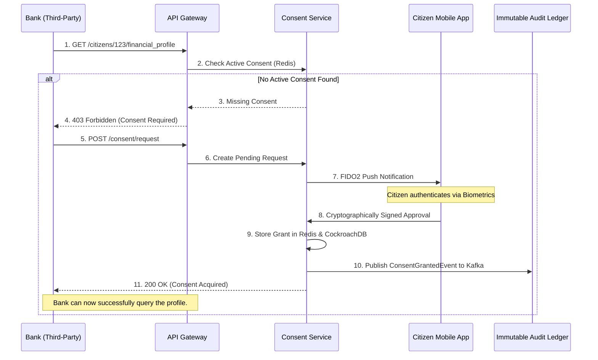
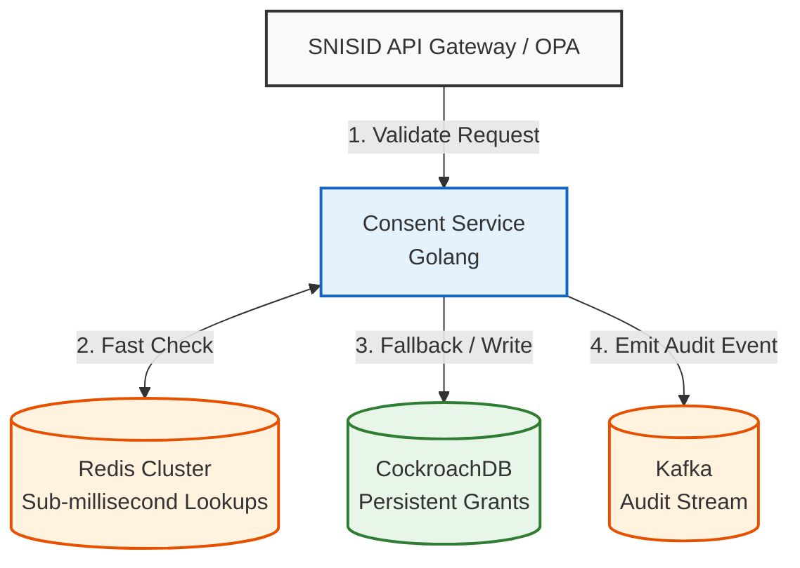
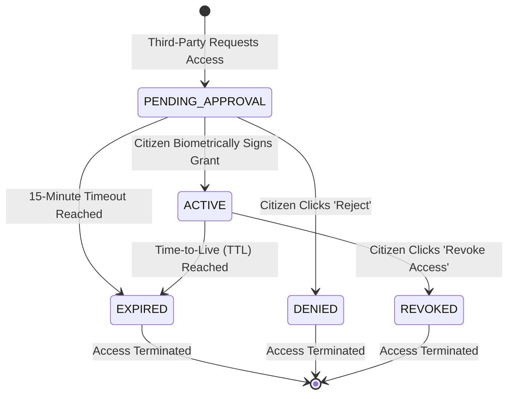

# SNISID Consent Management Service Architecture
## Privacy, GDPR-like Controls & Digital Signatures

This document details the architectural design for the **Consent Management Service**. Within the SNISID ecosystem, data privacy is paramount. This service ensures that no external entity (e.g., Banks, Telecoms) or cross-domain government agency can access a citizen's protected personal data without their explicit, cryptographically verifiable, and time-bound consent.

---

## 1. Consent Lifecycle & Governance

### The Consent Ledger
The service acts as an immutable ledger of active and revoked consent grants.
1. **Initiation:** An agency (e.g., a Bank) requests access to a citizen's data via the SNISID API Gateway.
2. **Push Notification:** The Consent Service triggers a FIDO2-secured push notification to the citizen's mobile app.
3. **Cryptographic Signing:** The citizen reviews the request (e.g., "Bank X is requesting your Address for 30 days"). By scanning their biometric (FaceID/TouchID), their mobile device uses a secure enclave to cryptographically sign the consent grant.
4. **Validation:** The Consent Service stores the signed grant. The API Gateway queries this service before allowing the Bank to access the data.

### GDPR-like Controls & Delegated Consent
- **Time-Bound:** Every consent grant requires an explicit expiration date (e.g., `expires_at: 2026-12-31T23:59:59Z`).
- **Revocation:** Citizens can view a dashboard of all active grants and revoke them instantaneously with a single click.
- **Delegated Consent:** For minors or incapacitated individuals, a legally linked guardian (verified via the ANH registry) can cryptographically sign consent grants on their behalf.

---

## 2. API & Event Contracts

### API Contract (OpenAPI Snippet)
The Consent Service exposes endpoints to query active grants (used heavily by the API Gateway / OPA).

```yaml
paths:
  /v1/consent/validate:
    post:
      summary: Validate if an active consent grant exists for a specific requester.
      requestBody:
        content:
          application/json:
            schema:
              type: object
              properties:
                citizen_niu: { type: string }
                requester_client_id: { type: string }
                requested_scopes: { type: array, items: { type: string } }
      responses:
        '200':
          description: Consent is valid.
          content:
            application/json:
              schema:
                properties:
                  is_valid: { type: boolean, example: true }
                  expires_at: { type: string, format: date-time }
```

### Event Contract (AsyncAPI)
All mutations to consent are published to the Kafka backbone to populate the immutable audit ledger.

```yaml
channels:
  snisid.consent.events:
    publish:
      message:
        name: ConsentGrantedEvent
        payload:
          type: object
          properties:
            consent_id: { type: string, format: uuid }
            citizen_niu: { type: string }
            requester_id: { type: string }
            scopes: { type: array, items: { type: string } }
            cryptographic_signature: { type: string }
```

---

## 3. Storage & Immutability Architecture

- **Fast Lookups (Redis):** The API Gateway needs to validate consent in `< 5ms`. Active, unexpired consent grants are cached in a highly available Redis Cluster.
- **Immutable Storage (CockroachDB + Kafka):** The actual signed payloads are permanently stored in CockroachDB and appended to Kafka. A revoked consent grant is never *deleted*; a `ConsentRevoked` event is appended, conceptually nullifying the grant.

---

## 4. Architecture & Workflow Diagrams (Mermaid)

### 1. Cryptographic Consent Provisioning Flow
This sequence diagram shows the real-time interaction between a third-party, the Consent Service, and the Citizen's mobile device.



### 2. Microservice & Cache Topology


### 3. BPMN Consent Lifecycle States


---
*Prepared by the SNISID Cloud Infrastructure & Resilience Board.*
