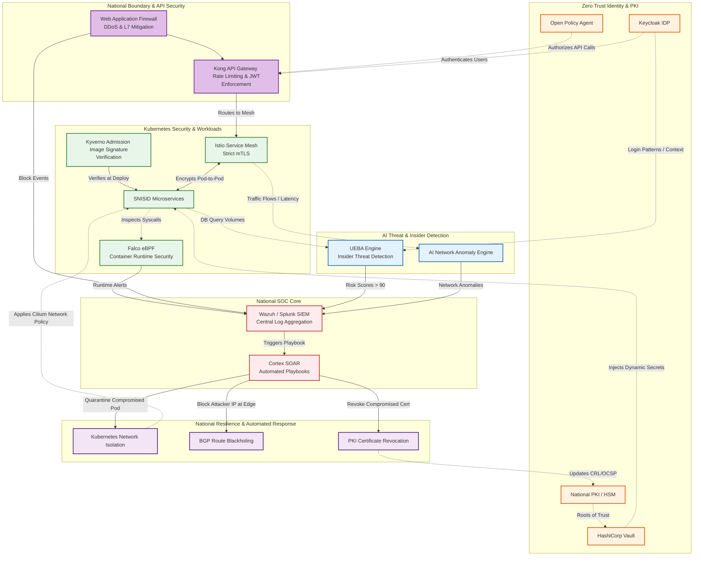

# SNISID Sovereign National Cyber Defense Architecture

Below is the complete enterprise-grade Mermaid diagram representing the unified Cyber Defense and Security Operations Center (SOC) architecture for SNISID. 

It integrates Zero Trust perimeters, Kubernetes container security, AI-driven UEBA (User and Entity Behavior Analytics) for insider threats, and automated SOAR response mechanisms to ensure national resilience.

