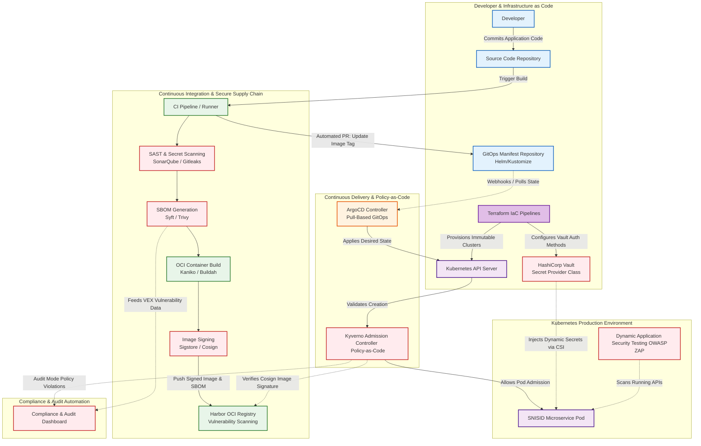

# SNISID Sovereign DevSecOps Architecture

Below is the complete enterprise-grade Mermaid diagram representing the DevSecOps and Secure Software Supply Chain architecture for SNISID. 

It integrates GitOps pull-based deployments, Policy-as-Code admission controllers, immutable infrastructure provisioning, and automated security scanning (SAST/DAST/SBOM) at every phase of the pipeline.

