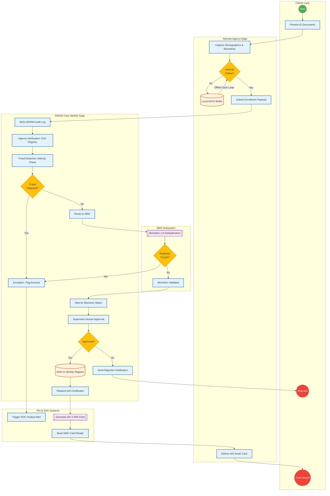

# SNISID BPMN Identity Enrollment Workflow

Below is the complete Mermaid flowchart simulating a standard Business Process Model and Notation (BPMN) diagram for the National Identity Enrollment Saga.

It covers offline edge synchronization, multi-system validation, biometric deduplication, and automated PKI issuance.

