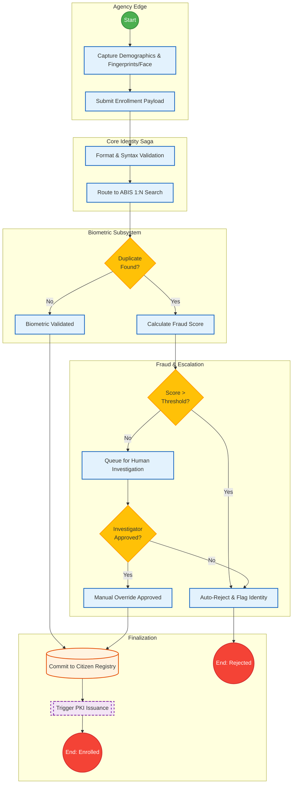
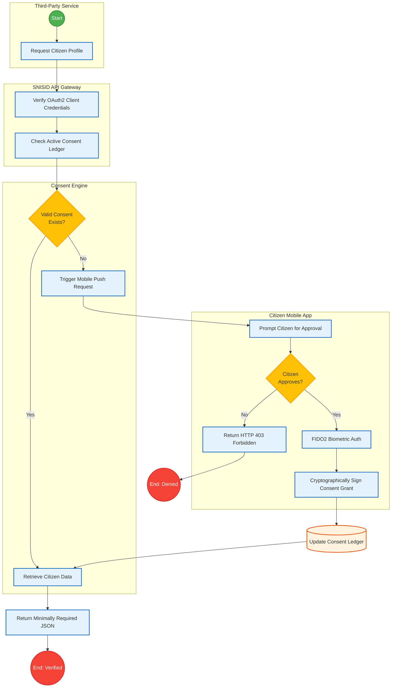
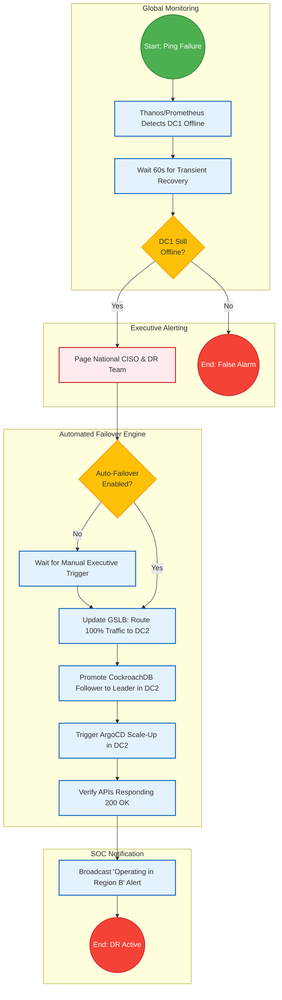

# SNISID Enterprise BPMN Workflows

This document contains a comprehensive suite of enterprise-grade Business Process Model and Notation (BPMN) workflows (represented via Mermaid flowcharts) governing the core operations, inter-agency interactions, and disaster resilience of the SNISID platform.

---

## 1. Unified Enrollment, Biometrics & Fraud Escalation Workflow

This workflow covers the core citizen onboarding process, integrating biometric ABIS deduplication and real-time fraud detection.



---

## 2. Citizen Verification & Cryptographic Consent Workflow

This workflow dictates how third-party entities (e.g., Banks, Telecoms) verify citizen identities using explicit, mobile-based cryptographic consent.



---

## 3. Inter-Agency Approval: Judicial & Tax Validation Workflow

This workflow represents highly privileged cross-agency data verification over the X-Road protocol, specifically for background checks spanning Justice (DCPJ) and Tax (DGI) authorities.

```mermaid
flowchart TD
    classDef startEvent fill:#4CAF50,stroke:#388E3C,stroke-width:2px,color:white,shape:circle;
    classDef endEvent fill:#F44336,stroke:#D32F2F,stroke-width:2px,color:white,shape:circle;
    classDef task fill:#E3F2FD,stroke:#1565C0,stroke-width:2px;
    classDef gateway fill:#FFC107,stroke:#FFA000,stroke-width:2px,shape:rhombus;

    subgraph Requesting Agency
        S3((Start)):::startEvent --> Init[Initiate Background Check]:::task
        Init --> XRoadOut[Sign SOAP/REST Envelope]:::task
    end

    subgraph Interoperability Gateway
        XRoadOut --> API[Route to SNISID X-Road Gateway]:::task
        API --> MTLSCheck[Verify Agency mTLS Certificate]:::task
    end

    subgraph DGI (Tax)
        MTLSCheck --> Fork1[Parallel Dispatch]:::task
        Fork1 --> TaxCheck[Query DGI NIF Status]:::task
        TaxCheck --> TaxStatus{Tax <br/> Compliant?}:::gateway
        TaxStatus -- Yes --> TaxOk[Tax Clearance = True]:::task
        TaxStatus -- No --> TaxFail[Tax Clearance = False]:::task
    end

    subgraph DCPJ (Judicial)
        Fork1 --> JudCheck[Query Criminal Records API]:::task
        JudCheck --> JudStatus{Warrant <br/> Active?}:::gateway
        JudStatus -- Yes --> JudFail[Judicial Clearance = False]:::task
        JudStatus -- No --> JudOk[Judicial Clearance = True]:::task
    end

    subgraph Aggregation
        TaxOk & TaxFail & JudFail & JudOk --> Aggregate[Aggregate Agency Responses]:::task
        Aggregate --> Audit[Write Immutable Audit Log]:::task
        Audit --> Return[Return Aggregate Response Payload]:::task
        Return --> E4((End)):::endEvent
    end
```

---

## 4. Disaster Recovery (PRA/PCA) Execution Workflow

This automated workflow triggers when a catastrophic event (e.g., Category 5 Hurricane, Earthquake) severs communication to the primary Port-au-Prince datacenter.


