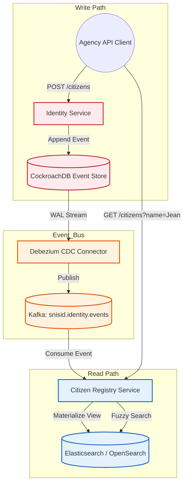
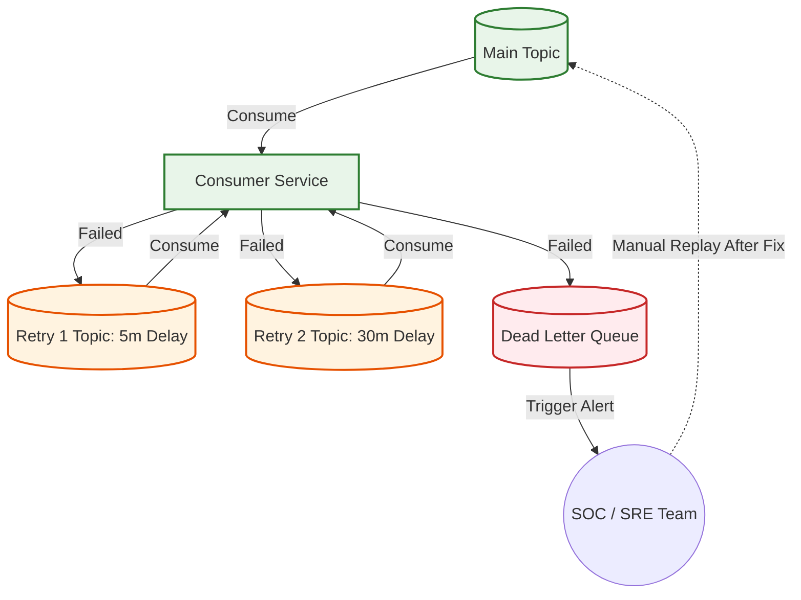

# SNISID Event-Driven Architecture
## Asynchronous Messaging & CQRS Strategy

This document details the **Event-Driven Architecture (EDA)** for SNISID. To achieve extreme scalability and handle the intermittent connectivity inherent to remote Haitian agencies, the platform relies heavily on asynchronous message passing, Event Sourcing, and CQRS, powered by a dual-broker strategy utilizing **Apache Kafka** and **NATS Jetstream**.

---

## 1. Dual-Broker Architecture

To handle the varying infrastructural realities of the platform, SNISID employs two distinct message brokers:

1. **Apache Kafka (The Core Backbone):**
   - **Location:** Deployed centrally in the Tier III datacenters (Port-au-Prince & Cap-Haïtien).
   - **Purpose:** Heavy-duty, high-throughput Event Sourcing, stream processing (Analytics), and immutable Audit Trails.
   - **Retention:** Topics acting as the Event Store have *infinite retention* (log compaction enabled).

2. **NATS Jetstream (The Edge Enabler):**
   - **Location:** Deployed at remote agency edge nodes (e.g., a rural DGI or immigration office).
   - **Purpose:** Lightweight, offline-capable message buffering. If the internet drops, local transactions are buffered in NATS. Upon reconnection, NATS securely bridges the payload to the central Kafka cluster via encrypted gRPC streams.

---

## 2. Topic Architecture & Schema Registry

### Naming Convention
All Kafka topics follow a strict domain-driven taxonomy: `snisid.<domain>.<entity>.<event>`

### Core Topics Inventory
- `snisid.identity.citizen.registered`
- `snisid.identity.biometrics.matched`
- `snisid.consent.grant.created`
- `snisid.consent.grant.revoked`
- `snisid.agency.request.initiated`
- `snisid.audit.system.accessed`

### Schema Registry
All event payloads are serialized using **Apache Avro**. The API Gateway and microservices enforce schema validation against the Confluent/Strimzi Schema Registry. If a microservice attempts to publish an event that violates the Avro schema, the publish fails immediately, preventing poison pills.

---

## 3. Reliability: Retries & Dead Letter Queues (DLQ)

Because microservices occasionally fail or downstream databases timeout, SNISID implements robust message retry and isolation patterns:
- **Retry Topics:** If processing fails, the message is routed to `snisid.identity.citizen.retry_1` with a 5-minute delay, then `retry_2` with a 30-minute delay.
- **Dead Letter Queue (DLQ):** After 3 failed attempts, the message is routed to `snisid.identity.citizen.dlq`. 
- **DLQ Processing:** Messages in the DLQ do not block the main partition. They trigger a PagerDuty alert for the SRE team. A dedicated administrative UI allows SREs to inspect the toxic message, patch the bug, and replay the DLQ back into the main topic.

---

## 4. Architecture Diagrams (Mermaid)

### 1. Global Event Topology (Edge to Core)
This diagram illustrates how remote agency events are buffered locally by NATS and asynchronously synchronized to the core Kafka backbone.

```mermaid
graph TD
    classDef edge fill:#e3f2fd,stroke:#1565c0,stroke-width:2px;
    classDef core fill:#e8f5e9,stroke:#2e7d32,stroke-width:2px;
    classDef kafka fill:#fff3e0,stroke:#e65100,stroke-width:2px;

    subgraph Edge_Node [Remote Agency Location (Intermittent Internet)]
        App[Agency Kiosk App]:::edge
        NATS[(Local NATS Jetstream)]:::edge
        Sync[NATS-to-Kafka Bridge]:::edge
        App -->|Publish Offline Event| NATS
        NATS --> Sync
    end

    subgraph Core_Datacenter [Port-au-Prince Datacenter]
        KAFKA[(Apache Kafka Cluster)]:::kafka
        Audit[Audit Service]:::core
        Analytics[ClickHouse Analytics]:::core
    end

    Sync -.->|TLS Reconnection| KAFKA
    KAFKA -->|Consume| Audit
    KAFKA -->|Stream Process| Analytics
```

### 2. CQRS & Event Sourcing Workflow
This diagram details the core Command Query Responsibility Segregation (CQRS) flow used for citizen identities.



### 3. Dead Letter Queue & Retry Flow


---
*Prepared by the SNISID Cloud Infrastructure & Resilience Board.*
