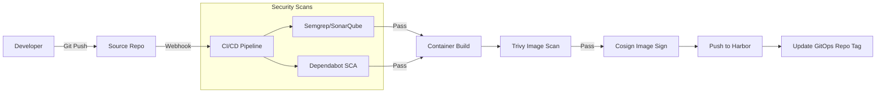
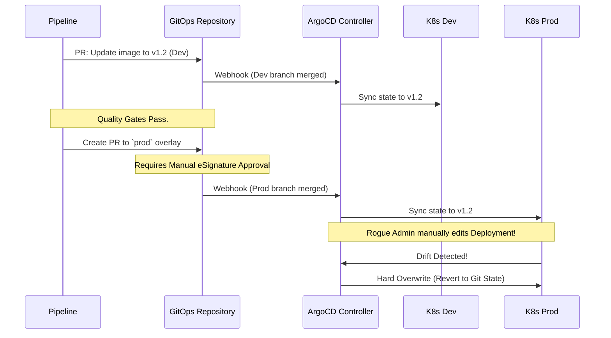
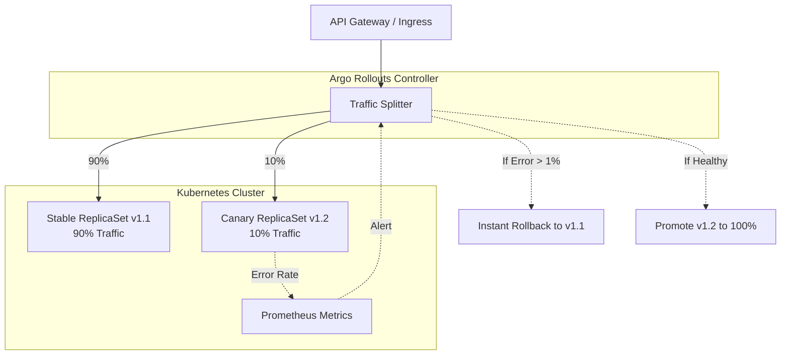
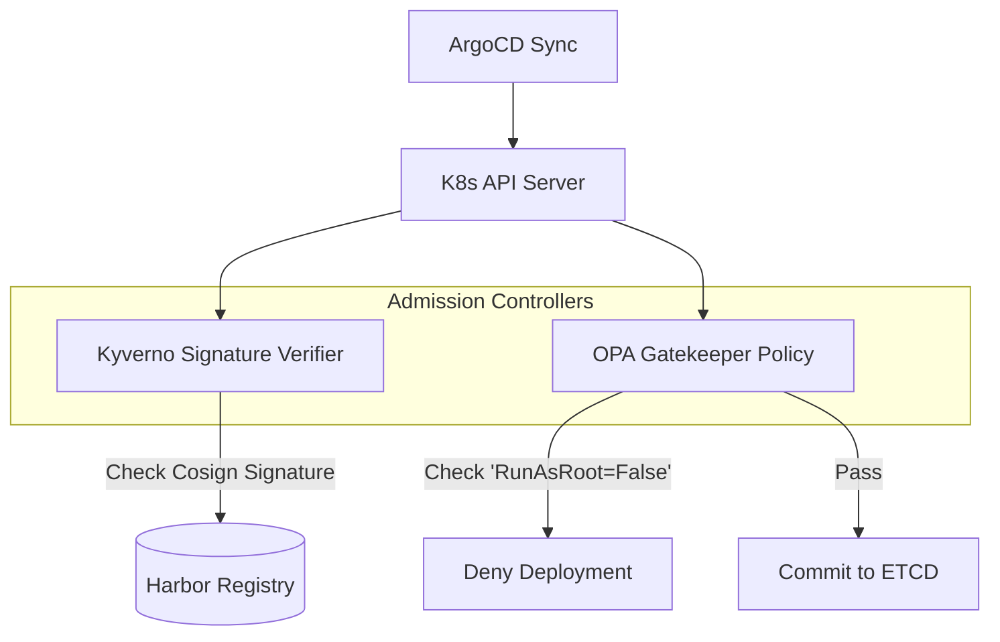

# SNISID: National GitOps & DevSecOps Architecture
## Secure Software Supply Chain & Automated Infrastructure Strategy

This document defines the comprehensive **DevSecOps and GitOps architecture** for the Système National d’Identification et d’Interopérabilité Sécurisée des Identités et des Données (SNISID). It is engineered to adhere to the **SLSA (Supply chain Levels for Software Artifacts) Level 4** framework and **NIST SSDF** (Secure Software Development Framework), ensuring absolute sovereign control, immutability, and resilience.

---

## 1. GitOps & Immutable Infrastructure Architecture

### GitOps Core Principles
In SNISID, **Git is the sole source of truth**. Direct human access to Kubernetes API servers (`kubectl apply`) or Cloud Control Panels is cryptographically disabled in production. Every change to infrastructure or application state is driven entirely by declarative pull requests.

### Règles Absolues GitOps

* **Git = Source of Truth unique :** Aucune configuration manuelle n'est tolérée en production.
* **Revue Mandatory :** Chaque Pull Request (PR) requiert la revue et l'approbation d'au moins **2 personnes indépendantes** avant d'être fusionnée.
* **Protection des Branches :** Les branches `main`, `production` et `staging` sont strictement protégées. Les pushs directs y sont interdits.
* **SAST Automatique :** Tout merge request déclenche un scan SAST automatique bloquant avant toute approbation humaine.
* **Synchronisation ArgoCD :** La synchronisation d'ArgoCD est automatique vers l'environnement de `staging`, mais requiert une déclenchement manuel validé pour la `production`.
* **Rollback Instantané :** En cas d'incident en production, le retour à la normale s'effectue exclusivement par `git revert` (exécuté en moins de 5 minutes).
* **Détection de Dérive (Drift) :** ArgoCD compare en continu l'état réel du cluster avec les fichiers Git et lève une alerte immédiate au SOC en cas de dérive non planifiée en production.

### Immutable Infrastructure & Drift Detection
- All infrastructure (VMs, Networking) and Kubernetes states are immutable. If a manual change occurs out-of-band, the GitOps controller (ArgoCD) instantly detects the **configuration drift** and actively overwrites the cluster back to the state defined in Git.

### Multi-Environment Promotion Strategy
SNISID uses a strictly gated multi-environment promotion model:
1. **Development (`dev`):** Ephemeral namespaces. Changes auto-deploy upon feature branch merge.
2. **Staging (`stg`):** Exact replica of production. Triggers integration and DAST tests.
3. **Production (`prod`):** Requires human cryptographic approval (eSignature via eID smart card) on the Pull Request.

---

## 2. CI/CD & Secure Software Supply Chain (SLSA Level 4)

### Secure Artifact Repositories
- **Harbor** is deployed as the sovereign OCI-compliant registry. It enforces strict RBAC, CVE vulnerability scanning, and signature verification policies. No image can be pulled into a cluster unless it originates from this specific, hardened Harbor instance.

### Image Signing & Supply Chain Security
- **Cosign (Sigstore):** Every Docker image built in the pipeline is cryptographically signed using keyless signing tied to the GitLab CI OIDC identity, or via the SNISID internal PKI.
- **SBOM Generation:** **Syft** generates a Software Bill of Materials (SBOM) in SPDX/CycloneDX format during the build phase, attaching it as an attestation to the OCI image.

### DevSecOps Pipeline Integration (8 Étapes)

Le pipeline applique un modèle de sécurité "Shift-Left" strict composé de 8 étapes automatisées. Tout échec sur une étape bloquante arrête immédiatement le pipeline et empêche le déploiement.

| Étape | Outils | Statut / Seuil |
|---|---|---|
| **1 — PRE-COMMIT** | GitLeaks + detect-secrets | **BLOQUANT** — Tout secret hardcodé entraîne un rejet immédiat du commit |
| **2 — BUILD & SAST** | SonarQube + Semgrep | **BLOQUANT** si vulnérabilité avec un score CVSS $\ge 7.0$ détectée |
| **3 — SCA (Dependencies)** | Trivy + OWASP Dependency-Check | **BLOQUANT** si vulnérabilité de sévérité *Critical* détectée |
| **4 — CONTAINER SCAN** | Trivy + Grype | **BLOQUANT** si vulnérabilité *Critical* — Conteneurs basés sur Alpine/Distroless |
| **5 — SIGNING** | Sigstore Cosign + Attestations SLSA Level 3 | **BLOQUANT** — Toute image non signée cryptographiquement est refusée par l'Admission Controller |
| **6 — DEPLOY STAGING** | ArgoCD (GitOps) | Non-bloquant — Déploiement automatique vers l'environnement de staging |
| **7 — DAST** | OWASP ZAP + Nuclei | **BLOQUANT** si vulnérabilité avec un score CVSS $\ge 7.0$ détectée |
| **8 — DEPLOY PROD** | ArgoCD + Change Control Board | Double approbation requise — Déploiements interdits le vendredi après 16h |

### Optimisations et Gouvernance Avancée (v2.0 — MP-009)

* **SBOM Complet & SLSA Level 4 :** Pour chaque build, un SBOM au format CycloneDX est généré, signé avec Sigstore Cosign et poussé dans le registre Harbor. Pour les composants critiques (`Identity` et `Auth`), les builds sont hermétiques et signés par deux parties indépendantes pour atteindre le niveau **SLSA Level 4**. Le SBOM est directement mis à disposition du SOC pour analyse de vulnérabilités en temps réel.
* **Feedback Loop Rapide (< 10 Minutes) :** Afin de ne pas ralentir le développement, les scans SAST Semgrep sont configurés en mode différentiel (analyse uniquement du diff de code par rapport à la branche cible). Les caches de dépendances (Docker, Cargo, Go) sont distribués localement pour réduire les temps de build.
* **Environnements Éphémères par PR :** Chaque Pull Request génère automatiquement un namespace Kubernetes éphémère isolé (avec des données de test anonymisées). Cet environnement permet de tester l'intégration en conditions réelles et est automatiquement détruit dès que la PR est fusionnée ou fermée.

---

## 3. Infrastructure-as-Code (IaC) & Policy-as-Code

### Terraform Strategy
- **Terraform** provisions the base underlying infrastructure (Hypervisors, Networks, DNS, Managed Databases).
- **State File Security:** State files are stored in an encrypted, versioned backend (e.g., PostgreSQL or S3) protected by strict RBAC.

### Helm & Kustomize Architecture
- **Helm:** Used exclusively to package upstream third-party dependencies (e.g., CockroachDB, Kafka).
- **Kustomize:** Used for first-party SNISID microservices. It allows defining a `base` deployment and overlaying specific variations for `dev`, `stg`, and `prod` without duplicating YAML code.

### Policy-as-Code & Gatekeeper Integration
- **OPA Gatekeeper:** Acts as a Kubernetes Admission Controller. It evaluates incoming deployments against Rego policies.
- **Example Policies:** Blocks images from untrusted registries, denies containers running as root, and rejects ingress rules without TLS specified.

---

## 4. Secrets Management & Vault Automation

- **Absolute Zero Secrets in Git:** Hardcoded secrets in code or Git repositories are an instant pipeline failure (detected via `trufflehog` or `gitleaks`).
- **Vault Automation:** HashiCorp Vault is populated via a separate, highly restricted Terraform pipeline.
- At runtime, Kubernetes workloads use the **Vault Agent Injector** to securely pull secrets into memory via Kubernetes Service Account (OIDC) identities, preventing secret sprawl.

---

## 5. Deployment Strategies & Release Governance

### Progressive Delivery
SNISID avoids risky "big bang" deployments. Releases are managed using **Argo Rollouts**.
- **Canary Deployments:** A new version of the Identity Service receives 5% of traffic. Prometheus monitors error rates and latency. If metrics are stable for 10 minutes, traffic increases to 20%, then 100%. If metrics spike, Argo Rollouts automatically aborts and instantly rolls back to the previous version.
- **Blue-Green Deployments:** Used for critical database schema migrations where zero downtime is mandatory but A/B testing is not applicable.

### Developer Workflows & Branching Strategy
- SNISID uses **Trunk-Based Development** supplemented by short-lived feature branches.
- Direct pushes to `main` are disabled. All merges require passing CI checks and mandatory code reviews (2-person rule).

### Rollback Strategy
Because Git is the source of truth, rolling back a catastrophic failure is simply `git revert <commit-hash>`. ArgoCD immediately syncs the reverted state to the cluster.

---

## 6. Audit, Compliance, & Disaster Recovery

### Audit & Compliance Automation
- **Audit Logging:** Every Git commit, PR approval, and CI pipeline run generates a signed event logged to the central WORM (Write-Once-Read-Many) storage.
- **Compliance:** Automated tools continuously verify that the repository structure and branch protections align with ISO 27001 requirements.

### Disaster Recovery Pipelines
- In the event of a catastrophic regional failure (Port-au-Prince offline), the GitOps model allows infrastructure administrators to point ArgoCD to the secondary Cap-Haïtien cluster, which instantly provisions the entire national architecture exactly as defined in Git. RTO is minimal.

### Haiti-Specific Operational Constraints
- **Bandwidth Limitations:** Pipeline artifacts and images are cached locally within the datacenters using Harbor proxy caches to prevent massive WAN data consumption during frequent CI builds.
- **Intermittent Connectivity:** CI/CD runners (GitLab Runners) are deployed on-premise. They do not rely on cloud-hosted SaaS runners that could fail during national internet outages.

---

## 7. Production-Ready Examples

### 1. Git Repository Structure
```text
snisid/
├── apps/                        # Application source code
│   └── identity-service/
│       ├── src/
│       └── .gitlab-ci.yml       # App-specific pipeline
├── infrastructure/              # Terraform base infra
│   └── tf-live/
│       ├── prod/
│       └── staging/
└── gitops/                      # ArgoCD Manifests
    ├── clusters/
    ├── base/
    └── overlays/
        ├── prod/
        └── staging/
```

### 2. GitLab CI/CD Pipeline (SLSA Security Scans & Signing)
```yaml
stages:
  - lint
  - sast
  - build
  - container-scan
  - sign
  - update-gitops

sast_scan:
  stage: sast
  image: returntocorp/semgrep
  script: semgrep ci --config=p/ci
  
build_image:
  stage: build
  script:
    - docker build -t harbor.snisid.gov.ht/core/identity-svc:$CI_COMMIT_SHA .
    - docker push harbor.snisid.gov.ht/core/identity-svc:$CI_COMMIT_SHA

sign_image:
  stage: sign
  image: gcr.io/projectsigstore/cosign:latest
  script:
    - cosign sign --key k8s://snisid-pki/cosign-key harbor.snisid.gov.ht/core/identity-svc:$CI_COMMIT_SHA
    
update_gitops:
  stage: update-gitops
  script:
    - git clone git@git.snisid.gov.ht:infrastructure/gitops.git
    - cd gitops/overlays/prod/identity-svc
    - kustomize edit set image harbor.snisid.gov.ht/core/identity-svc:$CI_COMMIT_SHA
    - git commit -am "Update identity-svc to $CI_COMMIT_SHA"
    - git push origin main
```

### 3. Argo Rollout (Canary Deployment YAML)
```yaml
apiVersion: argoproj.io/v1alpha1
kind: Rollout
metadata:
  name: identity-service
spec:
  replicas: 5
  strategy:
    canary:
      steps:
      - setWeight: 10
      - pause: {duration: 10m}
      - analysis:
          templates:
          - templateName: success-rate-check
      - setWeight: 50
      - pause: {duration: 10m}
      - setWeight: 100
```

---

## 8. Architecture Diagrams (Mermaid)

### 1. DevSecOps CI/CD Pipeline Flow (SLSA Compliant)


### 2. GitOps Multi-Environment Promotion & Drift Detection


### 3. Progressive Delivery (Canary) with Argo Rollouts


### 4. Policy-as-Code & Immutable Deployment Flow


---
*Prepared by the SNISID Infrastructure & Automation Board.*
